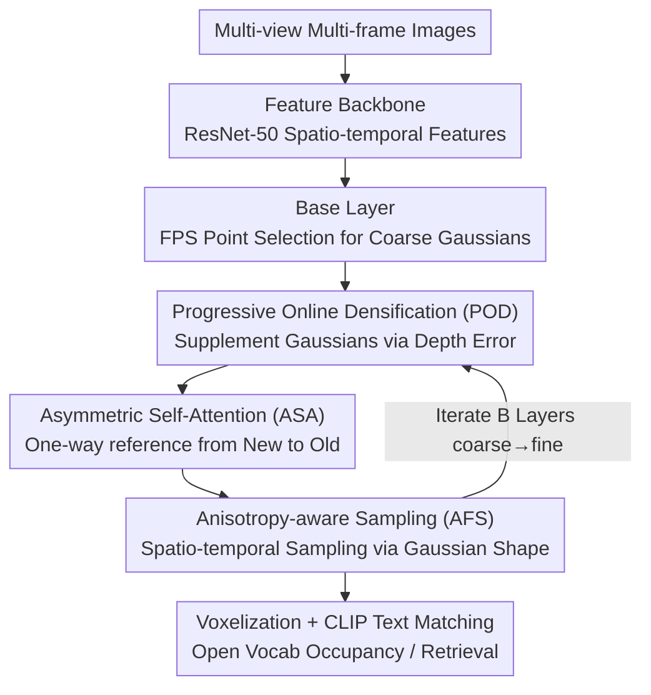

# Progressive Gaussian Transformer with Anisotropy-aware Sampling for Open Vocabulary Occupancy Prediction

**Conference**: ICLR 2026  
**OpenReview**: [https://openreview.net/forum?id=mHFaflQv93](https://openreview.net/forum?id=mHFaflQv93)  
**Code**: https://yanchi-3dv.github.io/PG-Occ  
**Area**: 3D Vision / Open Vocabulary / Autonomous Driving Perception  
**Keywords**: 3D Occupancy Prediction, Open Vocabulary, Gaussian Representation, Progressive Densification, Anisotropic Sampling

## TL;DR
PG-Occ represents driving scenes using a set of sparse 3D Gaussians with text-aligned features. It employs "Progressive Online Densification" to supplement Gaussians in under-reconstructed areas during inference, paired with "Anisotropy-aware Sampling" to adaptively extract features according to Gaussian shapes. This achieves a 14.3% mIoU improvement over the previous SOTA on the Occ3D-nuScenes open vocabulary occupancy prediction task.

## Background & Motivation
**Background**: 3D occupancy prediction is a core task in visual autonomous driving perception. Compared to BEV, it adds the height dimension to provide a complete 3D scene representation. To move beyond labels restricted to "predefined categories," recent methods predict **text-aligned features**. During inference, similarity is calculated with CLIP text embeddings to support open vocabulary perception for arbitrary text queries.

**Limitations of Prior Work**: Text features are high-dimensional (e.g., 512-dim). Constructing **dense** voxel features for the entire scene incurs massive memory and computational overhead. Consequently, works like GaussTR use **sparse Gaussians** to represent the scene, improving efficiency. however, Gaussians are inherently sparse and struggle to capture details of small objects and complex scenes.

**Key Challenge**: There is a sparse $\leftrightarrow$ dense trade-off in open vocabulary occupancy modeling: sparse Gaussians save computation but miss small targets, while dense representations capture details but are computationally prohibitive. Existing sparse Gaussian methods generally use a **fixed number** of Gaussian queries regardless of scene complexity, further limiting the expression of complex structures.

**Goal**: While maintaining the efficiency of sparse Gaussians, provide the representation with the capability to "become dense where detail is needed." Simultaneously, ensure that Gaussian sampling on 2D feature maps utilizes their geometric shape rather than treating them as single points.

**Key Insight**: The authors draw inspiration from feed-forward 3D Gaussian Splatting (3DGS). Since Gaussian parameters can be predicted in a single feed-forward pass, Gaussians can also be **added feed-forwardly and adaptively** based on current prediction errors, without relying on the gradient-based offline densification of the original 3DGS.

**Core Idea**: A "Progressive Gaussian Transformer" performs coarse-to-fine occupancy prediction. A base layer of Gaussians establishes the global coarse structure, followed by $B$ progressive layers that supplement Gaussians online based on depth errors and fuse spatio-temporal features using anisotropic sampling.

## Method

### Overall Architecture
PG-Occ represents the driving scene as a set of **text-aligned feature Gaussian blobs** $G=\{G_i:(\mu_i,s_i,r_i,\sigma_i,f_i)\}$. Each Gaussian has a position $\mu_i\in\mathbb{R}^3$, scale $s_i\in\mathbb{R}^3$, rotation quaternion $r_i\in\mathbb{R}^4$, opacity $\sigma_i$, and a 512-dimension text-aligned feature $f_i$ (replacing the color in original Gaussians with semantic features). The input consists of $L$ multi-view camera images from the current and previous frames, and the output is a 3D semantic occupancy field at arbitrary resolution.

The system is a **Progressive Gaussian Transformer**: it first uses ResNet-50 to extract spatio-temporal image features, followed by a base layer (capturing coarse geometry) and $B$ progressive layers (iteratively refining and expanding Gaussians). Each progressive layer performs three tasks: POD supplements new Gaussians in under-reconstructed areas based on depth errors from the previous layer; ASA (Asymmetric Self-Attention) allows new Gaussians to reference old ones without contaminating them; AFS (Anisotropy-aware Sampling) extracts spatio-temporal features and aggregates them to decode new geometry and features. Training uses only 2D supervision (pseudo-depth + text features) without LiDAR or 3D labels. During inference, Gaussians are voxelized into dense occupancy.

### Key Designs

**1. Progressive Online Densification (POD): Adaptive Supplementing via Feed-forward Depth Error**

To address the issue where a "fixed number of sparse Gaussians cannot capture small objects," POD allows the number of Gaussians to grow as needed during inference. It involves two steps: **Base Initialization** uses pseudo-depth maps from Metric3D V2 to back-project a pseudo-point cloud $P=\bigcup_l T_l\cdot(K_l^{-1}\cdot D_l)$, then uses Farthest Point Sampling (FPS) to select $N$ representative points as initial Gaussian positions. **Feed-forward Densification** compares the rendered expected depth $\hat D$ with the reference depth $D$ at each progressive layer, marking pixels with errors exceeding a threshold as under-reconstructed areas:

$$U_{select}=\{(u,v)\in\Omega\mid \hat D(u,v)-D(u,v)>\gamma\}$$

where $\gamma$ is half the final occupancy grid resolution. Point sets are generated in these areas and $n^b$ new Gaussians are selected via FPS, then concatenated with optimized Gaussians from the previous layer $\mu^b=\mu^{b-1}\oplus\mu^b_{add}$. Crucially, densification relies only on Gaussian rendering without gradient backpropagation, allowing real-time, adaptive allocation of computation to areas with insufficient reconstruction.

**2. Asymmetric Self-Attention (ASA): Referencing Old Gaussians Without Back-Contamination**

Newly added Gaussians from POD are initially under-optimized. If standard self-attention is used, these "half-finished" queries might interfere with the well-trained Gaussians from previous layers, leading to training instability. ASA enforces **unidirectional interaction** through an attention mask: new Gaussians can attend to old Gaussians to borrow features for refinement, while old Gaussians remain unaffected by new ones. Formally, given $x^b$ queries in layer $b$ where the first $x^{b-1}$ are inherited, the mask is:

$$M_{i,j}=\begin{cases}-\infty,& i<x^{b-1}\ \text{and}\ j\ge x^{b-1}\\ 0,& \text{otherwise}\end{cases}$$

This shields "old queries (row $i$)" from "new queries (column $j$)." This stabilizes learned Gaussians while allowing expanded ones to improve incrementally. Removing ASA (w/o ASA) drops performance to 14.85 mIoU, while removing self-attention entirely (w/o SA) results in a collapse to 11.14.

**3. Anisotropy-aware Sampling (AFS): Sampling via Ellipsoid Shape Rather than Center Points**

Treating each Gaussian only as a center point $\mu_i$ for sampling ignores the anisotropy encoded by scale $s$ and rotation $r$—which determines the effective receptive field in 2D feature space. AFS passes query features through an MLP to generate $n=16$ unit offsets $\mu_\delta$, which are then scaled and rotated by the Gaussian ellipsoid so that sampling points fall within the ellipsoid:

$$\mu^{i,j}_{sample}=\mu_i+R(r_i)\cdot(s_i\odot\mu^{i,j}_\delta),\quad j=1,\dots,n$$

These 3D sampling points are projected onto multi-view/multi-temporal 2D feature planes. After bilinear interpolation, they are aggregated into a representative feature $f_a^i$. Two lightweight MLPs then decode the text feature $f_i=\text{MLP}_{feat}(f_a^i)$ and geometric attributes $(\Delta\mu_i,s_i,r_i,\sigma_i)=\text{MLP}_{geo}(f_a^i)$, updating positions incrementally $\mu_i=\mu_{i-1}+\Delta\mu_i$. This ensures large Gaussians have large receptive fields and small Gaussians have small ones.

### Loss & Training
The entire process uses 2D supervision. After rasterizing Gaussians $G_b$ of each layer to 2D planes, two types of losses are calculated. **Depth Rendering Loss** combines SILog, L1, and temporal photometric consistency: $L_{depth}=L_{L1}+\lambda_{SILog}L_{SILog}+\lambda_{temp}L_{temp}$. **Feature Rendering Loss** combines cosine similarity and MSE: $L_{feat}=L_{cos}+\lambda_{mse}L_{mse}$. Total objective: $L_{total}=\lambda_{depth}L_{depth}+\lambda_{feat}L_{feat}$. Implementation uses a ResNet-50 backbone, 7 frames of spatio-temporal info, 1 base layer + 2 progressive layers, trained on 8×A800 for 8 epochs (~9 hours) with 180×320 rasterization resolution.

## Key Experimental Results

### Main Results
On Occ3D-nuScenes, PG-Occ achieves 15.15 mIoU using only camera and text supervision (no LiDAR), a 14.3% relative improvement over the previous best, leading in several medium-to-large object categories.

| Dataset | Metric | Ours | Prev. SOTA | Gain |
|--------|------|------|----------|------|
| Occ3D-nuScenes | mIoU | 15.15 | 14.07 (GaussianFlowOcc) | +14.3% (Relative to 13.25 GaussTR) |
| Occ3D-nuScenes | bus IoU | 23.63 | 14.70 (VEON) | Significant Lead |
| Occ3D-nuScenes | car IoU | 26.42 | 20.43 (GaussTR) | +5.99 |
| nuScenes retrieval | mAP(v) | 21.2 | 18.2 (LangOcc) | +3.0 |
| nuScenes Depth | Abs Rel ↓ | 0.139 | 0.170 (Metric3D V2 Labels) | Outperforms source +18.2% |

> ⚠️ The 14.3% relative improvement in mIoU is calculated relative to GaussTR (13.25) as per the paper's text.

### Ablation Study

| Configuration | mIoU | RayIoU | mAP(v) | Description |
|------|------|--------|--------|------|
| Full model | 15.15 | 13.92 | 21.20 | Complete Model |
| w/o POD | 14.84 | 12.58 | 19.21 | Remove Online Densification |
| w/o AFS | 15.03 | 13.56 | 20.12 | Remove Anisotropy-aware Sampling |
| w/o ASA | 14.85 | 12.76 | 19.41 | Revert to Symmetric Self-Attention |
| w/o SA | 11.14 | 10.44 | 15.60 | Remove Self-Attention entirely |

### Key Findings
- **Self-Attention is the Backbone**: Removing self-attention entirely (w/o SA) causes mIoU to plummet from 15.15 to 11.14, the largest drop in the ablation study.
- **POD Benefits Retrieval**: Removing POD drops mAP(v) from 21.20 to 19.21, indicating progressive densification helps open-vocabulary retrieval robustness.
- **Simultaneous Efficiency Gains**: Compared to the baseline, PG-Occ achieves +14.3% mIoU while increasing FPS by 41.1% and reducing training time by 25%.
- **Weakness in Small Objects**: The 0.4m voxel resolution restricts the contribution of fine Gaussians; the authors admit slight inferiority on small targets.
- **Zero-shot Generalization**: Direct inference on Lyft Level-5 without fine-tuning yields reliable occupancy, and depth accuracy exceeds its supervision source (Metric3D V2).

## Highlights & Insights
- **Gradient-Free Densification**: POD converts "where to add Gaussians" into a judgment of the difference between rendered and reference depth. It is purely feed-forward and real-time.
- **Stabilized Training via Asymmetric Mask**: A simple attention mask solves the stability issue of "new Gaussians contaminating old ones," a concept transferable to any incremental token architecture.
- **Shape as Receptive Field**: AFS translates Gaussian scale/rotation directly into the receptive field for 2D sampling, allowing "anisotropy"—often ignored in 3DGS—to participate in feature aggregation.
- **Pure 2D Supervision for Open Vocab 3D**: The pipeline does not use LiDAR or 3D labels yet outperforms LiDAR-trained VEON, making it attractive for label-sensitive scenarios.

## Limitations & Future Work
- Small object performance is relatively weak due to the 0.4m voxel resolution bottlenecking fine Gaussians.
- Dependence on external pseudo-depth models (Metric3D V2 / UniDepth V2) creates an upstream bottleneck.
- Sensitivity analysis for hyperparameters like progressive layers, supplement count $n^b$, and threshold $\gamma$ is not fully detailed.
- Future work: Adaptive voxel resolution for small objects, joint optimization of depth priors and Gaussian geometry, and extending temporal fusion to longer horizons.

## Related Work & Insights
- **vs GaussTR**: Both use sparse text-aligned Gaussians, but GaussTR uses a fixed number of queries. PG-Occ uses progressive online densification to expand Gaussians, capturing better surfaces; car IoU increases from 20.43 to 26.42.
- **vs GaussianFlowOcc / GaussianFormer**: These also use sparse Gaussians to reduce voxel computation but rely on fixed queries or flow estimation. The core of this work is coarse-to-fine densification + anisotropic sampling.
- **vs VEON / LangOcc / POP-3D**: These open vocabulary methods either rely on LiDAR or NeRF. PG-Occ outperforms VEON in mIoU and LangOcc in retrieval mAP(v) without LiDAR.
- **vs Original 3DGS**: 3DGS requires scene-level offline optimization and gradient-based densification; this work follows feed-forward approaches like Splatter Image, making densification feed-forward and error-triggered.

## Rating
- Novelty: ⭐⭐⭐⭐ The combination of feed-forward densification, asymmetric self-attention, and anisotropy-aware sampling precisely targets the sparse/dense trade-off.
- Experimental Thoroughness: ⭐⭐⭐⭐ Tasks covering occupancy, retrieval, and depth + component ablations + zero-shot generalization.
- Writing Quality: ⭐⭐⭐⭐ Clearly defined framework and modules (POD/ASA/AFS).
- Value: ⭐⭐⭐⭐ Pure 2D supervision for open vocabulary 3D occupancy with simultaneous gains in efficiency and accuracy.

<!-- RELATED:START -->

## Related Papers

- [\[CVPR 2026\] OnlinePG: Online Open-Vocabulary Panoptic Mapping with 3D Gaussian Splatting](../../CVPR2026/3d_vision/onlinepg_online_open-vocabulary_panoptic_mapping_with_3d_gaussian_splatting.md)
- [\[ICLR 2026\] OVSeg3R: Learn Open-vocabulary Instance Segmentation from 2D via 3D Reconstruction](ovseg3r_learn_open-vocabulary_instance_segmentation_from_2d_via_3d_reconstructio.md)
- [\[ICLR 2026\] GeoPurify: A Data-Efficient Geometric Distillation Framework for Open-Vocabulary 3D Segmentation](geopurify_a_data-efficient_geometric_distillation_framework_for_open-vocabulary_.md)
- [\[CVPR 2026\] OVI-MAP: Open-Vocabulary Instance-Semantic Mapping](../../CVPR2026/3d_vision/ovi-map_open-vocabulary_instance-semantic_mapping.md)
- [\[ICLR 2026\] World2Minecraft: Occupancy-Driven Simulated Scenes Construction](world2minecraft_occupancy-driven_simulated_scenes_construction.md)

<!-- RELATED:END -->
