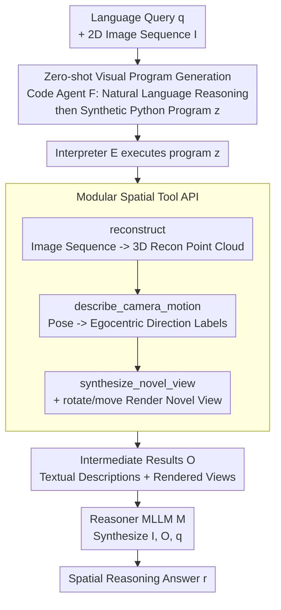

# pySpatial: Generating 3D Visual Programs for Zero-Shot Spatial Reasoning

**Conference**: ICLR 2026  
**arXiv**: [2603.00905](https://arxiv.org/abs/2603.00905)  
**Code**: [Project Page](https://pySpatial.github.io)  
**Area**: 3D Vision  
**Keywords**: Visual Programming, 3D Reconstruction, Spatial Reasoning, Zero-Shot, Robotic Navigation

## TL;DR

pySpatial is a visual programming framework that enables MLLMs to automatically invoke 3D spatial tools (3D reconstruction, camera pose recovery, novel view synthesis, etc.) by generating Python code. It transforms limited 2D image inputs into interactively explorable 3D scenes, achieving zero-shot, plug-and-play explicit 3D spatial reasoning. It outperforms GPT-4.1-mini by 12.94% and VLM-3R by 16.5% with an overall accuracy of 58.56% on the MindCube benchmark, and successfully drives a real quadruped robot for indoor navigation.

## Background & Motivation

**Background**: MLLMs (GPT-4o, Claude, etc.) excel in tasks like image description and video understanding but remain very weak in 3D spatial reasoning. Recent studies show that MLLM performance on multi-view spatial reasoning tasks (e.g., "How to move from View 1 to View 2?") is only slightly above random guessing.

**Limitations of Prior Work**:

1.  **Training Data Bottleneck**: MLLMs are pre-trained on massive image-text pairs, but explicit 3D spatial supervision data is extremely scarce and costly to annotate, making it difficult for models to establish reliable correspondences between language and 3D spatial structures.
2.  **Unreliable Implicit Reasoning**: Existing methods (e.g., cognitive maps, Chain-of-Thought) rely on the "implicit imagination" of MLLMs to build spatial models, which is limited and uncontrollable.
3.  **Single-View Limitation**: Methods like SpatialVLM and SpatialRGPT only handle single-view spatial understanding and cannot cope with multi-view reasoning.
4.  **Requirement for Fine-tuning**: Specialized spatial models (e.g., VLM-3R) require fine-tuning on synthetic data, lacking plug-and-play flexibility.

**Key Challenge**: MLLMs lack explicit geometric understanding of the 3D world; implicit reasoning alone cannot reliably solve spatial problems.

**Goal**: Rather than letting the MLLM implicitly imagine 3D, pySpatial uses a visual programming paradigm to let the MLLM generate Python code to call 3D tools. This explicitly constructs, explores, and reasons about 3D scenes—transforming "imagination" into "computation."

## Method

### Overall Architecture

pySpatial does not require the MLLM to implicitly imagine 3D in its "mind" but instead outsorces spatial reasoning to an executable Python program. Given a language query $q$ and a set of 2D images $\mathcal{I}$, a code agent $\mathcal{F}$ first translates the query into a program $z = \mathcal{F}(q)$ that calls pySpatial APIs. An interpreter $\mathcal{E}$ executes this program and calls underlying 3D tools (reconstruction, pose description, novel view synthesis) to produce intermediate results $O = \mathcal{E}(z, \mathcal{I})$, such as text and rendered views. Finally, a reasoner MLLM $\mathcal{M}$ synthesizes the original images, program outputs, and the query to provide an answer $r = \mathcal{M}(\mathcal{I}, O, q)$. The entire pipeline replaces "imagination" with "computation" without updating any weights—the code agent, 3D tools, and reasoner are all replaceable off-the-shelf modules.

### Key Designs

**1. Zero-shot visual program generation: Using in-context learning to bypass scarce 3D supervision data**

The scarcity and high annotation cost of 3D spatial supervision data are the root causes of weak spatial reasoning in MLLMs. pySpatial addresses this by avoiding training entirely. The code agent $\mathcal{F}$ writes the program $z$ from query $q$ using only API documentation and a few query-code examples (in-context learning), without ever touching model weights, file I/O, or rendering backend implementations. The generation uses structured output—reasoning in natural language first before synthesizing Python code. This ensures the produced program is an explicit reasoning log that is readable, checkable, debuggable, and even manually modifiable, making it more controllable and auditable than implicit imagination.

**2. Modular spatial tool API: Encapsulating complex 3D operations into high-level semantic functions**

MLLMs are not adept at direct geometric manipulation but are proficient at writing code. pySpatial encapsulates low-level reconstruction, pose calculations, and rendering into a concise set of high-level APIs. The agent simply composes these like function calls, which are executed by the interpreter $\mathcal{E}$. The API covers three core capabilities: `reconstruct(scene)` for 3D reconstruction from image sequences, `describe_camera_motion(recon)` for translating camera poses into natural language, and `synthesize_novel_view(recon, pose)` for rendering new images from arbitrary viewpoints. Additionally, a set of egocentric camera control commands is provided—`rotate_right/left(ext, angle)` (default 45°), `move_forward/backward(ext, dist)` (default 0.3), and `turn_around(ext)` (180° turn). The reconstruction tool switches based on the task: CUT3R for metric-scale real-world navigation and VGGT for normalized space benchmark evaluation. Both lift pixels to world coordinates via back-projection: $\mathbf{X}_i = \mathbf{G}_n^{-1} \pi^{-1}(\mathbf{p}_i, D_n(\mathbf{p}_i), K^{-1})$. Camera motion description discretizes the pose matrix into eight egocentric direction labels (forward, backward, left turn, etc.) based on the yaw angle of world displacement in the first camera frame: $\theta = \text{atan2}(d_x, d_z) \cdot 180/\pi$. Novel view synthesis uses rasterization rendering based on the reconstructed point cloud $\mathcal{P}$ and the target pose. When the agent issues high-level commands like `rotate_left` or `turn_around`, the framework automatically converts them into yaw rotations before rendering, shielding the agent from rendering details.

**3. Plug-and-play framework design: All components are replaceable without model-specific binding**

To achieve zero-cost integration, every layer of pySpatial is designed to be replaceable. Both the code agent and the final reasoner can be replaced with any open-source or closed-source MLLM (GPT-4o, GPT-4.1-mini, Claude, etc.). The 3D reconstruction module can also switch freely between CUT3R, VGGT, or DUSt3R. The entire system can run all experiments on a single NVIDIA A6000 Ada GPU without specialized hardware or fine-tuning procedures.

## Key Experimental Results

### Main Results: MindCube Full Set (21K+ Questions)

| Method | Type | Overall | Rotation | Among | Around |
|------|------|:---:|:---:|:---:|:---:|
| Random (chance) | - | 32.35 | 36.36 | 32.29 | 30.66 |
| LLaVA-OneVision-7B | Open-source MLLM | 47.43 | 36.45 | 48.42 | 44.09 |
| DeepSeek-VL2-Small | Open-source MLLM | 47.62 | 37.00 | 50.38 | 26.91 |
| GPT-4o | Commercial MLLM | 38.81 | 32.65 | 40.17 | 29.16 |
| GPT-4.1-mini | Commercial MLLM | 45.62 | 37.84 | 47.22 | 34.56 |
| Claude-4-Sonnet | Commercial MLLM | 44.75 | 48.42 | 44.21 | 47.62 |
| VLM-3R | Specialized Spatial Model | 42.09 | 36.73 | 44.22 | 24.45 |
| **pySpatial (Ours)** | Visual Programming | **58.56** | **43.20** | **60.54** | **48.10** |

pySpatial dominates all baselines with an overall accuracy of 58.56%: outperformining the strongest open-source MLLM (DeepSeek-VL2-Small) by 10.94%, GPT-4.1-mini by 12.94%, and the fine-tuned VLM-3R by 16.47%. In the most challenging "Among" category (reasoning about relationships between a central object and all surrounding objects), it reaches 60.54%, whereas no other method exceeds 50%.

### MindCube-1k Subset Comparison

| Method | Overall | Rotation | Among | Around |
|------|:---:|:---:|:---:|:---:|
| GPT-4o | 42.29 | 35.00 | 43.00 | 46.40 |
| Chain-of-Thought | 40.48 | 32.00 | 36.00 | 58.00 |
| Cognitive Map | 41.43 | 37.00 | 41.67 | 44.40 |
| ViperGPT | 36.95 | 20.50 | 41.00 | 40.40 |
| VADAR | 40.76 | 33.50 | 40.67 | 46.80 |
| VADAR + 3D Reconstruction | 35.62 | 31.00 | 36.83 | 36.40 |
| **pySpatial** | **62.35±1.18** | **41.83±2.34** | **64.89±2.60** | **72.67±3.30** |

pySpatial surpasses all mental model methods and visual programming baselines by approximately 20%. Notably, performance decreased when adding a 3D reconstruction module to VADAR (40.76→35.62), indicating that simply having 3D information is insufficient—it requires a reasonable API design to effectively utilize 3D geometry.

### Omni3D-Bench Single-View Generalization

| Method | numeric(ct) | numeric(other) | y/n | multi-choice | Total |
|------|:---:|:---:|:---:|:---:|:---:|
| GPT-4o | 28.1 | 35.5 | 66.7 | 57.2 | 42.9 |
| VADAR | - | - | - | - | 41.5 |
| ViperGPT | - | - | - | - | 27.8 |
| **pySpatial** | - | - | - | - | **45.3** |

Even in a single-view setting, pySpatial outperforms GPT-4o and all visual programming methods, validating the framework's generalization across various setups.

## Highlights & Insights

### Pros

1.  **Paradigm Innovation**: The transition from "implicit imagination" to "explicit computation" is highly clear, bridging MLLMs and the 3D world through visual programming.
2.  **Zero-Shot SOTA**: Achieves significant improvements over fine-tuned specialized models on multiple benchmarks without any training, demonstrating strong generalization.
3.  **High Interpretability**: The generated Python programs serve as precise logs of the reasoning process, facilitating debugging and auditing.
4.  **Real-World Validation**: Indoor navigation experiments with a quadruped robot demonstrate feasibility moving from academic benchmarks to the real world.

### Limitations

1.  Reliance on GPT-4o as the code agent incurs high API costs and is limited by commercial model availability.
2.  The quality of 3D reconstruction directly impacts downstream reasoning; it may fail in texture-less or repetitive-texture environments.
3.  Novel view synthesis based on point cloud rasterization creates holes in occluded regions, which can affect subsequent MLLM reasoning.

### Rating

⭐⭐⭐⭐ — An elegant application of the visual programming paradigm in 3D spatial reasoning. The method is simple yet effective, with impressive zero-shot performance, providing a practical path for the deployment of Embodied AI using MLLMs.

<!-- RELATED:START -->

## Related Papers

- [\[CVPR 2026\] LaS-Comp: Zero-shot 3D Completion with Latent-Spatial Consistency](../../CVPR2026/3d_vision/las-comp_zero-shot_3d_completion_with_latent-spatial_consistency.md)
- [\[CVPR 2026\] S$^2$-MLLM: Boosting Spatial Reasoning Capability of MLLMs for 3D Visual Grounding with Structural Guidance](../../CVPR2026/3d_vision/s2-mllm_boosting_spatial_reasoning_capability_of_mllms_for_3d_visual_grounding_w.md)
- [\[CVPR 2026\] Multi-Scale Gaussian-Language Map for Zero-shot Embodied Navigation and Reasoning](../../CVPR2026/3d_vision/multi-scale_gaussian-language_map_for_zero-shot_embodied_navigation_and_reasonin.md)
- [\[CVPR 2026\] Context-Nav: Context-Driven Exploration and Viewpoint-Aware 3D Spatial Reasoning for Instance Navigation](../../CVPR2026/3d_vision/context-nav_context-driven_exploration_and_viewpoint-aware_3d_spatial_reasoning_.md)
- [\[CVPR 2026\] UZ3DVG: Unaided Zero-Shot 3D Visual Grounding with Generated Language Conditions](../../CVPR2026/3d_vision/uz3dvg_unaided_zero-shot_3d_visual_grounding_with_generated_language_conditions.md)

<!-- RELATED:END -->
