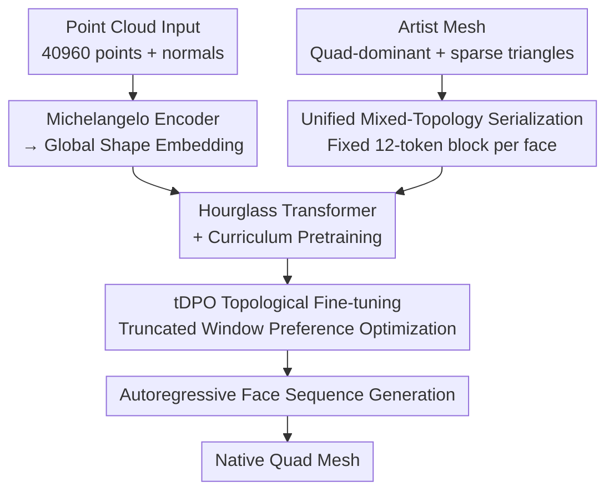

# QuadGPT: Native Quadrilateral Mesh Generation with Autoregressive Models

**Conference**: ICLR 2026  
**arXiv**: [2509.21420](https://arxiv.org/abs/2509.21420)  
**Code**: None (API release planned)  
**Area**: 3D Generation / Mesh Generation  
**Keywords**: quad mesh generation, autoregressive model, mixed topology, tDPO, Hourglass Transformer

## TL;DR

Proposes QuadGPT—the first end-to-end autoregressive framework for generating native quad meshes. By utilizing a unified mixed-topology tokenization (padding triangles into 4-vertex blocks), an Hourglass Transformer architecture, and truncated DPO (tDPO) fine-tuning based on topological rewards, it surpasses existing triangle-to-quad conversion pipelines and cross-field-guided methods in Chamfer Distance, Hausdorff Distance, quad ratio, and user preference.

## Background & Motivation

**Background**: Quadrilateral (quad) meshes are the standard in the gaming and film industries, ensuring modeling efficiency, smooth subdivision surfaces, deformation stability, and convenient UV unwrapping. Existing 3D generation methods either produce dense unstructured triangle meshes through implicit representations and isosurface extraction (e.g., Marching Cubes) or quadrangulate existing meshes via cross-field guidance. However, the latter requires clean inputs and lacks robustness.

**Limitations of Prior Work**: Autoregressive mesh generation methods (MeshAnything, BPT, DeepMesh, Mesh-RFT) have demonstrated the ability to generate triangle meshes with artist-like topology, but they are limited to triangles. Converting triangle outputs to quads still relies on heuristic merging algorithms (such as triangle pair merging), which often disrupts the natural edge flow and introduces topological artifacts. Even high-quality triangle meshes are difficult to translate into production-ready quad layouts.

**Key Challenge**: Generative methods can learn artist-like topology but are restricted to triangles, while post-processing methods can produce quads but fail to guarantee global topological quality—the problem lies in the artificial decoupling of quad mesh generation and post-processing.

**Key Insight**: If an autoregressive model can directly predict quad face sequences, it can learn the global structure of quad topology (edge loops, edge density distribution) end-to-end without passing through intermediate triangle steps. The key challenges are: (1) how to represent mixed topology (real artist meshes are typically quad-dominant with a small number of triangles); (2) how to optimize global topological quality (cross-entropy loss only optimizes local token prediction).

**Core Idea**: Achieve the first native quad mesh autoregressive generation using unified face-block representation and topology-aware RL fine-tuning.

## Method

### Overall Architecture

QuadGPT aims to resolve the disconnect where "generative methods only output triangles and quads rely on post-processing." It allows the autoregressive model to **directly** output face sequences dominated by quadrilaterals, learning global topological structures like edge loops and edge density end-to-end. The pipeline revolves around three core pillars: serialization, pretraining, and tDPO. On the training side, artist meshes (quad-dominant with sparse triangles) are compressed into fixed-length token sequences via unified serialization and fed into an Hourglass Transformer for conditional pretraining (point clouds are converted to global shape embeddings via a Michelangelo encoder and injected via cross-attention). Finally, truncated DPO (tDPO) is used for RL fine-tuning to push global topological quality. During inference, face sequences are generated autoregressively conditioned on input point clouds ($N_p = 40960$ points + normals) and decoded back into native quad meshes.

### Key Designs

**1. Unified Mixed-Topology Serialization: Handling quad and triangle mixes with fixed-length face blocks**

Real artist meshes are almost always quad-dominant with a few triangles. The autoregressive model must represent both face types simultaneously. QuadGPT serializes every face—regardless of being a triangle or quad—into a token block of constant length 12. A quad face directly flattens the 3D coordinates of its 4 vertices ($4 \times 3 = 12$ tokens). A triangle face prepends 3 padding tokens $\tau_{\text{pad}}$ (integer value 1024) followed by its 3 vertex coordinates ($3 + 3 \times 3 = 12$ tokens) to maintain the length of 12. Vertex coordinates are normalized to $[-0.95, 0.95]^3$, quantized with 1024-level (10-bit) precision, and all vertices are sorted in $(z, x, y)$ lexicographical order to ensure a deterministic sequence.

This approach implicitly encodes face types based on the presence of padding tokens, eliminating the need for explicit type tokens or separate encoding paths. The fixed-length blocks make tokenization highly parallelizable and keep the architecture clean.

**2. Hourglass Transformer + Curriculum Pretraining: Compressing long sequences and annealing from triangles to quads**

High-precision meshes can reach tens of thousands of tokens, making standard Transformers too expensive. The architecture uses a multi-level Hourglass structure. Initial token embeddings $\mathbf{E}^{(0)} \in \mathbb{R}^{L \times D_0}$ pass through Transformer Blocks, are shortened by a factor of 3 to $\mathbb{R}^{(L/3) \times D_1}$, then by a factor of 4 to $\mathbb{R}^{(L/12) \times D_2}$. Global context is captured in the bottleneck layer at a low cost before upsampling back. The model has 1.1B parameters and 24 layers.

Training does not start with quads directly; predicting a quad face is effectively predicting two correlated triangles, which is unstable from scratch. Training weights are initialized from triangle-mesh pretraining, and a quad-dominance parameter $r \in [0, 1]$ gradually anneals the data distribution: from pure triangles ($r=0$) to quad-dominant ($r \to 1$). The model first masters basic geometric syntax before learning complex quad topological rules. The data comes from 1.3 million curated high-quality quad models.

**3. Truncated DPO (tDPO) Topological Fine-tuning: Preference optimization on local windows to enforce global edge flow**

Topological quality, such as edge loop continuity, is a global property that cross-entropy loss cannot capture. tDPO uses a topological scoring system that rewards long continuous edge loops ($L_{\text{avg}}$) and penalizes fragmentation ($R_{\text{frac}}$). Preference pairs $(y_w, y_l)$ are constructed such that $L_{\text{avg}}(y_w) > L_{\text{avg}}(y_l)$ and $R_{\text{frac}}(y_w) < R_{\text{frac}}(y_l)$.

The "truncated" aspect addresses the extreme length of mesh sequences. A window of length $\tau = 36864$ is truncated at a random starting position $m$ for optimization:

$$\mathcal{L}_{\text{tDPO}}(\theta) = -\mathbb{E}_{\mathcal{D}}\mathbb{E}_m\left[\log \sigma\left(\beta\left[\log\frac{\pi_\theta(y_{w,m:m+\tau}|x)}{\pi_{\text{ref}}(y_{w,m:m+\tau}|x)} - \log\frac{\pi_\theta(y_{l,m:m+\tau}|x)}{\pi_{\text{ref}}(y_{l,m:m+\tau}|x)}\right]\right)\right]$$

Optimizing decisions on local windows results in more coherent global topology, allowing DPO to scale to high-face-count meshes for the first time.

## Key Experimental Results

### Main Results

| Method | Dense CD ↓ | Dense HD ↓ | Dense QR ↑ | Dense US ↑ | Artist CD ↓ | Artist HD ↓ | Artist QR ↑ | Artist US ↑ |
|------|-----------|-----------|-----------|-----------|------------|------------|------------|------------|
| QuadriFlow | 0.045 | 0.099 | 100% | 1.6 | 0.281 | 0.531 | 100% | 0.3 |
| MeshAnythingV2 | 0.153 | 0.394 | 53% | 1.4 | 0.096 | 0.251 | 60% | 2.1 |
| BPT | 0.115 | 0.283 | 43% | 2.7 | 0.051 | 0.125 | 49% | 3.1 |
| DeepMesh | 0.246 | 0.435 | 64% | 3.3 | 0.236 | 0.417 | 66% | 2.8 |
| FastMesh | 0.105 | 0.257 | 3% | 1.1 | 0.052 | 0.141 | 17% | 1.9 |
| **Ours (QuadGPT)** | **0.057** | **0.147** | **80%** | **4.9** | **0.043** | **0.095** | **78%** | **4.8** |

QuadGPT leads across all metrics: CD is over 46% lower than the best baseline on dense meshes, and user study (US) scores are overwhelmingly superior (4.9 vs 3.3). The Quad Ratio (QR) reaches 80% (only QuadriFlow is higher, but its geometric quality is much poorer and it frequently fails).

### Ablation Study

| Training Strategy | CD ↓ | HD ↓ | QR ↑ | US ↑ |
|---------|------|------|------|------|
| From Scratch | 0.081 | 0.203 | 75% | 0.6 |
| Finetune (Curriculum) | 0.065 | 0.167 | 72% | 1.3 |
| DPO (Full Seq) | 0.073 | 0.188 | 74% | 1.1 |
| tDPO (Truncated) | 0.061 | 0.156 | 78% | 3.3 |
| **tDPO-Pro (Full Reward)** | **0.057** | **0.147** | **80%** | **3.7** |

| Comparison Setting | CD ↓ | HD ↓ | QR ↑ | US ↑ |
|---------|------|------|------|------|
| TriGPT (Tri-to-Quad Conv) | 0.062 | 0.160 | 70% | 0.2 |
| TriGPT+RL (Above + RL FT) | 0.051 | 0.138 | 72% | 0.5 |
| **Ours (Native Quad)** | **0.057** | **0.147** | **80%** | **1.3** |

### Key Findings

- **Curriculum learning is key to stable training**: Training from scratch leads to difficult convergence (CD at 0.081). Curriculum initialization (Finetune) reduces it to 0.065. Modeling a quad face is like modeling two correlated triangles; foundational geometric skills are needed first.
- **Standard DPO does not generalize to complex meshes**: Full-sequence DPO fine-tuned on low-face-count meshes fails to generalize to complex high-face-count meshes (CD increased from 0.065 to 0.073). tDPO solves this via truncation.
- **Decisive gap between native generation and conversion**: In controlled comparisons, while TriGPT+RL has slightly better CD/HD, the gap in QR (72% vs 80%) and user preference (0.5 vs 1.3) is massive—post-processing conversion cannot recover natural edge flow.

## Highlights & Insights

- **Simplicity of the Padding Strategy**: Using 3 padding tokens to unify triangles into 12-token blocks is elegant—no type tokens or branching paths are needed, and the model learns face types implicitly.
- **Rationality of Curriculum Learning**: A quad face is topologically equivalent to two triangles, so learning triangles before quads is a natural progression—this strategy is systematically validated for the first time in mesh generation.
- **Scalability of tDPO**: The truncation strategy for scaling DPO to long sequences is a significant contribution that could be applied to other long-sequence RL tasks like long-form text or music generation.

## Limitations & Future Work

- **QR below 100%**: An 80% quad ratio means 20% triangles still persist, falling short of pure quad meshes.
- **Data Dependency**: Curating 1.3 million high-quality quad meshes is expensive, and performance is highly sensitive to data quality.
- **Point Cloud Input Only**: The pipeline starts from point clouds; a text/image-to-quad pipeline would require external models.
- **Limited Inference Speed**: 230 tokens/s means about 2.7 minutes per mesh for a 36864 token context, requiring further optimization for production.

## Related Work & Insights

- **vs MeshAnything/BPT/DeepMesh**: These generate high-quality triangles but require post-processing to convert to quads, which destroys edge flow. QuadGPT's end-to-end approach fundamentally avoids this.
- **vs QuadriFlow**: Cross-field methods can generate perfect quads (QR=100%) but are extremely non-robust on complex topologies or sharp features. QuadGPT significantly wins in robustness and user preference.
- **vs Mesh-RFT (RL for meshes)**: While Mesh-RFT applies RL to triangle meshes, QuadGPT's tDPO extends these ideas to quad topological quality, with truncation being the key innovation.

## Rating

- Novelty: ⭐⭐⭐⭐⭐ First native quad mesh autoregressive framework; unified serialization and tDPO are innovative.
- Experimental Thoroughness: ⭐⭐⭐⭐⭐ Comprehensive ablations (curriculum/DPO variants/native vs conversion) and user studies.
- Writing Quality: ⭐⭐⭐⭐ Clear structure, detailed method descriptions, and intuitive diagrams.
- Value: ⭐⭐⭐⭐⭐ Fills the gap in native quad mesh generation with direct value for the games and film industries.

<!-- RELATED:START -->

## Related Papers

- [\[CVPR 2026\] PixARMesh: Autoregressive Mesh-Native Single-View Scene Reconstruction](../../CVPR2026/3d_vision/pixarmesh_autoregressive_mesh-native_single-view_scene_reconstruction.md)
- [\[ICLR 2026\] AssetFormer: Modular 3D Assets Generation with Autoregressive Transformer](assetformer_modular_3d_assets_generation_with_autoregressive_transformer.md)
- [\[AAAI 2026\] Learning Conjugate Direction Fields for Planar Quadrilateral Mesh Generation](../../AAAI2026/3d_vision/learning_conjugate_direction_fields_for_planar_quadrilateral_mesh_generation.md)
- [\[CVPR 2025\] TreeMeshGPT: Artistic Mesh Generation with Autoregressive Tree Sequencing](../../CVPR2025/3d_vision/treemeshgpt_artistic_mesh_generation_with_autoregressive_tree_sequencing.md)
- [\[CVPR 2026\] Mesh-Pro: Asynchronous Advantage-guided Ranking Preference Optimization for Artist-style Quadrilateral Mesh Generation](../../CVPR2026/3d_vision/mesh-pro_asynchronous_advantage-guided_ranking_preference_optimization_for_artis.md)

<!-- RELATED:END -->
