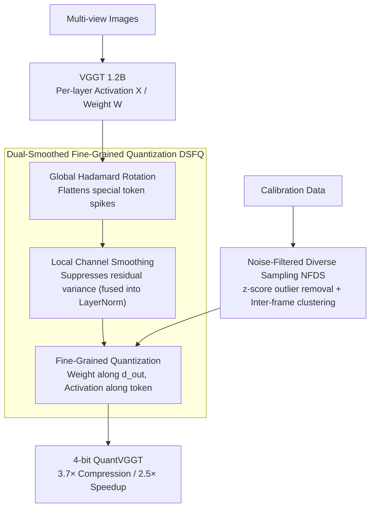

# Quantized Visual Geometry Grounded Transformer

**Conference**: ICLR 2026  
**arXiv**: [2509.21302](https://arxiv.org/abs/2509.21302)  
**Code**: [https://github.com/wlfeng0509/QuantVGGT](https://github.com/wlfeng0509/QuantVGGT)  
**Area**: 3D Vision / Model Compression  
**Keywords**: VGGT, post-training quantization, 3D reconstruction, Hadamard rotation, calibration

## TL;DR
To address the deployment needs of the billion-scale 3D reconstruction model VGGT, this paper proposes QuantVGGT, the first dedicated PTQ framework. It resolves the heavy-tail distribution caused by special tokens through dual-smoothed fine-grained quantization (Hadamard rotation + channel smoothing) and addresses calibration instability via noise-filtered diverse sampling. 4-bit quantization achieves 3.7× memory compression and 2.5× speedup while maintaining 98%+ accuracy.

## Background & Motivation

**Background**: VGGT is a 1.2B parameter unified 3D reconstruction model that performs depth estimation, point map regression, camera pose prediction, and point tracking in a single forward pass. While performance is excellent, the massive computational and memory overhead limits practical deployment.

**Limitations of Prior Work**: While PTQ is mature for LLMs and 2D vision models, VGGT presents two unique challenges: (1) data-independent special tokens (camera/register tokens) lead to extremely heavy-tailed activation distributions; (2) the semantic complexity of 3D multi-view data makes calibration sample selection highly unstable.

**Key Challenge**: Special tokens are crucial designs for multi-task inference in VGGT, but their distribution discrepancy compared to regular image tokens causes quantization bits to be wasted on extreme values.

**Goal**: Design a dedicated PTQ scheme for VGGT to maintain reconstruction accuracy under low-bit quantization.

**Key Insight**: Distribution analysis reveals that special tokens are the source of the heavy tail, while multi-view inter-frame relationships provide the key structure for calibration.

**Core Idea**: Global Hadamard rotation disperses spikes from special tokens, and local channel smoothing reduces residual variance after rotation. These are combined with frame-aware diverse sampling to construct a robust calibration set.

## Method

### Overall Architecture
QuantVGGT aims to quantize the 1.2B VGGT to 4-bit with minimal accuracy loss. The difficulty lies in heavy-tailed activations created by special tokens (camera/register) and the difficulty of selecting multi-view calibration samples. It handles these through two components. The first is **DSFQ** (Dual-Smoothed Fine-Grained Quantization): activations undergo a global Hadamard rotation to flatten spikes, followed by local channel scaling in the rotated space to suppress residual variance, and finally fine-grained quantization. The second is **NFDS** (Noise-Filtered Diverse Sampling): before feeding calibration data, outlier samples are filtered using deep activation statistics, followed by clustering and uniform sampling based on VGGT's inter-frame correlation to create a clean and diverse calibration set. This set is fed to DSFQ to estimate quantization parameters for each layer.

### Key Designs

**1. Pre-Global Rotation: Spreading extreme values from few channels to all channels**

The activation magnitudes of special tokens are an order of magnitude larger than regular patch tokens, with a few channels holding extreme spikes. Here, activations $\mathbf{X}$ and weights $\mathbf{W}$ are simultaneously left-multiplied by a random Hadamard matrix $\mathbf{H}$. Utilizing the equivalence $\mathbf{XW}^\top = (\mathbf{XH})(\mathbf{WH})^\top$, the output remains unchanged while the rotation uniformly distributes energy from a few dimensions across all channels. This essentially leverages the central limit effect to pull the heavy-tailed distribution toward a Gaussian-like one, preventing quantization ranges from being dominated by isolated spikes.

**2. Post-Local Smooth: Suppressing residual inter-channel variance after rotation**

Rotation only flattens global spikes; local magnitude differences between channels remain. Therefore, a per-channel scaling factor is calculated in the rotated space:
$$\hat{c}_i = \frac{\max(|\mathbf{X}_i\mathbf{H}|)^\alpha}{\max(|\mathbf{W}_i\mathbf{H}|)^{1-\alpha}}$$
(with $\alpha=0.5$), balancing the quantization difficulty between activations and weights. The sequence is critical: rotating then smoothing is much more stable than smoothing then rotating, as the gains of the latter would be disrupted by the subsequent rotation. Furthermore, this scaling factor can be fused into the preceding LayerNorm with zero runtime overhead.

**3. Fine-Grained Quantization Granularity: Reducing difficulty at the source**

Weights are quantized along the $d_{out}$ dimension, and activations are quantized along the token dimension. This is feasible because the inner product summation in matrix multiplication only occurs over $d_{in}$; grouping along these two dimensions does not break the summation structure. According to $\mu$-coherent theory, finer quantization granularity results in smaller dynamic ranges within each group, making quantization easier and further reducing error when combined with the previous smoothing steps.

**4. Noise-Filtered Diverse Sampling (NFDS): Constructing a robust calibration set**

Semantic complexity in 3D multi-view data causes large accuracy fluctuations for low-bit quantization when using random calibration samples. NFDS consists of two steps: first, noise filtering, where a noise score is calculated for each sample based on deep activation statistics (L2 norm of the z-score of activation mean and variance), and samples with high scores are removed; second, diverse sampling, utilizing the inter-frame inductive bias of VGGT to perform K-means clustering on normalized similarity vectors $c_t^i$ (first frame vs. subsequent frames). This filters outliers that hinder calibration while covering the various sub-domains of the data space. This is theoretically supported by Theorem 3.2, which states that calibration sets should be sampled scaling-proportionally across data sub-domains; inter-frame relationships describe the sub-domain structure of VGGT more effectively than semantic labels.

## Key Experimental Results

### Main Results (Camera Pose Estimation on CO3Dv2)

| Configuration | W/A bit | Accuracy Retention | Memory Compression | Speedup |
|---------------|---------|--------------------|--------------------|---------|
| Full FP16     | 16/16   | 100%               | 1×                 | 1×      |
| W8A8 QuantVGGT| 8/8     | ~99%               | 2×                 | 1.5×    |
| W4A4 QuantVGGT| 4/4     | ~98%               | 3.7×               | 2.5×    |
| W4A4 SmoothQuant| 4/4   | ~85%               | 3.7×               | 2.5×    |
| W4A4 QuaRot   | 4/4     | ~90%               | 3.7×               | 2.5×    |

### Ablation Study

| Component | Accuracy Change | Description |
|-----------|-----------------|-------------|
| Hadamard Rotation Only | +5% vs naive | Disperses spikes |
| + Channel Smoothing | +3% | Reduces residual variance |
| + Fine-Grained Quant | +2% | Finer quantization granularity |
| + NFDS | +2% | Robust calibration |
| Full QuantVGGT | 98% FP | Synergy of all components |

### Key Findings
- **Special tokens are the primary barrier to quantization**: the first 5 tokens (camera+register) have activation magnitudes over 10× larger than patch tokens.
- **Rotation $\rightarrow$ Smoothing order is essential**: smoothing before rotation destroys the benefits of smoothing; rotation followed by smoothing is more stable as the distribution is more uniform.
- **Frame-aware clustering outperforms label clustering**: t-SNE visualization shows semantic labels fail to distinguish calibration sub-domains for 3D scenes, whereas inter-frame relationships do.
- **4-bit quantization is hardware-feasible**: benchmarked 2.5× inference speedup on RTX 4090.

## Highlights & Insights
- **First quantization work for billion-scale 3D models**: Fills the gap in quantization for the 3D reconstruction field.
- **"Global then local" dual-smoothing design**: Elegantly solves the heavy-tail problem in two steps without runtime overhead (scaling factors fuse into LayerNorm).
- **Frame-aware calibration in NFDS**: Leverages the unique "first frame vs. subsequent frames" inductive bias of VGGT, reflecting the philosophy that "understanding the model enables better compression."
- **Theoretical contribution of Theorem 3.2**: Provides formal guidance for constructing calibration sets.

## Limitations & Future Work
- Evaluated only on VGGT; applicability to other 3D models like DUSt3R/MASt3R is unverified.
- ~2% accuracy loss remains at 4-bit, which may be insufficient for high-precision scenarios.
- Noise thresholds and cluster counts in NFDS require hyperparameter tuning.
- Extreme low-bit quantization (INT2/INT3) has not been explored.

## Related Work & Insights
- **vs. SmoothQuant**: Only performs local smoothing without considering the impact of special tokens in VGGT.
- **vs. QuaRot**: Only performs Hadamard rotation without subsequent local channel smoothing.
- Provides insights for quantizing other large models containing special tokens, such as [CLS] in VLMs.

## Rating
- Novelty: ⭐⭐⭐⭐ Components are not entirely new (Hadamard, SmoothQuant), but the combination and analysis for VGGT are innovative.
- Experimental Thoroughness: ⭐⭐⭐⭐ Evaluated across multiple benchmarks and bit-widths with complete ablations.
- Writing Quality: ⭐⭐⭐⭐ Deep motivation analysis and clear visualizations.
- Value: ⭐⭐⭐⭐ First quantization work for large 3D models with strong practical significance.

<!-- RELATED:START -->

## Related Papers

- [\[ICLR 2026\] FastVGGT: Fast Visual Geometry Transformer](fastvggt_fast_visual_geometry_transformer.md)
- [\[CVPR 2025\] VGGT: Visual Geometry Grounded Transformer](../../CVPR2025/3d_vision/vggt_visual_geometry_grounded_transformer.md)
- [\[CVPR 2026\] OmniVGGT: Omni-Modality Driven Visual Geometry Grounded Transformer](../../CVPR2026/3d_vision/omnivggt_omni-modality_driven_visual_geometry_grounded_transformer.md)
- [\[CVPR 2026\] GGPT: Geometry-Grounded Point Transformer](../../CVPR2026/3d_vision/ggpt_geometry_grounded_point_transformer.md)
- [\[CVPR 2026\] Emergent Outlier View Rejection in Visual Geometry Grounded Transformers](../../CVPR2026/3d_vision/emergent_outlier_view_rejection_in_visual_geometry_grounded_transformers.md)

<!-- RELATED:END -->
