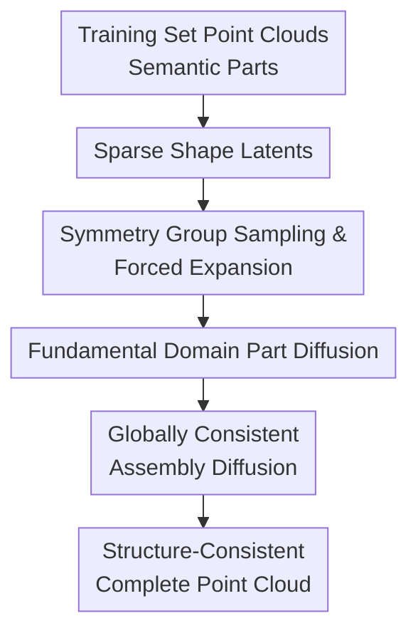

# Quartet of Diffusions: Structure-Aware Point Cloud Generation through Part and Symmetry Guidance

**Conference**: ICLR 2026  
**OpenReview**: [https://openreview.net/forum?id=BT9rsod6Hc](https://openreview.net/forum?id=BT9rsod6Hc)  
**Code**: None  
**Area**: 3D Vision / Point Cloud Generation  
**Keywords**: Point cloud generation, part composition, symmetry constraints, diffusion models, structure-aware generation  

## TL;DR
This paper decomposes point cloud generation into four diffusion processes: shape latent variables, symmetry groups, semantic parts, and part assembly. By using explicit part and symmetry priors, it generates more consistent and controllable 3D point clouds that closely follow the ground truth distribution on ShapeNetPart.

## Background & Motivation
**Background**: 3D point cloud generation has primarily followed two paths: treating the entire point cloud as a single distribution (e.g., flow, VAE, score-based, or diffusion models) or introducing part-aware representations that view objects as compositions of semantic parts to support local editing and structural variations.

**Limitations of Prior Work**: Holistic generation models achieve high visual fidelity but lack explicit mechanisms to constrain relationships between structural units like wings, wheels, or chair legs. Part-based methods, while allowing part manipulation, often ignore "what parts exist and where they are placed" without treating reflections, rotations, or repetitions as learnable and executable generative variables. Consequently, models may produce asymmetric chairs, misaligned wheels, or inconsistent wings.

**Key Challenge**: Structure-aware generation must simultaneously preserve the diversity and geometric quality of global generative models while ensuring that part relationships and symmetry laws are strictly enforced during the generation process. Penalizing asymmetry via loss functions does not guarantee symmetry in output, and part decomposition alone does not ensure globally consistent assembly.

**Goal**: The authors decompose the problem into four sub-tasks: obtain a shape latent variable to coordinate global structure; generate an appropriate symmetry group for each semantic part; generate only the fundamental domain of parts and expand them via the symmetry group; and finally learn the translation, rotation, and scale for assembly.

**Key Insight**: Structural regularities in real objects are reflected in both "what the part is" and "how the part repeats or mirrors." For instance, airplane wings are reflectional pairs, while wheels exhibit local rotational symmetry and pairwise appearance. Rather than letting a large model implicitly guess these rules, they should be treated as interpretable generative variables.

**Core Idea**: Use four synergistic diffusion models to learn shape latents, symmetry groups, fundamental domains, and assembly transformations. This transforms point cloud generation from "holistic sampling" into a process of "defining structural laws, generating parts, and then assembling under global constraints."

## Method

### Overall Architecture
The input to Quartet of Diffusions is the unconditional 3D point cloud distribution learned from the training set, and the output is a complete point cloud $\tilde{x}$ composed of multiple semantic parts. The core formulation represents a point cloud as $x=\bigcup_{j=1}^{M}T_jp_j$, where $p_j$ is the $j$-th semantic part and $T_j$ represents the transformation (translation, rotation, scale) used to place the part in the global coordinate system.

The generation chain consists of four diffusions. First, a global latent $z$ is sampled from the shape latent distribution $p_\theta(z)$. Then, a symmetry group $S_j$ is sampled for each part via $p_\zeta(S_j\mid z)$. Subsequently, the fundamental domain $d_j$ of the part is generated conditioned on $S_j$ and $z$, which is then expanded by the symmetry group to form the full part $p_j$. Finally, a part encoder yields $w_j$, and the assembly diffusion $p_\psi(T_j\mid w_j, z)$ samples the transformation $T_j$ to assemble all parts.

From a probabilistic modeling perspective, the joint distribution is decomposed as:

$$
p\left(\{(p_j,T_j,S_j,w_j)\}_{j=1}^{M},z\right)
=p_\theta(z)\prod_{j=1}^{M}p_\zeta(S_j\mid z)p_\xi(p_j\mid S_j,z)q_\phi(w_j\mid p_j,z)p_\psi(T_j\mid w_j,p_j,S_j,z).
$$

Meaning: $z$ provides the global structural anchor, $S_j$ determines the symmetry laws for each part, $p_j$ handles local geometry, and $T_j$ manages spatial assembly.

### Key Designs
**1. Sparse Shape Latents: Unifying Structural Context**

To prevent parts from being sampled independently and appearing mismatched, a Sparse VAE (SVAE) encodes the full point cloud into a shape latent $z$. A latent diffusion model $p_\theta(z)$ then learns the distribution of these latents. All subsequent diffusion steps are conditioned on $z$, ensuring that the model first determines "what kind of chair/car this is" before generating local structures. The sparse constraint $\mathbb{E}_x[\|a_\eta(x)\|_1]<\delta$ encourages the latent to retain interpretable structural factors.

**2. Symmetry Group Sampling: Generating Fundamental Domains**

Rather than treating symmetry as a "soft" loss constraint, Quartet treats it as a "hard" rule. It samples a symmetry group $S_j$ (restricted to finite rigid transformation groups generated by up to three reflections) and generates only the fundamental domain $d_j$. The full part is then explicitly expanded: $p_j=S_jd_j=\bigcup_{S\in S_j}Sd_j$. This ensures that the generated part naturally satisfies the corresponding symmetry.

**3. Fundamental Domain Diffusion: Concentrating on Non-Redundant Geometry**

By generating only $d_j$ via $p_\xi(d_j\mid S_j,z)$, the model reduces the number of points to be generated (e.g., only one wing or one leg representative) and avoids having to "guess" repetition patterns. This is implemented using a transformer-based diffusion model on voxelized point clouds, utilizing 3D window attention to model local details efficiently.

**4. Globally Consistent Assembly: Predicting Spatial Transformations**

The assembly transformation $T_j$ (translation, rotation, scale) is sampled from $p_\psi(T_j\mid w_j, z)$, where $w_j$ is the part latent. The assembly diffusion considers both the geometry of the part and the global shape. Equivariance fine-tuning (EFT) is applied to the part encoder to ensure stable latent representations under various transformations, preventing part collisions during assembly.

### Loss & Training
Training is conducted sequentially. First, the SVAE is trained using the ELBO with a sparsity penalty $\mathcal{L}_{\text{SVAE}}$. Next, the latent diffusion for $z$ is trained. Symmetry group labels are obtained via a detection algorithm to train the symmetry score diffusion $s_\zeta(S,t)$. The part diffusion is trained to generate $d_j$ conditioned on $S_j, z$. Finally, the part encoder and assembly diffusion are trained. The diffusion objectives follow the standard score matching loss $\mathbb{E}\|\epsilon-\epsilon_\theta(x_t,t)\|^2$.

## Key Experimental Results

### Main Results
Evaluation is performed on ShapeNetPart (Airplane, Car, Chair). Quality is measured by 1-NNA, while structural symmetry is measured by the Symmetry Discrepancy Index (SDI): $L_{\text{SDI}}(p)=d(p,Sd)$.

| Model | PA | SA | Airplane 1-NNA CD/EMD ↓ | Airplane SDI CD/EMD ↓ | Car 1-NNA CD/EMD ↓ | Car SDI CD/EMD ↓ | Chair 1-NNA CD/EMD ↓ | Chair SDI CD/EMD ↓ |
|------|----|----|--------------------------|-------------------------|---------------------|--------------------|-----------------------|----------------------|
| DiT-3D | ✗ | ✗ | 64.7 / 60.3 | 105 / 42.4 | 52.7 / 50.2 | 206 / 327 | 52.5 / 53.1 | 235 / 49.0 |
| SALAD | ✓ | ✗ | 73.9 / 71.1 | 198 / 45.1 | 59.2 / 57.2 | 236 / 29.4 | 57.8 / 58.4 | 308 / 52.6 |
| FrePolad | ✗ | ✗ | 65.3 / 62.1 | 94.1 / 38.1 | 52.4 / 53.2 | 173 / 29.6 | 51.9 / 50.3 | 252 / 50.9 |
| **Ours** | ✓ | ✓ | 63.3 / 59.7 | 25.7 / 1.87 | 50.1 / 51.8 | 25.7 / 2.28 | 51.6 / 53.7 | 28.9 / 2.86 |

*PA: Part-Aware, SA: Symmetry-Aware.*

| Part | SALAD SDI-CD ↓ | **Ours** SDI-CD ↓ | Observation |
|------|----------------|------------------|------|
| Airplane wings | 30.5 | 7.76 | Significant consistency gain in wing pairs |
| Car wheels | 68.5 | 4.10 | Local symmetry enforced effectively |
| Chair legs | 93.5 | 6.19 | Handles repetitive structures well |

### Ablation Study
| Configuration | Latent diff. | Symmetry diff. | Part/assembly diff. | Airplane 1-NNA CD/EMD ↓ | Airplane SDI CD/EMD ↓ | Chair 1-NNA CD/EMD ↓ |
|------|:---:|:---:|:---:|:---:|:---:|:---:|
| Solo (Holistic) | ✗ | ✗ | ✗ | 69.2 / 64.2 | 154 / 44.2 | 53.2 / 53.8 |
| Trio (No Latent) | ✗ | ✓ | ✓ | 85.1 / 85.8 | 3516 / 1450 | 92.5 / 85.2 |
| Trio (No Symmetry) | ✓ | ✗ | ✓ | 63.1 / 63.6 | 95 / 39.2 | 52.3 / 53.9 |
| **Quartet** | ✓ | ✓ | ✓ | 63.3 / 59.7 | 25.7 / 1.87 | 51.6 / 53.7 |

### Key Findings
- **Symmetry is not just a "bonus"**: Without symmetry diffusion (Trio Var 2), 1-NNA remains decent, but SDI degrades significantly, meaning traditional metrics underestimate structural errors.
- **Shape Latent as Anchor**: Models without the global latent (Trio Var 1) collapse because parts and symmetries are sampled inconsistently.
- **SVAE/EFT as Stabilizers**: Sparse latents and Equivariant Fine-Tuning primarily improve the assembly phase by maintaining stable geometric semantics.

## Highlights & Insights
- **Symmetry as a Generative Variable**: Promoting symmetry from a loss function to a sampled variable via fundamental domain expansion is a robust way to ensure structural integrity.
- **Diagnostic Decomposition**: Splitting the problem into four sub-diffusions ($z, S_j, d_j, T_j$) makes 3D shape generation more interpretable and easier to debug compared to black-box models.
- **SDI as a Metric**: The Symmetry Discrepancy Index provides a much-needed structural evaluation that standard metrics like CD or EMD overlook.
- **Controllability**: Since parts are generated separately, the model naturally supports interactive editing where specific parts can be replaced while maintaining overall global consistency via $z$.

## Limitations & Future Work
- **Unconditional Only**: The paper does not yet demonstrate conditional generation from text, images, or sketches.
- **Category Specificity**: Currently tested on rigid objects with clear parts and symmetries; performance on non-rigid or organic shapes with fuzzy boundaries is unverified.
- **Preprocessing Dependency**: The model relies on accurate upstream part segmentation and symmetry detection.
- **Symmetry Constraints**: The symmetry space is mathematically limited (e.g., no translational symmetry), which may restrict the modeling of complex patterns.

## Related Work & Insights
- vs **PointFlow / LION**: Quartet improves upon these by introducing structural interpretability and explicit SDI reduction.
- vs **SPAGHETTI / SALAD**: While both are part-aware, Quartet adds explicit symmetry enforcement rather than just part composition.
- vs **PAGENet**: Unlike PAGENet's soft MSE constraints, Quartet uses fundamental domains to provide hard symmetry guarantees.

## Rating
- **Novelty**: ⭐⭐⭐⭐⭐ (Elegant integration of symmetry groups into the diffusion framework).
- **Experimental Thoroughness**: ⭐⭐⭐⭐ (Strong metrics but limited to three categories).
- **Writing Quality**: ⭐⭐⭐⭐ (Clear decomposition, though requires background in group theory).
- **Value**: ⭐⭐⭐⭐⭐ (A benchmark for structured 3D generation).

<!-- RELATED:START -->

## Related Papers

- [\[ICLR 2026\] Test-Time Optimization of 3D Point Cloud LLM via Manifold-Aware In-Context Guidance and Refinement](test-time_optimization_of_3d_point_cloud_llm_via_manifold-aware_in-context_guida.md)
- [\[ICLR 2026\] MoGen: Detailed Neuronal Morphology Generation via Point Cloud Flow Matching](mogen_detailed_neuronal_morphology_generation_via_point_cloud_flow_matching.md)
- [\[ICLR 2026\] Part-X-MLLM: Part-aware 3D Multimodal Large Language Model](part-x-mllm_part-aware_3d_multimodal_large_language_model.md)
- [\[CVPR 2026\] Mamba Learns in Context: Structure-Aware Domain Generalization for Multi-Task Point Cloud Understanding](../../CVPR2026/3d_vision/mamba_learns_in_context_structure-aware_domain_generalization_for_multi-task_poi.md)
- [\[CVPR 2026\] Photo3D: Advancing Photorealistic 3D Generation through Structure-Aligned Detail Enhancement](../../CVPR2026/3d_vision/photo3d_advancing_photorealistic_3d_generation_through_structure-aligned_detail_.md)

<!-- RELATED:END -->
## Related Papers

- [\[ICLR 2026\] Test-Time Optimization of 3D Point Cloud LLM via Manifold-Aware In-Context Guidance and Refinement](test-time_optimization_of_3d_point_cloud_llm_via_manifold-aware_in-context_guida.md)
- [\[ICLR 2026\] MoGen: Detailed Neuronal Morphology Generation via Point Cloud Flow Matching](mogen_detailed_neuronal_morphology_generation_via_point_cloud_flow_matching.md)
- [\[ICLR 2026\] Part-X-MLLM: Part-aware 3D Multimodal Large Language Model](part-x-mllm_part-aware_3d_multimodal_large_language_model.md)
- [\[CVPR 2026\] Mamba Learns in Context: Structure-Aware Domain Generalization for Multi-Task Point Cloud Understanding](../../CVPR2026/3d_vision/mamba_learns_in_context_structure-aware_domain_generalization_for_multi-task_poi.md)
- [\[CVPR 2026\] Photo3D: Advancing Photorealistic 3D Generation through Structure-Aligned Detail Enhancement](../../CVPR2026/3d_vision/photo3d_advancing_photorealistic_3d_generation_through_structure-aligned_detail_.md)

<!-- RELATED:END -->
