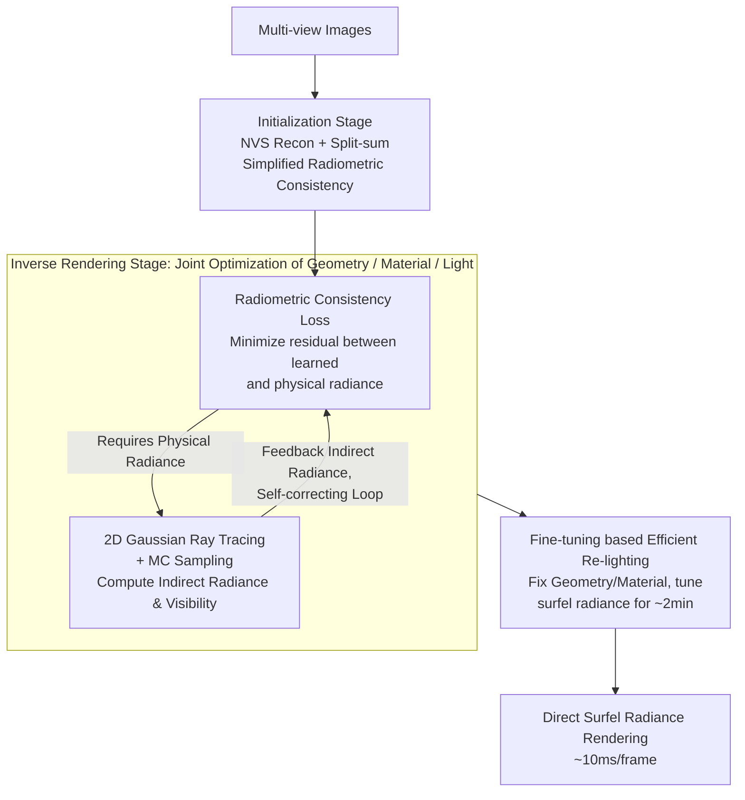

# RadioGS: Radiometrically Consistent Gaussian Surfels for Inverse Rendering

**Conference**: ICLR 2026 Oral  
**arXiv**: [2603.01491](https://arxiv.org/abs/2603.01491)  
**Code**: [https://qbhan.github.io/radiogs-page/](https://qbhan.github.io/radiogs-page/)  
**Area**: 3D Vision  
**Keywords**: Inverse Rendering, Gaussian Splatting, Indirect Illumination, Radiometric Consistency, Ray Tracing

## TL;DR

RadioGS proposes radiometric consistency loss—a mechanism that minimizes the residual between the learned radiance of each Gaussian surfel and its physically rendered radiance. This provides a physics-based supervision signal for unobserved directions, constructing a self-correcting feedback loop that achieves accurate indirect illumination and material decomposition, supporting efficient re-lighting in minutes.

## Background & Motivation

**Background**: Inverse rendering based on Gaussian Splatting has advanced rapidly, enabling efficient recovery of geometry, material, and lighting from multi-view images. However, accurately decomposing global illumination effects, particularly indirect illumination and inter-reflections, remains a core challenge.

**Limitations of Prior Work**: Existing methods handle indirect illumination in two primary ways: (1) Treating indirect radiance as a learnable residual (e.g., R3DG, GS-IR), where unconstrained optimization leads to ambiguous decomposition of lighting and materials; (2) Querying indirect radiance from pre-trained NVS Gaussian primitives (e.g., IRGS, SVG-IR), but pre-training is only supervised for training views, meaning radiance queried from unobserved directions can be entirely incorrect.

**Key Challenge**: NVS training only constrains Gaussian radiance from camera-visible directions, yet indirect illumination requires querying radiance from arbitrary directions (including inter-reflection directions). The lack of supervision for unobserved directions leads to inaccurate indirect radiance, which results in lighting being incorrectly baked into surface materials.

**Goal**: To provide a physics-based constraint that allows Gaussian surfels to obtain correct radiance values in unobserved directions, thereby accurately modeling indirect illumination and inter-reflections.

**Key Insight**: Drawing inspiration from self-training radiance caches—the radiance values of Gaussian primitives can gradually converge to physically correct solutions by iteratively minimizing the rendering equation residual.

**Core Idea**: Radiometric Consistency = Aligning the learned radiance $L_\mathbf{G}$ of each Gaussian surfel with its physically rendered radiance $L_\mathbf{G}^{PBR}$ based on the rendering equation. This forms a self-correcting loop where reconstruction supervision from camera views propagates to indirect illumination terms, and physical rendering in turn constrains radiance in unobserved directions.

## Method

### Overall Architecture

RadioGS addresses a long-overlooked loophole in GS inverse rendering: NVS reconstruction only constrains Gaussian radiance visible to the camera, while indirect illumination requires querying radiance from any direction. Without supervision for unobserved directions, lighting is erroneously baked into materials. The overall approach applies a **physically self-consistent** constraint to the radiance of each Gaussian surfel, aligning "learned radiance" with "radiance re-calculated via the rendering equation," thereby propagating accurate signals from camera views to unobserved directions along light paths.

The workflow consists of two stages plus a lightweight fine-tuning. The initialization stage pre-trains surfels using a simplified radiometric consistency loss based on split-sum approximation alongside NVS reconstruction loss to stabilize geometry. The inverse rendering stage then employs the full Monte Carlo radiometric consistency loss, combined with material smoothness and lighting priors, to jointly optimize geometry, materials, and lighting. Within this, the **radiometric consistency loss** and the supporting **2D Gaussian ray tracing + Monte Carlo sampling** form a self-correcting cycle. For re-lighting, geometry and materials are fixed, and surfel radiance is fine-tuned under new lighting for approximately 2 minutes. Afterward, images are rendered by directly reading surfel radiance (<10ms/frame) without runtime ray tracing.

### Key Designs

**1. Radiometric Consistency Loss: Physical Supervision for Unobserved Directions**

The root of the problem is that NVS only supervises directions visible to the camera. RadioGS requires the learned radiance $L_\mathbf{G}$ of each surfel at position $x$ and outgoing direction $\omega_o$ to equal the physical radiance re-integrated according to the rendering equation:

$$L_\mathbf{G}^{PBR}(x,\omega_o) = \int f_r \cdot (V \cdot L_{dir} + L_{ind}) \cdot (\omega_i \cdot n_x)\, d\omega_i,$$

where visibility $V$ and indirect radiance $L_{ind}$ are obtained through 2D Gaussian ray tracing. The difference is the residual $\mathcal{R}_\mathbf{G} = L_\mathbf{G} - L_\mathbf{G}^{PBR}$, and the loss minimizes its L1 expectation $\mathcal{L}_{rad} = \mathbb{E}_{j,\omega_o}[\|\mathcal{R}_\mathbf{G}\|_1]$. This propagates accurate radiance from camera views to other surfels via $L_{ind}$, ensuring physical consistency through a bidirectional feedback loop.

**2. 2D Gaussian Ray Tracing and Monte Carlo Sampling: Differentiable Indirect Radiance**

To compute physical radiance, the visibility and indirect light between surfels must be known and differentiable. RadioGS reuses a 2D Gaussian ray tracer: $\text{Trace}(x, \omega_i; \mathbf{G}) = (L_{trace}, T_{trace})$, using accumulated radiance $L_{trace}$ as $L_{ind}$ and $1-T_{trace}$ as $V$. Integrals are estimated via Monte Carlo sampling: in each step, $N_g = 4096$ surfels are randomly selected, each sampling $N_s = 64$ incident rays. Outgoing directions include both random (unobserved) and camera (constrained) directions to ensure the propagation of NVS-constrained signals.

**3. Fine-tuning based Efficient Re-lighting: Offloading Runtime Costs**

Traditional methods require expensive runtime querying of indirect radiance. RadioGS pre-computes this cost: given new lighting, surfel radiance parameters are fine-tuned by minimizing $\mathcal{L}_{rad}$ for a few minutes. Once completed, images can be rendered from any view by directly reading surfel radiance (<10ms/frame), avoiding runtime ray tracing or storing per-surfel incident radiance.

### Loss & Training

Initialization stage: $\mathcal{L}_{init} = \mathcal{L}_{recon} + \mathcal{L}_{recon}^{PBR} + \lambda_{rad}\mathcal{L}_{rad} + \lambda_{dist}\mathcal{L}_{dist} + \lambda_n\mathcal{L}_n + \lambda_{ns}\mathcal{L}_{ns} + \lambda_m\mathcal{L}_m$ (split-sum version). Inverse rendering stage: $\mathcal{L}_{inv} = \mathcal{L}_{init} + \lambda_{as}\mathcal{L}_{as} + \lambda_{rs}\mathcal{L}_{rs} + \lambda_{light}\mathcal{L}_{light}$ (Full MC radiometric consistency + material/lighting priors). Radiometric consistency weight $\lambda_{rad} = 0.2$ (inverse rendering) and $1.0$ (re-lighting). Total training time is approximately 60 minutes on an RTX 4090.

## Key Experimental Results

### Main Results

| Method | NVS PSNR↑ | Normal MAE↓ | Albedo PSNR↑ | Relight PSNR↑ | Training Time |
|------|-----------|-------------|-------------|--------------|---------|
| TensoIR (NeRF) | 35.09 | 4.10 | 29.27 | 28.58 | 4h |
| GS-IR | 35.33 | 4.95 | 29.94 | 24.37 | - |
| **RadioGS (Ours)** | **Best** | **Best** | **Best** | **Best** | **1h** |

RadioGS outperforms existing GS and NeRF methods across almost all metrics on the TensoIR dataset while maintaining computational efficiency.

### Ablation Study

| Configuration | Relight PSNR | Description |
|------|-------------|------|
| Full RadioGS | Best | Full MC Radiometric Consistency |
| w/o Rad. Consist. Loss | Significant Drop | Inaccurate indirect illumination |
| Split-sum only (No MC) | Drop | Approximation insufficient for complex reflections |
| w/o Initialization Consist. | Drop | Unstable geometric foundation |
| Fine-tune vs. RT Relighting | Slightly lower | Extremely fast rendering (<10ms vs ~100ms) |

### Key Findings

- The radiometric consistency loss is the core of RadioGS's advantage; re-lighting quality drops significantly without it, proving the necessity of physical constraints for indirect illumination.
- The reflection of a red bulb on a yellow Lego surface (TensoIR dataset) demonstrates the ability to model inter-reflections accurately, whereas other methods often bake such effects into the albedo.
- The fine-tuning re-lighting strategy achieves quality close to ray tracing in 2 minutes while being an order of magnitude faster during rendering.

## Highlights & Insights

- The **self-correcting feedback loop** is a profound insight—NVS supervision and physical constraints are complementary: NVS constrains observed directions, while physical rendering constrains unobserved directions, linked through the indirect illumination term.
- **Simplified radiometric consistency in initialization** is a crucial engineering insight—using MC sampling on unstable geometry causes oscillation; split-sum provides a smooth transition.
- **Fine-tuning for re-lighting** shifts the cost from runtime to offline, making it highly suitable for multi-frame rendering applications.

## Limitations & Future Work

- Assumes dielectric materials; performance on highly specular materials like metals is not yet verified.
- $2^{18}$ rays per step still incur calculation overhead, resulting in a 1-hour training time.
- MC sampling may be inaccurate in low-density surfel areas.
- Fine-tuning for re-lighting may require more iterations under extreme lighting changes (e.g., indoor to outdoor).

## Related Work & Insights

- **vs IRGS (Gu et al., 2024)**: IRGS uses Gaussian ray tracing but relies on observed image signals; RadioGS provides additional supervision for unobserved directions via physical constraints.
- **vs SVG-IR (Sun et al., 2025)**: SVG-IR queries radiance from pre-trained Gaussians which are unconstrained in unobserved directions; RadioGS's radiometric consistency solves this fundamental issue.
- **vs Neural Radiance Cache (Müller et al., 2021)**: Radiance caches are used for forward rendering; RadioGS extends this concept to Gaussian primitives in inverse rendering.

## Rating

- Novelty: ⭐⭐⭐⭐⭐ The self-correcting feedback loop for radiometric consistency is physically motivated and innovative.
- Experimental Thoroughness: ⭐⭐⭐⭐ Extensive evaluations on synthetic and real datasets with comprehensive ablations.
- Writing Quality: ⭐⭐⭐⭐⭐ Very clear problem motivation, method derivation, and experimental analysis.
- Value: ⭐⭐⭐⭐⭐ Significant progress in accurately modeling indirect illumination for GS inverse rendering.

<!-- RELATED:START -->

## Related Papers

- [\[CVPR 2026\] SGS-Intrinsic: Semantic-Invariant Gaussian Splatting for Sparse-View Indoor Inverse Rendering](../../CVPR2026/3d_vision/sgs-intrinsic_semantic-invariant_gaussian_splatting_for_sparse-view_indoor_invers.md)
- [\[CVPR 2025\] SVG-IR: Spatially-Varying Gaussian Splatting for Inverse Rendering](../../CVPR2025/3d_vision/svg-ir_spatially-varying_gaussian_splatting_for_inverse_rendering.md)
- [\[ICCV 2025\] GeoSplatting: Towards Geometry Guided Gaussian Splatting for Physically-based Inverse Rendering](../../ICCV2025/3d_vision/geosplatting_towards_geometry_guided_gaussian_splatting_for_physically-based_inv.md)
- [\[CVPR 2026\] MVInverse: Feed-forward Multiview Inverse Rendering in Seconds](../../CVPR2026/3d_vision/mvinverse_feed-forward_multiview_inverse_rendering_in_seconds.md)
- [\[CVPR 2025\] PBR-NeRF: Inverse Rendering with Physics-Based Neural Fields](../../CVPR2025/3d_vision/pbr-nerf_inverse_rendering_with_physics-based_neural_fields.md)

<!-- RELATED:END -->
