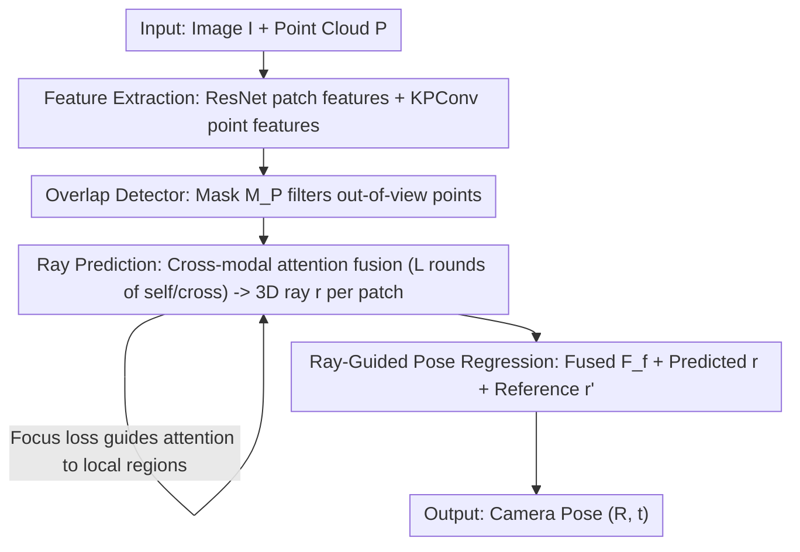

# RayI2P: Learning Rays for Image-to-Point Cloud Registration

**Conference**: ICLR 2026  
**OpenReview**: [https://openreview.net/forum?id=arfeGsDWoq](https://openreview.net/forum?id=arfeGsDWoq)  
**Code**: To be confirmed (authors promise open source after acceptance)  
**Area**: 3D Vision  
**Keywords**: Image-to-point cloud registration, Camera pose estimation, Ray representation, Cross-modal, Differentiable pose regression

## TL;DR
This paper reformulates image-to-point cloud registration from "establishing 2D-3D correspondences" to "predicting a bundle of 3D rays for each image patch." A differentiable ray-guided regression module is then used to directly estimate the camera's 6-DoF pose, fundamentally bypassing projection ambiguity and scale inconsistency, setting new state-of-the-art accuracy on KITTI and nuScenes.

## Background & Motivation

**Background**: Image-to-point cloud registration aims to estimate the 6-DoF camera pose of a query image relative to a pre-built 3D point cloud map, a fundamental task in 3D reconstruction, AR/VR, SLAM, and visual localization. Existing methods fall into two categories: matching-free methods (e.g., DeepI2P) use geometric priors to predict pose directly without explicit correspondences, while matching-based methods (CorrI2P, VP2P-Match, CoFiI2P, ICL, GraphI2P, etc.) first establish dense 2D-3D correspondences and then solve for pose using geometric solvers like PnP-RANSAC, consistently maintaining superior accuracy.

**Limitations of Prior Work**: Matching-free methods rely on frustum classification providing only "coarse supervision"—determining if a 3D point is inside the camera frustum—resulting in large pose errors due to lack of fine-grained alignment signals. Matching-based methods offer higher precision but are hindered by two structural issues.

**Key Challenge**: The first is **projection-induced correspondence ambiguity**—under perspective projection, multiple 3D points with vastly different geometric properties (curvature, normals, semantics) distributed along the same line of sight project onto the same image patch. This forces the model to align dissimilar 3D features with the same image feature, leading to feature collapse. The second is **depth-induced scale inconsistency**—fixed-size image patches correspond to wildly different 3D physical ranges depending on depth (a small foreground object and a large distant object may occupy the same image area). This misalignment of receptive fields makes learning a scale-consistent similarity metric extremely difficult, especially in complex outdoor scenes.

**Goal**: To move beyond the "direct 2D-3D correspondence" paradigm and find a cross-modal geometric representation naturally resistant to projection ambiguity and scale drift while providing fine-grained supervision.

**Key Insight**: The authors observe that under a pinhole camera model, each image patch naturally corresponds to a 3D ray originating from the camera center. Ray direction only encodes orientation and is not bound to depth, making it insensitive to both the specific depth along the sightline and the physical scale—perfectly addressing the two main pain points.

**Core Idea**: Replace "establishing 2D-3D point pairs" with "predicting a 3D ray (ray bundle) for each patch," and then differentiably regress the camera pose from the ray bundle, bypassing explicit matching.

## Method

### Overall Architecture
Inputting an image $I \in \mathbb{R}^{H\times W\times 3}$ and a point cloud $P \in \mathbb{R}^{N\times 3}$ from the same scene, the model outputs the camera pose $T_{gt}=(R_{gt}, t_{gt})$ in the point cloud coordinate system. The pipeline operates in two sequential stages: first, a **Ray Prediction Module** infers a consistent 3D ray for each image patch; second, a **Differentiable Ray-Guided Pose Regression Module** jointly regresses rotation and translation from the ray bundle.

Specifically, the image is downsampled via ResNet to patch features $F_I \in \mathbb{R}^{H_cW_c\times C}$ ($H_c=H/8, W_c=W/8$), and the point cloud is processed via KPConv to obtain point features $F_P \in \mathbb{R}^{N_c\times C}$. An overlap detector predicts a binary mask $M_P$ to identify visible 3D points. Cross-modal attention fuses patch and visible point features into $F_f$, from which an MLP head regresses the ray $r \in \mathbb{R}^{H_cW_c\times 6}$ for each patch. Finally, the pose regression module takes fused features $F_f$, predicted rays $r$, and reference rays $r'$ into a differentiable network to output $(R, t)$.

### Key Designs

**1. Representing Cameras via Plücker Rays: Replacing rigid extrinsics with over-parameterized ray bundles**

Directly regressing camera extrinsics $(R, t)$ is difficult due to low dimensionality, strong geometric constraints, and high nonlinearity. Ours borrows from the generalized camera model, representing the camera as a "bundle of rays bound to image patches." Each patch center pixel $u_i$ corresponds to a 3D ray $r_i = [d_i, m_i] \in \mathbb{R}^6$ in Plücker coordinates, where $d_i$ is the direction and $m_i = p_i \times d_i$ is the moment vector (invariant to which point $p_i$ on the ray is chosen). Given $(R, t, K)$, rays can be generated as $d_i = R^\top K^{-1}\tilde{u}_i$ and $m_i = (-R^\top t)\times d_i$. Conversely, the camera can be recovered: the center is $c=\arg\min_p \sum_i\|p\times d_i - m_i\|^2$, and rotation is solved by aligning ray directions. This bidirectional invertibility bridges geometric interpretability and modeling flexibility. Crucially, as $d_i$ is depth-independent, it inherently resists projection ambiguity and scale drift.

**2. Cross-modal Attention + Overlap Mask: Fusing only visible and relevant 3D geometry**

To predict the correct ray for each patch, the model must extract relevant 3D information. Path coordinates $E_I$ and point coordinates $E_P$ are processed by an MLP for positional embeddings, added to features to create position-aware representations $F_I' = F_I + PE_I$ and $F_P' = F_P + PE_P$. The mask $M_P$ filters out irrelevant geometry. Then, $L$ rounds of alternating self-attention and cross-attention are performed: self-attention enables global context exchange between image patches, while cross-attention allows patches to attend to visible 3D points. By default, $L=2$.

**3. Focus Loss: Constraining attention to 3D points projecting near the patch**

Without constraints, cross-modal attention may become erratic. Ours introduces focus loss to guide cross-attention distributions, encouraging each patch to assign higher attention to 3D points whose projections fall within a circle of radius $\sigma$ around the patch center. If $H \in \mathbb{R}^{H_cW_c\times N_c}$ is the average attention map, and $\mathbb{1}_{ij}=1$ when $\|E_{I,i}-E^{2D}_{P,j}\|_2 < \sigma$, then:

$$L_{foc} = 1 - \frac{1}{H_cW_c}\sum_{i=1}^{H_cW_c}\sum_{j=1}^{N_c} H_{ij}\cdot \mathbb{1}_{ij}.$$

This pushes attention toward spatially local and geometerically meaningful regions, improving ray precision and convergence. Ablation shows $\sigma=32$ is optimal.

**4. Differentiable Ray-Guided Pose Regression: Learning-based regression over unstable geometric solvers**

Predicted rays may contain noise or outliers. Classical geometric solvers can become unstable under such conditions. Ours instead uses a differentiable regression module. Fused features $F_f$, predicted rays $r$ (in LiDAR coordinates), and reference rays $r'$ (identity rays in camera coordinates calculated via $K$ as geometric anchors) are concatenated to form ray-guided features $F_r$. These are global-pooled and concatenated back as context-enhanced features $F_c$, then compressed into a pose vector $v_{pose}$. Two lightweight MLP heads predict rotation (using 6D continuous representation) and translation.

### Loss & Training
The total loss is $L_{total} = L_{ray} + L_{cam} + L_{foc}$:

- Ray regression loss $L_{ray} = \frac{1}{H_cW_c}\sum_i \|r_{gt,i}-r_i\|_2$, supervised by ground truth rays.
- Camera pose loss $L_{cam} = \|R_{gt}-R\|_2 + \|t_{gt}-t\|_2$, directing pose supervision.
- Focus loss $L_{foc}$ for attention guidance.

## Key Experimental Results

### Main Results
Testing on KITTI (Seqs 9-10) and nuScenes, using metrics: Mean Relative Translation Error (RTE), Relative Rotation Error (RRE), and Registration Accuracy (Acc: RTE < 2m & RRE < 5°). Unlike previous works, all test pairs are retained for robustness evaluation.

| Dataset | Metric | Ours | ICL (Prev. SOTA) | GraphI2P† (w/ depth) |
|--------|------|------|----------|----------|
| KITTI | RTE(m)↓ | **0.09±0.08** | 0.20±0.21 | 0.32±0.81 |
| KITTI | RRE(°)↓ | **0.63±0.71** | 1.24±2.34 | 1.65±1.32 |
| KITTI | Acc(%)↑ | **99.75** | 97.49 | 99.61 |
| nuScenes | RTE(m)↓ | **0.39±0.29** | 0.63±0.44 | 0.49±1.22 |
| nuScenes | RRE(°)↓ | **1.48±5.72** | 2.13±3.75 | 1.73±1.63 |
| nuScenes | Acc(%)↑ | 96.61 | 90.94 | **99.48** |

**Gain**: On KITTI, Ours leads all metrics, reducing RTE by 0.11m and RRE by 0.61° compared to ICL. It even outperforms GraphI2P, which uses an external depth estimator. On nuScenes, Ours significantly outperforms ICL and remains competitive with GraphI2P. Inference takes 0.11s, ~80x faster than those with heavy post-processing.

### Ablation Study
(FPF=Fused patch features, PR=Predicted rays, RR=Reference rays, CPS=Classical Solver)

| Config | RTE(m)↓ | RRE(°)↓ | Acc(%)↑ | Note |
|------|---------|---------|---------|------|
| FPF only | 0.33 | 2.07 | 94.48 | Features only, poor |
| PR only | 0.34 | 1.14 | 98.66 | Rays boost rotation accuracy |
| FPF+PR | 0.10 | 0.73 | 99.41 | Complementary features |
| PR+RR+CPS | 0.10 | 0.82 | 99.62 | Geometric solver is unstable |
| Full | **0.09** | **0.63** | **99.75** | Best performance |

### Key Findings
- **Ray representation is the core driver**: Moving from "FPF only" to "PR only" dropped RRE from 2.07° to 1.14°, proving that modeling the camera as a ray bundle is easier to learn than direct extrinsic regression.
- **Learnable Regression > Geometric Solvers**: Classical solvers showed high variance ($\pm20.93$) on nuScenes. The learnable module stabilized this, confirming its robustness against noisy ray predictions.
- **Focus Radius Sweet Spot**: Accuracy improves as $\sigma$ goes from 8 to 32, but degrades beyond that or without the loss, showing $\sigma=32$ balances locality with geometric context.

## Highlights & Insights
- **Representation over Architecture**: The breakthrough replaces "2D-3D point matching" with "patch $\to$ 3D rays." The depth-independence of ray direction makes long-standing issues like projection ambiguity vanish by design.
- **Plücker Invertibility**: The bidirectional mapping between rays and extrinsics maintains geometric interpretability while leveraging the ease of learning over-parameterized ray bundles.
- **Focus Loss as a Cheap Prior**: Guiding attention with a simple "projected proximity" constraint boosts accuracy and convergence at zero extra inference cost.
- **SOTA via Simplicity**: Using downsampled resolutions and lightweight MLP heads, Ours is 80x faster than competitors.

## Limitations & Future Work
- Pose quality remains capped by the accuracy of the ray prediction; noisy rays necessitate learnable regression.
- Validation is limited to outdoor driving (KITTI/nuScenes); generalization to indoor or sparse point clouds remains to be fully explored.
- Dependent on the accuracy of the overlap detector; poor visibility masks can propagate errors to the fusion stage.

## Related Work & Insights
- **vs DeepI2P**: Uses coarse frustum classification; Ours uses patch-level rays for fine-grained, orientation-aware supervision, achieving an order of magnitude better precision.
- **vs ICL / CoFiI2P**: These rely on discrete point matches vulnerable to scale drift; Ours uses continuous rays to bypass explicit correspondences entirely.
- **vs GraphI2P**: Avoids the computational overhead of external depth estimation by utilizing the inherent depth-independence of rays.

## Rating
- Novelty: ⭐⭐⭐⭐⭐ Reformulating registration as ray learning is a paradigm-level innovation.
- Experimental Thoroughness: ⭐⭐⭐⭐ Solid results on standard benchmarks but lacks cross-domain indoor testing.
- Writing Quality: ⭐⭐⭐⭐⭐ Very clear motivation and derivation.
- Value: ⭐⭐⭐⭐⭐ SOTA accuracy, 80x speedup, and a simple, transferable ray representation.

<!-- RELATED:START -->

## Related Papers

- [\[CVPR 2026\] Hg-I2P: Bridging Modalities for Generalizable Image-to-Point-Cloud Registration via Heterogeneous Graphs](../../CVPR2026/3d_vision/hg-i2p_bridging_modalities_for_generalizable_image-to-point-cloud_registration_v.md)
- [\[CVPR 2026\] SuP: Sub-cloud Driven Point Cloud Registration](../../CVPR2026/3d_vision/sup_sub-cloud_driven_point_cloud_registration.md)
- [\[ICLR 2026\] Spiking Discrepancy Transformer for Point Cloud Analysis](spiking_discrepancy_transformer_for_point_cloud_analysis.md)
- [\[CVPR 2026\] Deformation-based In-Context Learning for Point Cloud Understanding](../../CVPR2026/3d_vision/deformation-based_in-context_learning_for_point_cloud_understanding.md)
- [\[CVPR 2026\] C-GenReg: Training-Free 3D Point Cloud Registration by Multi-View-Consistent Geometry-to-Image Generation with Probabilistic Modalities Fusion](../../CVPR2026/3d_vision/c-genreg_training-free_3d_point_cloud_registration_by_multi-view-consistent_geom.md)

<!-- RELATED:END -->
