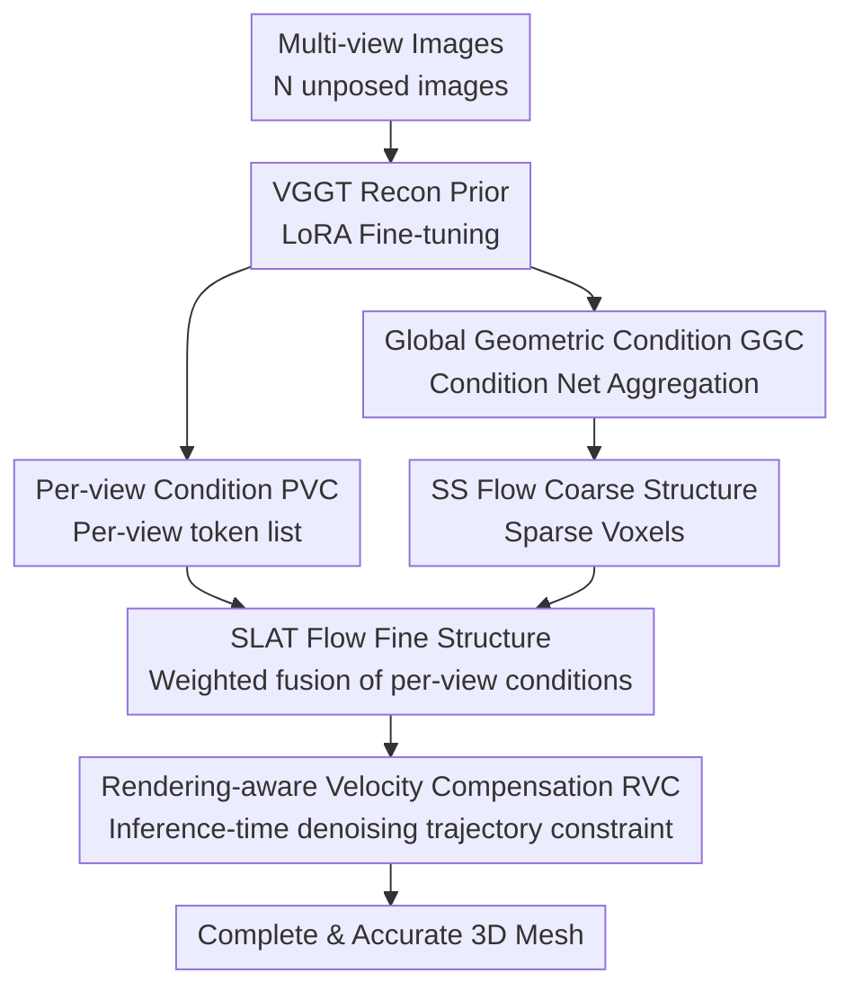

# ReconViaGen: Towards Accurate Multi-view 3D Object Reconstruction via Generation

**Conference**: ICLR 2026  
**OpenReview**: [https://openreview.net/forum?id=z0QLeooEEf](https://openreview.net/forum?id=z0QLeooEEf)  
**论文**: [Project Page](https://jiahao620.github.io/reconviagen)  
**Code**: To be confirmed  
**Area**: 3D Vision  
**Keywords**: Multi-view reconstruction, 3D generative prior, Diffusion models, Reconstruction prior, Pose-agnostic

## TL;DR
ReconViaGen integrates strong reconstruction priors (VGGT) as multi-view perceptual conditions into a diffusion-based 3D generator (TRELLIS). During inference, it employs rendering-aligned velocity compensation to constrain the denoising trajectory. This approach maintains the capability to "complete unobserved parts" while ensuring global structure and local details are highly consistent with input views, achieving SOTA results on Dora-bench and OmniObject3D.

## Background & Motivation
**Background**: Multi-view 3D object reconstruction is a long-standing core task in 3D vision. Prevailing methods (feed-forward reconstructors like NeRF, 3DGS, DUSt3R/VGGT) rely on sufficient view overlap and learnable cross-view correspondences to estimate geometry and appearance.

**Limitations of Prior Work**: Real-world acquisition frequently involves occlusions, sparse coverage, weak textures, and support surface interference. Pure reconstruction methods can only recover "visible surfaces" and are ineffective for unobserved regions, often resulting in holes, artifacts, or missing/blurry geometric details, which severely limits **completeness**.

**Key Challenge**: Diffusion-based 3D generative priors can learn priors from large-scale 3D datasets to "hallucinate" plausible structures for unobserved parts (solving completeness). however, **diffusion inference is inherently stochastic**, leading to uncontrollable variations that struggle with the pixel-level alignment required for reconstruction. There is a fundamental tension between **accuracy/reliability** and generative completeness. Consequently, existing reconstruction frameworks have failed to effectively absorb diffusion generative priors.

**Key Insight**: The authors analyze two root causes for "inconsistency" in existing multi-view diffusion generation: (a) when using multi-view image features as conditions, **cross-view associations are not adequately constructed or utilized**, leading to inaccurate global and local estimates of geometry and texture; (b) **iterative denoising lacks controllability** during local detail generation, making it prone to generating plausible but inconsistent details.

**Core Idea**: Anchor the generation using strong reconstruction priors. Specifically, the rich 3D lifting information encoded by the VGGT reconstructor is aggregated into diffusion conditions (addressing a). Furthermore, during inference, rendering-aligned velocity compensation explicitly constrains the denoising trajectory (addressing b), making generation "subserve reconstruction."

## Method

### Overall Architecture
ReconViaGen addresses "pose-agnostic multi-view reconstruction": given $N$ uncalibrated multi-view images $I=\{I_i\}_{i=1}^{N}$, it outputs a complete 3D object $O$ consistent with the inputs. The workflow runs reconstruction and generation simultaneously, leveraging their complementarity—using TRELLIS's generative prior to complete unobserved parts and VGGT's reconstruction prior to constrain accuracy—via a coarse-to-fine three-stage pipeline.

In the first stage, a fine-tuned VGGT (feed-forward transformer with DINO ViT + 24 layers of alternating intra-frame/global self-attention, decoding camera parameters, depth, point maps, and tracking features) provides reconstruction priors. Instead of using explicit outputs like point clouds, the authors aggregate multi-layer VGGT features $\phi^{vggt}$ through a Condition Net into a **Global Geometric Condition (GGC)** and **Per-View local Conditions (PVC)**. The second stage feeds GGC into TRELLIS’s SS Flow to generate coarse structures (sparse voxels) and PVC into SLAT Flow to generate fine structure latents (textured meshes). The third stage, active only during inference, employs **Rendering-aware Velocity Compensation (RVC)**: it uses initial generation results to refine camera poses, then decodes and renders the current denoising state to compare against input images, using the resulting gradients to correct the denoising velocity at each step for pixel-level alignment.

### Key Designs

**1. Global Geometric Condition (GGC): Anchoring coarse structure with reconstruction features**

To address the lack of cross-view association leading to inaccurate global structures, the authors avoid using VGGT’s point cloud output (which is lossy) and instead use a Condition Net to aggregate all multi-layer VGGT features $\phi^{vggt}$ (concatenated across views in the token dimension) into a **fixed-length** token list $T_g$. Starting from a learnable initial token list $T_{init}$, four cross-attention blocks fuse VGGT features layer-by-layer:

$$T^{i+1}=\mathrm{CrossAttn}\big(Q(T^i),\,K(\phi^{vggt}),\,V(\phi^{vggt})\big),\quad i\in\{0,1,2,3\}$$

where $T^0=T_{init}$ and $T^3=T_g$. $T_g$ serves as the condition for SS Flow, ensuring the coarse structure is rooted in explicit 3D lifting information like camera poses, depth, and point maps encoded by VGGT. During SS Flow training, VGGT is frozen while only the Condition Net and DiT are trained. Ablations show GGC alone improves PSNR from 16.7 to 20.5 and reduces CD from 0.144 to 0.093, identifying it as the primary driver of global structural accuracy.

**2. Per-View local Condition (PVC) and Weighted Fusion: Infusing local details**

Since a single global token lacks sufficient information for geometric/texture details, the authors use the same Condition Net to initialize a token list $P_k$ for **each view** individually, fusing only the corresponding view's VGGT features $\phi^{vggt}_k$:

$$P_k^{i+1}=\mathrm{CrossAttn}\big(Q(P_k^i),\,K(\phi^{vggt}_k),\,V(\phi^{vggt}_k)\big)$$

The set $\{P_k\}_{k=1}^{N}$ provides per-view guidance for SLAT Flow. In each SLAT DiT block, the noise latent $y_j$ undergoes self-attention to yield $y'_j$, followed by cross-attention with each view condition $P_k$. These are combined using fusion weights $w_k\in(0,1)$ calculated by an MLP:

$$y_{j+1}=\sum_{k=1}^{N}\mathrm{CrossAttn}\big(Q(y'_j),\,K(P_k),\,V(P_k)\big)\cdot w_k$$

This weighted fusion, rather than simple averaging, allows the model to adaptively determine the reliability of each view for specific voxel details. Ablations indicate PVC primarily improves PSNR (20.5→21.0), corresponding to better local per-view alignment.

**3. Rendering-aware Velocity Compensation (RVC): Explicit pixel-alignment on denoising trajectories**

While GGC and PVC provide conditional guidance, the denoising process itself lacks hard constraints relative to the input images. RVC is introduced during inference for $t<0.5$. It first refines camera poses $C$ using the second-stage results via VGGT. The current SLAT state is decoded into $O_t$ (e.g., a textured mesh) and rendered from $C$ to compute multi-similarity losses against input images:

$$L_{RVC}(v_t)=L_{SSIM}+L_{LPIPS}+L_{DreamSim}$$

If a view's loss exceeds 0.8 (typically due to poor pose estimation), it is discarded. To solve the optimization problem of updating massive voxel latents simultaneously, the gradient of the loss with respect to the predicted target $\hat{x}_0=x_t-t\cdot v_t$ is converted into a velocity compensation term:

$$\Delta v_t=\frac{\partial L}{\partial \hat{x}_0}\frac{\partial \hat{x}_0}{\partial v_t}=-t\,\frac{\partial L}{\partial \hat{x}_0}$$

This is added to each denoising step (with $\alpha=0.1$ controlling intensity):

$$x_{t_{prev}}=x_t-(t-t_{prev})\,(v+\alpha\cdot\Delta v)$$

This forces input images to act as strong explicit guides, pushing SLAT vectors toward details consistent across all inputs. RVC pushes PSNR to 22.6 and F-score to 0.953.

### Loss & Training
The VGGT aggregator is fine-tuned using LoRA (rank 64, alpha 128) applied to qkv and projection layers. Multi-task objectives $L_{VGGT}=L_{camera}+L_{depth}+L_{nmap}$ preserve pre-trained geometric priors. SS/SLAT Flow follows the TRELLIS conditional flow matching objective $L_{CFM}=\mathbb{E}\,\|v_\theta(x,t)-(\epsilon-x_0)\|_2^2$ with CFG (drop rate 0.3). The model is fine-tuned on 390k objects from Objaverse.

## Key Experimental Results

### Main Results
Evaluated on Dora-bench (300 objects, 4-view input) and OmniObject3D (200 objects, 4-view). PSNR/SSIM/LPIPS measure consistency, while CD/F-score measure geometric accuracy and completeness.

| Dataset | Method | PSNR↑ | LPIPS↓ | CD↓ | F-score↑ |
|--------|------|-------|--------|------|----------|
| Dora-bench | TRELLIS-M | 16.71 | 0.111 | 0.144 | 0.843 |
| Dora-bench | Hunyuan3D-2.0-mv | 20.22 | 0.093 | 0.094 | 0.937 |
| Dora-bench | InstantMesh | 18.92 | 0.120 | 0.110 | 0.865 |
| Dora-bench | VGGT | - | - | 0.112 | 0.921 |
| Dora-bench | **Ours** | **22.63** | **0.090** | **0.090** | **0.953** |
| OmniObject3D | TRELLIS-M | 16.86 | 0.242 | 0.072 | 0.932 |
| OmniObject3D | InstantMesh | 17.50 | 0.145 | 0.094 | 0.907 |
| OmniObject3D | **Ours** | **19.77** | **0.141** | **0.059** | **0.959** |

Ours leads across all metrics and outperforms both TRELLIS and VGGT, validating that the complementarity of the two priors achieves a "1+1>2" effect.

### Ablation Study

| Config | GGC | PVC | RVC | PSNR↑ | CD↓ | F-score↑ |
|------|-----|-----|-----|-------|------|----------|
| (a) baseline (TRELLIS-M) | ✗ | ✗ | ✗ | 16.71 | 0.144 | 0.843 |
| (b) +GGC | ✓ | ✗ | ✗ | 20.46 | 0.093 | 0.941 |
| (c) +PVC | ✓ | ✓ | ✗ | 21.05 | 0.093 | 0.937 |
| (d) Full +RVC | ✓ | ✓ | ✓ | 22.63 | 0.090 | 0.953 |

### Key Findings
- **GGC provides the largest contribution**: Adding only GGC boosts PSNR by ~3.8 points and nearly halves CD, proving that anchoring coarse structure with reconstruction features is the foundation of accuracy.
- **PVC improves local alignment**: Enhances PSNR (appearance consistency) while having minimal effect on global CD.
- **RVC provides significant inference-time gains**: Improves F-score from 0.937 to 0.953 and PSNR by +1.6, demonstrating the effectiveness of explicit rendering constraints.
- **Diminishing returns with view count**: PSNR increases from 1→2→4 views (18.4→19.6→22.6) but saturates at 8 views (23.1). 4 views represent the optimal efficiency point.

## Highlights & Insights
- **Reconstruction priors as conditions, not post-processing**: Aggregating rich features rather than using explicit model outputs (like point clouds) avoids information loss—a representative paradigm for "feature-guided generation."
- **Clever Gradient-to-Velocity Compensation**: Converting rendering loss into a velocity correction term via $\partial\hat{x}_0/\partial v_t=-t$ enables "training-free, plug-and-play" pixel alignment in corrected flow frameworks.
- **Weighted Per-view Fusion**: Learning weights $w_k$ via an MLP is more robust than simple averaging, allowing the model to prioritize reliable views for specific voxels.

## Limitations & Future Work
- **Dependency on two external models**: Performance is capped by VGGT and TRELLIS; the framework is essentially an integrator.
- **RVC Inference Overhead**: Requires repeated decoding, rendering, and backpropagation during denoising.
- **Training Cost**: High requirements (8×A800, 390k objects).
- **View Saturation**: Benefits drop sharply beyond 4 views, and performance significantly degrades for extremely sparse (1-2) views.

## Related Work & Insights
- **vs TRELLIS (prior source)**: TRELLIS-M uses averaged conditions, leading to inaccurate global geometry; Ours uses perceptual conditions + RVC to boost PSNR from 16.7 to 22.6.
- **vs VGGT (prior source)**: VGGT only recovers visible surfaces; Ours utilizes generative priors to complete these regions, raising F-score from 0.921 to 0.953.
- **vs Regression-based priors (LRM/LucidFusion)**: Regression avoids inconsistency but results in blurry details; Ours outperforms these in fine-grained geometry and texture.

## Rating
- Novelty: ⭐⭐⭐⭐⭐ First to integrate strong reconstruction priors as multi-view conditions into diffusion generators with inference-time velocity compensation.
- Experimental Thoroughness: ⭐⭐⭐⭐⭐ Extensive benchmarks, thorough component-wise and view-count ablations.
- Writing Quality: ⭐⭐⭐⭐ Clear root cause analysis and comprehensive formulas.
- Value: ⭐⭐⭐⭐⭐ Provides a practical fusion paradigm for the tension between "generative completion" and "reconstruction accuracy."

<!-- RELATED:START -->

## Related Papers

- [\[ICLR 2026\] ReLi3D: Relightable Multi-View 3D Reconstruction with Disentangled Illumination](reli3d_relightable_multi-view_3d_reconstruction_with_disentangled_illumination.md)
- [\[CVPR 2026\] Multi-view Consistent 3D Gaussian Head Avatars 'without' Multi-view Generation](../../CVPR2026/3d_vision/multi-view_consistent_3d_gaussian_head_avatars_without_multi-view_generation.md)
- [\[ICLR 2026\] D²GS: Depth-and-Density Guided Gaussian Splatting for Stable and Accurate Sparse-View Reconstruction](d2gs_depth-and-density_guided_gaussian_splatting_for_stable_and_accurate_sparse-.md)
- [\[ICLR 2026\] Ctrl&Shift: High-Quality Geometry-Aware Object Manipulation in Visual Generation](ctrlshift_high-quality_geometry-aware_object_manipulation_in_visual_generation.md)
- [\[ICLR 2026\] Text-to-3D by Stitching a Multi-view Reconstruction Network to a Video Generator](text-to-3d_by_stitching_a_multi-view_reconstruction_network_to_a_video_generator.md)

<!-- RELATED:END -->
