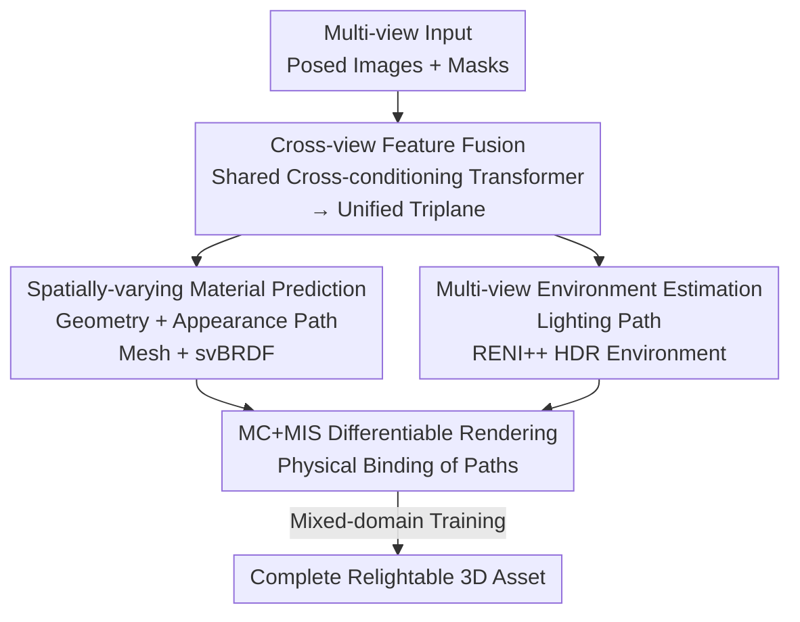

# ReLi3D: Relightable Multi-View 3D Reconstruction with Disentangled Illumination

**Conference**: ICLR 2026  
**OpenReview**: [https://openreview.net/forum?id=BlSKgQb3Vd](https://openreview.net/forum?id=BlSKgQb3Vd)  
**Paper**: [Project Page](https://reli3d.jdihlmann.com/)  
**Code**: Will release code and weights  
**Area**: 3D Vision  
**Keywords**: Feed-forward 3D reconstruction, inverse rendering, material-illumination disentanglement, svBRDF, multi-view fusion

## TL;DR
ReLi3D is the first end-to-end feed-forward system capable of simultaneously reconstructing complete geometry, spatially-varying PBR materials, and consistent HDR environment lighting from sparse multi-view images in less than 1 second. The core idea is to utilize "multi-view constraints" as the primary driver for material-illumination disentanglement, transforming the inherently ill-posed single-image inverse rendering problem into a well-constrained one.

## Background & Motivation

**Background**: There are two main paradigms for reconstructing usable 3D assets from images. One is diffusion-based generative methods (e.g., Score Distillation, multi-view generation, direct 3D diffusion), which offer high geometric fidelity but suffer from slow inference and hallucinations. The second is Large Reconstruction Models (LRM, e.g., LRM, SF3D, TripoSR), which use transformers for direct image-to-3D feed-forward inference, providing speed and practicality. However, a gap remains between LRM-style methods and actual artistic requirements—the latter demands accurate reconstruction from multiple views with decoupled lighting and spatially-varying PBR materials for relighting.

**Limitations of Prior Work**: Most existing feed-forward methods are optimized for single-view reconstruction. Single-view reconstruction is naturally ill-posed, as a single 2D appearance can result from infinite combinations of "surface reflectance $\times$ illumination." Regularization or learned priors can alleviate but not eliminate this ambiguity, especially in unobserved regions, leading to incomplete material predictions, unreliable normals, and limited relighting fidelity. Methods like SF3D even predict only a global roughness/metallic value for the entire object, failing to provide spatially-varying materials or environmental light estimation.

**Key Challenge**: The fundamental ill-posedness of inverse rendering lies in the inseparability of material and lighting from a single view. The authors observe that geometric consistency across multiple views provides the missing constraints for disentanglement. When multiple observations see the same surface point under shared lighting, cross-view consistency narrows the solution space, transforming the ill-posed single-view problem into a well-constrained one.

**Goal**: To build a unified feed-forward system that converts any number of posed images into a textured mesh with spatially-varying PBR materials and a consistent HDR environment in under 1 second, with generalization to real-world data.

**Core Idea**: Elevate multi-view fusion from a "robustness add-on" to the "primary mechanism for material-illumination disentanglement." A shared transformer fuses multi-view inputs, followed by dual paths to predict object structure/appearance and environment lighting respectively. Finally, a differentiable Monte Carlo renderer binds the two paths for physically-consistent disentangled training.

## Method

### Overall Architecture

ReLi3D takes $N$ multi-view images with camera poses and masks $\{(I_i, M_i, C_i)\}_{i=1}^N$ as input. It outputs a triplet: a mesh with spatially-varying svBRDF (albedo / roughness / metallic / normal) and an HDR environment map represented by a RENI++ latent code. The entire pipeline is a single feed-forward pass taking approximately 0.3 seconds.

The process involves: first using a **shared cross-conditioning transformer** to fuse an arbitrary number of views into a unified triplane feature. This is followed by **two parallel paths**: the geometry and appearance path decodes the mesh and svBRDF from the triplane, while the lighting path fuses mask-aware tokens to estimate the HDR environment. Finally, a **differentiable Monte Carlo + Multiple Importance Sampling (MC+MIS) renderer** binds the two paths, enforcing that predicted materials and lighting must jointly explain the observed images physically. Training utilizes a **mixed-domain protocol** (Synthetic PBR + Synthetic RGB + Real Captures) to bridge the gap between synthetic and real data.

### Key Designs

**1. Cross-view Feature Fusion: Mapping arbitrary views to a unified triplane via a shared transformer**

This step directly addresses "single-view ill-posedness" by allowing multi-view information to cross-fuse, providing consistent constraints for downstream paths. Specifically, each image is processed by DINOv2 with camera modulation to obtain per-view tokens: $T^{img}_i = \text{DINOv2}(I_i \odot M_i)$, $e_i = f_{cam}(C_i)$, $T^{cond}_i = [T^{img}_i \odot e_i\,;\,e_i]$. One image is randomly designated as the **hero view** $h$, and its tokens are concatenated with a learnable triplane token bank to form the query stream $Q_0 = [T^{tri}\,;\,T^{img}_h]$. The hero view is chosen randomly during both training and evaluation to ensure performance does not depend on a specific viewpoint. For compact yet expressive cross-view context, the authors use **latent mixing**: a set of learnable latent tokens $L_0$ undergoes self-attention and is interleaved with tokens from all non-hero views to form memory $M$. A dual-stream interleaved transformer then refined $Q$ using $M$. This handles arbitrary view counts while maintaining a dedicated hero channel for stable alignment, followed by pixel-shuffle upsampling to a high-resolution triplane.

**2. Spatially-varying Material Prediction: Directly deriving svBRDF from a shared triplane**

Unlike SF3D which only provides global parameters, ReLi3D predicts point-wise spatially-varying materials. It interprets transformer output tokens as triplane pixels, forming a unified 3D representation $T \in \mathbb{R}^{3 \times 40 \times 384 \times 384}$. For any 3D point $p$, features are sampled via triplane projection $f(p)=\text{concat}(T_{xy}, T_{yz}, T_{zx})$. A set of task-specific MLP heads then simultaneously solves for density, albedo, roughness, metallic, and normal perturbations: $\{\sigma, \rho, r, m, n_{bump}\}(p) = \{\text{MLP}_{density}, \text{MLP}_{albedo}, \text{MLP}_{rough}, \text{MLP}_{metal}, \text{MLP}_{normal}\}(f(p))$. Since all attributes share the same triplane embedding, there is no need for separate material tokens, naturally supporting multi-material objects. Geometry is extracted using Flexicubes for better mesh quality, with svBRDF parameters baked onto UV maps.

**3. Multi-view Environment Estimation: Inference from background or reflection**

ReLi3D introduces multi-view reasoning and adaptive background masking for environment estimation, with the lighting path running parallel to geometry. It uses a trainable DINOv2-small with additional input channels to encode mask-image pairs into mask-aware tokens $T^{mask}_i = f_{mask}([M_i, I_i])$. These are concatenated with the object transformer tokens to form the environment context $T_{env\text{-}ctx} = \text{concat}(\{T^{mask}_i\}, T_{out})$. A dedicated 1D transformer maps learnable environment tokens to a RENI++ latent code and a 6D global rotation $[z_{env}, r_{6D}] = \text{EnvTransformer}(T_{env\text{-}bank}, T_{env\text{-}ctx})$, with the HDR environment decoded as $L_{env}(\omega)=\exp(f_\theta(z, \gamma(\omega)))$. A key innovation is **randomized background masking** during training: partially masking background pixels in some views forces the network to learn two complementary skills—reading lighting directly when the background is visible, and inferring it from indirect clues like reflections and shadows when the background is obscured.

**4. MC+MIS Differentiable Rendering: Physical binding of dual paths**

Without a physical link, material and lighting might "compensate" for each other incorrectly. The authors use a differentiable physically-based Monte Carlo renderer with Multiple Importance Sampling (MIS) to bind the paths. The renderer enforces that the predicted material $f_r$ and lighting $L_{env}$ must jointly explain the observed image through physical light transport, ensuring physically meaningful disentanglement. This renderer supports three modes: direct material supervision when PBR ground truth is available, image reconstruction consistency when it is not, and seamless training across synthetic PBR, synthetic RGB, and real data.

### Loss & Training
The system is trained using a mixed-domain protocol with 174k objects: 42k synthetic PBR (full material supervision), 70k synthetic RGB, and 62k real captures from UCO3D (image-space self-supervision). Objects with PBR ground truth receive direct material supervision, while others rely on image reconstruction consistency via the MC+MIS renderer. Randomized background masking enables dual-mode lighting inference. The authors emphasize that multi-view constraints provide stronger supervision signals than massive single-view datasets, achieving high performance with only 174k objects (10–50$\times$ less than recent large-scale methods).

## Key Experimental Results

### Main Results

Materials and Relighting (Polyhaven + Blender Shiny, single-view unless noted): ReLi3D ranks first in all material and relighting metrics, with performance improving steadily as the view count increases.

| Method | Time(s) | Relighting PSNR↑ | Basecolor PSNR↑ | Roughness PSNR↑ | Metallic PSNR↑ |
|------|--------|------|------|------|------|
| SF3D | 0.26 | 15.79 | 18.42 | 19.60 | 28.37 |
| SPAR3D | 0.36 | 15.23 | 17.70 | 19.53 | 30.52 |
| Hunyuan3D | 69.40 | 14.81 | 21.25 | — | — |
| **Ours (1 view)** | 0.28 | **19.77** | **25.00** | 22.69 | 32.73 |
| **Ours (16 views)** | 0.32 | **21.21** | **26.78** | 24.50 | 33.21 |

Geometry and Image Quality (GSO + Stanford ORB / UCO3D): ReLi3D achieves SOTA performance at interactive speeds.

| Method | Time(s) | GSO CD↓ | GSO FS@0.5↑ | GSO PSNR↑ | UCO3D PSNR↑ |
|------|--------|------|------|------|------|
| SF3D | 0.28 | 0.132 | 0.974 | 17.64 | 12.79 |
| Hunyuan3D | 39.69 | 0.133 | 0.970 | 16.68 | 13.75 |
| **Ours (1 view)** | 0.30 | 0.105 | 0.985 | 19.57 | 15.28 |
| **Ours (4 views)** | 0.28 | 0.081 | 0.993 | 21.43 | 15.60 |

### Ablation Study
The impact of multi-view constraints is systematically validated across varying view counts:

| Configuration | CD↓ (GSO) | FS@0.5↑ | Description |
|------|---------|------|------|
| 1 view | 0.105 | 0.985 | Single-view baseline |
| 2 views | 0.088 | 0.991 | Significant improvement with one extra view |
| 4 views | 0.081 | 0.993 | ~27% CD improvement over single view |
| 8–16 views | 0.076 | 0.993–0.994 | Performance saturates after 4–8 views |

### Key Findings
- **Multi-view constraints are the primary source of gain**: Moving from 1 to 4 views improves geometric CD by ~27% and F-score@0.5 to 0.993, while inference time remains nearly constant (~0.3s), confirming the hypothesis that cross-view consistency narrows the solution space.
- **Saturation occurs**: Performance saturates after 4–8 views as surface coverage becomes sufficient; additional random views provide redundant information rather than new constraints.
- **Background info aids light localization**: Background presence allows correct light source orientation; without background, light inference relies on diffuse reflections, resulting in "blurrier" but still functional environment maps.
- **Dramatic speed advantage**: 100$\times$ faster than generative methods like Hunyuan3D (0.3s vs 39–69s) with more efficient vertex counts (4.5k vs 100k+).

## Highlights & Insights
- **Multi-view as a Disentanglement Engine**: While many works treat multi-view as a robustness patch, this work demonstrates it as the primary mechanism for separating material and light.
- **Dual-mode Lighting Inference**: Randomized background masking forces the network to learn both "reading background light" and "inferring light from reflections," addressing real-world issues like cropped or noisy backgrounds.
- **Unified Triplane for svBRDF**: Solving all material attributes from a single shared embedding simplifies the architecture and naturally supports multi-material objects.
- **MC+MIS Bridge for Mixed Domains**: The differentiable physical renderer acts as both a disentanglement constraint and a unified supervision interface for synthetic and real data.

## Limitations & Future Work
- Specialist high-resolution diffusion methods may achieve finer geometric details via long optimization; ReLi3D targets speed-quality trade-offs rather than absolute geometric maximums.
- Performance saturation suggests that active view sampling or selection might be needed to break the plateau beyond 8 views.
- Lower vertex counts (4.5k) are efficient but may be limiting compared to 100k+ methods in scenarios requiring hyper-fine meshes.
- Real-world generalization depends on training diversity; extreme materials/lighting outside the distribution remain a risk.

## Related Work & Insights
- **vs SF3D**: Both are fast feed-forward LRMs, but SF3D is limited to single-view, global materials, and lacks light estimation. ReLi3D handles multi-view, spatially-varying svBRDF, and joint HDR environment estimation.
- **vs SPAR3D**: SPAR3D also predicts RENI++ codes but uses an expensive diffusion-then-regression pipeline; its light predictions are often over-smoothed without clear sources.
- **vs Hunyuan3D / 3DTopia-XL**: Generative methods have strong details but are 100$\times$ slower and prone to hallucinations; ReLi3D matches quality at sub-second speeds with relightable assets.
- **vs LIRM**: LIRM is similar but uses progressive optimization and lacks lighting prediction; ReLi3D treats multi-view as the core disentanglement mechanism.

## Rating
- Novelty: ⭐⭐⭐⭐⭐ First sub-second system for joint geometry/svBRDF/HDR environment reconstruction.
- Experimental Thoroughness: ⭐⭐⭐⭐ covers multiple OOD datasets across geometry/material/relighting, though missing some modular ablation tables.
- Writing Quality: ⭐⭐⭐⭐ Clear motivation and methodology.
- Value: ⭐⭐⭐⭐⭐ Bridges the gap between feed-forward reconstruction and relightable production assets.

<!-- RELATED:START -->

## Related Papers

- [\[ICLR 2026\] ReconViaGen: Towards Accurate Multi-view 3D Object Reconstruction via Generation](reconviagen_towards_accurate_multi-view_3d_object_reconstruction_via_generation.md)
- [\[CVPR 2026\] Intrinsic Image Fusion for Multi-View 3D Material Reconstruction](../../CVPR2026/3d_vision/intrinsic_image_fusion_for_multi-view_3d_material_reconstruction.md)
- [\[ICLR 2026\] Text-to-3D by Stitching a Multi-view Reconstruction Network to a Video Generator](text-to-3d_by_stitching_a_multi-view_reconstruction_network_to_a_video_generator.md)
- [\[CVPR 2026\] Reliev3R: Relieving Feed-forward 3D Reconstruction from Multi-View Geometric Annotations](../../CVPR2026/3d_vision/reliev3r_relieving_feed-forward_3d_reconstruction_from_multi-view_geometric_annot.md)
- [\[ICLR 2026\] SSD-GS: Scattering and Shadow Decomposition for Relightable 3D Gaussian Splatting](ssd-gs_scattering_and_shadow_decomposition_for_relightable_3d_gaussian_splatting.md)

<!-- RELATED:END -->
