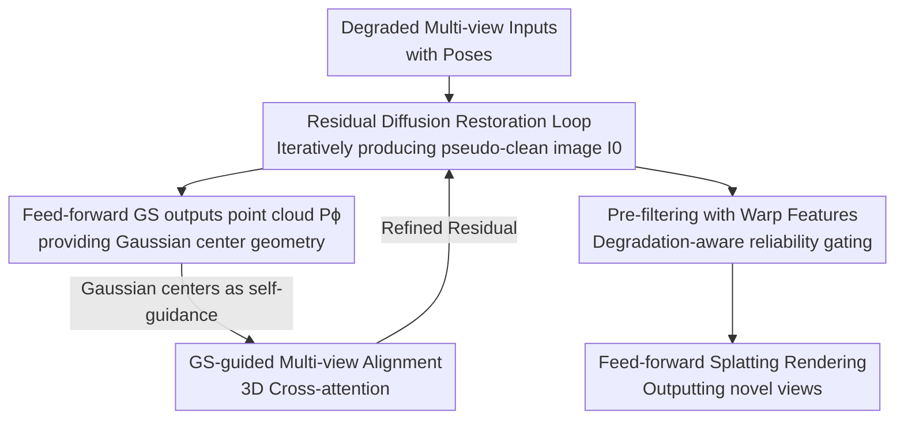

# ReSplat: Degradation-agnostic Feed-forward Gaussian Splatting via Self-guided Residual Diffusion

**Conference**: ICLR 2026  
**OpenReview**: [https://openreview.net/forum?id=461VpgnLsi](https://openreview.net/forum?id=461VpgnLsi)  
**Code**: https://github.com/yh-yoon/ReSplat  
**Area**: 3D Vision / Novel View Synthesis / Image Restoration  
**Keywords**: Feed-forward Gaussian Splatting, Degradation-agnostic Restoration, Residual Diffusion, Multi-view Alignment, Novel View Synthesis

## TL;DR
ReSplat couples a universal diffusion-based image restoration model and a feed-forward 3D Gaussian Splatting (3DGS) model into a self-guided closed loop. 3D Gaussian centers generated midway through diffusion sampling serve as "self-guidance" to achieve multi-view consistent restoration. The restored images are then fed back into the GS model for scene reconstruction, enabling clearer and more robust novel view synthesis under various degradations such as blur, low light, fog, rain, and snow.

## Background & Motivation
**Background**: Novel View Synthesis (NVS) is improving in rendering quality and speed through NeRF and 3D Gaussian Splatting (3DGS). Generalizable versions (feed-forward 3DGS, e.g., PixelSplat, MVSplat, MVSGaussian) eliminate per-scene optimization, reconstructing scenes from a few posed images in a single forward pass. However, these methods typically assume clean input images captured in controlled environments.

**Limitations of Prior Work**: Real-world captures often suffer from blur, low light, fog, rain, or snow. Existing NVS methods handling degradation (e.g., Deblur-NeRF, LLNeRF for low light, or specific dehazing methods) are mostly tailored for **specific** degradations by incorporating degradation physics into the rendering, making them ineffective across different types. Although GAURA is a generalizable, cross-degradation feed-forward NeRF, it fails to leverage mature 2D image restoration capabilities, limiting its performance.

**Key Challenge**: Universal Image Restoration (UIR) is a severely ill-posed problem where one degraded image corresponds to infinite possible clean images. Single-view restoration can easily produce inconsistent results across views, breaking multi-view consistency. Consistency is exactly what NVS requires most. If restoration and geometric consistency are treated independently, they tend to hinder each other.

**Goal**: To develop a **degradation-agnostic** feed-forward 3DGS NVS framework that does not require prior knowledge of degradation types and can handle various or mixed degradations with a single model.

**Key Insight**: Unlike NeRF, feed-forward 3DGS uses an explicit point representation. During reconstruction, it naturally performs Multi-View Stereo (MVS) and outputs explicit Gaussian centers (3D geometry). This geometry informs the restoration model which pixels correspond to the same 3D point across views, enabling geometry-assisted cross-view consistency. Conversely, cleaner restoration leads to more accurate geometric estimation, creating a positive feedback loop.

**Core Idea**: To allow universal image restoration (diffusive residual denoising DiffUIR) and feed-forward 3DGS (MVSGaussian) to **guide each other** during the diffusion sampling process. 3D Gaussian centers generated mid-process are used as "self-guidance" signals for restoration, iteratively refining results to achieve multi-view consistent, degradation-agnostic restoration and robust NVS.

## Method

### Overall Architecture
ReSplat integrates two models into an iterative closed loop: a universal restoration model $\theta$ based on Residual Denoising Diffusion (RDDM/DiffUIR) and a feed-forward GS model $\phi$ (based on MVSGaussian). Given $N$ posed degraded inputs $\{I^i_{in}\}$, the restoration model does not output the final image at once but performs several DDIM diffusion steps. At each step, a "pseudo-clean image" $I^\theta_0 = I_{in} - I^\theta_{res}$ is predicted from the current residual and sent to the MVS module of $\phi$ to generate an explicit point cloud $P^\phi_0$ (Gaussian centers). In the next step, the restoration model uses this 3D geometry for cross-view alignment to predict a more accurate residual. This "restoration $\to$ geometry $\to$ geometry-guided restoration" loop repeats until a stable clean image is reached, followed by a full feed-forward splatting to render novel views. Before rendering, a **pre-filtering** step de-weights multi-view aggregation based on original degradation to suppress residual artifacts.

The pipeline is a sequential process of "diffusion-embedded geometric feedback + pre-rendering weight gating":

### Key Designs

**1. Self-guided Closed Loop (Restoration $\leftrightarrow$ Geometry): Using intermediate Gaussian point clouds as guidance.**

This design addresses the ill-posed nature of single-view restoration by ensuring consistency. ReSplat does not treat restoration and reconstruction as two serial stages (IR $\to$ NV); instead, they are **inter-conditioned** during diffusion sampling (IR w/ NV). During training, two L1 losses are optimized jointly: the residual prediction loss $\|I_{res}-I^\theta_{res}(P^\phi_0, I_t, I_{in}, t)\|_1$ and the novel view rendering loss $\|I_{nv}-I^\phi_{ren}(I_{in}-I^\theta_{res}, I_{in})\|_1$. The residual prediction takes $P^\phi_0$—the Gaussian centers from the previous step—as input, providing geometric correspondence information to the restoration network. During sampling (Algorithm 2), $P^\phi_0$ is recalculated at each step as restoration improves, ensuring that restoration benefits from diffusion priors while being constrained by 3D geometry.

**2. GS-guided Multi-view Alignment: Transforming single-image restoration into cross-view attention.**

The original DiffUIR was designed for single images. This work embeds a spatial feature attention module that utilizes pseudo-geometry $P^\phi_0$ for alignment. For a specific Gaussian center $p_i$, feature vectors $\{f^j_i\}_{j=1}^N$ from $N$ views are projected onto this center. Self-attention is performed among these features representing the same 3D point to exchange multi-view information. This is executed repeatedly within the diffusion encoder to ensure 3D consistency. The processed features $f^j_{i,rep}$ are re-projected back to pixel coordinates using 2D interpolation weights $\{w_i\}$ based on diagonal areas. For a discrete point $q$, the aggregated feature is $F_q = \sum_{i} w_i f^j_{i,rep}$, prioritizing closer features. This ensures restoration is aligned based on geometric correspondence rather than mere pixel coordinates.

**3. Pre-filtering with Warp Features: Degradation-aware reliability gating to suppress artifacts.**

Even with high-quality restoration, residuals like rain streaks or fog fragments may persist. These "dirty" regions can pollute the radiance values of Gaussian ellipsoids during aggregation. While feed-forward GS predicts aggregation weights $W^i$ based on visibility, it is unaware of degradation residuals. The pre-filtering module warps restored results $\{I^i_{out}\}$ to the novel view using $P^\phi_0$ and predicts a **per-view reliability map** $\{W^i_{pre}\}$ via self-attention. The final weight used for rendering is the product $W^i_{final}(x) = W^i_{pre}(x) \cdot W^i(x)$. This acts as a degradation-aware "soft gate," suppressing areas with strong artifacts or cross-view inconsistencies while preserving clean, consistent structures.

### Loss & Training
The total loss is the sum of two L1 terms: the universal restoration loss $L_{UIR}=\|I_{res}-I^\theta_{res}\|_1$ for the residual prediction of model $\theta$, and the novel view rendering loss $L_{NV}=\|I_{nv}-I^\phi_{ren}\|_1$ for model $\phi$. Residual diffusion follows the DiffUIR framework with a Shared Distribution Term (SDT): $I_t = I_{t-1} + \alpha_t I_{res} + \beta_t \epsilon_{t-1} - \delta_t I_{in}$. Training data is constructed using GAURA's synthetic degradation pipeline on the IBRNet dataset. MVSGaussian is pre-trained on degraded data without restoration to accelerate convergence. All UIR baselines are fine-tuned on the same dataset for fair comparison. Inference uses DDIM with fixed **3 steps**, allowing 3-view inputs to be processed in under 1 second.

## Key Experimental Results

### Main Results
On the LLFF synthetic degradation dataset with 3-view inputs across 5 degradations (ReSplat uses the IR w/ NV loop; DiffUIR uses IR $\to$ NV serial):

| Degradation Type | Metric (NVS) | ReSplat | DiffUIR | GAURA |
|------------------|--------------|---------|---------|-------|
| Motion Blur      | PSNR↑        | **23.15** | 22.75 | 21.28 |
| Snow             | PSNR↑        | **24.46** | 24.24 | 20.48 |
| Fog              | PSNR↑        | **21.99** | 21.56 | 17.22 |
| Low-light        | PSNR↑        | **19.76** | 18.87 | 15.28 |
| Rain             | PSNR↑        | **24.11** | 23.51 | 21.78 |

Mixed degradations (LLFF mixed) highlight the degradation-agnostic advantage: on "Fog + Snow," ReSplat achieves 20.17 PSNR compared to DiffUIR's 15.38 (a ~5 dB gap). On real degradation datasets (DeblurNeRF, REVIDE, LLNeRF), ReSplat also leads in all categories (e.g., Low-light: 22.92 vs. DiffUIR's 22.00).

### Ablation Study
Average NVS metrics across 5 degradations:

| Configuration | Alignment | Pre-filtering | PSNR↑ | SSIM↑ | LPIPS↓ |
|---------------|-----------|---------------|-------|-------|--------|
| #1            | ✗         | ✗             | 22.19 | 0.8264 | 0.2372 |
| #2            | ✗         | ✓             | 22.35 | 0.8290 | 0.2368 |
| #3            | ✓         | ✗             | 22.46 | 0.8313 | 0.2306 |
| #4 (Full)     | ✓         | ✓             | **22.69** | **0.8383** | **0.2230** |

### Key Findings
- **GS-guided Alignment is Crucial**: Adding alignment (#3, +0.27 PSNR) contributes more than pre-filtering (#2, +0.16), identifying cross-view consistency as the primary gain. Combining both (#4) yields +0.50 PSNR and significantly improves perceptual quality (LPIPS reduces from 0.2372 to 0.2230).
- **Advantage Increases with Degradation Severity**: While ReSplat consistently leads DiffUIR in single degradations, the gap widens significantly in highly ill-posed cases like fog, low light, and mixed degradations. Geometric constraints stabilize restoration uncertainty in severe conditions.
- **Efficiency**: With only 3 DDIM steps, processing 3 views takes less than 1 second, providing a magnitude of improvement in utility compared to per-scene optimized NeRFs.

## Highlights & Insights
- **Repurposing "By-products of Reconstruction"**: Feed-forward 3DGS generates point clouds via MVS for rendering; ReSplat reuses this geometry to guide multi-view alignment in the restoration network, achieving consistency at zero additional geometric estimation cost.
- **Closed Loop vs. Serial Paradigm**: The comparison between IR $\to$ NV (serial) and IR w/ NV (inter-conditioned) demonstrates the value of integrated restoration. The large lead in mixed degradations validates this paradigm.
- **Degradation-agnostic Engineering Value**: The ability to handle multiple mixed degradations (blur/light/weather) with a single, fast feed-forward model is highly practical for real-world outdoors or low-light scene reconstruction.
- **Pre-filtering as a Lightweight Trick**: Applying a "reliability map" on top of GS visibility weights is a transferable strategy for any multi-view aggregation task dealing with noise or artifacts.

## Limitations & Future Work
- **Reliance on Synthetic Training**: Degradations are generated via the GAURA pipeline. The domain gap between synthetic and real distributions may limit generalizability, though real-world data tests were successful.
- **Backbone Coupling**: The framework binds DiffUIR for restoration and MVSGaussian for geometry. The plug-and-play capability with more advanced or lightweight models remains to be fully explored.
- **Extreme Scenarios**: While 3-view inputs are supported, further reductions in view count or extreme degradations (e.g., near-total darkness, dense fog) may cause the geometric guidance itself to fail, potentially amplifying errors.
- **Hyperparameter Balancing**: The balance between the two L1 losses and the impact of sampling steps (set at 3) on the quality-speed tradeoff requires more systematic sensitivity analysis.

## Related Work & Insights
- **vs. GAURA**: Both target degradation-agnostic NVS, but GAURA relies solely on NeRF and lacks 2D restoration priors. ReSplat significantly outperforms GAURA (e.g., 21.99 vs. 17.22 PSNR on fog) by coupling universal restoration with 3DGS.
- **vs. DiffUIR (Serial IR $\to$ NV)**: DiffUIR is ReSplat's restoration baseline. ReSplat transforms it into a geometry-guided multi-view alignment version with joint training, proving superior in cross-view consistency.
- **vs. Specialized NVS (Deblur-NeRF, LLNeRF, etc.)**: These methods target single degradations and often require per-scene optimization. ReSplat offers a "one-for-all" feed-forward alternative at the cost of slight specialization-specific peak performance.

## Rating
- Novelty: ⭐⭐⭐⭐⭐ Uses intermediate feed-forward GS geometry to guide diffusion restoration in a self-consistent loop.
- Experimental Thoroughness: ⭐⭐⭐⭐ Covers various degradations and real data, though extreme scenario stress tests are limited.
- Writing Quality: ⭐⭐⭐⭐ Clear framework and algorithm description; some notation is dense.
- Value: ⭐⭐⭐⭐⭐ High utility for real-world fast reconstruction from degraded data.

<!-- RELATED:START -->

## Related Papers

- [\[CVPR 2026\] Z-Order Transformer for Feed-Forward Gaussian Splatting](../../CVPR2026/3d_vision/z-order_transformer_for_feed-forward_gaussian_splatting.md)
- [\[ICLR 2026\] DiffPBR: Point-Based Rendering via Spatial-Aware Residual Diffusion](diffpbr_point-based_rendering_via_spatial-aware_residual_diffusion.md)
- [\[ICLR 2026\] Flash-Mono: Feed-Forward Accelerated Gaussian Splatting Monocular SLAM](flash-mono_feed-forward_accelerated_gaussian_splatting_monocular_slam.md)
- [\[CVPR 2026\] GIFSplat: Generative Prior-Guided Iterative Feed-Forward 3D Gaussian Splatting from Sparse Views](../../CVPR2026/3d_vision/gifsplat_generative_prior-guided_iterative_feed-forward_3d_gaussian_splatting_fr.md)
- [\[CVPR 2026\] AnchorSplat: Feed-Forward 3D Gaussian Splatting with 3D Geometric Priors](../../CVPR2026/3d_vision/anchorsplat_feed-forward_3d_gaussian_splatting_with_3d_geometric_priors.md)

<!-- RELATED:END -->
