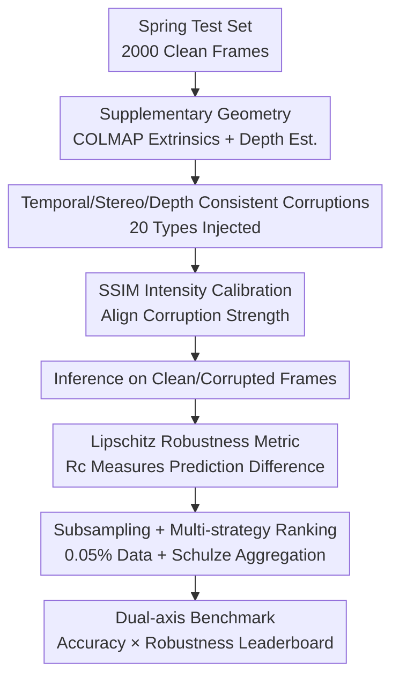

# RobustSpring: Benchmarking Robustness to Image Corruptions for Optical Flow, Scene Flow and Stereo

**Conference**: ICLR2026  
**OpenReview**: [https://openreview.net/forum?id=RebPBMrMmk](https://openreview.net/forum?id=RebPBMrMmk)  
**Code**: Integrated into [https://spring-benchmark.org/](https://spring-benchmark.org/)  
**Area**: 3D Vision  
**Keywords**: Optical Flow, Scene Flow, Stereo Matching, Robustness Benchmark, Image Corruption

## TL;DR
Ours proposes RobustSpring—the first benchmark for image corruption robustness in optical flow, scene flow, and stereo matching (dense matching). It injects 20 corruptions into the high-resolution Spring dataset in a temporal, stereo, and depth-consistent manner. Equipped with a Lipschitz-based robustness metric decoupled from accuracy, it evaluates 17 models, revealing hidden weaknesses where "high accuracy $\neq$ high robustness."

## Background & Motivation
**Background**: Dense matching tasks, including optical flow, scene flow, and stereo matching, are responsible for estimating pixel-level correspondences and serve as foundational components for real-world applications like robotic navigation, structure from motion, medical registration, and surgical assistance. Over three decades, benchmarks like KITTI, Sintel, and Spring have pushed the boundaries of "accuracy," leading to lower end-point errors on clean images.

**Limitations of Prior Work**: Existing mainstream benchmarks focus almost exclusively on accuracy and rarely systematically evaluate model stability under real-world corruptions like noise, compression artifacts, or rain and snow. Although KITTI/Sintel/Spring include degradations like motion blur or lighting changes, these are byproducts of collection or added for realism, **not designed for systematic study of how model predictions change under corruption**.

**Key Challenge**: While fields like image classification, 3D detection, and monocular depth estimation have mature corruption robustness studies (e.g., ImageNet-C), the dense matching area remains largely a void. Prior work covers only specific degradations like weather or low light, mostly for optical flow. No study has spanned all three tasks to include scene flow and stereo. Critically, "higher accuracy" does not naturally guarantee "higher robustness," yet this trade-off has never been quantified in dense matching.

**Goal**: Construct a dataset, metric, and benchmark platform capable of systematically evaluating corruption robustness across three dense matching tasks, and verify its reflection of real-world robustness.

**Key Insight**: Utilize Spring’s high-resolution, rendered stereo videos with dense ground truth as a base. Realize that dense matching differs fundamentally from classification because it relies on geometric consistency across time, stereo views, and depth. Therefore, corruptions cannot be applied independently per frame as in 2D classification; they must be temporal, stereo, and depth-consistent.

**Core Idea**: Inject 20 types of universal corruptions into dense matching data after "geometric adaptation." Quantize stability using a metric independent of ground truth that separates robustness from accuracy, elevating robustness to a "first-class citizen" alongside accuracy.

## Method

### Overall Architecture
RobustSpring is not a training dataset but a benchmark for evaluating "model generalization to unseen corruptions." Its construction follows two main pipelines: **Data Side**—Using clean frames from the Spring test set, it first supplements geometric information (depth + extrinsic parameters), then applies 20 geometrically-consistent corruptions to generate 20,000 corrupted images (40,000 frames / 20,000 stereo pairs). **Evaluation Side**—Models are run on both clean and corrupted frames. A Lipschitz-based robustness metric $R^c$ measures the difference between the two predictions. Results are compressed via subsampling and uploaded to a website coupled with the Spring accuracy leaderboard for dual-axis ranking.

To ensure geometric consistency without the original Spring metadata, the authors estimate extrinsic parameters using COLMAP 3.8 and calculate depth $Z = \frac{f_x \cdot B}{d}$ using disparities $d$ predicted by MS-RAFT+. This step uses only predicted values to avoid ground truth leakage.

### Key Designs

**1. Temporal/Stereo/Depth Consistent Corruption Injection: Geometric Adaptation of 2D Corruptions**

Dense matching models process stereo videos where predictions rely on geometric relationships across frames, views, and depths. Applying independent corruptions per frame/view would create "artificial inconsistencies" not found in reality. The authors adopt the five categories of corruptions (color, blur, noise, quality, weather; 20 types total) from Hendrycks & Dietterich but add three types of consistency to 16 of them: **Temporal consistency** ensures corruptions evolve smoothly between adjacent frames (e.g., frost patterns being coherent over time); **stereo consistency** subjects left and right cameras to identical transformation intensities; **depth consistency** renders weather particles (snow, rain, fog) directly into the 3D scene, moving them along 3D trajectories and projecting them geometrically to each view to produce view-dependent occlusion and perspective. 3D-independent corruptions like blur or noise retain per-frame implementations but share global intensity parameters. Motion blur is **not stereo-consistent** as it depends on the specific viewpoint—this physical judgment for each corruption is key to "dense matching-izing" universal corruptions.

**2. Lipschitz-based Robustness Metric: Decoupling Robustness from Accuracy**

Dense matching previously lacked standardized corruption robustness metrics. A common but flawed approach compares corrupted predictions against **ground truth**, which mixes accuracy and robustness. These two are often competitive: a model always outputting a constant is extremely robust but uselessly inaccurate. Thus, the authors compare corrupted predictions against **clean predictions**, based on the Lipschitz constant:

$$L_c = \frac{\|f(I) - f(I_c)\|}{\|I - I_c\|}$$

where $f$ is the model prediction, and $I$ / $I_c$ are clean / corrupted images. Since RobustSpring balances the change to images via SSIM calibration (Design 3), the denominator is approximately constant and can be omitted. Robustness is defined as the difference between clean and corrupted predictions under distance metric $M$:

$$R^c_M = M[f(I), f(I_c)]$$

To align with Spring, $M$ includes multiple metrics: $R^c_{\text{EPE}}$, $R^c_{\text{1px}}$, and $R^c_{\text{Fl}}$ for flow; $R^c_{\text{1px}}$, $R^c_{\text{Abs}}$, and $R^c_{\text{D1}}$ for stereo. Lower values indicate higher "stability." The EPE-based $R^c_{\text{EPE}} = \frac{1}{|\Omega|}\sum_{i\in\Omega}\|f_i(I) - f_i(I_c)\|$ generalizes optical flow adversarial robustness measures to general corruptions.

**3. SSIM-balanced Intensity Calibration + Subsampling: Making Corruptions Comparable and Uploadable**

The 20 corruptions vary naturally in intensity. The authors tune hyperparameters until image SSIM reaches specific thresholds (typically SSIM $\geq$ 0.7; noise types are relaxed to SSIM $\geq$ 0.2 due to sensitivity). This supports the "omitted denominator" in Design 2. To handle the data volume (2.1 TB for raw results of 20 corruptions), the authors use a refined subsampling strategy. After removing full-resolution Hero frames and applying 20x subsampling, only **0.05%** of the data (approx. 1.2 GB) remains, enabling users to upload results. Only corrupted **test** data is released to prevent "tuning for corruptions."

**4. Dual-axis Benchmark + Multi-strategy Ranking: Robustness as a Comparable Metric**

Each model yields 20 evaluations across corruptions. These are aggregated using three strategies: **Average**, **Median** (to mitigate outliers), and **Schulze Method** (a pairwise preference aggregation). RobustSpring is **coupled** with the existing Spring accuracy leaderboard, allowing researchers to position models on an Accuracy $\times$ Robustness dual-axis map.

## Key Experimental Results

### Main Results
The authors evaluated 17 models **not fine-tuned on Spring/RobustSpring**: 9 for optical flow (SEA-RAFT, GMFlow, MS-RAFT+, etc.), 2 for scene flow, and 6 for stereo. The table below shows Average $R^c_{\text{EPE}}$ for optical flow (lower is more robust) compared to Clean EPE $\varepsilon_{\text{clean}}$.

| Model | Avg $R^c_{\text{EPE}}$ | Avg $R^c_{\text{1px}}$ | Median $R^c_{\text{EPE}}$ | Clean EPE |
|----------|----------|----------|----------|----------|
| SEA-RAFT | **2.96** | 17.52 | 1.20 | 0.36 |
| GMFlow | 2.98 | 40.89 | 1.92 | 0.94 |
| MS-RAFT+ | 3.62 | 23.39 | 1.71 | 0.64 |
| FlowFormer | 3.77 | 21.53 | 2.14 | 0.72 |
| GMA | 4.03 | 21.47 | **1.39** | 0.91 |
| RAFT | 5.64 | 20.18 | 2.60 | 1.48 |
| FlowNet2 | 7.01 | 18.84 | 1.47 | 1.04 |
| PWCNet | 7.25 | 31.71 | 2.77 | 2.29 |

SEA-RAFT and GMFlow achieve the lowest Average $R^c_{\text{EPE}}$, while GMA achieves the lowest Median—divergence in rankings indicates high variance across corruption types.

### Key Findings
- **High Accuracy $\neq$ High Robustness, but no strong trade-off**: Accuracy and robustness show a weak, non-linear correlation. No model leads on both axes. Unlike adversarial robustness, high-accuracy models are often more robust to weather corruptions (localizing errors to particles rather than background) but remain sensitive to noise.
- **Architectural Signatures**: Transformer models (GMFlow, FlowFormer) perform best overall but **struggle with noise**, likely due to global matching; Hierarchical models (MS-RAFT+) show balanced robustness; Stacked/iterative models (SEA-RAFT, FlowNet2) are uniquely resistant to noise.
- **Hidden Shortcomings Revealed**: FlowNet2 performs poorly overall but is the most noise-resistant model—a "rank reversal" that accuracy benchmarks alone never detect.

## Highlights & Insights
- **"Geometric Consistency" as a First Principle**: Adapting corruptions to be temporal/stereo/depth-consistent—especially rendering weather in 3D—is a major innovation applicable to any multi-view/temporal task.
- **Mathematical Decoupling via Lipschitz**: Using clean predictions as the anchor provides a rigorous definition of "stability" and naturally extends adversarial robustness theory.
- **Engineering Pragmatism**: SSIM balancing makes heterogeneous corruptions comparable, and extreme subsampling (to 1.2 GB) makes the benchmark practically usable.
- **Insights on "Rank Reversal"**: The fact that FlowNet2 is noise-resistant despite low accuracy highlights that single-scalar accuracy hides the true robustness profile of models.

## Limitations & Future Work
- **Scope of Corruptions**: 20 types do not cover the whole space; lighting changes (re-rendering), bloom, glare, and extended codecs like JPEG 2000 are left for future expansion.
- **Single Intensity Level**: To save resources, only one intensity per corruption is used, preventing the plotting of "robustness degradation curves" found in ImageNet-C.
- **Estimated Geometry**: Consistency depends on COLMAP extrinsics and MS-RAFT+ depth. Estimation errors propagate into the corruption rendering.
- **Future Directions**: Adding multiple intensity levels and migrating the evaluation to real-world captured stereo videos to verify correlation.

## Related Work & Insights
- **vs ImageNet-C**: Ours extends the 2D independent corruption concept to geometrically-consistent dense matching across three tasks.
- **vs Adversarial Robustness**: Adversarial work targets worst-case perturbations; ours targets non-adversarial real-world corruptions, finding that the accuracy-robustness trade-off is less severe here.
- **vs Specific Benchmarks**: RobustSpring is the first systematic benchmark across 20 corruptions and three tasks, coupling the results with the standard Spring accuracy board.

## Rating
- Novelty: ⭐⭐⭐⭐⭐ First robustness benchmark for dense matching with "geometrically consistent corruptions + Lipschitz metrics."
- Experimental Thoroughness: ⭐⭐⭐⭐ Extensive evaluation of 17 models, though limited to a single intensity per corruption.
- Writing Quality: ⭐⭐⭐⭐⭐ Clear logic regarding design justifications and corruption physics.
- Value: ⭐⭐⭐⭐⭐ Vital for assessing the real-world deployment of dense matching models.

<!-- RELATED:START -->

## Related Papers

- [\[CVPR 2026\] Optical Flow Matching: Reframing Optical Flow as Continuous Transport Dynamics](../../CVPR2026/3d_vision/optical_flow_matching_reframing_optical_flow_as_continuous_transport_dynamics.md)
- [\[ICLR 2026\] WAFT: Warping-Alone Field Transforms for Optical Flow](waft_warping-alone_field_transforms_for_optical_flow.md)
- [\[CVPR 2026\] ARES: Unifying Asymmetric RGB-Event Stereo for Probabilistic Scene Flow Estimation](../../CVPR2026/3d_vision/ares_unifying_asymmetric_rgb-event_stereo_for_probabilistic_scene_flow_estimatio.md)
- [\[ICLR 2026\] HDR-NSFF: High Dynamic Range Neural Scene Flow Fields](hdr-nsff_high_dynamic_range_neural_scene_flow_fields.md)
- [\[CVPR 2026\] Flow4DGS-SLAM: Optical Flow-Guided 4D Gaussian Splatting SLAM](../../CVPR2026/3d_vision/flow4dgs-slam_optical_flow-guided_4d_gaussian_splatting_slam.md)

<!-- RELATED:END -->
