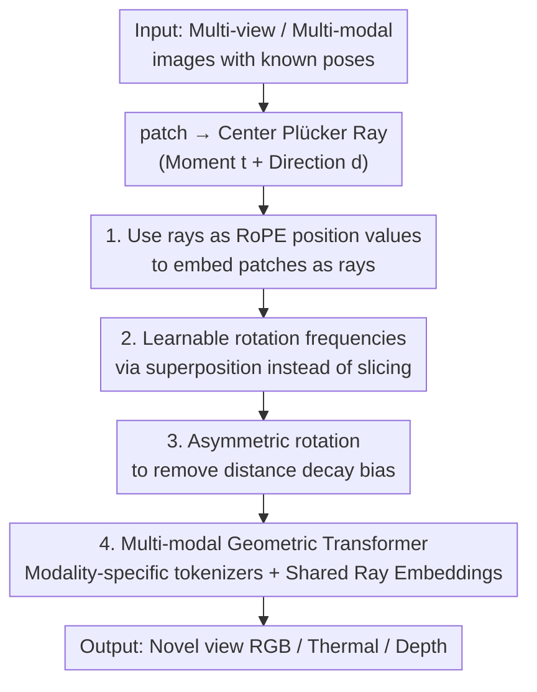

# RoRE: Rotary Ray Embedding for Generalised Multi-Modal Scene Understanding

**Conference**: ICLR 2026  
**OpenReview**: [https://openreview.net/forum?id=BR2ItBcqOo](https://openreview.net/forum?id=BR2ItBcqOo)  
**Paper**: [Project Page](https://roboticimaging.github.io/RoRE)  
**Code**: https://roboticimaging.github.io/RoRE (Available)  
**Area**: 3D Vision / Position Encoding / Multi-modal Fusion / Novel View Synthesis  
**Keywords**: Ray Embedding, RoPE, Multi-modal Scene Understanding, Camera Geometry Generalization, RGB-Thermal

## TL;DR
RoRE directly encodes image patches as "rays" and injects them into a Transformer via learnable Rotary Positional Embedding (RoPE). Combined with asymmetric rotation and modality-shared ray embeddings, this allows a **single network** to handle arbitrary camera geometries and modalities—such as perspective, fisheye, and RGB-Thermal—without retraining, significantly improving generalization and consistency across geometries and modalities.

## Background & Motivation

**Background**: Recent vision Transformers (DuST3R, VGGT, LVSM, etc.) have demonstrated that pure feed-forward Transformers can perform geometric reasoning and synthesize realistic novel views. A core design point for these "implicit renderers" is **how to inject camera information into the Transformer** to align visual tokens with the 3D scene structure. Common approaches include Absolute Positional Encoding (APE, such as additive embeddings of Plücker rays) or Relative Positional Encoding (RPE, such as GTA or PRoPE based on camera extrinsic/projection matrices).

**Limitations of Prior Work**: Existing camera encoding methods make strong assumptions about the camera. Once inputs vary in resolution, Field of View (FoV), or intrinsic parameters—or switch to "unconventional" sensors like fisheye or thermal cameras—these methods fail. Specifically: ① RPEs based on extrinsic/projection matrices (GTA, PRoPE) fail during generalization because they bind the camera to a specific projection matrix form; changing focal length or adding distortion drops performance to 11~14 dB PSNR. ② Multi-modal fusion often relies on hand-crafted alignment/fusion strategies or requires confocal (co-centered) images, making it difficult to achieve "plug-and-play" functionality.

**Key Challenge**: RPE generalizes well, but existing RPEs **deviate from "rays"—the most fundamental geometric representation**—and instead encode extrinsic or projection matrices, losing universality across camera geometries. Conversely, while ray representations (like Plücker coordinates) are universal, they are typically injected as APE, failing to benefit from the translation invariance and generalization advantages of RPE. These two have remained mutually exclusive.

**Goal**: To design a positional encoding that retains both the generalization capability of relative encoding and the universality of ray representation for various camera families (perspective/fisheye/multi-modal), while enabling a single network to fuse an arbitrary number of inputs from various modalities.

**Key Insight**: The authors note that RoPE essentially "rotates a vector based on some position value." This position value does not have to be a pixel index; it can be replaced by a **ray**. Parameterizing a patch directly as a ray and injecting it into RoPE allows it to naturally inherit the relativity of RoPE while returning to the universal geometric quantity of a ray.

**Core Idea**: Use **"rays" instead of "pixel indices/extrinsic parameters" as the position values for RoPE**, and make the rotation frequencies learnable with asymmetric rotation to eliminate distance decay. This results in RoRE, a positional encoding that is both relative and universal across geometries and modalities.

## Method

### Overall Architecture

The input to RoRE consists of several images with **known poses** (perspective, fisheye, RGB, or thermal), and the output is a novel view (and optional depth map). Each patch is represented by the Plücker ray of its center pixel (3D moment $t$ + 3D direction $d$). This ray is fed as the "position value" into a modified RoPE to rotate the query/key vectors. To prevent multi-dimensional ray positions from shattering the latent space, rotation frequencies are made **learnable** and applied via superposition. To eliminate the "distance decay" bias inherent in RoPE, **asymmetric rotation** is introduced. Finally, these ray embeddings are integrated into an LVSM-style encoder-decoder, where each modality has a specific tokenizer/head but shares the same ray embeddings. The model is trained using masked cross-modal prediction.

### Key Designs

**1. Ray-based RoPE: Embedding patches as rays instead of pixel indices**

Standard RoPE in vision rotates patches based on 2D pixel indices $(u,v)$, encoding only the image-space position and losing the 3D "look direction." RoRE uses the **Plücker ray** of the patch center as the position value. A ray consists of 6 dimensions: a 3D moment $t=[t_x,t_y,t_z]$ and a 3D direction $d=[d_x,d_y,d_z]$. A direct extension would be slicing the vector into 6 parts, each rotated by one ray component: $x_{rotated}=[f(x^{(1)},t_x),\dots,f(x^{(6)},d_z)]$. Since the ray itself encodes camera geometry, this encoding is inherently invariant to intrinsics—it remains meaningful even with varying focal lengths, distortion, or fisheye lenses, where projection-based methods (GTA, PRoPE) fail.

**2. Learnable Rotation Frequencies: Frequency superposition instead of vector slicing**

Slicing the vector into 6 parts can constrain the latent space too strictly. Furthermore, moments and directions have different scales and semantics. RoRE replaces the hand-crafted base frequency $\theta_i=10000^{-2(i-1)/d}$ with **learnable frequencies** $\theta_{p\times d/2}$ for each dimension $p=6$, applied via **superposition**:

$$R^{2d}_{RoRE}(P,\theta_i)=R^{2d}\!\left(\sum_p (P_p\cdot\theta_{i,p})\right),$$

where $P_p$ is a component of the ray position vector. This allows the network to learn which geometric dimensions should interact with which part of the latent space. After training, the learnable frequencies spontaneously recover a multi-scale structure similar to hand-crafted ones, with higher frequencies for direction channels and lower for position—showing an interpretable frequency spectrum.

**3. Asymmetric Rotation: Removing RoPE's distance decay for uniform attention**

Standard RoPE decays attention as token distance increases to favor local interactions. In 3D vision, however, **rays far apart in image space may have crucial geometric correspondences**. RoRE adopts asymmetric rotation by constructing a "negatively shifted mirror" position:

$$P=[t^+,t^-,d^+,d^-]=[t,-t,d,-d]+[0,b_{shift},0,b_{shift}],$$

where $b_{shift}=1$. This ensures that the encoded magnitude remains consistent across the ray domain, preserving the rotary properties of RoPE while eliminating unwanted attention decay. Visualization shows that while standard attention biases towards query ray neighbors, asymmetric rotation yields near-uniform cross-frame attention.

**4. Multi-modal Geometric Model: Modality-specific tokenizers + Shared ray embeddings**

To handle RGB, thermal, and depth simultaneously, RoRE uses modality-specific input tokenizers and output heads while **sharing the same RoRE ray embeddings** as the geometric backbone. Modality information is injected via absolute embeddings and by concatenating the modality class $C_{modality}$ into the position vector $P_{modality}=[P, C_{modality}]$. Unlike methods requiring confocal images, RoRE works on **non-confocal images with known poses**, learning cross-modal correspondences via photometric self-supervision and masked input strategies.

### Loss & Training
The model is trained primarily on RealEstate10K (perspective videos with poses) using masked inputs and random modality combinations. A cross-attention mechanism is used for target-query interaction. The total loss consists of photometric MSE, perceptual loss, and an optional geometrically consistent depth loss.

## Key Experimental Results

### Main Results

On standard novel view synthesis (RealEstate10K and the unseen DL3DV domain), RoRE performs on par with current SOTAs. Its advantage is most evident in generalization settings.

| Dataset | Metric | RoRE | LVSM | PRoPE† |
|--------|------|------|------|--------|
| RealEstate10K | PSNR↑ | 26.65 | 26.18 | 26.81 |
| DL3DV (Unseen) | PSNR↑ | 19.77 | 19.48 | 19.68 |

The gap widens significantly under **varying camera geometries** (without retraining):

| Test Setting | Metric | RoRE | LVSM | GTA | PRoPE |
|----------|------|------|------|-----|-------|
| Var. Focal RE10K | PSNR↑ | **22.66** | 21.95 | 14.81 | 14.71 |
| Distorted RE10K | PSNR↑ | **23.96** | 21.99 | 18.58 | 18.57 |
| Fisheye FIORD | PSNR↑ | **23.55** | 22.52 | 11.64 | 11.90 |

### Ablation Study

| Configuration | PSNR↑ | SSIM↑ | Note |
|------|-------|-------|------|
| APE Only | 26.18 | 0.834 | LVSM baseline |
| APE + Relative Ray Emb. | 26.56 | 0.843 | Significant gain from RPE |
| + Asymmetric Rotation | 26.65 | 0.845 | Steady small gain |
| + Learnable Freq. | 26.57 | 0.842 | Equal to manual freq. |
| RPE Only (No APE) | 26.65 | 0.843 | APE is almost redundant |
| Full RoRE | 26.65 | 0.845 | Final model |

### Key Findings
- **Performance gains primarily stem from Relative Ray Embedding (RPE)**: The jump from 26.18 to 26.56 marks the most significant improvement.
- **Learnable frequencies simplify tuning**: They match the performance of manual frequencies without the need for manual hyperparameter search.
- **APE is largely redundant**: The network can function effectively using only relative embeddings.
- **Generalization vs. Accuracy Trade-off**: RoRE's less constrained embedding space leads in varying geometries but may be slightly lower than PRoPE in fixed, narrow perspective domains.
- **Single model for multi-modal synthesis**: One model serves RGB-RGB, RGB-Thermal, and Thermal-Thermal configurations effectively.

## Highlights & Insights
- **"Position values as rays" is a decoupled perspective**: RoPE's mechanism is agnostic to the semantics of position values; using rays achieves both relativity and geometric universality.
- **Frequency superposition** prevents the latent space from being "shattered" by high-dimensional positions—a trick applicable to any multi-dimensional RoPE application.
- **Removing the "NLP locality bias"**: Asymmetric rotation removes the distance decay designed for NLP, which is often harmful in 3D geometric tasks where long-range ray correspondences are vital.

## Limitations & Future Work
- **Single ray per patch**: The size and orientation of the patch are not explicitly encoded, potentially limiting representational capacity.
- **Reliance on known poses**: RoRE is designed for "pose-available" scenarios (like multi-camera rigs), unlike pose-free methods (e.g., DuST3R).
- **Sim-to-real gap**: Training relies on synthetic datasets; performance on real thermal images still faces challenges regarding scene types and sensor fidelity.

## Related Work & Insights
- **vs. PRoPE / GTA**: These bind cameras to projection matrices, failing under distortion or fisheye lenses. RoRE encodes full rays, offering superior generalization.
- **vs. LVSM**: RoRE uses the LVSM backbone but replaces APE with relative ray embeddings, outperforming it in all generalization settings.
- **vs. MultiMAE**: While MultiMAE requires confocal images, RoRE aligns non-confocal images through a ray geometric backbone.

## Rating
- Novelty: ⭐⭐⭐⭐⭐ Adapting RoPE position values to rays, using frequency superposition, and applying asymmetric rotation provides a universal geometry encoding.
- Experimental Thoroughness: ⭐⭐⭐⭐ Covers 5 datasets including perspective, fisheye, and thermal; however, direct multi-modal feed-forward comparisons are limited.
- Writing Quality: ⭐⭐⭐⭐ Clear motivation and complete formulas.
- Value: ⭐⭐⭐⭐⭐ Extremely practical for heterogeneous multi-camera systems (e.g., automotive or search-and-rescue).

<!-- RELATED:START -->

## Related Papers

- [\[ICLR 2026\] OmniWorld: A Multi-Domain and Multi-Modal Dataset for 4D World Modeling](omniworld_a_multi-domain_and_multi-modal_dataset_for_4d_world_modeling.md)
- [\[CVPR 2026\] Multi-modal Frequency Decomposition Network for Semantic Scene Completion](../../CVPR2026/3d_vision/multi-modal_frequency_decomposition_network_for_semantic_scene_completion.md)
- [\[ICLR 2026\] EgoNight: Towards Egocentric Vision Understanding at Night with a Challenging Benchmark](egonight_towards_egocentric_vision_understanding_at_night_with_a_challenging_ben.md)
- [\[CVPR 2026\] MSGNav: Unleashing the Power of Multi-modal 3D Scene Graph for Zero-Shot Embodied Navigation](../../CVPR2026/3d_vision/msgnav_unleashing_the_power_of_multi-modal_3d_scene_graph_for_zero-shot_embodied.md)
- [\[CVPR 2026\] Fast SceneScript: Fast and Accurate Language-Based 3D Scene Understanding via Multi-Token Prediction](../../CVPR2026/3d_vision/fast_scenescript_fast_and_accurate_language-based_3d_scene_understanding_via_mul.md)

<!-- RELATED:END -->
