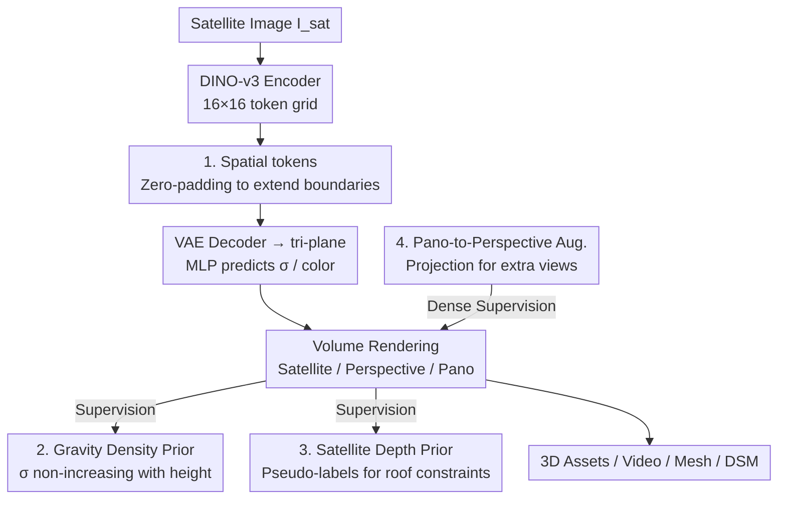

# Sat3DGen: Comprehensive Street-level 3D Scene Generation from Single Satellite Image

**Conference**: ICLR 2026  
**OpenReview**: [https://openreview.net/forum?id=E7JzkZCofa](https://openreview.net/forum?id=E7JzkZCofa)  
**Code**: https://github.com/qianmingduowan/Sat3DGen  
**Area**: 3D Vision  
**Keywords**: Satellite-to-3D, Street view synthesis, Feed-forward image-to-3D, Geometric priors, NeRF  

## TL;DR
Given a single top-down satellite image, Sat3DGen injects three types of geometric constraints (gravity density prior, satellite-view depth prior, spatial boundary tokens) and panorama-to-perspective view augmentation into a feed-forward tri-plane NeRF framework. This approach reduces street-level 3D geometric RMSE from 6.76m to 5.20m and improves rendering FID from ~40 to 19.

## Background & Motivation
**Background**: Generating street-level 3D scenes from single satellite images currently follows two paths. One is "geometry coloring" (e.g., Sat2Scene, Sat2City), which predicts building geometry first and then applies textures. While the geometry is clean, it focuses solely on buildings, losing non-building semantics like crosswalks, trees, and green belts, leading to inconsistencies with the satellite image. The second is the "3D proxy" path (e.g., Sat2Density++), which uses a feed-forward image-to-3D framework to jointly learn geometry and texture under 2D supervision. This path offers rich scene content and faithful semantics but suffers from rough and unstable geometry—unrealistic roofs, holes in facades, and "floaters" in the air.

**Limitations of Prior Work**: This work aims to "faithfully preserve the semantics and appearance of the satellite image," making the proxy path more suitable. However, the poor geometry of existing proxy methods prevents their use in downstream tasks like mapping and simulation.

**Key Challenge**: The authors argue that poor geometry in the proxy path is **not a flaw of the paradigm itself**—object-level models like InstantMesh/LRM have proven that pure 2D supervision can learn high-quality 3D. The problem stems from two difficulties unique to satellite-to-street data: **extremely sparse supervision** (one satellite patch + a few ground panoramas) and **extreme viewpoint gaps** (top-down vs. eye-level). This leads to unconstrained roof geometry, facade holes, and floaters. Furthermore, the mismatch in footprints between satellite and street views causes geometric instability at scene boundaries.

**Goal**: Instead of reinventing the feed-forward architecture, this work aims to "prescribe the right medicine" within a general framework to eliminate core geometric failure modes—suppressing floaters, stabilizing boundaries, removing roof ambiguity, and mitigating supervision sparsity.

**Key Insight**: Prioritize geometry (geometry-first) by using physical intuition and monocular depth pseudo-labels to compensate for missing geometric constraints in sparse supervision.

**Core Idea**: By using four lightweight components—"gravity density prior + satellite-view depth prior + spatial boundary tokens + panorama-to-perspective augmentation"—the geometry of the feed-forward tri-plane NeRF is refined. Improving the geometry results in a significant boost in photorealism.

## Method

### Overall Architecture
The backbone of Sat3DGen is a feed-forward image-to-3D framework using tri-plane NeRF as the 3D representation. It takes a satellite image $I_{sat}$ (plus an optional global illumination feature $f_{ill}$ for rendering control) as input and outputs a renderable 3D scene. It can render satellite views, perspective street views at arbitrary poses, and panoramic street views, or export meshes via Marching Cubes.

The main pipeline: A frozen DINO-v3 ViT encoder compresses $I_{sat}$ into a $16\times16\times1024$ token grid $\rightarrow$ padding a ring of zero "spatial tokens" around the grid to extend the effective scene range $\rightarrow$ a VAE-style decoder upsamples this into high-resolution tri-plane features $\rightarrow$ 3D query points are orthogonally projected onto XY/XZ/YZ planes for bilinear sampling and element-wise addition $\rightarrow$ a shallow MLP predicts density $\sigma$ and color $c$ $\rightarrow$ volume rendering synthesizes images. The sky is modeled separately using a spherical feature map to support arbitrary perspectives. The true innovation lies in the three types of geometric constraints (two as losses, one as a module) and a training strategy added to this backbone.

### Key Designs

**1. Spatial Tokens: Padding zero tokens to extend scene boundaries and stabilize boundary geometry**

Street view supervision often sees buildings and roads extending beyond the satellite crop. If the 3D field is forced into the crop's footprint, tearing and distortion occur at the boundaries. The authors pad $N=2$ rings of zero tokens around the token grid $F_{token}\in\mathbb{R}^{16\times16\times1024}$ to obtain $F_{token\_pad}\in\mathbb{R}^{20\times20\times1024}$. The intuition: padding expands the effective scene cube (e.g., from 50m to 62.5m), providing extra degrees of freedom to accommodate overflowing content and stabilizing interior geometry. During decoding, the padded tri-plane resolution is set to 320 (up from 256). This simple structural change specifically targets torn edges and warped borders.

**2. Gravity Density Prior: Using physical intuition of "non-increasing density with height" to suppress floaters**

Sparse-view reconstructions of outdoor scenes often contain floaters and floating ground. Based on the physical fact of gravity, the authors establish a simple rule: volume density $\sigma$ should generally be non-increasing with altitude—ground and trunks are dense at low altitudes, while higher altitudes (canopies, air) are sparser. In NeRF, $\sigma$ measures light occlusion, serving as a proxy for matter. Specifically, for a sample point $x$ and a point $x'=x+\delta z$ directly above it, a penalty is applied if the upper density is significantly higher than the lower:

$$L_{grav}=\mathbb{E}_{x,\delta z}\left[\text{ReLU}(\sigma(x+\delta z)-\sigma(x)-\epsilon)\right]$$

The relaxation term $\epsilon$ (set to 1) acts as a soft constraint, allowing for legitimate overhanging structures like tree canopies, arches, and bridges. This loss suppresses floaters and fills bottomless cavities while preserving necessary sparsity. Ablations show it contributes most to photorealism—removing it causes FID to degrade significantly (rising to 25.9).

**3. Satellite-view Depth Prior: Eliminating roof ambiguity with monocular depth pseudo-labels**

With only one top-down satellite image and a few street views per scene, roofs lack multi-view photometric supervision, resulting in distorted shapes. The authors use Depth Anything v2 to generate relative depth pseudo-labels $D^*$ for the satellite view to constrain the rendered depth $\hat D$. Since pseudo-labels are only relative, a MiDaS-style scale-and-shift invariant loss is used:

$$L_{depth}=\frac{1}{N}\sum_p\left|s\hat D(p)+t-D^*(p)\right|+\lambda_\nabla\frac{1}{N}\sum_p\left\|\nabla(s\hat D(p)+t)-\nabla D^*(p)\right\|_1$$

Where $(s,t)$ are the optimal scale and shift estimated via least squares for each image, and the second term is a gradient matching term to ensure smooth roofs. This doesn't require metric depth but provides depth-order cues to flatten flat roofs and maintain reasonable slopes for pitched roofs. Removing it increases geometric RMSE to 5.75m.

**4. Panorama-to-perspective Augmentation: Mitigating supervision sparsity by projecting panoramas into perspective views**

The root of sparse supervision is the limited number of views available for each scene. During training, in addition to satellite and panoramic street views, the authors project panoramas into perspective crops for supervision, effectively increasing view coverage and photometric consistency. The photometric objective adds a StyleGAN2 hinge adversarial loss to the L2 reconstruction and LPIPS perceptual losses to mitigate blurring in complex outdoor scenes:

$$L_{RGB}=\sum_i\|\hat I_i-I_i^{gt}\|_2^2+\lambda_{lpips}\sum_i L_{LPIPS}(\hat I_i,I_i^{gt})+\lambda_{GAN}\sum_i L_{GAN}(\hat I_i)$$

Where $i$ iterates through satellite, panoramic, and perspective supervision views. This is the final step that pushes both FID and RMSE to their best values (19.2 / 5.20m).

### Loss & Training
The total objective is a weighted sum:

$$L_{total}=\lambda_{rgb}L_{RGB}+\lambda_{grav}L_{grav}+\lambda_{sky\text{-}op}L_{sky\text{-}op}+\lambda_{sky\text{-}L1}L_{sky\text{-}L1}+\lambda_{depth}L_{depth}$$

The sky is decoupled using two complementary losses: a BCE loss ($L_{sky\text{-}op}$) between residual transmittance $T_{out}$ and a pseudo sky mask $M_{sky}$, and a masked L1 loss ($L_{sky\text{-}L1}$) for color preservation. Training uses GPS-paired satellite-street pairs from the VIGOR dataset, training on three cities (Chicago, New York, San Francisco) and reserving Seattle for out-of-distribution (VIGOR-OOD) testing. Satellite images are scaled to 256×256, panoramas to 512×128, and perspective views to 256×256. Training was conducted on 8 H20 GPUs with a batch size of 32 for 600k iterations.

## Key Experimental Results

### Main Results
Comparison of street-level rendering on the VIGOR-OOD test set (OOD testing is more challenging than the same-city split used in ControlS2S):

| Method | FID↓ | KID↓ | DINO↑ | SSIM↑ | PSNR↑ |
|------|------|------|-------|-------|-------|
| Sat2Density | 85.6 | 0.079 | 0.451 | 0.32 | 12.48 |
| Sat2Density++ | 40.8 | 0.035 | 0.465 | 0.34 | 12.51 |
| Canonical Image-to-3D | 35.6 | 0.030 | 0.479 | 0.35 | 12.63 |
| **Ours** | **19.2** | **0.014** | **0.525** | **0.37** | **12.83** |

Geometric accuracy comparison (predicted satellite depth vs. ground truth DSM):

| Method | MAE↓ | RMSE↓ | <2.5m↑ | <7.5m↑ |
|------|------|-------|--------|--------|
| Sat2Density++ | 4.72 | 6.76 | 49.69 | 83.65 |
| Canonical Image-to-3D | 4.23 | 6.21 | 52.73 | 84.54 |
| **Ours (Full)** | **3.47** | **5.20** | **62.69** | 88.68 |

### Ablation Study
Component-wise ablation on VIGOR-OOD (Lower FID indicates better realism, lower RMSE indicates better geometry):

| Configuration | FID↓ | KID×100↓ | RMSE↓ | Description |
|------|------|----------|-------|------|
| Canonical Image-to-3D | 35.6 | 30.1 | 6.21 | Baseline without all components |
| Base w/o $L_{dep}$ | 23.7 | 18.4 | 5.75 | No depth prior; significant geometric drop |
| Base w/o $L_{grav}$ | 25.9 | 19.0 | 5.21 | No gravity loss; FID degrades most |
| Base w/o Spatial Tokens | 24.8 | 18.1 | 5.64 | No boundary tokens; geometry drop |
| Base (All geometric priors) | 21.6 | 16.2 | 5.23 | All three geometric priors enabled |
| **Full model** | **19.2** | **13.6** | **5.20** | Best overall with perspective augmentation |

### Key Findings
- The gravity density loss $L_{grav}$ contributes most to **photorealism**: removing it increases FID from 19.2 to 25.9, the largest degradation. This suggests that suppressing floaters and straightening facades directly improves rendering quality.
- The depth prior $L_{dep}$ and spatial tokens are more critical for **geometric accuracy**: removing them increases RMSE to 5.75m and 5.64m, respectively. These three components address different geometric issues (roofs / boundaries / facade floaters) and are complementary.
- "Better geometry leads to better realism" is the strongest argument of this paper. Without adding modules specifically for image quality, geometric optimization alone reduced FID from ~40 to 19.

## Highlights & Insights
- **Leverage Effect of Geometry-First**: Instead of stacking image quality modules, the authors only add geometric constraints, achieving gains in both geometry and realism. This validates the core hypothesis that the proxy path's poor geometry is due to insufficient constraints rather than a flawed paradigm.
- **Gravity Prior as a Single-Line Loss**: Translating the physical intuition of "non-increasing density with height" into a ReLU soft constraint with a relaxation term $\epsilon$ is simple and physically consistent. It can migrate to any sparse-view outdoor NeRF reconstruction.
- **Spatial Tokens for Zero-Cost Boundary Repair**: Padding zero tokens to extend the effective cube solves boundary tearing caused by footprint mismatch. This idea is applicable to any reconstruction task with cropped inputs and overflowing supervision.
- **Panorama-to-perspective Augmentation**: Using existing panoramas to generate perspective views is a low-cost data augmentation strategy to combat supervision sparsity without extra data collection.

## Limitations & Future Work
- Geometric evaluation relies on the indirect measure of satellite-view depth vs. DSM due to a lack of **ground truth 3D assets**. 3D comparisons remain primarily qualitative.
- Training and testing are limited to VIGOR urban scenes with fixed satellite zoom level 20. Generalization to rural areas, complex terrain, or different satellite resolutions has not been verified.
- The gravity prior assumes scenes are dominated by opaque surfaces, which might not hold for glass facades, large water bodies, or dense overhanging structures.
- Dependency on pseudo-labels from multiple off-the-shelf models (Depth Anything v2, sky segmentation) introduces potential error propagation.

## Related Work & Insights
- **vs. Sat2Density++ (Same proxy path)**: Both use feed-forward image-to-3D and illumination-adaptive rendering. However, Sat2Density++ has rough geometry and warped boundaries. This work improves the same framework with geometric constraints and augmentation, moving RMSE from 6.76 to 5.20 and FID from 40.8 to 19.2.
- **vs. Sat2Scene / Sat2City (Geometry coloring path)**: Those methods provide clean geometry but only for buildings, losing non-building semantics and showing weak consistency with satellite images. This work preserves full semantics (trees, crosswalks) and is more faithful.
- **vs. ControlNet / ControlS2S (Diffusion-based)**: Diffusion models generate images frame-by-frame without 3D consistency. This work learns a view-consistent 3D representation capable of rendering arbitrary trajectories with lower FID (19.2 vs 23.6/28.0).
- **vs. InstantMesh / LRM (Object-level feed-forward 3D)**: This work brings the "pure 2D supervision can learn geometry" conclusion from object-level to scene-level by adding geometric constraints specific to outdoor sparse-view supervision.

## Rating
- Novelty: ⭐⭐⭐⭐ Does not invent a new architecture, but systematically fixes the long-standing geometric issues of the proxy path with four targeted components.
- Experimental Thoroughness: ⭐⭐⭐⭐ Establishes a new VIGOR-OOD+DSM geometric benchmark; includes comprehensive main experiments and component-wise ablations. The lack of GT 3D evaluation is a minor limitation.
- Writing Quality: ⭐⭐⭐⭐ The motivation (paradigm is fine, constraints are lacking) and the "geometry drives realism" argument are logically sound.
- Value: ⭐⭐⭐⭐ Directly benefits downstream tasks like digital twins, simulation, and street-view generation. The components are transferable to other outdoor reconstruction tasks.

<!-- RELATED:START -->

## Related Papers

- [\[ICLR 2026\] One2Scene: Geometric Consistent Explorable 3D Scene Generation from a Single Image](one2scene_geometric_consistent_explorable_3d_scene_generation_from_a_single_imag.md)
- [\[ICLR 2026\] SceneTransporter: Optimal Transport-Guided Compositional Latent Diffusion for Single-Image Structured 3D Scene Generation](scenetransporter_optimal_transport-guided_compositional_latent_diffusion_for_sin.md)
- [\[ICCV 2025\] Sat2City: 3D City Generation from A Single Satellite Image with Cascaded Latent Diffusion](../../ICCV2025/3d_vision/sat2city_3d_city_generation_from_a_single_satellite_image_with_cascaded_latent_d.md)
- [\[CVPR 2026\] Pano3DComposer: Feed-Forward Compositional 3D Scene Generation from Single Panoramic Image](../../CVPR2026/3d_vision/pano3dcomposer_feed-forward_compositional_3d_scene_generation_from_single_panora.md)
- [\[CVPR 2025\] WonderWorld: Interactive 3D Scene Generation from a Single Image](../../CVPR2025/3d_vision/wonderworld_interactive_3d_scene_generation_from_a_single_image.md)

<!-- RELATED:END -->
