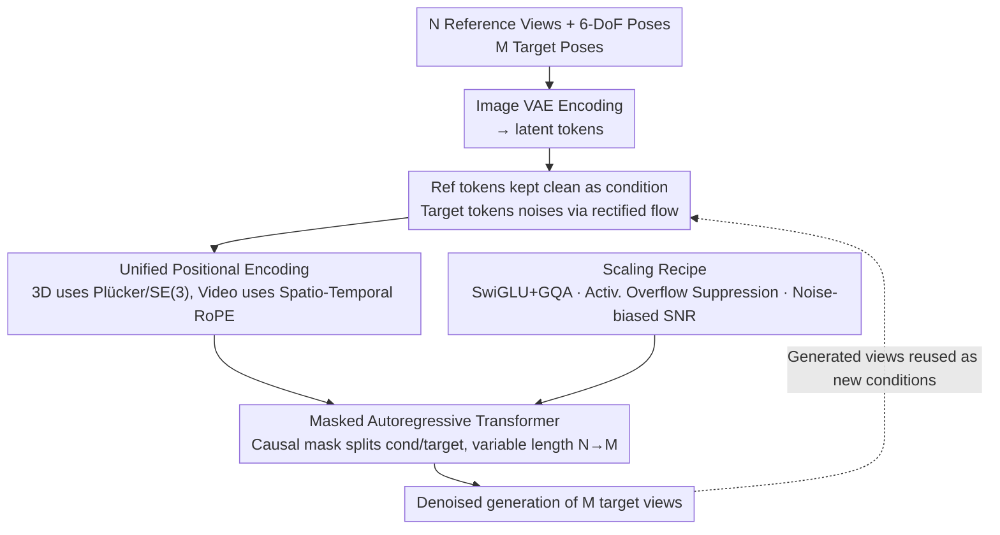

# Scaling Sequence-to-Sequence Generative Neural Rendering

**Conference**: ICLR 2026  
**arXiv**: [2510.04236](https://arxiv.org/abs/2510.04236)  
**Code**: [Project Page](https://shikun.io/projects/kaleido)  
**Area**: 3D Vision  
**Keywords**: Neural Rendering, Novel View Synthesis, Rectified Flow Transformer, Masked Autoregression, Unified Positional Encoding, Video-3D Unification

## TL;DR

Kaleido is proposed as a series of decoder-only rectified flow transformer generative models that treat 3D as a special sub-domain of video. Through Unified Positional Encoding, a masked autoregressive framework, and video pre-training strategies, it achieves "any-to-any" 6-DoF novel view synthesis without any explicit 3D representation. It **matches the rendering quality of per-scene optimization methods (InstantNGP) in multi-view settings for the first time** and increases the resolution from 512/576px to 1024px.

## Background & Motivation

Novel View Synthesis (NVS) is a core task in 3D vision, aiming to generate images from arbitrary target viewpoints given a few reference views. Existing methods face distinct technical bottlenecks:

| Method Paradigm | Representative Work | Core Limitations |
|---------|---------|---------|
| Per-scene Optimization | 3DGS, NeRF, InstantNGP | Requires many views + minutes of optimization; lacks zero-shot generalization. |
| Feed-forward Reconstruction | PixelNeRF, LRM | Depends on explicit 3D representations (point clouds/tri-planes); limited generalization. |
| Diffusion Generation | Zero123++, SV3D, SEVA | Based on U-Net architectures; resolution limited to 512/576px; difficult to scale; often requires SDS distillation. |
| Video-controlled Generation | MotionCtrl, CameraCtrl, GEN3C | Essentially 4D temporal prediction; limited by single reference frames or fixed trajectories; cannot handle "any-to-any" spatial queries. |

**Key Insight**: 3D can be viewed as a special sub-domain of video—both are essentially image sequences, differing only in whether the camera transformations between frames are known. However, directly fine-tuning video models is ineffective as they rely on temporal VAEs assuming high temporal correlation, which does not hold in sparse-view 3D tasks.

**Goal**:
- 3D data with camera labels is extremely scarce, whereas video data scales by orders of magnitude.
- Previous strong general NVS models like SEVA are limited by U-Net architectures (576px) and lack scalability.
- A scalable pure Transformer architecture is needed to learn spatial priors ("visual commonsense") from video and transfer them to 3D.

## Method

### Overall Architecture

Kaleido reformulates novel view synthesis as a pure sequence-to-sequence image synthesis problem. Given $N$ reference views and their 6-DoF poses $\{(I_i, P_i)\}_{i=1}^{N}$ and $M$ target poses $\{P_j\}_{j=1}^{M}$, a single decoder-only rectified flow transformer directly outputs $M$ target views. This process bypasses explicit 3D representations (no point clouds, NeRF, 3DGS, or depth estimation). Each image is encoded into latent tokens via a VAE, camera poses are injected via positional encoding, reference views are kept clean as conditions, and target views are noise-conditioned for rectified flow denoising. Video and 3D are treated as the same sequence task with different positional encodings.

### Key Designs

**1. Unified Positional Encoding: One Transformer for Video and 3D Data**

To transfer visual commonsense from massive video data to the 3D domain, the architecture must be shared. Kaleido utilizes the same RoPE framework for both: for video, it encodes temporal position $t$ and spatial positions $(h, w)$; for 3D, it encodes Plücker ray coordinates $(\mathbf{o}, \mathbf{d})$ derived from camera parameters. This design requires zero additional parameters, allowing the architecture to switch between video and 3D training while naturally extending video temporal consistency into 3D spatial consistency.

**2. Masked Autoregressive Framework: Supporting "Any-to-Any" Inference**

Existing models often struggle with variable numbers of reference and target views. Kaleido uses causal masking to distinguish between condition views (clean tokens) and target views (noisy tokens), allowing $N$ and $M$ to vary during both training and inference. Crucially, it enables autoregressive iteration: high-quality generated views can serve as new conditions, extending the sequence from a 12-view training length to 480-frame (40$\times$) extreme generation.

**3. Scaling Recipe: Resolving Bottlenecks in pure Seq2Seq Models**

Scaling pure Transformers for generative NVS requires overcoming two engineering hurdles identified through ablation. First, massive activation overflow (Sec 2.2.2) is eliminated through specific activation function selection. Second, standard diffusion SNR sampling is sub-optimal for 3D rendering; the authors employ noise-biased sampling (Sec 2.2.3) to re-adjust the SNR distribution. This recipe makes a naive pure Transformer truly viable for generative rendering.

### Loss & Training

Training occurs in two stages. First, the model undergoes pre-training on large-scale video data using the rectified flow matching loss $\mathcal{L} = \mathbb{E}_{t}\left[\|v_\theta(x_t, t) - (x_1 - x_0)\|^2\right]$ to learn spatio-temporal consistency. Second, it is fine-tuned on 3D datasets with camera labels, where the Unified Positional Encoding switches to Plücker ray mode. Rectified flow provides more stable training and higher sampling efficiency than standard DDPM, supporting Classifier-Free Guidance for enhanced quality.

## Key Experimental Results

### Main Results: NVS Benchmark Comparison

| Setting | Comparison Method | Kaleido Performance | Key Metrics |
|------|---------|-------------|---------|
| Few-view (1-3 views) | Zero123++, SV3D, SEVA, EscherNet | Substantially outperforms generative methods zero-shot | PSNR significantly leading |
| Multi-view (>10 views) | InstantNGP (Per-scene Optimization) | **Matches quality for the first time** | Comparable PSNR |
| Single-view 3D Reconstruction | All previous methods | SOTA | CD=1.83, VIoU=70% |
| Resolution | SEVA (576px), CAT3D (512px) | **First 1024px** generative rendering model | Doubled resolution |

### Comparison with Video-controlled Generative Models (Appendix H)

| Method | Type | Camera Accuracy ($R_{err}$↓ / $T_{err}$↓) | Visual Quality (LPIPS↓) |
|------|------|------|------|
| Wonderland (CVPR 2025) | Video→3DGS Pipeline | Lower | Comparable |
| ViewCrafter | Video Gen | Lower | Lower |
| VD3D | Video Diffusion | Lower | Lower |
| MotionCtrl (SIGGRAPH 2024) | Video Control | Lower | Lower |
| **Kaleido** | Seq2Seq NVS | **Best** | **Best or Comparable** |

On DL3DV and Tanks & Temples, Kaleido significantly exceeds all video baseline models in camera accuracy.

### Ablation Study

| Ablation Config | Impact | Description |
|---------|------|------|
| W/o Video Pre-training | Spatial consistency worsens | Validates "3D ≈ video sub-domain" hypothesis |
| Standard PE vs. Unified PE | Performance drop | Unified PE is key for video→3D transfer |
| Encoder-decoder vs. Decoder-only | Performance drop | Decoder-only is better for variable-length tasks |
| Standard SNR vs. Noise-biased | Performance drop | SNR distribution is vital for 3D rendering |
| Unfixed Activation Overflow | Unstable training | Critical bottleneck for large-scale scaling |
| Reduced Model Size | Continuous decline | 3D geometry requires sufficient capacity |

### Key Findings

1. **3D ≈ Video Sub-domain**: Video pre-training significantly improves 3D rendering; temporal consistency effectively transfers to spatial consistency.
2. **Clear Scaling Laws**: Increased model size consistently improves quality; a clear scaling law exists for pure Transformers in NVS.
3. **Implicit Geometric Understanding**: Models without explicit 3D representations still learn meaningful geometry, as evidenced by CD=1.83 in 3D reconstruction.
4. **Video Models are not Substitutes**: Typical video temporal VAE assumptions fail in sparse 3D tasks; methods like GEN3C crash during large viewpoint changes due to "empty cache" issues.

## Highlights & Insights

- **Paradigm Shift**: Proves for the first time that pure 2D sequence models can match the quality of per-scene optimization (e.g., InstantNGP) without SDS refinement.
- **Architectural Innovation**: Unified Positional Encoding allows a single architecture to handle video and 3D with zero modifications, representing an elegant and practical design.
- **Data Leverage**: Cleverly compensates for 3D data scarcity using video pre-training, providing a paradigm for other data-limited 3D tasks.
- **Scaling Recipe**: Systematically identifies and resolves scaling bottlenecks (activation overflow, SNR sampling) for seq2seq 3D rendering.
- **1024px Milestone**: The first generative rendering model to surpass U-Net limitations and achieve 1024px resolution.

## Limitations & Future Work

1. **Inference Efficiency**: High inference cost for large models/long sequences; while faster than per-scene optimization, it is not yet real-time.
2. **Geometric Precision Ceiling**: Implicit 3D understanding may be insufficient for applications requiring sub-pixel geometric precision (e.g., AR/VR).
3. **Camera Parameter Dependency**: Still requires known 6-DoF target camera poses as input.
4. **Long Sequence Degradation**: Artifacts appear in extreme 480-frame autoregressive generation; consistency over ultra-long trajectories needs improvement.
5. **Training Cost**: High overall cost for video pre-training combined with 3D fine-tuning.
6. **No 4D Capability**: Current design is for static scenes and does not handle dynamic scene reconstruction.

## Related Work & Insights

- **NeRF / 3DGS**: Per-scene optimization provides the quality upper bound; Kaleido matches InstantNGP in multi-view settings.
- **SEVA (ICCV 2025)**: A U-Net-based general NVS model; Kaleido surpasses it in scalability and resolution.
- **CAT3D / ReconFusion**: Generative methods requiring SDS refinement; Kaleido achieves higher quality in a single stage.
- **GEN3C (NVIDIA)**: Based on explicit depth reprojection; Kaleido's implicit priors are more robust to large viewpoint changes.
- **Insight**: The strategy of unifying professional domain tasks into sequence-to-sequence problems and leveraging large-scale neighborhood data (video) can be extended to 3D editing, dynamic reconstruction, and robotics.

## Rating

- Novelty: ⭐⭐⭐⭐⭐ (3D-as-Video paradigm + Unified PE + Scaling recipe)
- Experimental Thoroughness: ⭐⭐⭐⭐ (Comprehensive evaluation across benchmarks; added video model comparisons in rebuttal)
- Writing Quality: ⭐⭐⭐⭐ (Clear concepts and strong systematic approach)
- Value: ⭐⭐⭐⭐⭐ (Opens new directions for generative neural rendering; scaling insights are widely applicable)

<!-- RELATED:START -->

## Related Papers

- [\[ICLR 2026\] Plan then Act: Bi-level CAD Command Sequence Generation](plan_then_act_bi-level_cad_command_sequence_generation.md)
- [\[CVPR 2026\] LongStream: Long-Sequence Streaming Autoregressive Visual Geometry](../../CVPR2026/3d_vision/longstream_long-sequence_streaming_autoregressive_visual_geometry.md)
- [\[CVPR 2026\] AutoRegressive Generation with B-rep Holistic Token Sequence Representation](../../CVPR2026/3d_vision/autoregressive_generation_with_b-rep_holistic_token_sequence_representation.md)
- [\[ICCV 2025\] LONG3R: Long Sequence Streaming 3D Reconstruction](../../ICCV2025/3d_vision/long3r_long_sequence_streaming_3d_reconstruction.md)
- [\[CVPR 2026\] AeroDGS: Physically Consistent Dynamic Gaussian Splatting for Single-Sequence Aerial 4D Reconstruction](../../CVPR2026/3d_vision/aerodgs_physically_consistent_dynamic_gaussian_splatting_for_single-sequence_aer.md)

<!-- RELATED:END -->
