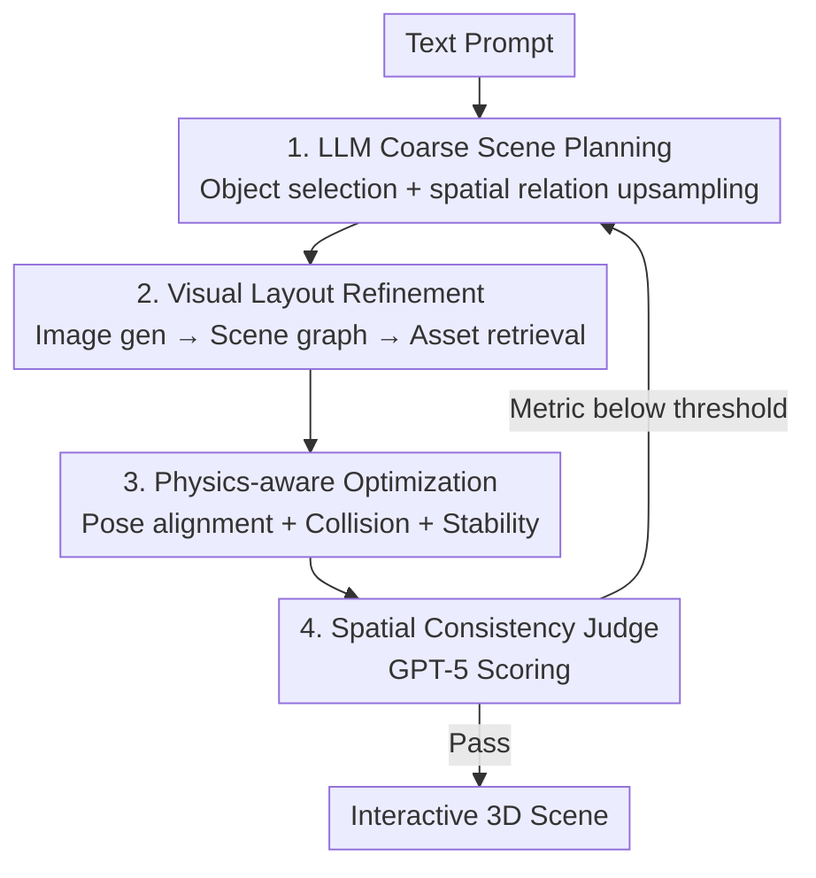

# Scenethesis: A Language and Vision Agentic Framework for 3D Scene Generation

**Conference**: ICLR 2026  
**OpenReview**: [https://openreview.net/forum?id=SzhezVoaNB](https://openreview.net/forum?id=SzhezVoaNB)  
**Paper**: [NVIDIA Research Project Page](https://research.nvidia.com/labs/dir/scenethesis/)  
**Code**: To be released (promised in paper)  
**Area**: 3D Vision  
**Keywords**: text-to-3D scene, Agentic framework, physical plausibility, layout optimization, vision foundation models

## TL;DR
Scenethesis is a training-free agentic framework that utilizes LLMs to draft coarse layouts, vision foundation models for visual grounding and scene graph extraction, and a physics-aware optimizer (semantic correspondence + SDF contact/support constraints) for object-wise pose correction. A GPT-5 judge verifies spatial consistency and triggers re-planning, enabling the generation of collision-free, stable, and interactive 3D scenes for both indoor and outdoor environments.

## Background & Motivation

**Background**: The ability to generate interactive 3D scenes from text is a key capability for gaming, virtual content creation, and embodied intelligence. It requires more than just synthesizing individual assets; it demands "spatial intelligence"—understanding support, occlusion, and affordance to ensure objects function correctly within an editable, physically consistent environment. Current main approaches include learning-based layout/scene generation (trained on CAD datasets like 3D-FRONT) and LLM/VLM-based layout planning.

**Limitations of Prior Work**: Both routes face significant challenges. Learning-based methods inherit biases from indoor datasets, which are dominated by large furniture and lack small objects or long-tail relationships (e.g., "on-top-of", "inside", "behind"). They often fail to generalize to outdoor scenes or unusual support relationships. LLM-based planners use linguistic common sense to propose diverse layouts but operate in symbolic rather than metric space. Lacking visual grounding, they often place furniture backwards or violate support/clearance constraints, leading to floating or intersecting objects, especially for small or occluded items.

**Key Challenge**: There is a **structural trade-off between diversity and physical plausibility**. Learning-based methods are physically credible but limited to indoor scenes and lack diversity; LLM planners are diverse but lack visual/physical grounding, often violating common-sense physics. Both lack a mechanism that combines open-ended planning with physically grounded execution.

**Goal**: To achieve the open-set diversity of LLMs, the spatial grounding of vision foundation models, and physics-aware, collision-free placement for both indoor and outdoor scenes, all without training a new scene-level generator.

**Key Insight**: Vision foundation models (image generators, segmentation, depth estimation) have encoded compact real-world spatial priors—common object co-occurrences and arrangements—through large-scale training. Rather than training a new generator, it is more effective to "ground" the LLM's coarse plan onto these visual priors and use a physics-based optimization loop to refine placements into collision-free, stable states.

**Core Idea**: Construct a training-free agentic pipeline comprising "language planning + visual grounding + physics optimization + judge-based repair," allowing physical constraints to shape the layout during development rather than as a post-hoc patch.

## Method

### Overall Architecture
Scenethesis takes a text prompt (e.g., "a peaceful beach at sunset") and outputs an interactive 3D scene where objects can be edited individually and are physically plausible. The pipeline consists of four serial agent modules with a "judge → re-plan" feedback loop: ① An LLM module reasons the prompt into a coarse scene plan (selecting objects + upsampling descriptions with spatial relations); ② A visual module grounds this plan into an image, performs segmentation/depth estimation/scene graph extraction, and retrieves editable 3D assets; ③ A physics-aware optimization module iteratively corrects the 5-DoF pose of each object based on the scene graph hierarchy (anchor → parent → child), using semantic correspondence for alignment and SDF for collision and stability constraints; ④ A judge module uses GPT-5 to compare the generated scene with the guidance image, triggering re-planning if spatial consistency metrics fall below a threshold.

### Key Designs

**1. LLM Coarse Scene Planning: Drafting Anchor-based Layouts with Linguistic Common Sense**

To address the lack of diversity in learning-based methods, Scenethesis utilizes LLM open-ended common sense. Given a simple prompt, the LLM interprets it, traverses all object categories in a 3D database, selects relevant items, and generates an "upsampled prompt" describing coarse spatial relations. The key is that it **outputs only a rough draft**: following the Holodeck approach, the LLM selects an anchor object (the top of the hierarchy above the floor, like a sofa) and arranges other objects into a coarse spatial hierarchy relative to it. This hierarchy is embedded in the upsampled prompt for downstream visual grounding, avoiding direct coordinate assignment by the LLM, as symbolic planning is inherently unreliable for precise metrics.

**2. Visual Layout Refinement: Grounding Drafts into Scene Graphs via Generative Priors**

This step uses the implicit spatial priors of image generators to ground the LLM's draft in three stages. **Image Guidance**: Generates a visually grounded image from the upsampled prompt to serve as a reference for segmentation, depth, and retrieval. **Scene Graph Generation**: Uses VFMs/VLMs (GPT-5, Grounded-SAM, DepthPro) to segment objects, estimate depth, and derive 3D bounding boxes (3DBB), constructing a scene graph that identifies anchor/parent/child structures. 5-DoF poses (scale, orientation, translation) are initialized by back-projecting segmented objects into sparse 3D point clouds using monocular depth. These poses are treated as coarse initializations for further optimization due to noise and occlusion. **Asset Retrieval**: Instead of generative pipelines like 3DGS, which often have geometric defects, Scenethesis retrieves editable assets from a curated Objaverse subset based on category/attributes and provides environment maps for background elements.

**3. Physics-aware Optimization: Semantic Correspondence for Alignment + SDF Constraints**

Placing assets directly onto 3DBBs estimated from images leads to issues with occlusion-induced point cloud incompleteness and shape mismatch. This iterative optimization loop processes objects based on the scene graph hierarchy. **Pose Alignment** uses RoMa to extract dense, semantic-aware correspondences $\{p(x,y),\tilde p(x,y)\}_i^m = \mathrm{RoMa}(o_i,\tilde o_i)$ between the asset and the guidance image, minimizing the weighted sum of 2D reprojection and 3D consistency to refine scale, translation, and azimuth. **Physical Plausibility** moves beyond 3DBB proxies to precise mesh-surface sampling for collision and SDF contact/support reasoning. The collision constraint queries the scene SDF: a translation loss pushes the object away in direction $u_i$ based on penetration depth $d_i$:

$$L_{translation} = \sum_{v_i \in V^-} \| f(T, |d_i|, u_i) - T \|_2^2, \quad f(T,|d_i|,u_i) = T + u_i \cdot |d_i|$$

A scale loss $L_{scale}$ is activated if multiple independent collision clusters ($N_{cluster}>1$) occur. Stability constraints require the bottom sampling points of an object to touch the parent surface (SDF → 0):

$$L_{stability} = \sum_{v_i \in V_B} \left(1 - e^{-d_i^2}\right)$$

This ensures physics shapes the layout during the process rather than being an afterthought.

**4. Spatial Consistency Judge: GPT-5 Verification and Targeted Re-planning**

To ensure a closed-loop system, a GPT-5 judge compares the generated 3D scene, the guidance image, and the planned objects. It verifies relations across three normalized metrics $[0,1]$: object category accuracy, orientation alignment, and global spatial consistency. If any metric falls below a threshold, the judge triggers re-planning, sending the pipeline back to the LLM module.

### Loss & Training
The entire process is training-free, requiring no scene-level generator training. Optimization is implemented in PyTorch/PyTorch3D and runs on a single A100 (40G). The three primary optimization targets are: pose alignment (2D reprojection + 3D consistency), collision loss ($L_{translation}$/$L_{scale}$), and stability loss ($L_{stability}$), processed iteratively through the scene graph hierarchy.

## Key Experimental Results

Evaluation was conducted on 34 prompts (22 indoor + 12 outdoor) across 8 major and 16 sub-categories from DL3DV-10K. Baselines were restricted to interactive scene generation methods with public code.

### Main Results
Text-Image Alignment + Spatial Quality Preference (GPT-5/Human preference for Ours relative to baselines):

| Method | CLIP↑ | BLIP↑ | VQA↑ | Notes |
|------|------|------|------|------|
| DiffuScene | 23.11 | 48.28 | 0.7832 | 3D-FRONT Trained |
| SceneTeller | 25.27 | 51.99 | 0.7999 | LLM Planning |
| Holodeck | 28.32 | 46.25 | 0.6815 | LLM Planning |
| LayoutGPT | 23.01 | 46.35 | 0.8052 | LLM Planning |
| IDesign | 28.19 | 44.76 | 0.7095 | VLM Planning |
| **Ours** | **30.71** | **77.17** | **0.8269** | Training-free |

Scenethesis achieves the highest scores across all metrics. The significant lead in BLIP (77.17 vs. 51.99) highlights its superior text adherence and pipeline reliability.

Physical Plausibility + Interactivity (Indoor):

| Method | Col-O↓ | Col-S↓ | Inst-O↓ | Inst-S↓ | Reach↑ | Walk↑ |
|------|------|------|------|------|------|------|
| Holodeck | 6.1% | 21% | 7.00% | 31.58% | 0.90 | 0.96 |
| IDesign | 6.51% | 65% | 8.3% | 68.88% | 0.88 | 0.80 |
| LayoutVLM | 12.2% | 57.1% | 20.3% | 71.4% | 0.90 | 0.71 |
| **Ours** | **0.8%** | **6%** | **3.20%** | **16.67%** | **0.94** | **0.96** |

Object collision rate dropped from 6.1% to 0.8%, and scene instability from 31.58% to 16.67%. Reachability and walkability were also the highest, demonstrating that $SDF$ in-loop constraints successfully drive layouts toward collision-free and stable configurations.

### Ablation Study
Incremental impact of physics-aware optimization components:

| Configuration | Pose Align.↑ | Collision↓ | Instability↓ | Description |
|------|------|------|------|------|
| Raw layout | 0.536 | 22.7% | 87.3% | Direct placement on 3DBB |
| +Pose Alignment | 0.732 | 10.6% | 74.2% | Semantic alignment |
| +Collision | 0.755 | 3.6% | 69.8% | Collision constraints |
| +Stability | **0.836** | **0.8%** | **3.2%** | Complete system |

### Key Findings
- **Pose alignment governs "accuracy," while stability constraints govern "steadiness"**: Adding Pose Alignment significantly raised the alignment score (0.536 to 0.732), while Instability plummeted precisely when Stability constraints were added (74.2% to 3.2%).
- **Collision constraints drive the drop in collision rates**: The addition of Collision was the largest contributor to reducing the collision rate from 10.6% to 3.6%.
- **SDF mesh-level geometry vs. 3DBB proxies**: Unlike 3DBB-based baselines that suffer from "false collisions," mesh-surface sampling + SDF allows small objects to be precisely placed inside shelf slots, which is fundamental to the lead in physical metrics.

## Highlights & Insights
- **Training-free outperforms learning-based**: Scenethesis matches or exceeds the layout realism of models trained specifically on 3D-FRONT, proving that "VFM priors + physics optimization" can replace specialized scene generators.
- **In-loop physics vs. post-hoc patching**: By integrating SDF contact/support constraints directly into the pose alignment loop, physics shapes the layout as it is formed. This "in-loop" approach is the reason for the dramatically lower collision rates compared to post-hoc methods like CAST.
- **Migratable Judge-Replanning loop**: Using a powerful VLM as a judge to trigger re-planning upgrades a feed-forward pipeline into a self-correcting agent loop, a strategy applicable to many multi-module pipelines.
- **SDF surface geometry replaces 3DBB**: Moving from bounding box granularity to mesh-surface sampling unlocks long-tail capabilities like placing objects inside containers.

## Limitations & Future Work
- **Retrieval Database Dependence**: The variety of scenes is capped by the asset library. Future improvements in generative 3D for articulated objects could overcome this.
- **Evaluation Bias**: The heavy reliance on GPT-5 as generator, judge, and evaluator introduces potential self-evaluation bias.
- **Pipeline Latency**: Multiple calls to LLMs, image generators, VFMs, and iterative optimization suggest high costs and latency (not detailed in the paper).
- **Future Directions**: Finer-grained re-planning (repairing specific sub-regions) and lightweight learnable pose initialization to reduce optimization iterations.

## Related Work & Insights
- **vs. Learning-based Layout Generation**: These models inherit indoor biases and struggle with long-tail relations; Scenethesis generalizes better via training-free optimization.
- **vs. LLM/VLM Planning**: Earlier methods lack visual grounding; Scenethesis uses LLM only for coarse drafts, grounding them via VFMs in metric space.
- **vs. CAST**: CAST performs post-hoc correction; Scenethesis integrates physics into the loop, resulting in significantly lower collision rates.
- **vs. NeRF/3DGS**: Those provide realism but lack instance structure; Scenethesis outputs editable, interactive, instantiated scenes.

## Rating
- Novelty: ⭐⭐⭐⭐ Combines LLM planning, VFM grounding, in-loop SDF physics, and VLM judges into a coherent training-free agent.
- Experimental Thoroughness: ⭐⭐⭐⭐ Robust indoor/outdoor metrics; however, preference metrics rely on GPT-5 and end-to-end timing is missing.
- Writing Quality: ⭐⭐⭐⭐ Clear logic, well-defined constraints and formulas, and intuitive diagrams.
- Value: ⭐⭐⭐⭐⭐ High utility for virtual content, simulation, and embodied AI due to its training-free, general-purpose nature.

<!-- RELATED:START -->

## Related Papers

- [\[CVPR 2026\] SAGE: Scalable Agentic 3D Scene Generation for Embodied AI](../../CVPR2026/3d_vision/sage_scalable_agentic_3d_scene_generation_for_embodied_ai.md)
- [\[ICLR 2026\] PAT3D: Physics-Augmented Text-to-3D Scene Generation](pat3d_physics-augmented_text-to-3d_scene_generation.md)
- [\[ICLR 2026\] FlashWorld: High-quality 3D Scene Generation within Seconds](flashworld_high-quality_3d_scene_generation_within_seconds.md)
- [\[ICLR 2026\] OpenFly: A Comprehensive Platform for Aerial Vision-Language Navigation](openfly_a_comprehensive_platform_for_aerial_vision-language_navigation.md)
- [\[ICLR 2026\] DepthLM: Metric Depth from Vision Language Models](depthlm_metric_depth_from_vision_language_models.md)

<!-- RELATED:END -->
