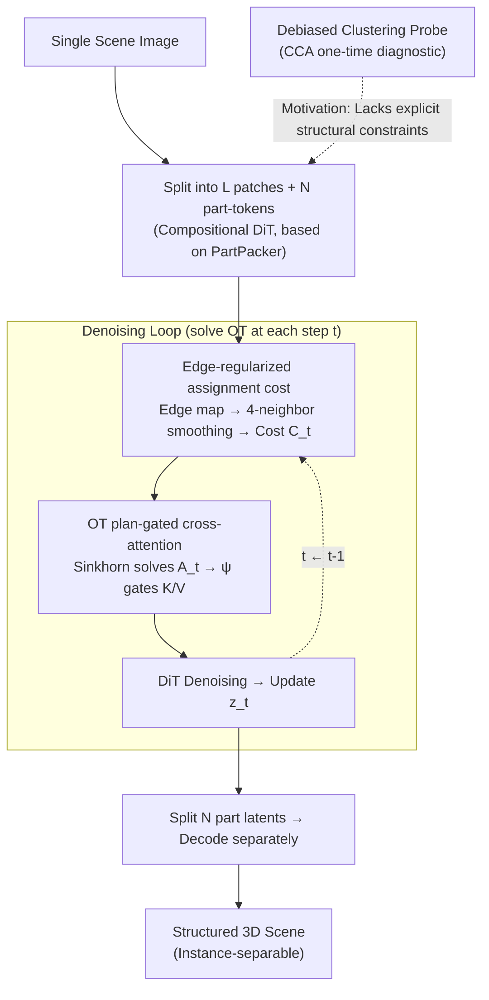

# SceneTransporter: Optimal Transport-Guided Compositional Latent Diffusion for Single-Image Structured 3D Scene Generation

**Conference**: ICLR 2026  
**arXiv**: [2602.22785](https://arxiv.org/abs/2602.22785)  
**Code**: [Project Page](https://2019epwl.github.io/SceneTransporter/)  
**Area**: 3D Vision / Structured Scene Generation  
**Keywords**: Structured 3D scenes, Optimal Transport, Compositional Diffusion, Instance Separation, Cross-attention Gating

## TL;DR

SceneTransporter reformulates open-world structured 3D scene generation as a global assignment-association problem by introducing an entropic Optimal Transport (OT) framework into the denoising loop of compositional 3D latent diffusion models: OT plan-gated cross-attention achieves exclusive patch-to-part routing (preventing feature entanglement), while edge-regularized assignment costs encourage the separation of different instances at image boundaries, achieving SOTA instance-level consistency and geometric fidelity across 74 diverse open-world scene images.

## Background & Motivation

**Background**: High-quality 3D scene generation is a cornerstone of immersive technologies and embodied AI. However, most scene generators output monolithic meshes that cannot be directly used for downstream tasks—material assignment, physical simulation, asset retrieval, and fine-grained editing all require the scene to have explicit instance-level object-context separation.

**Limitations of Prior Work**:

1.  **Fragile "divide and conquer" schemes**: These involve segmenting the input image first, then generating 3D parts separately, and finally assembling the scene. This pipeline relies heavily on 2D segmentation quality, handles occlusion poorly, and minor 2D segmentation errors propagate into severe 3D geometric artifacts.
2.  **End-to-end compositional generation fails in open-world settings**: Methods such as PartPacker and PartCrafter perform well in object-level part generation but reveal two pathologies when generalized to complex open-world scenes:
    *   **Structural Mispartition**: Semantic instances fail to form disjoint parts; the geometry of a single object is scattered across multiple part-tokens.
    *   **Geometric Redundancy**: Multiple latents compete to describe the same spatial region, leading to overlaps.
3.  **Fundamental reason**: Unconstrained soft attention mechanisms cannot establish globally consistent patch-to-part assignments.

**Key Challenge**: Feature representations in part-level generators implicitly contain correct instance grouping information (recoverable via debiased clustering), but the model itself lacks structural constraints to make this information explicit.

**Goal**: Introduce an Optimal Transport framework to provide explicit global assignment constraints—OT's one-to-one mapping prevents feature entanglement, coverage budget constraints prevent part-token information starvation, and edge regularization prevents cross-boundary leakage.

## Method

### Overall Architecture

SceneTransporter reformulates "structured scene generation" as a global assignment problem: explicitly assigning every image patch to a specific 3D part to avoid feature entanglement between different objects. It is built upon existing compositional 3D generators (PartPacker's rectified-flow DiT), dividing the conditioning image into $L$ patches and maintaining $N$ part-level tokens. At each denoising step $t$, the part-patch affinity is regularized into a cost matrix $\mathbf{C}_t$ using image edges, followed by solving an entropic Optimal Transport (OT) problem to obtain a transport plan $\mathbf{A}_t$. This plan gates the cross-attention, limiting each part's field of view to its exclusive image evidence, thereby driving the denoising step. This mechanism is training-free and serves as a plug-and-play inference-time module. The motivation for adding this OT constraint stems from a **one-time debiased clustering diagnostic** (Design 1)—which does not participate in step-by-step inference but proves the root cause and provides the design motivation.

### Key Designs

**1. Debiased Clustering Probe: Probing the root cause before design**

Part-level generators like PartPacker exhibit two typical pathologies in open-world scenes—structural mispartition and geometric redundancy—yet merging all parts roughly reconstructs the scene. The authors designed a diagnostic experiment: direct clustering of raw part-tokens fails to yield stable instance groups. However, if Canonical Correlation Analysis (CCA) is first used to find shared components among part-level latent sets, and tokens are projected onto the orthogonal complement of the shared subspace to isolate object-specific variations, clustering the residual tokens becomes reliably successful. This contrast indicates that correct instance grouping information is **implicit** in features; the model simply fails to **establish these associations explicitly**. The lack is not representation capacity but an external structural constraint.

**2. Edge-Regularized Assignment Cost: Using image edges to delineate boundaries at object contact**

To provide a cost matrix $\mathbf{C}_t$ that distinguishes instances, the difficulty lies in the fact that patches near contact boundaries in cluttered scenes are often simultaneously compatible with multiple parts, leading to information leakage. The authors inject image edge priors: extract an edge map $\mathbf{E}$, downsample it to the patch grid, and calculate edge-aware coupling weights $w_{j\ell} = \exp(-\gamma_{\text{edge}} \max\{\mathbf{E}_\downarrow(j), \mathbf{E}_\downarrow(\ell)\})$ on a 4-neighborhood graph. This weight is high for adjacent patches in low-edge regions and low across high-edge boundaries. It is used for edge-aware smoothing of part-patch cosine similarity $S_{i,j}$ to obtain $\widehat{S}_{i,j}$, followed by per-patch contrastive normalization to intensify competition. The final cost is $\mathbf{C}_t(i,j) = \frac{1}{2}(1 - \widetilde{S}_{i,j})$. Without any mask supervision, image edges alone bias the cost matrix towards separation at object junctions.

**3. OT Plan-Gated Cross-Attention: Preventing feature entanglement via one-to-one transport constraints**

Given $\mathbf{C}_t$, to address the issue of multiple parts competing for the same patch, the authors solve an entropic OT between $N$ 3D parts and $L$ image patches at each step $t$: $\mathbf{A}_t = \arg\min_{\mathbf{A} \ge 0} \langle \mathbf{C}_t, \mathbf{A} \rangle + \varepsilon_t \mathcal{H}(\mathbf{A})$, subject to $\mathbf{A}\mathbf{1} = \boldsymbol{\mu}$ and $\mathbf{A}^\top\mathbf{1} = \boldsymbol{\nu}$. The row marginal $\boldsymbol{\mu}$ is the part capacity budget (ensuring no part is "starved"); the column marginal $\boldsymbol{\nu} = \frac{1}{L}\mathbf{1}_L$ ensures equal contribution from each patch. This is solved via stabilized log-domain Sinkhorn iterations. Rather than direct replacement, $\mathbf{A}_t$ is row-normalized into patch weights $\boldsymbol{\omega}_i$, then processed through a bounded, identity-preserving gating function $\psi_{\lambda_t, \varepsilon_g}(w) = \varepsilon_g + (1-\varepsilon_g) w^{\lambda_t}$ to modulate Key and Value in cross-attention. Each part "sees" only its exclusive image memory, making routing exclusive and suppressing both structural mispartition and geometric redundancy.

## Key Experimental Results

### Main Results: Quantitative Evaluation on 74 Open-World Scenes

| Method | Requires Mask | ULIP↑ | ULIP-2↑ | Uni3D↑ | IoU_max↓ | IoU_mean↓ | Inference Time(s) |
|------|:---:|:---:|:---:|:---:|:---:|:---:|:---:|
| MIDI | ✓ | 0.1397 | 0.2763 | 0.2518 | 0.0458 | 0.1642 | 149.68 |
| PartCrafter | ✗ | 0.1177 | 0.3096 | 0.2635 | **0.0042** | **0.0539** | 157.97 |
| PartPacker | ✗ | 0.1417 | 0.3083 | 0.2887 | 0.0319 | 0.2142 | 47.41 |
| **Ours** | ✗ | **0.1466** | **0.3220** | **0.3021** | 0.0101 | 0.0926 | 54.99 |

Ours achieves SOTA performance across three geometric fidelity metrics (ULIP, ULIP-2, Uni3D) and ranks second in part disentanglement metrics (PartCrafter has lower IoU as it discards the background/ground, but sacrifices scene completeness). Inference time is only 7.6s slower than PartPacker, which is much faster than MIDI and PartCrafter.

**User Study: 30-person Preference Evaluation**

| Method | Geometric Quality↑ | Layout Consistency↑ | Segmentation Rationality↑ |
|------|:---:|:---:|:---:|
| MIDI | 2.61 | 1.82 | 2.29 |
| PartCrafter | 2.44 | 1.63 | 2.17 |
| PartPacker | 2.81 | 2.95 | 1.97 |
| **Ours** | **3.09** | **3.34** | **3.22** |

Using a forced ranking system (1-4 scale), Ours received the highest preference across all dimensions, with a particularly massive advantage in segmentation rationality (3.22 vs. PartPacker 1.97).

### Ablation Study

**OT Plan Gating vs. Standard Attention**: Standard cross-attention produces noisy maps and chaotic patch-to-part mappings, leading to geometric corruption. OT gating clearly separates ground and architecture parts. Hard affinity maps show non-overlapping region assignments, resulting in clean part geometry.

**OT Plan Evolution**: The transport plan stabilizes rapidly after $t \approx 540/600$ steps—coarse semantic routing is determined early and maintained, while late stages focus on local refinements.

**Effect of Edge Regularization**: In contact regions (e.g., sofa near a corner table), adding edge regularization successfully separates adjacent but semantically distinct objects, whereas the version without it shows mixed parts and blurred boundaries.

## Highlights & Insights

1.  **Diagnostic-driven methodology**: Quantitatively revealing root causes via debiased clustering before designing solutions—methodologically robust.
2.  **Mathematical Elegance**: Reformulating structured 3D generation as an Optimal Transport problem with clear constraints (exclusivity, coverage, edge-awareness), while remaining fully differentiable and training-free.
3.  **Plug-and-play**: Effectively applied to pre-trained generators at inference time with minimal overhead (~7.6s).
4.  **Comprehensive Evaluation**: Metric-based evaluation + 30-person user study + extensive ablation + denoising visualization.

## Limitations & Future Work

1.  Tested on 74 images; the sample scale is relatively small, which limits statistical reliability.
2.  PartCrafter’s superior IoU is due to discarding backgrounds; the comparison is not entirely fair without controlled completeness requirements.
3.  Edge detection relies on low-level features (Canny/Sobel), which might produce spurious edges in texture-rich scenes, affecting OT assignment quality.

## Rating

⭐⭐⭐⭐⭐ — Strong work in both theoretical depth and practical efficacy. The complete pipeline from diagnosis to solution and the training-free, plug-and-play design make it a benchmark in structured 3D generation.

<!-- RELATED:START -->

## Related Papers

- [\[ICLR 2026\] One2Scene: Geometric Consistent Explorable 3D Scene Generation from a Single Image](one2scene_geometric_consistent_explorable_3d_scene_generation_from_a_single_imag.md)
- [\[CVPR 2026\] Pano3DComposer: Feed-Forward Compositional 3D Scene Generation from Single Panoramic Image](../../CVPR2026/3d_vision/pano3dcomposer_feed-forward_compositional_3d_scene_generation_from_single_panora.md)
- [\[ICLR 2026\] Sat3DGen: Comprehensive Street-level 3D Scene Generation from Single Satellite Image](sat3dgen_comprehensive_street-level_3d_scene_generation_from_single_satellite_im.md)
- [\[ICML 2026\] AvAtar: Learning to Align via Active Optimal Transport](../../ICML2026/3d_vision/avatar_learning_to_align_via_active_optimal_transport.md)
- [\[ICML 2026\] Streaming Sliced Optimal Transport](../../ICML2026/3d_vision/streaming_sliced_optimal_transport.md)

<!-- RELATED:END -->
## Related Papers

- [\[ICLR 2026\] One2Scene: Geometric Consistent Explorable 3D Scene Generation from a Single Image](one2scene_geometric_consistent_explorable_3d_scene_generation_from_a_single_imag.md)
- [\[CVPR 2026\] Pano3DComposer: Feed-Forward Compositional 3D Scene Generation from Single Panoramic Image](../../CVPR2026/3d_vision/pano3dcomposer_feed-forward_compositional_3d_scene_generation_from_single_panora.md)
- [\[ICLR 2026\] Sat3DGen: Comprehensive Street-level 3D Scene Generation from Single Satellite Image](sat3dgen_comprehensive_street-level_3d_scene_generation_from_single_satellite_im.md)
- [\[ICML 2026\] AvAtar: Learning to Align via Active Optimal Transport](../../ICML2026/3d_vision/avatar_learning_to_align_via_active_optimal_transport.md)
- [\[ICML 2026\] Streaming Sliced Optimal Transport](../../ICML2026/3d_vision/streaming_sliced_optimal_transport.md)

<!-- RELATED:END -->
