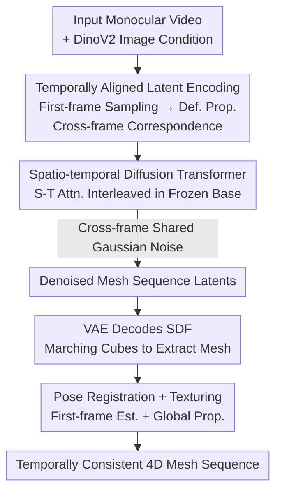

# ShapeGen4D: Towards High Quality 4D Shape Generation from Videos

**Conference**: ICLR 2026  
**OpenReview**: [https://openreview.net/forum?id=r9AJisFLLo](https://openreview.net/forum?id=r9AJisFLLo)  
**Project Page**: [https://shapegen4d.github.io/](https://shapegen4d.github.io/)  
**Area**: 3D Vision  
**Keywords**: 4D Shape Generation, Video-conditioned Generation, Latent Diffusion Transformer, Temporal Consistency, Mesh Sequences

## TL;DR
ShapeGen4D adapts a large-scale pre-trained 3D shape diffusion model into a feed-forward "video-to-4D mesh sequence" generator. By employing temporally aligned latent codes, spatio-temporal attention, and cross-frame shared noise, it end-to-end generates geometrically consistent dynamic mesh sequences capable of handling topological changes and volumetric expansion/contraction, outperforming baselines like L4GM, V2M4, and GVFD in geometric accuracy.

## Background & Motivation
**Background**: Video-conditioned 4D shape generation aims to recover time-varying 3D geometry and appearance from a single monocular video. Early mainstream methods relied on per-scene optimization of 4D representations using score distillation sampling (SDS). These evolved into two-stage pipelines: first generating multi-view videos via image/video diffusion, then performing feed-forward geometric reconstruction. Inspired by the success of large-scale 3D latent diffusion Transformers (e.g., Hunyuan3D, TRELLIS, Step1X-3D), recent attempts have been made to transfer pre-trained 3D generation models to 4D.

**Limitations of Prior Work**: SDS methods are fragile and computationally expensive. Two-stage methods are limited by accumulated inconsistency errors from the multi-view generation stage, resulting in suboptimal reconstruction quality and efficiency. Concurrent works directly utilizing pre-trained 3D models also face critical flaws: V2M4 runs a 3D generator independently for each video frame and relies on complex, fragile mesh registration and geometric optimization to stitch the sequence, leading to artifacts in geometry, motion, and texture. GVFD generates the first frame using Trellis and trains a model to deform this initial geometry, but its geometry and texture are **limited to the first frame**, ignoring new information exposed in subsequent frames. Furthermore, due to its reliance on scarce 4D training data, it is restricted to rigid or near-isometric deformations and cannot handle topological changes or significant volumetric fluctuations.

**Key Challenge**: 4D training data is extremely scarce compared to the abundance of 3D data. For effective generalization, it is necessary to maximize the reuse of geometric priors learned by pre-trained 3D models. However, 3D models are inherently "single-image-to-single-shape" and agnostic to temporal sequences; applying them frame-by-frame results in jitter, drift, and erratic poses. The core difficulty lies in enabling a 3D generator to output temporally consistent mesh sequences **without introducing new modalities or per-frame optimization**.

**Goal**: Construct the first video-to-4D feed-forward framework that directly generates dynamic 3D meshes, accommodating topological changes and relaxing constraints on animation types while inheriting the generalization capabilities of pre-trained 3D models.

**Key Insight**: The authors observe that "generating a sequence of 3D meshes" is a capability already possessed by the base 3D model; it is not necessary to invent new modalities like "Gaussian particle deformation offsets" (as in GVFD) which the model has not learned. By **fine-tuning** the 3D generator (rather than using it as a black box or an external optimization) to process the entire video simultaneously and explicitly addressing temporal consistency, rich 3D knowledge can be transferred.

**Core Idea**: Insert spatio-temporal attention into a pre-trained 3D shape diffusion Transformer, combined with temporally aligned VAE latent codes and cross-frame shared noise, to map videos to temporally consistent SDF mesh sequences in an end-to-end manner.

## Method

### Overall Architecture
ShapeGen4D is a flow-based latent diffusion model that takes a monocular video as input and outputs a sequence of meshes representing non-rigid motion over time. Built upon "3DShape2VectSet style" 3D models such as Step1X-3D or Hunyuan3D, the framework consists of two synergy components: (a) A **temporally aligned dynamic VAE** that encodes each mesh frame into a set of latent codes, which are then decoded into a Truncated Signed Distance Field (SDF). Crucially, latent codes from different frames are mapped to the "same physical point" on the deforming surface to ensure natural temporal alignment. (b) A **spatio-temporal diffusion Transformer** that interleaves learnable spatio-temporal attention layers between frozen base 3D Transformer blocks. This allows latents from different frames to "see" each other during denoising, enforcing cross-frame consistency. After generating the mesh sequence, a lightweight two-stage post-processing (global pose registration + global texturing) aligns the output to the input video and applies consistent textures to create a drivable asset.

### Key Designs

**1. Temporally Aligned Latent Encoding: Mapping Latents to the Same Physical Point**

Encoding mesh sequences $\{M_1,...,M_T\}$ independently per frame produces temporally jittering latent codes. In VAE encoders, unordered point clouds are compressed into fixed-length representations using a sparse query set $Q=\mathrm{FPS}(P)$ (Farthest Point Sampling) to cross-attend to the dense point cloud $P$. If $Q_t$ is sampled independently from $P_t$ for each frame, query positions will not correspond across time, causing latents to jump randomly along the temporal axis. The authors introduce temporal structure by sampling $Q_1$ only in the first frame and propagating it via animation deformation: $Q_t = w_t(Q_1)$, where $w_t$ is the deformation at frame $t$. This ensures each latent sequence corresponds to the **same physical point** on the deforming surface, significantly reducing jitter. Queries are sampled from the **original non-watertight mesh** defining the animation to avoid expensive registration of processed watertight meshes.

**2. Spatio-temporal Attention Layers: Upgrading 3D Transformers for Cross-frame Communication**

The base rectified-flow diffusion Transformer is designed for "single-image-to-single-3D-latent," where each block independently processes image features and shape latents. To introduce temporal dependency, the authors **insert a spatio-temporal Transformer layer** after each block of the pre-trained model. It reuses the structure of the base single-stream block but applies self-attention across all frames to joint shape latents and image hidden states, capturing cross-frame dependencies. Frame indices use 1D RoPE embeddings. During training, **only these new layers are updated while the base is frozen** to prevent catastrophic forgetting of 3D priors. Output projections of these layers are **zero-initialized** to ensure stability and equivalence to the original model at the start of training.

**3. Cross-frame Shared Noise: Eliminating Pose Flickering from Noise Variance**

In diffusion models, additive Gaussian noise is typically sampled independently per frame. However, independent noise causes motion instability in this task. The authors identify that since the original 3D model is **view-agnostic**, shapes are generated in arbitrary orientations. Different noise samples drive the model towards different poses and scales, causing visible flickering. While image diffusion models use independent noise on regular grids with explicit position embeddings, 3DShape2VectSet models lack explicit coordinates and must implicitly infer position, making them more sensitive to noise. The solution is simple: **all frames share the same noise** during training and inference. This significantly improves temporal smoothness and geometric alignment even before fine-tuning.

### Loss & Training
The model is trained using rectified-flow (velocity prediction). Data consists of 14k high-quality animated 3D assets selected from Objaverse, converted to watertight meshes and normalized. The model generates 16 frames with 1024 latents each. The encoder takes 32k points per frame with 1024 queries from non-watertight meshes. Training was performed on 16 A100 GPUs for 25k steps (approx. 2 days) with a batch size of 64 and a learning rate of $5\times10^{-5}$. During inference, a **time shift** is introduced in the denoising scheduler to allocate more steps to high-noise segments, which improves stability given the increased difficulty of denoising 4D latents with shared noise.

## Key Experimental Results

### Main Results
Geometric accuracy was evaluated on a held-out Objaverse test set (33 samples with significant motion). ShapeGen4D leads across Chamfer, IoU, and F-Score, with the Hunyuan3D-2.1 base version further widening the gap.

| Method | Representation | Feed-forward | Chamfer↓ | IoU↑ | F-Score↑ | Inference Time↓ |
|------|------|------|---------|------|---------|------|
| Step1X-3D (per-frame) | SDF | ✓ | 0.1356 | 0.3033 | 0.2617 | 3 min |
| L4GM | MV-3D GS | ✓ | 0.1576 | – | 0.1932 | 25 sec |
| V2M4 | mesh+deform | ✗ | 0.1233 | 0.3023 | 0.2814 | 30 min |
| GVFD | 3D GS+deform | ✓ | 0.3978 | – | 0.0699 | 10 min |
| **ShapeGen4D (Step1X-3D)** | SDF | ✓ | 0.1220 | 0.3276 | 0.2934 | 3 min |
| **ShapeGen4D (Hunyuan3D-2.1)** | SDF | ✓ | **0.0827** | **0.4155** | **0.3971** | 15 min |

Rendering quality was evaluated on Consistent4D. While L4GM shows higher rendering metrics, the authors note this is due to its **inherent alignment with the input view** (biased towards input reconstruction). Step1X-3D, GVFD, and Ours prioritize generating plausible 4D shapes from various views over strict alignment, making direct comparison of rendering metrics biased against non-aligned methods.

| Method | Aligned | LPIPS↓ | CLIP↑ | FVD↓ | DreamSim↓ |
|------|------|--------|-------|------|-----------|
| Step1X-3D | ✗ | 0.1524 | 0.9040 | 940 | 0.1106 |
| L4GM | ✓ | 0.0988 | 0.9397 | 302 | 0.0487 |
| GVFD | ✗ | 0.1691 | 0.8601 | 916 | 0.1467 |
| **Ours** | ✗ | 0.1359 | 0.9009 | 796 | 0.0966 |

### Ablation Study
Components were removed progressively (using 8 frames for efficiency):

| Configuration | Chamfer↓ | IoU↑ | F-Score↑ | Description |
|------|---------|------|---------|------|
| w/o aligned latents | 0.1348 | 0.3230 | 0.3002 | Independent queries; lower quality, high jitter |
| w/o shared noise | 0.1186 | 0.3137 | 0.2962 | Independent noise; pose flickering |
| 1D temp. attn. | 0.2118 | 0.1503 | 0.1462 | Pure temporal attention; catastrophic collapse |
| w/o image hidden states | 0.1196 | 0.3332 | 0.3084 | S-T attn. ignores image; lower accuracy |
| w/o time shift | 0.1374 | 0.3087 | 0.2861 | No denoising time shift; reduced stability |
| **Full method** | **0.1096** | **0.3346** | **0.3190** | Complete model |

### Key Findings
- **Temporally aligned latents are critical**: Replacing them with independent queries leads to a full degradation of geometric metrics and increased flickering. This is the foundation for learning smooth temporal dynamics.
- **Intra-frame attention is indispensable**: Pure 1D temporal attention results in collapse (Chamfer 0.21), confirming that latents without explicit position embeddings must rely on intra-frame attention to infer spatial location.
- **Shared noise resolves pose flickering**: In difficult cases like a moving hippo or a flag, sharing noise stabilizes orientation and improves geometry even before fine-tuning.
- **Time shift is effective only at inference**: It has negligible impact during training but significantly enhances stability during the denoising process.

## Highlights & Insights
- **Reuse of base capabilities**: The philosophy of not creating new modalities and instead maximizing the reuse of learned 3D priors is the most elegant design choice. Unlike GVFD, which forces the model to learn "Gaussian offsets"—a modality it hasn't seen at scale—this work allows the 3D model to generate what it knows best (mesh sequences) while focusing on temporal consistency.
- **Deeper diagnosis of noise sensitivity**: Attributing pose flickering to view-agnostic base models and lack of explicit position embeddings leads to the "shared noise" solution. This transition from mechanistic understanding to a zero-cost solution is highly impactful.
- **Transfer learning paradigm**: The combination of "training new layers + zero initialization + frozen backbone" provides a reusable template for extending large pre-trained models into new dimensions (like time) without catastrophic forgetting.

## Limitations & Future Work
- **Dependency on post-processing**: The generated meshes are in a canonical space and require pose registration to match the input video. Texturing also relies on propagation from the first frame via mesh registration.
- **Data scale constrained to 14k assets**: Despite 3D priors, the ceiling of 4D data scale remains. Coverage for complex multi-object scenes or extreme topological changes requires further verification.
- **Efficiency-accuracy trade-off**: The Hunyuan version is more accurate but slower (15 min vs 3 min). Evaluation protocols for rendering are also biased towards view-aligned methods.
- **Short sequences**: The model generates a fixed 16 frames; long-sequence consistency and chunk-stitching methods were not explored in detail.

## Related Work & Insights
- **vs GVFD**: GVFD generates geometry only for the first frame and uses a deformation field to drive Gaussian particles. It is limited to rigid/near-isometric motion and generalizes poorly. ShapeGen4D generates entire sequences observing all frames, handling topological changes with superior generalization.
- **vs V2M4**: V2M4 uses per-frame 3D generation plus fragile optimization. ShapeGen4D is a direct feed-forward framework with internal consistency enforced via spatio-temporal attention.
- **vs L4GM**: L4GM predicts multi-view Gaussian pixels. While its rendering metrics are high due to evaluation bias, its geometry is weaker and prone to errors in complex cases where ShapeGen4D's diffusion priors excel.

## Rating
- Novelty: ⭐⭐⭐⭐⭐ First feed-forward video-to-4D framework directly generating dynamic meshes.
- Experimental Thoroughness: ⭐⭐⭐⭐ Solid dual-benchmark and ablation, though 4D test sets are inherently limited in scale.
- Writing Quality: ⭐⭐⭐⭐⭐ Excellent motivation and diagnosis of mechanisms (noise, latent alignment).
- Value: ⭐⭐⭐⭐⭐ Provides a reusable paradigm for lifting 3D diffusion models to 4D.

<!-- RELATED:START -->

## Related Papers

- [\[ICLR 2026\] FlashWorld: High-quality 3D Scene Generation within Seconds](flashworld_high-quality_3d_scene_generation_within_seconds.md)
- [\[ICLR 2026\] Ctrl&Shift: High-Quality Geometry-Aware Object Manipulation in Visual Generation](ctrlshift_high-quality_geometry-aware_object_manipulation_in_visual_generation.md)
- [\[AAAI 2026\] 4DSTR: Advancing Generative 4D Gaussians with Spatial-Temporal Rectification for High-Quality and Consistent 4D Generation](../../AAAI2026/3d_vision/4dstr_advancing_generative_4d_gaussians_with_spatial-tempora.md)
- [\[ICLR 2026\] Mono4DGS-HDR: High Dynamic Range 4D Gaussian Splatting from Alternating-exposure Monocular Videos](mono4dgs-hdr_high_dynamic_range_4d_gaussian_splatting_from_alternating-exposure_.md)
- [\[ICLR 2026\] PAGE-4D: VGGT-4D Perception via Disentangled Pose and Geometry Estimation](page-4d_vggt-4d_perception_via_disentangled_pose_and_geometry_estimation.md)

<!-- RELATED:END -->
