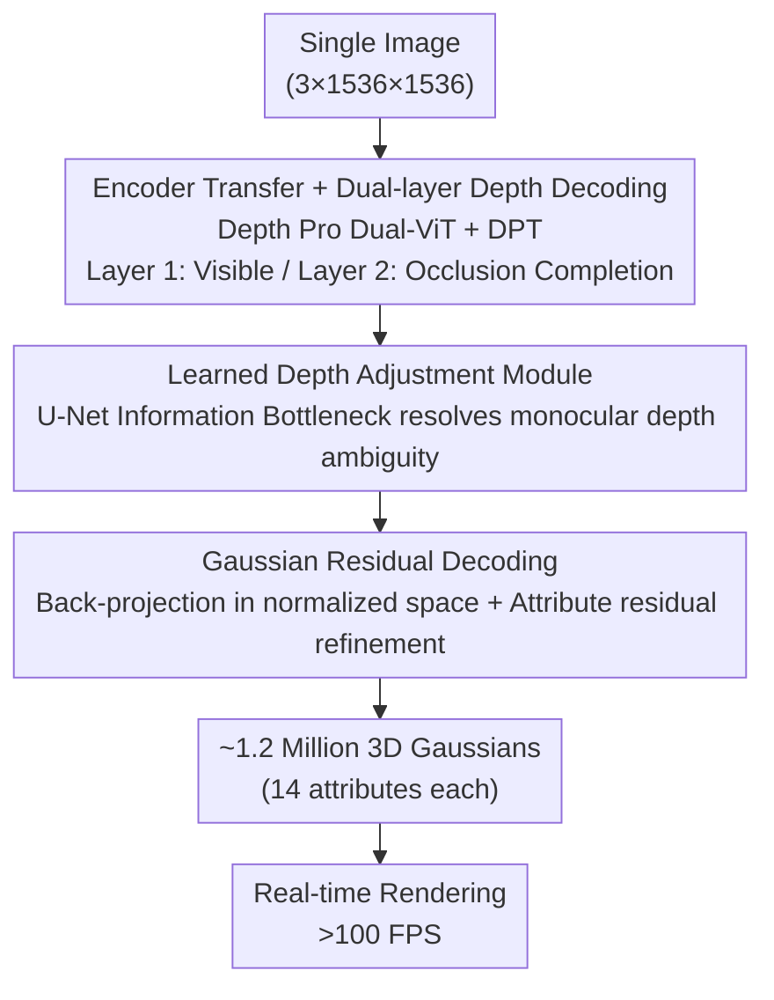

# Sharp Monocular View Synthesis in Less Than a Second

**Conference**: ICLR 2026  
**arXiv**: [2512.10685](https://arxiv.org/abs/2512.10685)  
**Code**: [github.com/apple/ml-sharp](https://github.com/apple/ml-sharp)  
**Area**: 3D Vision  
**Keywords**: view synthesis, 3D Gaussian splatting, monocular depth, real-time rendering, feedforward

## TL;DR

SHARP generates approximately 1.2 million 3D Gaussians from a single image via a single feedforward neural network. It completes inference in less than 1 second on an A100 GPU and supports rendering speeds exceeding 100 FPS. It achieves zero-shot SOTA performance across 6 datasets, reducing LPIPS by 25–34% compared to the strongest prior methods while shortening synthesis time by three orders of magnitude.

## Background & Motivation

**Background**: Novel view synthesis has evolved from multi-view optimization (NeRF, 3DGS) to single-view feedforward methods (Splatter Image, Flash3D) and diffusion-based methods (Gen3C, ViewCrafter, SVC). The former is fast but limited in quality, while the latter offers high quality but can take several minutes to process.

**Limitations of Prior Work**: (1) Feedforward methods (e.g., Flash3D) exhibit significantly lower visual fidelity than diffusion methods; (2) Diffusion methods (e.g., Gen3C requires ~15 minutes) are too slow for interactive browsing; (3) Diffusion outputs at close-range views are often less sharp than the input photo; (4) Most methods lack a metric scale, preventing coupling with physical devices.

**Key Challenge**: How to achieve high-fidelity photorealistic rendering at close-range views while maintaining sub-second interactive speeds?

**Goal**: To train an end-to-end regression network based on the Depth Pro encoder that predicts dual-layer depth maps and refined residuals for all Gaussian attributes. It introduces a learned depth adjustment module to resolve monocular depth ambiguity, a carefully designed loss configuration to suppress artifacts, and self-supervised fine-tuning to adapt to real-world images.

## Method

### Overall Architecture

SHARP addresses the task of "single image $\to$ high-fidelity close-range view rendering" by compressing the process into a single feedforward regression. Given an input image $\mathbf{I} \in \mathbb{R}^{3 \times 1536 \times 1536}$, the model directly outputs a Gaussian tensor $\mathbf{G} \in \mathbb{R}^{14 \times 2 \times 768 \times 768}$ — representing approximately 1.2 million 3D Gaussians, each with 14 attributes (3 position + 3 scale + 4 rotation + 3 color + 1 opacity). The network comprises four learnable components: a pretrained encoder, a dual-layer depth decoder, a depth adjustment module, and a Gaussian decoder. The data flow consists of three stages: first, estimating visible and occluded depth layers using the encoder and decoder; second, using the adjustment module to resolve monocular depth ambiguities; and third, back-projecting corrected depths as initial Gaussian values followed by attribute refinement via residual regression. The total parameters are 702M (340M trainable), with inference under 1 second on an A100.

### Key Designs

**1. Encoder Transfer + Dual-layer Depth Decoding: Migrating mature monocular depth capabilities to view synthesis and completing occluded backgrounds.**

A root cause for feedforward methods lagging behind diffusion methods is the failure to fully leverage existing geometric priors, coupled with the lack of background information occluded by foreground objects. SHARP reuses the dual ViT backbone of Depth Pro as the encoder. The low-resolution encoder (326M parameters) is unfrozen during training to adapt to view synthesis, while the patch encoder remains frozen. This inherits metric-scale depth priors while allowing features to shift toward rendering tasks. The depth decoder is based on DPT (~20M parameters), with a key modification of duplicating the final convolutional layer to output two depth channels: the first layer for visible surfaces and the second for occluded regions and view-dependent effects, enabling the completion of backgrounds for viewpoint movement.

**2. Learned Depth Adjustment Module: Resolving fundamental monocular depth ambiguity with an information bottleneck.**

Monocular depth estimation inherently suffers from scale and surface ambiguities, especially on transparent or reflective surfaces, which causes artifacts when back-projecting. Inspired by Conditional VAEs, a small U-Net (2M parameters) is inserted. During training, it takes both predicted inverse depth $\hat{D}^{-1}$ and ground truth inverse depth $D^{-1}$ to output a per-pixel scaling map $\mathbf{S}$ for correction:

$$\bar{D} = \mathbf{S}(\hat{D}, D) \odot \hat{D}$$

To prevent the network from simply copying the ground truth, an MAE regularizer $\mathcal{L}_{\text{scale}} = \mathbb{E}[|\mathbf{S}(p) - 1|]$ and multi-scale TV regularization are applied to compress this path into an information bottleneck, forcing the network to learn only the most compact ambiguity-resolution representation. During inference, since ground truth is unavailable, the module is replaced by an identity function; the model has learned to be cautious in error-prone areas. Ablations show this reduces DISTS on ScanNet++ from 0.077 to 0.064, with the most significant improvements in clarity at reflections/transparency.

**3. Gaussian Residual Decoding: Regressing attributes via residuals in normalized space for stable training and cross-camera generalization.**

Once the corrected depth is obtained, the bulk of the geometry is fixed, but Gaussian color, scale, rotation, and opacity still require refinement. Rather than predicting absolute values, which is difficult to train and prone to overfitting to training cameras, SHARP uses a Gaussian initializer to back-project each pixel into initial 3D coordinates $\mu(i,j) = [i \cdot \bar{D}'(i,j),\, j \cdot \bar{D}'(i,j),\, \bar{D}'(i,j)]^T$. Colors are taken from input pixels, and scales are proportional to depth $s = s_0 \cdot \bar{D}'$. A deliberate choice is **not to use the source view's intrinsic matrix**, forcing the network to reason in a normalized space for zero-shot generalization across cameras. A Gaussian decoder (DPT architecture, ~7.8M parameters, trained from scratch) then predicts residuals added to the initial values via attribute-specific activation functions:

$$\mathbf{G}_{\text{attr}} = \gamma_{\text{attr}}\Big(\gamma_{\text{attr}}^{-1}(\mathbf{G}_{0,\text{attr}}) + \eta_{\text{attr}} \Delta\mathbf{G}_{\text{attr}}\Big)$$

Regressing residuals ensures the geometric initialization handles the heavy lifting, allowing the decoder to focus on local corrections, leading to more stable and faster convergence.

### Loss & Training

Training occurs in two stages. Stage 1 utilizes ~700,000 procedurally generated scenes (~8 million images) with perfect image and depth ground truth to learn clean geometry and appearance mappings. Stage 2 involves Self-Supervised Fine-Tuning (SSFT): the trained model generates pseudo-novel views of real images, which are then used as input to reconstruct the original real image as the target. This facilitates adaptation to real image distributions without stereo pairs.

The supervision signal consists of three types of losses. On the rendering side, L1 color loss $\mathcal{L}_{\text{color}}$, perceptual loss $\mathcal{L}_{\text{percep}}$ (including a Gram matrix term for sharpness), and BCE alpha loss $\mathcal{L}_{\text{alpha}}$ are used. For geometry, inverse depth L1 loss $\mathcal{L}_{\text{depth}}$ is applied only to the first layer, leaving the second for free completion. Additional regularizers include second-layer depth TV $\mathcal{L}_{\text{tv}}$, disparity gradient floater suppression $\mathcal{L}_{\text{grad}}$, offset constraints $\mathcal{L}_{\text{delta}}$, and Gaussian screen-projection variance $\mathcal{L}_{\text{splat}}$. Perceptual loss is vital for sharpness (reducing ScanNet++ DISTS from 0.162 to 0.063 in ablation), but triggers OOM on 40GB GPUs; to circumvent this, the authors utilize "Computation Graph Surgery," releasing ResNet computation graphs immediately after precomputing gradients.

## Key Experimental Results

### Main Results

Zero-shot evaluation on 6 unseen datasets (lower is better):

| Method | Middlebury DISTS | Middlebury LPIPS | ScanNet++ DISTS | ScanNet++ LPIPS | WildRGBD DISTS | WildRGBD LPIPS |
|------|-----------------|-----------------|-----------------|-----------------|---------------|---------------|
| Flash3D | 0.359 | 0.581 | 0.374 | 0.572 | 0.159 | 0.345 |
| TMPI | 0.158 | 0.436 | 0.128 | 0.309 | 0.114 | 0.327 |
| LVSM | 0.274 | 0.555 | 0.145 | 0.302 | 0.095 | 0.257 |
| Gen3C | 0.164 | 0.545 | 0.090 | 0.227 | 0.106 | 0.285 |
| **Ours (SHARP)** | **0.097** | **0.358** | **0.071** | **0.154** | **0.069** | **0.190** |

Inference time comparison: SHARP 0.91s (+ rendering ~5ms/frame); Gen3C ~830s; ViewCrafter ~120s.

### Ablation Study

**Loss Component Ablation** (ScanNet++/Tanks and Temples DISTS):

| Configuration | ScanNet++ DISTS | T&T DISTS |
|------|-----------------|-----------|
| color + alpha only | 0.229 | 0.301 |
| + depth | 0.162 | 0.239 |
| + perceptual | 0.063 | 0.126 |
| + regularizers | 0.064 | 0.126 |

**Depth Adjustment Ablation**:

| Depth Adjust | ScanNet++ DISTS | ScanNet++ LPIPS |
|----------|-----------------|-----------------|
| No | 0.077 | 0.154 |
| Yes | 0.064 | 0.147 |

**Gaussian Quantity Ablation**:

| Count | ScanNet++ DISTS | ScanNet++ LPIPS |
|------|-----------------|-----------------|
| 2×192² (~74K) | 0.110 | 0.199 |
| 2×384² (~295K) | 0.077 | 0.160 |
| 2×768² (~1.2M) | 0.064 | 0.147 |

### Key Findings

1. **25–34% LPIPS reduction vs Gen3C**: SHARP is optimal across all 6 datasets, while Gen3C takes ~900x longer to infer.
2. **Perceptual loss is the primary contributor**: Reduces DISTS from 0.162 to 0.063 (ScanNet++). The Gram matrix term is key for sharpness.
3. **Depth adjustment improves detail clarity**: Particularly on transparent/reflective surfaces by eliminating ambiguity-induced blur.
4. **1.2M Gaussians significantly outperform 74K**: Performance scales consistently with Gaussian count.
5. **SSFT provides qualitative improvement**: While metrics show minor changes, visual results are noticeably sharper.

## Highlights & Insights

- **Triumph of Pure Regression**: Proves that for close-range view synthesis, a well-designed feedforward regression approach can outperform diffusion models that use three orders of magnitude more computation.
- **Key Engineering Insights**: Normalized space prediction (no source intrinsics needed), computation graph surgery for perceptual loss OOM, and viewpoint swapping for self-supervision without stereo pairs.
- **Metric Scale Support**: The output 3D representation has absolute scale, allowing direct coupling with the physical movement of AR/VR headsets.
- **Information Bottleneck in Depth Adjustment**: Regularization forces the network to learn only necessary information to resolve depth ambiguity, which can then be removed during inference.

## Limitations & Future Work

- Designed for close-range views (~0.5m displacement); quality drops for distant views/large displacements — potentially complementary to diffusion models.
- Does not use Spherical Harmonics (SH), thus cannot model view-dependent effects (reflections, specularities).
- Depth model may fail in extreme scenarios: macro photography, night scenes, or complex water reflections.
- Direct application of synthetic training data to Flash3D did not yield similar gains, suggesting architecture design, not just data, is the differentiator.
- Unified frameworks for video and multi-view input remain unexplored.

## Related Work & Insights

- **3D Gaussian Splatting (Kerbl et al., 2023)**: Provides the 3D representation adopted by SHARP, though the original requires multi-view optimization.
- **Depth Pro (Bochkovskii et al., 2025)**: Serves as the backbone, providing metric-scale monocular depth estimation.
- **Flash3D (Szymanowicz et al., 2025)**: A predecessor in the same paradigm using pretrained depth for scene-level generalization, but with lower fidelity.
- **Gen3C (Ren et al., 2025)**: The strongest diffusion baseline; less sharp than SHARP at close ranges but superior for distant view synthesis.

## Rating

⭐⭐⭐⭐⭐

This paper achieves a Pareto optimum in quality and speed for single-image novel view synthesis, reaching SOTA status across 6 datasets with sub-second inference. Each module of the end-to-end architecture (dual-layer depth, depth adjustment, Gaussian refinement) is supported by clear motivation and ablation. Engineering details (graph surgery, SSFT) demonstrate strong systems capability. Developed by Apple; code is open-sourced.

<!-- RELATED:START -->

## Related Papers

- [\[CVPR 2026\] MoVieS: Motion-Aware 4D Dynamic View Synthesis in One Second](../../CVPR2026/3d_vision/movies_motion-aware_4d_dynamic_view_synthesis_in_one_second.md)
- [\[CVPR 2025\] Sharp-It: A Multi-view to Multi-view Diffusion Model for 3D Synthesis and Manipulation](../../CVPR2025/3d_vision/sharp-it_a_multi-view_to_multi-view_diffusion_model_for_3d_synthesis_and_manipul.md)
- [\[ICLR 2026\] True Self-Supervised Novel View Synthesis is Transferable](true_self-supervised_novel_view_synthesis_is_transferable.md)
- [\[ICLR 2026\] EgoWorld: Translating Exocentric View to Egocentric View using Rich Exocentric Observations](egoworld_translating_exocentric_view_to_egocentric_view_using_rich_exocentric_ob.md)
- [\[ICLR 2026\] WorldTree: Towards 4D Dynamic Worlds from Monocular Video Using Tree-Chains](worldtree_towards_4d_dynamic_worlds_from_monocular_video_using_tree-chains.md)

<!-- RELATED:END -->
