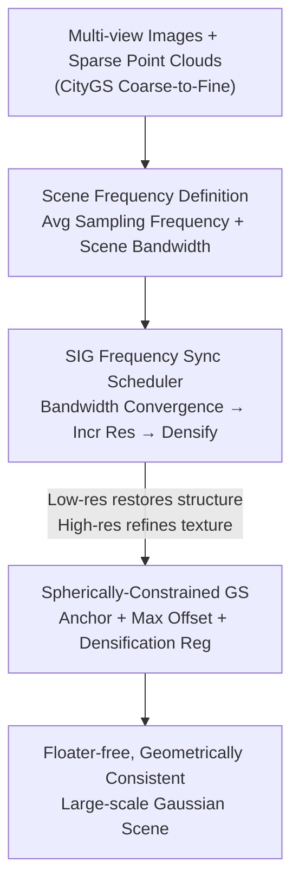

# Signal Structure-Aware Gaussian Splatting for Large-Scale Scene Reconstruction

**Conference**: ICLR 2026  
**OpenReview**: [https://openreview.net/forum?id=DavFcTeTbK](https://openreview.net/forum?id=DavFcTeTbK)  
**Area**: 3D Vision  
**Keywords**: 3D Gaussian Splatting, Large-Scale Scene Reconstruction, Frequency Alignment, Adaptive Scheduling, Geometric Priors

## TL;DR
This paper reformulates large-scale 3DGS scene reconstruction as a "signal structure recovery" problem. It derives the average sampling frequency and scene bandwidth for the 3D Gaussian representation and proposes SIG, an adaptive scheduler that switches image resolution and densification timing based on scene frequency convergence. Combined with spherically-constrained Gaussians to suppress floaters, it achieves a +0.9 dB PSNR improvement on multiple large-scale benchmarks while accelerating single-GPU training by approximately 1.5×.

## Background & Motivation

**Background**: 3D Gaussian Splatting (3DGS) models scenes using explicit Gaussian primitives, enabling fast and realistic rendering. For city-scale scenes, the mainstream approach is "divide and conquer"—partitioning the scene into multiple blocks for parallel training (e.g., CityGS, VastGS, BlockGS).

**Limitations of Prior Work**: Large-scale scenes inevitably contain "sparsely observed areas" where the point clouds initialized by COLMAP are extremely sparse and low-frequency. Using high-frequency images to supervise these "low-frequency initialized" Gaussians induces **uncontrolled densification**: excessive gradients cause Gaussians to split prematurely on fine textures while ignoring the underlying geometric structure. This results in numerous redundant primitives and floaters, making training slow and the output blurry.

**Key Challenge**: Rendering resolution and densification strategies are **not orthogonal components**, yet existing scheduling strategies either only adjust resolution (e.g., DashGS uses non-linear resolution scaling per iteration) or only adjust densification (e.g., TamingGS uses preset densification steps). Crucially, these are **hard-coded schedules** defined before training—they are unaware of the actual state of scene frequency convergence. Increasing resolution too early disrupts early optimization, while doing it too late slows down convergence and wastes computation.

**Goal**: To answer "when to increase resolution and when to densify" within a unified framework, while constraining Gaussians to prevent them from drifting to incorrect positions.

**Key Insight**: Reconstruction is viewed as "recovering continuous 3D signals from discretely sampled images." According to the Nyquist-Shannon sampling theorem, a sampling frequency $f$ can only recover frequency components within $[0, f/2]$. Thus, the ideal scheduling logic is: **only increase the resolution when the scene bandwidth has converged at the current resolution (i.e., information within the current sampling frequency is fully exploited)**, allowing higher-frequency images to guide densification for fine details. The key to implementing this logic is the ability to **quantitatively calculate the sampling frequency and effective bandwidth of 3D Gaussians**.

**Core Idea**: Mathematically derive the average frequency of the 3D Gaussian representation, use "scene frequency convergence" signals to adaptively synchronize image supervision with Gaussian frequencies (the SIG scheduler), and use spherically-constrained Gaussians to lock the optimization space near the initial geometric priors.

## Method

### Overall Architecture

The method is built upon the coarse-to-fine block training of CityGS (where coarse training establishes the "scaffold" and fine training refines each block). The core contribution replaces the "fine training" stage with **frequency-driven adaptive scheduling + geometrically constrained optimization**. Input consists of multi-view images and sparse point clouds; the output is a floater-free, geometrically consistent Gaussian scene. The pipeline consists of three steps: defining and validating "sampling frequency" and "scene bandwidth" (Theoretical Foundation); using them to drive the SIG scheduler to increase resolution and perform densification upon bandwidth convergence (Adaptive Scheduling); and finally, locking each Gaussian within its geometric prior sphere with densification regularization (Optimization).

### Key Designs

**1. Scene Frequency Definition: Unifying "Sampling Frequency" and "Gaussian Bandwidth"**

This serves as the foundation for scheduling. The pain point is that without quantitative metrics, it is impossible to judge "when to increase resolution." The authors define the **average sampling frequency** from a differential perspective: given focal length $f$ and sampling depth $d$, a unit interval in screen space corresponds to a 3D radius $d/f$, so the local sampling frequency is proportional to $f/d$. Downsampling the image by a factor $t$ is equivalent to $f' = f/t$ and $v' = v/t$, meaning resolution directly determines sampling frequency. Integrated over the whole scene, the average sampling frequency is $v = \sum_{i=1}^{n}\int_s w_i(s) \cdot \frac{f}{d_i(s)} \, ds$, where $w_i(s)$ is the contribution weight.

On the other hand, the **scene signal bandwidth** is defined by representing the scene opacity field as a weighted sum of Gaussians $D(x) = \sum_i o_i G_i(x)$. The average frequency $\bar\omega$ is calculated as the weighted average of the power spectral density. Since continuous integration over millions of Gaussians is infeasible, the authors use the half-power (3dB) bandwidth $\omega_{3dB} = \sqrt{2a \ln 2}$ to approximate the primary energy frequency of each primitive. This yields a closed-form expression $\bar\omega = \frac{\sum_i o_i^2 \det(\Sigma_i) \omega_{3dB_i}}{\sum_i o_i^2 \det(\Sigma_i)}$. Since for 1D Gaussians $\omega_{3dB} \propto 1/\sigma$, they use the mean of the three-axis scales $\omega_{3dB_i} \propto \sum_{k=1}^3 \frac{1}{3\sigma_k}$. Validation shows that only bandwidth defined by the mean of the three axes correlates strictly with sampling frequency (image resolution), whereas $\max$ or $\min$ based definitions do not.

**2. SIG Scheduler: Synchronizing Image Supervision and Gaussian Frequencies**

To address the limitations of hard-coded scheduling, SIG (Synchronizing Image supervision with Gaussian frequencies) consists of two coupled sub-schedulers. The **Frequency-Aligned Resolution Scheduler (FARS)** uses the stabilization of "average scene bandwidth" to determine convergence at the current resolution. At each iteration, the bandwidth gradient $\frac{d\omega}{d\,iter} = \omega_i - \omega_{i-1}$ is computed. When $\frac{d\omega}{d\,iter} < k \cdot \mathrm{mean}(\frac{1}{d})$ (where $d$ is the nearest neighbor distance in the initial point cloud for normalization), the bandwidth is considered converged, and image resolution is increased.

The **Densification Scheduler (DS)** is interwoven with FARS: since an increase in sampling frequency requires more Gaussians to fit higher-frequency signals, $m$ rounds of densification are executed only after each resolution increase. This avoids uncontrolled over-densification in early stages and prevents primitive counts from exploding.

**3. Spherically-Constrained Gaussians: Locking Gaussians via Geometric Priors**

This addresses floaters caused by the massive optimization space of sparse initializations. Unlike Scaffold-GS, which uses neural anchors and MLPs (hindering independent block training), this paper uses **explicit** constraints. Each Gaussian is assigned an anchor and a max offset. The anchor is initialized from the COLMAP point, and the offset is $x_{current} - x_{anchor}$. The max offset is set based on the average distance to $K=15$ nearest neighbors. Any Gaussian moving beyond $l \times$ max offset is pruned.

**Anchor Adaptive Control** ensures that new Gaussians inherit these constraints: "Replication" (for low-frequency regions) creates a new anchor at the current position to allow large shifts; "Splitting" (for high-frequency details) inherits the original anchor and reduces max offset by $0.7\times$ to encourage conservative updates. Finally, **Densification Regularization** $L_{cons}$ uses photometric consistency from reprojections to suppress floaters in textureless areas.

### Loss & Training
- In addition to standard 3DGS loss, a reprojection photometric consistency regex $L_{cons}$ (Eq. 7) is added during densification.
- Key hyperparameters: Resolution threshold $k=5 \times 10^{-5}$, evaluated every 100 iterations; spherical constraint scale $l=15$, $K=15$; images are dynamically downsampled from $n$ (5 $\to$ 1).
- Coarse and fine stages each take 30,000 iterations on an RTX 4090.

## Key Experimental Results

### Main Results
Evaluated on Mill19, UrbanScene3D, and MatrixCity (Synthetic) with color correction.

| Scene | Metric | Ours-L | CityGS | DashGS | Gain (vs CityGS) |
|-------|--------|--------|--------|--------|------------------|
| rubble | PSNR | **27.35** | 26.45 | 26.37 | +0.90 dB |
| rubble | SSIM | **0.843** | 0.809 | 0.802 | +0.034 |
| sci-art | PSNR | **25.94** | 24.49 | 24.10 | +1.45 dB |
| MatrixCity-Aerial | PSNR | **29.04** | 28.61 | 28.66 | +0.43 dB |

Efficiency: Average fine optimization time for one block in `rubble` dropped from 98 min (CityGS) to 71 min (Ours), a ~1.4× speedup.

### Ablation Study
Ablation on `rubble` (Full model: 1.5M points, 27.35 PSNR):

| Configuration | PSNR | SSIM | LPIPS | Points | Insight |
|---------------|------|------|-------|--------|---------|
| Full Model | 27.35 | 0.843 | 0.189 | 1.5M | - |
| w/o FARS | 26.18 | 0.807 | 0.231 | 2.2M | Over-densification; worst quality |
| w/o DS | 26.89 | 0.827 | 0.212 | 1.4M | Cannot add high-res details later |
| w/o SCG | 27.05 | 0.818 | 0.210 | 1.8M | Increased redundant/wrong optimization |
| w/o DR | 27.01 | 0.820 | 0.209 | 1.9M | Increase in floaters |

### Key Findings
- **FARS is the most significant contributor**: Removing it drops PSNR by 1.17 dB and increases point count to 2.2M, confirming that supervising low-frequency initialization with high-frequency images is the root cause of degradation.
- **Resolution and densification must be coupled**: Without DS, the end of the densification window might precede reaching max resolution, losing opportunities to refine high-frequency details.
- **SCG and DR suppress redundancy**: They reduce the point count from ~1.9M to 1.5M, effectively eliminating floaters and incorrect optimizations.

## Highlights & Insights
- **Converting hyperparameters to signals**: The decision of when to increase resolution or densify is transformed from a manual hyperparameter into a computable convergence signal derived from the Gaussian bandwidth.
- **Unified Framework**: The insight that both "rendering resolution" and "densification" are tools for adjusting signal frequency (sampling vs. target signal) allows the use of a self-consistent Nyquist framework.
- **Explicit vs. Implicit Constraints**: By using explicit spherical constraints rather than neural anchors, the method gains the geometric prior benefits of Scaffold-GS while maintaining the block-independence required for large-scale scalability.
- **Plug-and-Paly**: SIG and spherical constraints can be easily integrated into CityGS/BlockGS to improve both quality and speed.

## Limitations & Future Work
- While coarse-to-fine training yields two levels of Gaussians, the paper has not yet developed a complete Level-of-Detail (LoD) rendering solution.
- $L_{cons}$ depends on 3DGS rendering depth, which is not always precise, limiting its use to the densification stage rather than the entire training process.
- The global average frequency might not be fine-grained enough for extreme local variations, and the robustness of the threshold $k$ requires broader verification outside the tested datasets.

## Related Work & Insights
- **vs. DashGS**: Both adjust resolution, but DashGS uses a non-linear hard-coded schedule focused on efficiency, whereas this method uses adaptive frequency convergence to better recover high-frequency details.
- **vs. TamingGS**: TamingGS uses a predefined densification schedule; SIG couples densification with resolution based on frequency.
- **vs. Scaffold-GS**: Both use geometric priors. Scaffold-GS relies on MLPs and shared anchors, whereas this work uses explicit constraints to preserve block-level parallel scalability.
- **vs. CityGS/BlockGS**: This paper builds on their block-based frameworks but introduces frequency alignment and geometric constraints to solve their inherent floater and redundancy problems.

## Rating
- Novelty: ⭐⭐⭐⭐⭐ Formalizing 3DGS scheduling as signal recovery is a novel and self-consistent perspective.
- Experimental Thoroughness: ⭐⭐⭐⭐ Extensive benchmarks and ablations, though frequency robustness is mainly verified on specific datasets.
- Writing Quality: ⭐⭐⭐⭐ Clear theoretical derivations and motivation, though some formulas are dense.
- Value: ⭐⭐⭐⭐⭐ High practical value as a plug-and-play module for large-scale reconstruction efficiency.

<!-- RELATED:START -->

## Related Papers

- [\[ICLR 2026\] SkyEvents: A Large-Scale Event-Enhanced UAV Dataset for Robust 3D Scene Reconstruction](skyevents_a_large-scale_event-enhanced_uav_dataset_for_robust_3d_scene_reconstru.md)
- [\[ICLR 2026\] UrbanGS: Efficient and Scalable Architecture for Geometrically Accurate Large-Scale Urban Gaussian Splatting](urbangs_efficient_and_scalable_architecture_for_geometrically_accurate_large-sce.md)
- [\[ICCV 2025\] OccluGaussian: Occlusion-Aware Gaussian Splatting for Large Scene Reconstruction and Rendering](../../ICCV2025/3d_vision/occlugaussian_occlusion-aware_gaussian_splatting_for_large_scene_reconstruction_.md)
- [\[ICLR 2026\] FastAvatar: Towards Unified and Fast 3D Avatar Reconstruction with Large Gaussian Reconstruction Transformers](fastavatar_towards_unified_and_fast_3d_avatar_reconstruction_with_large_gaussian.md)
- [\[ICLR 2026\] ARTDECO: High-Fidelity Online 3D Reconstruction with Hierarchical Gaussian Structure + Feed-forward Priors](artdeco_toward_high-fidelity_on-the-fly_reconstruction_with_hierarchical_gaussia.md)

<!-- RELATED:END -->
