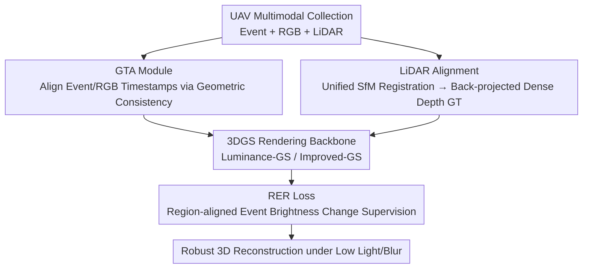

# SkyEvents: A Large-Scale Event-Enhanced UAV Dataset for Robust 3D Scene Reconstruction

**Conference**: ICLR 2026  
**OpenReview**: [https://openreview.net/forum?id=dxHPqQindP](https://openreview.net/forum?id=dxHPqQindP)  
**Code**: https://github.com/Anthony-ECPKN/SkyEvent (Available)  
**Area**: 3D Vision  
**Keywords**: Event Camera, UAV, 3D Scene Reconstruction, Multimodal Dataset, 3D Gaussian Splatting

## TL;DR
This paper introduces SkyEvents, the first "Event + RGB + LiDAR" multimodal dataset for large-scale UAV 3D scene reconstruction (45 sequences, >8 hours, 0.72 km² point cloud). It proposes a Geometric Timestamp Alignment (GTA) module and a Region-level Event Rendering (RER) loss, demonstrating that incorporating the event modality significantly enhances the texture and geometric fidelity of 3DGS reconstruction under extreme conditions such as low light and motion blur.

## Background & Motivation
**Background**: City-scale 3D reconstruction (digital twins, urban modeling) using UAVs currently relies primarily on neural rendering techniques like NeRF or 3D Gaussian Splatting (3DGS), which have scaled from small objects to large scenes. However, these methods fundamentally depend on multi-view images captured by standard CMOS RGB cameras.

**Limitations of Prior Work**: During UAV flight, constant camera motion and long exposure lead to motion blur, while low-light/nighttime environments suffer from insufficient dynamic range. Consequently, RGB images from many views are either blurred or underexposed, which directly degrades 3DGS reconstruction quality, causing structural artifacts and texture loss. Event cameras inherently address these issues: they asynchronously record pixel intensity changes with microsecond temporal resolution and high dynamic range, making them naturally robust to motion blur and low light.

**Key Challenge**: While the idea of introducing event cameras to UAV 3D reconstruction is established, a practical dataset remains unavailable. Existing aerial event datasets (MVSEC, UZH-FPV, M3ED, NU-AIR, EvMAPPER) either lack synchronized high-resolution RGB, lack dense depth and voxel-level geometric ground truth, or focus solely on high-altitude orthorectified planar mosaics—none of which satisfy the requirements for "low-altitude, city-scale, 6-DoF pose + dense depth supervision" voxel reconstruction.

**Goal**: To fill this gap by creating a dataset specifically designed for event-enhanced UAV 3D reconstruction while bridging the gap in "how to integrate events into neural rendering": (1) precisely aligning event and RGB stream timestamps; (2) converting event signals into supervised rendering losses.

**Core Idea**: A DJI Matrice 350 RTK is used to synchronously collect event + RGB + LiDAR multimodal data, with LiDAR providing illumination-invariant geometric ground truth. Geometric consistency is utilized to align event/RGB timestamps, and region-aligned consistency of brightness changes is used to integrate events into 3DGS rendering optimization.

## Method

### Overall Architecture
The output of SkyEvents follows two tracks: the **dataset itself** (collection → timestamp alignment → LiDAR geometric ground truth) and **two components to utilize events** (GTA module, RER loss). The latter are validated through benchmark experiments on standard 3DGS pipelines to verify data utility.

The collection platform uses a DJI Matrice 350 RTK carrying a Prophesee Gen4 EVK4 event camera, a DJI Osmo Action 4 RGB camera, and a mini-PC, flying at altitudes of 70–100 m over five distinct areas, supplemented by a DJI Zenmuse L2 LiDAR survey. A delay of approximately 5 ms exists between the raw RGB and event streams, necessitating frame-level alignment via the **GTA module**. Since LiDAR and RGB are collected in separate flights with unsynchronized trajectories, a unified SfM is used to rigidly register both into the same Euclidean coordinate system, followed by back-projecting LiDAR geometry into dense depth ground truth for each frame. Finally, using Luminance-GS / Improved-GS backbones, the **RER loss** employs accumulated event brightness changes as supervision to examine the benefits of adding events.

### Key Designs

**1. SkyEvents Multimodal Dataset: LiDAR as Illumination-Invariant Geometric GT**

To address the lack of data for event-enhanced UAV 3D reconstruction, this paper provides the first aerial dataset containing synchronized event streams, 120 Hz RGB video, and LiDAR point clouds. The scale includes 45 sequences spanning over 8 hours, covering five areas totaling 1.41 km², with point cloud coverage of 0.72 km² and a ground sampling distance (GSD) of approximately 2.64 cm/pixel. The DJI L2 LiDAR provides the ground truth; since laser ranging is illumination-invariant and highly accurate—remaining stable even in low-light/blurred conditions—it is used to derive dense depth and voxel geometric ground truth. Compared to existing aerial event datasets (see Table 1), SkyEvents is unique in providing low-light/night sequences, high-frame-rate RGB, and three types of 3D supervision (Depth/Geometry/6-DoF Pose) necessary for city-scale neural rendering.

**2. Geometric Constraint Timestamp Alignment (GTA): Using Homography Inlier Counts as Alignment Scores**

Event camera streams have an approx. 5 ms latency relative to RGB streams; naive alignment based on trigger times results in frame misalignment. GTA treats alignment as searching for the event timestamp with the highest score within a time window. For each RGB sampling time $t_k$, candidate event timestamps $\tau$ are enumerated within a symmetric window $[t_k-\Delta, t_k+\Delta]$ (half-window $\Delta=100\text{ms}$, step size $\delta=8.333\text{ms}$). The $\tau_k^\star$ that maximizes the geometric consistency score $S(I_{t_k}, E_\tau)$ is selected. The score is calculated by finding correspondences between the event reconstruction $E_\tau$ and RGB image $I_{t_k}$ using a dense matcher (MatchAnything/ROMA), estimating a homography matrix $H$ via MAGSAC, and subtracting the normalized reprojection error from the inlier count:

$$S(I_{t_k}, E_\tau) = \sum_{i=1}^{N} m_i - \alpha \frac{\sum_{i=1}^{N} m_i \varepsilon_i}{\max(1, \sum_{i=1}^{N} m_i)}$$

where $m_i$ is the inlier mask, $\varepsilon_i$ is the reprojection error of inlier $i$, and $\alpha$ balances inlier quantity against error magnitude. Alignment is thus driven entirely by geometric consistency.

To avoid perspective warping for every image pair, GTA approximates $H$ as a diagonal affine mapping $[x,y]^\top \approx D[x',y']^\top + t$ ($D=\mathrm{diag}(s_x,s_y)$) on a regular grid. It fits $(s_x,s_y,t_x,t_y)$ using linear least squares and back-calculates the RGB crop window to match event resolution after bilinear scaling. This ensures alignment while saving computation and maintaining reproducibility. A global optimization term is added to maximize per-frame consistency while penalizing absolute deviations from a 1s rhythm (coefficient $\beta$), suppressing local jitter.

**3. Region-level Event Rendering (RER) Loss: Supervising Brightness Changes in Overlap Zones**

The RER loss leverages the physical fact that accumulated event values $\approx$ log-brightness changes. For two timestamps $t_1, t_2$, events are accumulated by polarity into an event map $\bar E(t_1,t_2)(x)=\sum_{t_1<t_i<t_2} p_i \mathbb{1}[x_i=x]$. Simultaneously, the log-difference between two rendered images $\hat I_{t_1}, \hat I_{t_2}$ synthesizes the same brightness change.

The challenge lies in differing FOVs/intrinsics between event and RGB sensors. RER reuses the diagonal affine mapping $C_\theta$ and crop window from GTA to resample rendered images to event resolution, applying supervision **only in the overlapping region**:

$$L_{\text{event}} = \left\| \left| \log C_\theta(\hat I_{t_2}) - \log C_\theta(\hat I_{t_1}) \right| - \bar E(t_1, t_2) \right\|_2^2$$

The "region-level" aspect differentiates it from existing losses by avoiding hard comparisons across whole images, which prevents gradient deviation caused by FOV inconsistencies. Event supervision starts at step 8,000 (of 30,000 total) to allow 3DGS to establish coarse geometry before refining high-frequency details with events.

## Key Experimental Results

### Main Results
On two representative scenes using Luminance-GS (complex lighting) and Improved-GS (SOTA) backbones, "With Events" is compared against "Without Events" (Table 2, ↑ is better, LPIPS↓ is better):

| Scene / Condition | Method | Metric | With Event | Without Event |
|------|------|------|------|------|
| Scene1 / Low Light | Luminance-GS | PSNR | 5.21 | 4.79 |
| Scene1 / Blur | Improved-GS | PSNR | 27.44 | 27.36 |
| Scene1 / Blur | Improved-GS+kernel | PSNR / LPIPS | 28.26 / 0.211 | 28.11 / 0.205 |
| Scene2 / Low Light | Luminance-GS | PSNR | 5.77 | 5.70 |
| Scene2 / Blur | Improved-GS | PSNR / LPIPS | 26.48 / 0.248 | 25.86 / 0.265 |

Under low-light settings (Luminance-GS), events provide stable gains: PSNR increases, LPIPS slightly decreases, and SSIM remains largely unchanged, indicating events act as a "stable cue" when RGB is severely underexposed. Benefits are more pronounced in blurred settings (Improved-GS), especially in the larger Scene2 (800+ images), where the event-driven model improves PSNR by ~0.5 dB and significantly reduces LPIPS. Qualitatively (Fig. 4), adding events reduces ghosting/double-contours in blurred regions and sharpens details.

### Benchmarks for Auxiliary Tasks
The dataset includes benchmarks for exploratory tasks where existing models struggle:

| Task | Phenomenon | Description |
|------|------|------|
| Monocular Depth Estimation | E2Depth shows artifacts and lost fine structures | Models are not tuned for aerial event streams |
| Event-to-Video | E2VID/FireNet/SSL-E2VID quality degrades significantly (Table 3) | Models trained on ground data fail to generalize to aerial low-light events |

### Key Findings
- **Events provide high-frequency constraints**: They are most effective for deblurring (largest gains in blurred scenes) and beneficial for low-light reconstruction, particularly in large-scale/difficult settings.
- **Scene scale amplifies benefits**: Gains in Scene2 were clearer than Scene1, suggesting larger datasets better utilize the stability of events.
- **Existing models struggle with generalization**: SOTA models fail in depth estimation and event-to-video tasks, proving SkyEvents fills a real-world gap and serves as a challenging benchmark.

## Highlights & Insights
- **Decoupling "Ground Truth" from "Lighting" with LiDAR**: Since RGB cannot serve as reliable input or GT in low light, the use of lighting-invariant LiDAR provides precise depth/geometric GT, which is then back-projected. This approach is transferable to any dataset construction task where camera-based GT fails under extreme lighting.
- **Alignment as a Geometric Optimization**: GTA does not rely on hardware trigger timestamps but searches for optimal timing using "inlier count - normalized reprojection error," combined with global rhythm constraints to handle jitter.
- **Reuse of Affine Mapping**: The diagonal affine mapping $C_\theta$ from alignment is reused in the RER loss, ensuring the "supervised region" strictly matches the "aligned region" and avoiding redundant warping.

## Limitations & Future Work
- **Synthetic Low-Light Data**: Because feature matching failed on real low-light images for SfM registration, the authors used daytime sequences with gamma correction + linear scaling to ensure pixel-level correspondence. A gap remains between this and real nighttime capture.
- **Small Main Experiment Scale**: Quantitative comparisons involve only two scenes and two backbones, with some configurations (e.g., Scene2 Improved-GS+kernel) showing unstable metrics.
- **Complementary Components**: GTA and RER are built upon existing event brightness losses/matchers; the paper's focus is the dataset, with the methods serving as engineering support.
- **Downstream Tasks Unresolved**: Benchmarks for depth and video reconstruction only highlight existing failures without proposing solutions.

## Related Work & Insights
- **vs MVSEC / UZH-FPV**: These provide stereo events and aggressive trajectories for odometry but lack high-resolution RGB and voxel geometric GT.
- **vs M3ED / NU-AIR**: These target high-speed robotics or aerial detection but lack the per-frame dense depth or high-res RGB required for neural rendering.
- **vs EvMAPPER**: It pioneered high-altitude event mosaics but focuses on planar mosaics, unlike SkyEvents which handles low-altitude 6-DoF complexity and jitter.
- **vs Dark-EvGS**: Also uses events for 3DGS low-light synthesis but focuses on small objects; this work targets large-scale city scenes.

## Rating
- Novelty: ⭐⭐⭐⭐ First event + RGB + LiDAR aerial 3D reconstruction dataset; method components provide necessary support.
- Experimental Thoroughness: ⭐⭐⭐ Validated event gains and provided challenging benchmarks, though main experiments are limited in scene variety.
- Writing Quality: ⭐⭐⭐⭐ Clear motivation, good comparisons, and complete mathematical formulations for GTA/RER.
- Value: ⭐⭐⭐⭐ High community value as the first data foundation and benchmark for event-enhanced UAV 3D reconstruction.

<!-- RELATED:START -->

## Related Papers

- [\[ICLR 2026\] Signal Structure-Aware Gaussian Splatting for Large-Scale Scene Reconstruction](signal_structure-aware_gaussian_splatting_for_large-scale_scene_reconstruction.md)
- [\[ICLR 2026\] Point-MoE: Large-Scale Multi-Dataset Training with Mixture-of-Experts for 3D Semantic Segmentation](point-moe_large-scale_multi-dataset_training_with_mixture-of-experts_for_3d_sema.md)
- [\[CVPR 2026\] AeroGS: Scale-Aware Gaussian Splatting for Pose-Free Dynamic UAV Scene Reconstruction](../../CVPR2026/3d_vision/aerogs_scale-aware_gaussian_splatting_for_pose-free_dynamic_uav_scene_reconstruc.md)
- [\[CVPR 2026\] 3DReflecNet: A Large-Scale Dataset for 3D Reconstruction of Reflective, Transparent, and Low-Texture Objects](../../CVPR2026/3d_vision/3dreflecnet_a_large-scale_dataset_for_3d_reconstruction_of_reflective_transparen.md)
- [\[CVPR 2026\] SpatialVID: A Large-Scale Video Dataset with Spatial Annotations](../../CVPR2026/3d_vision/spatialvid_a_large-scale_video_dataset_with_spatial_annotations.md)

<!-- RELATED:END -->
