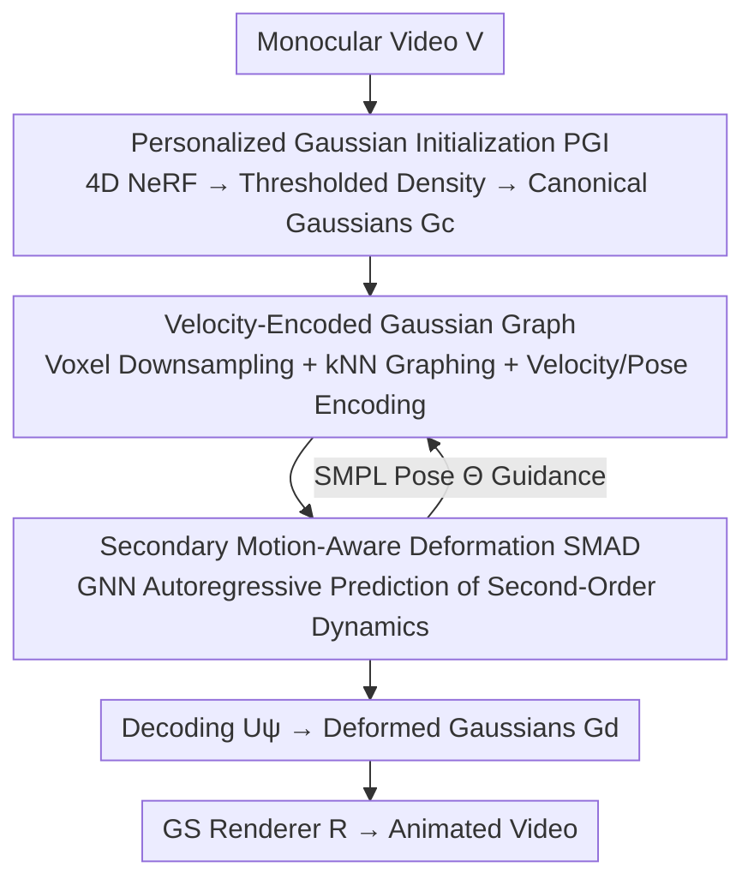

# SMAGA: Secondary Motion-Aware 3D Clothed Gaussian Avatars from Monocular Videos

**Conference**: ICLR 2026  
**OpenReview**: [https://openreview.net/forum?id=2A3Q2EtGTF](https://openreview.net/forum?id=2A3Q2EtGTF)  
**Code**: None  
**Area**: 3D Vision  
**Keywords**: 3D Gaussian Splatting, Animatable Human, Secondary Motion, Loose Clothing, Autoregressive Deformation

## TL;DR
Addressing the difficulty of 3DGS human avatars reconstructed from monocular videos to represent the flowing secondary motion of loose clothing (e.g., skirts), this paper proposes a two-stage framework: it first uses template-free personalized Gaussian initialization to align with clothed silhouettes, followed by a GNN deformer that structures Gaussians into a graph and autoregressively predicts second-order dynamics (mass-spring-damper). This generates realistic and temporally coherent clothing dynamics under single-view constraints.

## Background & Motivation
**Background**: 3D Gaussian Splatting (3DGS) has made reconstructing animatable human avatars from monocular videos both efficient and high-fidelity. The mainstream practice involves binding Gaussian primitives to a parametric skeletal template like SMPL and using Linear Blend Skinning (LBS) to drive Gaussian deformation according to the current pose.

**Limitations of Prior Work**: Such methods excel at reproducing **major motion** (joint movements of major body parts) but are helpless against **secondary motion** (time-varying clothing dynamics like the inertial fluttering of skirts or down jackets). Once driven to new poses unseen during training, loose clothing suffers from unrealistic tearing and needle artifacts.

**Key Challenge**: The authors attribute these failures to two points. First, existing deformations are **functions of the current pose** and calculated independently per frame, thus they are **unaware of temporal context**. Since secondary motion is inherently coupled with temporal continuity, this leads to spikes in motion error and misalignment with driving signals. Second, Gaussian initialization depends on a **naked body template**. The geometry assumed by the template severely mismatches the true shape of loose clothing. A small number of Gaussians must represent both the body and clothing far from the surface, which inevitably collapses under new poses.

**Goal**: To enable 3DGS avatars to both move and faithfully reproduce the secondary motion of loose clothing without any 3D ground-truth or prior geometry, given only monocular videos.

**Key Insight**: Since LBS and naked templates are the root causes, the approach **bypasses the template**—avoiding naked templates for initialization and avoiding predefined joint hierarchies for deformation. Instead, it models deformation via second-order dynamics, which physically closer resemble the evolution of real deformable systems.

**Core Idea**: Organize Gaussian points into a graph and utilize a GNN as a neural proxy for a mass-spring-damper system to **autoregressively predict structure-preserving second-order updates**. This yields template-free and temporally coherent clothing dynamics.

## Method

### Overall Architecture
Given a monocular RGB video $V=\{I_t\}_{t=1}^{T}$, the method represents the avatar as a set of 3D Gaussians $G^d_t=\{(\mu_{t,i},\Sigma_{t,i},c_{t,i},\alpha_{t,i})\}$ with a fixed count $N$ but parameters that update dynamically over time. These are projected into animated videos $\hat V=\{R(G^d_t)\}$ via a differentiable splatting renderer $R$. The pipeline is divided into two stages: **(1) Personalized Gaussian Initialization (PGI)**—training a deformable 4D NeRF to map observation points back to a canonical space, thresholding the time-averaged density $\bar\sigma(x)=\frac{1}{T}\sum_t\sigma(x,t)$, and clustering surviving voxels to obtain dense canonical Gaussians $G_c$, which cover both the body and loose clothing without relying on a naked template; **(2) Secondary Motion-Aware Deformation (SMAD)**—structuring voxel-downsampled $G_c$ into a "velocity-encoded Gaussian graph" $\Gamma$, where a message-passing GNN deformer autoregressively predicts second-order dynamics for each node, followed by a decoder $U_\psi$ to output deformed Gaussians $G^d$. SMPL pose sequences $\Theta$ provide motion descriptors to guide temporally coherent deformation.

### Key Designs

**1. Personalized Gaussian Initialization (PGI): Distilling Template-free Clothed Gaussians with 4D NeRF**

This step addresses the pain point where "naked templates do not match loose clothing." The authors no longer use a naked parametric model like SMPL for initial Gaussian placement. Instead, they first train a deformable neural radiance field (deformable NeRF) on the input monocular video to map each observation space point $x_t$ back to a unified canonical space (reference time). By querying color and density in the canonical space, they obtain a dense canonical density field that **represents both the body and loose clothing**. After training, the time-averaged density $\bar\sigma(x)=\frac{1}{T}\sum_t\sigma(x,t)$ is thresholded, and surviving voxels are clustered to obtain Gaussian centers $\{\mu^c_i\}$, with isotropic variances $\{\Sigma^c_i\}$ and colors $\{c^c_i\}$, forming the person-specific canonical Gaussians $G_c$. Since the initial geometry comes from the video itself rather than a naked prior, the Gaussians naturally distribute along the clothed contours, avoiding the collapse under new poses caused by "few Gaussians struggling to represent clothing."

**2. Velocity-Encoded Gaussian Graph: Structuring Gaussians and Injecting Second-Order Temporal States**

To decouple deformation from LBS while maintaining control as the Gaussian count grows, the authors organize Gaussians into a graph to approximate their interactions. First, voxel-grid downsampling reduces $N$ Gaussians to $M\ll N$ nodes $X\in\mathbb{R}^{M\times3}$ (these $M$ nodes are the final primitives for rendering). A graph $\Gamma=(X,A)$ is built using k-nearest neighbors based on pairwise distances $d(x_i,x_j)=\lVert x_i-x_j\rVert_2$, with adjacency elements $A_{ij}=\exp(-d(x_i,x_j)^2/\rho_a^2)$, where $\rho_a$ controls distance sensitivity. The key to node features $h_i$ is injecting **temporal states**: besides position $x_i$, the velocity $v_i(t)=\frac{x_i(t)-x_i(t-\Delta t)}{\Delta t}$ obtained via finite differences is concatenated. A buffer of the past $\tau_v$ velocity vectors $\bar v_i=\{v_i(t),\dots,v_i(t-\tau_v)\}$ is cached to capture long-range dependencies, and SMPL poses $\Theta_{t-\tau:t}$ within the time window are embedded via an MLP as $e_i$, resulting in $h_i=(x_i,\bar v_i,e_i)$. This "velocity encoding (VE)" allows the deformation to **perceive temporal context** and eliminates motion error spikes caused by frame-independent calculations.

**3. Secondary Motion-Aware Deformation (SMAD): GNN as a Neural Proxy for Second-Order Dynamics**

This is the core of the method, targeting the "LBS inability to represent inertially driven soft-body dynamics." The authors view each Gaussian node $i$ as a point mass $g_i$ whose motion follows a second-order mass-spring-damper system:

$$F^{ext}_i(t)=g_i\,\ddot x_i(t)+\gamma_i\,\dot x_i(t)+\sum_j k_{ij}\big(x_i(t)-x_j(t)-L^{rest}_{ij}\big)$$

where $\gamma_i$ is damping, $k_{ij}$ is the spring stiffness between nodes, and $L^{rest}_{ij}$ is the rest offset in canonical space. Discretized via explicit Euler integration, $v_i(t+\Delta t)$ and $x_i(t+\Delta t)$ can be derived from acceleration $a_i(t)$. This second-order form naturally induces secondary motions like skirt fluttering. In practice, instead of specifying forces explicitly, a message-passing GNN **learns** these updates: message $m_{j\to i}(t)=M_\theta(h_i,h_j)$, aggregation $m^{agg}_i=\sum_j A_{ij}m_{j\to i}$, node feature updates via $F_\theta$, and acceleration $a_i(t)$ output by $G_\theta$—the neural proxy for the dynamics update. Finally, node positions are assigned to Gaussian means $\mu_i\leftarrow x_i(t+\Delta t)$, while color, opacity, and covariance are decoded by $U_\psi(z_i,h^\ell_i)$ ($z_i$ being a learnable latent code). Compared to frame-wise LBS, this autoregressive graph deformation maintains structural consistency and extrapolates stable clothing dynamics for new poses.

### Loss & Training
The total SMAD loss is $\mathcal{L}_{SMAD}=\mathcal{L}_{RGB}+\lambda_{iso}\mathcal{L}_{iso}+\lambda_{damp}\mathcal{L}_{damp}$. The primary term is the L1 photometric loss $\mathcal{L}_{RGB}=\lVert R(G^d_t)-I_t\rVert_1$. Two regularization terms manage "shape" and "stability": the isometric loss $\mathcal{L}_{iso}=\sum_{(i,j)\in E}(\lVert x_i-x_j\rVert_2-L^{rest}_{ij})^2$ penalizes geodesic distance shifts to maintain local surface area, preventing clothing regions from being stretched or shrunk ($\lambda_{iso}=0.1$ emphasizes length maintenance); the damping loss $\mathcal{L}_{damp}=\sum_i\sum_t\lVert v_i(t)\rVert_2^2$ constrains velocity magnitude to suppress high-frequency jitter and dynamic instability, reducing visual flickering at cloth edges ($\lambda_{damp}=0.01$ to avoid over-constraining dynamic details).

## Key Experimental Results

### Main Results
Evaluations were performed on 4D-Dress (5 selected subjects in loose clothing), ZJU-MoCap (novel view synthesis), and the authors' in-the-wild **LoCo-Human** (5 loose-clothed humans, 5 dynamic + 1 static sequence each). Comparison against 3DGS-based monocular avatar methods (GART, Gaussian Avatar, 3DGS-Avatar, ExAvatar) used PSNR / SSIM / LPIPS, with motion error added to measure temporal consistency with driving signals.

| Dataset (Subject) | Metric | Ours | Prev. Best Baseline |
|------|------|------|----------|
| 4D-Dress 00148 (New Pose) | PSNR↑ | 24.74 | 22.79 (3DGS-Avatar) |
| 4D-Dress 00185 (New Pose) | PSNR↑ / LPIPS↓ | 29.98 / 0.0370 | 28.35 / 0.0470 (ExAvatar) |
| ZJU-MoCap 394 (New View) | PSNR↑ | 30.89 | 30.54 (3DGS-Avatar) |
| LoCo-Human S01 (In-the-wild) | PSNR↑ / LPIPS↓ | 26.17 / 0.0423 | 24.82 / 0.0489 (ExAvatar) |

The most significant gains occurred in 4D-Dress and LoCo-Human with loose clothing and dynamic motion (PSNR typically +1.3~2.0), qualitatively eliminating tearing artifacts common in baselines. Improvement on ZJU-MoCap was more modest due to limited pose diversity and tighter clothing.

### Ablation Study

| Configuration | PSNR↑ | LPIPS↓ | Description |
|------|------|---------|------|
| A0: Base (Vanilla GNN + Pose Deformation) | 25.21 | 0.058 | No physical information |
| A1: + Physical Finite Diff. Reg. | 26.05 | 0.052 | +0.84 PSNR, −10.3% LPIPS |
| A2: + Adaptive Spring Stiffness $k_{ij}$ | 26.44 | 0.049 | Unsupervised rigid/non-rigid parts |
| A3: + Message Passing (Edge Feat.) | 27.12 | 0.044 | +0.68 PSNR, −10.2% LPIPS |
| A4: Full (+ Latent Code) | 27.89 | 0.040 | +2.68 PSNR, −31.0% LPIPS vs A0 |
| B0: w/o VE | 22.06 | 0.067 | No Velocity Encoding |
| B4: $\tau_v=11$ (Ours) | 27.89 | 0.040 | +5.83 PSNR, −40.3% LPIPS vs B0 |
| C0: w/o SMAD | 24.29 | 0.059 | No Graph Deformation |
| C4: $M=40\text{k}$ (Ours) | 27.89 | 0.040 | +3.60 PSNR, −32.2% LPIPS vs C0 |

### Key Findings
- **Velocity Encoding (VE) is the largest contributor**: PSNR drops by 5.83 without VE, making it the most impactful component. It reduces motion error spikes by approximately 35.5%, confirming that temporal context is critical for secondary motion modeling.
- **Node Capacity $M$ has a sweet spot**: $M<10\text{k}$ under-represents non-rigid dynamics, while $M=100\text{k}$ performs worse than $M=40\text{k}$ due to optimization difficulties and overfitting, suggesting capacity is not "the more the better."
- **Velocity Window $\tau_v$ has a sweet spot**: $\tau_v=1$ yields limited gains, while over-lengthy windows saturate. $\tau_v=11$ achieves the best balance between temporal context and feature efficiency.
- **GNN outperforms MLP deformers**: In controlled experiments, an MLP-based autoregressive deformer fits training motions but degrades significantly on unseen motions. The GNN is more stable and generalizes better due to its graph structure prior. Extrapolation across train/test/OOD sequences (PSNR 28.64 / 27.89 / 26.51) shows gradual degradation, proving that second-order states $(x_t,v_t)$ provide a physically plausible motion representation.

## Highlights & Insights
- **Embedding "Physical Intuition" into GNN**: Using a second-order mass-spring-damper system as the inductive bias for the deformer and letting the GNN act as its neural proxy avoids explicit ODE solving (saving computation) while being closer to real deformable system evolution than pure pose-conditioned deformation. This is the root cause of successful extrapolation to new poses.
- **Template-free Initialization is Undervalued**: Distilling canonical Gaussians with 4D NeRF bypasses the geometric assumptions of naked templates. This ensures Gaussians in loose clothing regions are "placed correctly," making downstream deformation meaningful. PGI and SMAD are complementary pillars.
- **The VE Trick is Transferable**: Using finite difference velocity + history buffers as node features essentially injects second-order temporal states into any point/graph-based dynamic reconstruction. This can be transferred to other deformable objects requiring temporal coherence (e.g., hair, fabric).
- **LoCo-Human Fills a Benchmark Gap**: Existing datasets often lack loose clothing combined with large-scale dynamics. The self-built in-the-wild dataset allows the first quantitative evaluation of the overlooked "secondary motion" capability.

## Limitations & Future Work
- **Subject-specific Training**: Both the PGI's 4D NeRF and SMAD are person-specific, requiring individual training for each subject without cross-identity generalization or fast adaptation.
- **Sensitivity of Capacity and Stability**: Optimal values for node count $M$ and velocity window $\tau_v$ are quite specific, with performance degrading if they are too large. This suggests a need for per-motion hyperparameter tuning and limited robustness.
- **Physical Simplification**: The mass-spring-damper system is a highly simplified model of real cloth dynamics. It may be insufficient for extremely flowing fabrics, self-collisions, or multi-layered clothing; explicit collision handling was not introduced.
- **Future Directions**: Exploring cross-identity deformation priors (amortized PGI), introducing lightweight collision constraints, or extending second-order states to higher orders/learned integration for enhanced stability under extreme dynamics.

## Related Work & Insights
- **vs. Template + LBS 3DGS Avatars (GART / 3DGS-Avatar / ExAvatar / Gaussian Avatar)**: These bind Gaussians to skeletons and drive them frame-by-frame via joints. They excel at major motion but lack temporal context and are geometrically constrained by naked templates. Ours uses template-free initialization + graph autoregressive second-order deformation to focus on the overlooked secondary motion of loose clothing, achieving stability even in single-view scenarios.
- **vs. Physics Simulation-based Cloth Modeling**: Numerical ODE solvers are precise but computationally expensive, difficult to parameterize, and usually require mesh-based inputs or high-level supervision like 4D scans/cloth-body segmentation. Ours uses only monocular video and approximates second-order dynamics via GNN on Gaussian primitives without any 3D ground-truth or prior geometry.
- **vs. MLP Autoregressive Deformers (e.g., Zheng et al. 2021)**: While also using position + encoded velocity, MLPs degrade significantly on unseen actions. The graph structure in our method provides stronger structural priors and generalization, proving more stable in ablations.

## Rating
- Novelty: ⭐⭐⭐⭐⭐ Combining second-order mass-spring-damper physics, graph autoregression, and template-free initialization for monocular loose-clothed avatars is a fresh approach for addressing the neglected secondary motion.
- Experimental Thoroughness: ⭐⭐⭐⭐ Uses three datasets (including in-the-wild) and multi-dimensional ablations (VE/capacity/architecture/OOD), though lacks open-source code and direct comparison with physics simulation methods.
- Writing Quality: ⭐⭐⭐⭐ Motivation and methodology are logically clear with complete formulas; a few expressions and symbols have minor flaws.
- Value: ⭐⭐⭐⭐ Enables monocular 3DGS avatars to represent loose clothing dynamics effectively for the first time, which is significant for VR, telepresence, and digital humans.

<!-- RELATED:START -->

## Related Papers

- [\[CVPR 2026\] Motion-Aware Animatable Gaussian Avatars Deblurring](../../CVPR2026/3d_vision/motion-aware_animatable_gaussian_avatars_deblurring.md)
- [\[ICLR 2026\] FastGHA: Generalized Few-Shot 3D Gaussian Head Avatars with Real-Time Animation](fastgha_generalized_few-shot_3d_gaussian_head_avatars_with_real-time_animation.md)
- [\[NeurIPS 2025\] Dynamic Gaussian Splatting from Defocused and Motion-blurred Monocular Videos](../../NeurIPS2025/3d_vision/dynamic_gaussian_splatting_from_defocused_and_motion-blurred_monocular_videos.md)
- [\[ICLR 2026\] Mono4DGS-HDR: High Dynamic Range 4D Gaussian Splatting from Alternating-exposure Monocular Videos](mono4dgs-hdr_high_dynamic_range_4d_gaussian_splatting_from_alternating-exposure_.md)
- [\[ICLR 2026\] Gradient-Direction-Aware Density Control for 3D Gaussian Splatting](gradient-direction-aware_density_control_for_3d_gaussian_splatting.md)

<!-- RELATED:END -->
