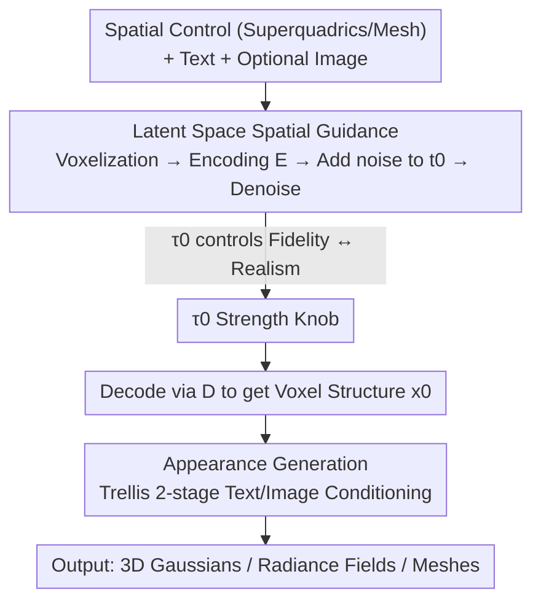

# SpaceControl: Introducing Test-Time Spatial Control to 3D Generative Modeling

**Conference**: ICLR 2026  
**OpenReview**: [https://openreview.net/forum?id=mEqsCVI5sN](https://openreview.net/forum?id=mEqsCVI5sN)  
**Paper**: [Project Page](https://spacecontrol3d.github.io/)  
**Code**: https://spacecontrol3d.github.io/ (Publicly available on project page)  
**Area**: 3D Vision / Diffusion Models  
**Keywords**: 3D Generation, Spatial Control, Training-free Guidance, rectified flow, superquadrics

## TL;DR
SpaceControl proposes a **training-free** test-time method that voxelizes user-provided 3D geometry (from coarse superquadrics to fine meshes) and encodes it into the latent space of a pre-trained 3D generative model (Trellis). By utilizing an SDEdit-style "add noise to $t_0$ then denoise" mechanism to inject spatial guidance and a single parameter $\tau_0$ to smoothly adjust "geometric fidelity ↔ generative realism," it significantly outperforms training-based and optimization-based baselines in geometric alignment (Chamfer distance) without any parameter fine-tuning.

## Background & Motivation
**Background**: Recent progress in 3D asset generation (e.g., Trellis, SAM 3D) has enabled the creation of high-quality meshes/Gaussians. However, controllability—allowing users to reliably guide generation toward a desired shape—remains a challenge. Existing controllable solutions mostly rely on **text** or **image** conditions.

**Limitations of Prior Work**: Text is flexible but semantically vague, failing to precisely specify geometry (e.g., "a chair" cannot specify the backrest angle or armrest position). While images provide more structural constraints, they are difficult to edit and unintuitive for fine-grained control. Neither modality allows artists to **directly manipulate the object geometry**.

**Key Challenge**: Existing "spatially controllable 3D generation" approaches are either **training-based** (e.g., Spice-E fine-tuning Shap-E for cuboid conditions, LION using voxel conditions), which maintain inference speed but require category-level fine-tuning, generalize poorly, and lack adjustable control strength; or **guidance/optimization-based** (e.g., Latent-NeRF, Coin3D), which require no retraining but necessitate long test-time optimizations per sample and often indirectly constrain geometry by projecting 3D conditions onto multi-view 2D planes.

**Goal**: Move the control to the **3D space itself**—using 3D geometry as a "3D sketch" to directly guide the synthesis of detailed 3D assets. The method should be training-free, operate directly on 3D volumes, and offer adjustable control strength.

**Key Insight**: The authors observe that modern 3D generative models (Trellis) use **rectified flow** and decouple **geometric structure and appearance** into a two-stage process. The structure stage includes a pre-trained encoder $E$ that is typically unused during standard inference. This provides an entry point to map spatial conditions into a **shared latent space**.

**Core Idea**: Adapt the SDEdit concept from image editing to 3D—**use $E$ to encode voxelized geometry into latent variables, add noise to an intermediate time $t_0$, and then denoise using the original model**. Without any architectural changes or training, the generation is guided to form around the provided geometry; the magnitude of $t_0$ (represented as $\tau_0$) serves as the fidelity knob.

## Method

### Overall Architecture
SpaceControl is built on top of the pre-trained Trellis (rectified flow + structure/appearance stages). The input consists of "spatial control (superquadrics or meshes) + text prompts + optional images," and the output is a high-quality 3D asset aligned with the geometry (decodable into 3D Gaussians / Radiance Fields / Meshes). The pipeline involves two steps: the **structure generation** stage injects spatial conditions into the latent space to guide the coarse geometry, while the **appearance generation** stage applies textures to the generated geometry guided by text/images. Crucially, spatial guidance is only injected via the "add noise—denoise" mechanism during the structure stage, leaving model weights untouched.

### Key Designs

**1. Latent Space Spatial Guidance: Using Geometry as a "3D Sketch" for Noise Injection**

Addressing the limitations of methods that require fine-tuning or 2D projections, SpaceControl performs SDEdit-style interventions directly in the 3D latent space with zero training. Given a user-specified 3D geometry, it is first voxelized into $x_c \in \{0,1\}^{64\times64\times64}$ and fed into the Trellis pre-trained encoder $E$ to obtain clean latent variables $z_{c,0} \in \mathbb{R}^{16\times16\times16\times8}$. Following the forward (noising) formula of rectified flow, it is noised to time $t_0$:

$$z_{t_0} = t_0 z_1 + (1-t_0) z_{c,0}, \quad z_1 \sim \mathcal{N}(0, I)$$

Iterative denoising starts from $t_0$ using the **original Structure Flow Model** (velocity field $v_\theta$, update rule $z_{t(i+1)} = z_{t(i)} - v_\theta(z_{t(i)}, t(i))(t(i)-t(i+1))$) to obtain $z_0$, which is then restored by decoder $D$ to the final voxel structure $x_0$. This requires no architectural changes because $z_{t_0}$ already "carries" information about the user geometry, and the model's denoising naturally pulls the generation toward it. Text prompts are used simultaneously to resolve semantic ambiguities (e.g., defining if the geometry is a chair or a table). Unlike Spice-E, which requires category-specific fine-tuning, this approach works with different backbones and geometry types without retraining, even for unseen Toys4K categories.

**2. $\tau_0$ Strength Knob: Smooth Trade-off via Single Parameter**

Addressing the inability of existing spatial conditioning methods to adjust control strength, SpaceControl treats the noise time $t_0$ (corresponding to discrete step $\tau_0$) as a user-adjustable knob. A smaller $\tau_0$ initializes $z_{t_0}$ closer to pure noise $z_1$ and further from the control signal $z_{c,0}$, requiring more denoising steps and resulting in an output closer to the original Trellis distribution—**more realistic but less faithful**. A larger $\tau_0$ biases $z_{t_0}$ toward $z_{c,0}$, skipping early denoising steps to preserve more injected spatial structure—**more faithful but occasionally sacrificing realism**. Time steps are re-calibrated via a scaling factor $\lambda$ as $t(\tau) = \lambda t(\tau) / (1+(\lambda-1)t(\tau))$. Experiments show $\tau_0 \in [4,6]$ is generally a good balance for Toys4K. This continuous interpolation capability is inherent to this approach and unavailable in training-based methods.

**3. Mechanism: Decoupled Stages and Multi-modal Conditioning**

SpaceControl's ability to manipulate geometry without affecting appearance stems from its parasitic integration into the **decoupled structure/appearance** design of Trellis. The first stage (structure) generates a binary occupancy grid $x \in \{0,1\}^{64\times64\times64}$, where spatial guidance is injected. The second stage (appearance) expands activated voxels into point-wise noisy latent features $s_1 \in \mathbb{R}^{L\times8}$, denoises them with the Appearance Flow Model, and decodes them via $D_{GS}/D_{RF}/D_M$. Text conditions (CLIP text encoding) are used in both stages, while image conditions (DINOv2 encoding) are only used in the appearance stage. Thus, **images primarily affect texture and barely touch geometry**, allowing SpaceControl to support "2D image to 3D shape style transfer" and maintaining visual consistency during object editing.

## Key Experimental Results

### Main Results
Evaluated under two types of spatial conditions (coarse superquadrics vs. fine meshes) across ShapeNet (chair/table categories seen by Spice-E) and Toys4K (unseen by all). Metrics: CD (Chamfer Distance, lower is more faithful), CLIP-I (text alignment), FID (texture realism), P-FID (geometric realism). Ours uses $\tau_0=6$.

| Condition / Dataset | Method | CD↓ | CLIP-I↑ | FID↓ | P-FID↓ |
|------|------|------|---------|------|--------|
| Superquadric · Toys4K | Coin3D | 54.4 | 0.21 | 231 | 102.0 |
| Superquadric · Toys4K | Spice-E† | 65.9 | 0.29 | 233 | 66.52 |
| Superquadric · Toys4K | SPICE-E-T† | 39.1 | 0.32 | 223 | 53.51 |
| Superquadric · Toys4K | **Ours** | **14.0** | 0.32 | 221 | 81.3 |
| Superquadric · Chair | **Ours** | **0.98** | 0.30 | 146 | 34.06 |
| Mesh · Toys4K | SPICE-E-T† | 23.3 | 0.32 | 222 | 90.99 |
| Mesh · Toys4K | **Ours** | **4.89** | 0.29 | 244 | 72.47 |
| Mesh · Table | **Ours** | **0.48** | 0.28 | 130 | 42.33 |

† denotes fine-tuned on chair/table categories. **Ours leads significantly in CD across all settings** while maintaining CLIP-I/FID/P-FID competitive with the best baselines—achieving high fidelity without compromising realism. Training-based baselines degrade on unseen Toys4K data, whereas Ours does not.

### Ablation Study
Scanning $\tau_0$ (P=Superquadric, M=Mesh, Toys4K data):

| $\tau_0$ | CD↓ (P) | CD↓ (M) | FID↓ (P) | P-FID↓ (M) | Description |
|------|---------|---------|----------|------------|------|
| 0 | 117 | 75.4 | 217 | 79.4 | Nearly no control (Vanilla Trellis) |
| 2 | 110 | 65.5 | 216 | 82.7 | Weak control |
| 4 | 56.8 | 32.4 | 222 | 83.9 | Visible alignment begins |
| 6 | 14.0 | 4.89 | 221 | 72.5 | Large Gain in fidelity, good realism |
| 8 | 9.04 | 1.57 | 257 | 77.0 | High fidelity, FID starts rising (lower realism) |
| 10 | 8.85 | 1.84 | 268 | 74.9 | Maximum fidelity, but texture realism degrades |

### Key Findings
- **$\tau_0$ Monotonic Trade-off**: As $\tau_0$ increases, CD continues to drop (more faithful), but FID begins to rise after $\tau_0>6$. $[4,6]$ is the sweet spot.
- **Training-free Stability**: Training-based methods often generate artifacts like "two-headed cows" or fail to maintain specific poses. Ours strictly follows the 3D volume constraints and maintains quality even for non-axis-aligned rotations.
- **User Study**: 52 volunteers preferred Ours over Spice-E / SPICE-E-T in overall preference, fidelity, and realism (e.g., 85% win rate over Spice-E).
- **Image Conditioning**: Images only enter the appearance stage, essentially providing "2D to 3D style transfer" while the geometry is strictly controlled by spatial inputs.

## Highlights & Insights
- **Porting SDEdit to 3D Latent Space**: The core insight is that modern 3D models have an encoder $E$ that is idle during inference, which serves as a zero-training entry point for spatial conditions.
- **Continuous Control via Scalar**: Reusing the rectified flow noise time as a fidelity knob provides continuous interpolation that training-based methods naturally lack.
- **Decoupled leverage**: By targeting the geometry-specific stage, spatial control is achieved without polluting the text/image-driven texture generation.
- **Interactive Potential**: The real-time superquadric editing interface demonstrates strong practical utility for asset creation workflows.

## Limitations & Future Work
- **Manual $\tau_0$ Tuning**: The fidelity knob currently requires user selection; future work could explore adaptive $\tau_0$ scheduling.
- **Lack of Local Control**: $\tau_0$ is currently global. Part-aware local control is a future direction.
- **Base Model Dependency**: Quality and resolution are limited by Trellis (e.g., $64^3$ voxel grid may lose fine structures).
- **Scene-level Validation**: While technically extensible to multi-object scenes, the paper primarily verifies single-object cases.

## Related Work & Insights
- **vs Spice-E / SPICE-E-T**: Spice-E (training-based) requires category fine-tuning and generalizes poorly. SpaceControl is training-free, works with any geometry type, and offers adjustable strength.
- **vs Coin3D / Latent-NeRF**: These optimization-based methods are slow and rely on indirect 2D projections. Ours performs direct 3D latent denoising, which is faster and more precise.
- **vs SDEdit (2D)**: SpaceControl is the 3D analog, using 3D geometry instead of 2D strokes as the initialization for guided generation.

## Rating
- Novelty: ⭐⭐⭐⭐ Transparently adapting SDEdit to 3D latent space with an adjustable knob is simple yet effective.
- Experimental Thoroughness: ⭐⭐⭐⭐ Comprehensive comparison across datasets, conditions, and human studies.
- Writing Quality: ⭐⭐⭐⭐ Clear preliminaries and concise methodology.
- Value: ⭐⭐⭐⭐ High practical value for 3D creation due to its plug-and-play and interactive nature.

<!-- RELATED:START -->

## Related Papers

- [\[ICLR 2026\] TTT3R: 3D Reconstruction as Test-Time Training](ttt3r_3d_reconstruction_as_test-time_training.md)
- [\[ICLR 2026\] GOOD: Geometry-guided Out-of-Distribution Modeling for Open-set Test-time Adaptation in Point Cloud Semantic Segmentation](good_geometry-guided_out-of-distribution_modeling_for_open-set_test-time_adaptat.md)
- [\[ICLR 2026\] Test-Time Optimization of 3D Point Cloud LLM via Manifold-Aware In-Context Guidance and Refinement](test-time_optimization_of_3d_point_cloud_llm_via_manifold-aware_in-context_guida.md)
- [\[CVPR 2026\] Learning 3D Reconstruction with Priors in Test Time](../../CVPR2026/3d_vision/tco_learning_3d_reconstruction_with_priors_in_test_time.md)
- [\[CVPR 2026\] ZipMap: Linear-Time Stateful 3D Reconstruction via Test-Time Training](../../CVPR2026/3d_vision/zipmap_linear-time_stateful_3d_reconstruction_via_test-time_training.md)

<!-- RELATED:END -->
## Related Papers

- [\[ICLR 2026\] TTT3R: 3D Reconstruction as Test-Time Training](ttt3r_3d_reconstruction_as_test-time_training.md)
- [\[ICLR 2026\] GOOD: Geometry-guided Out-of-Distribution Modeling for Open-set Test-time Adaptation in Point Cloud Semantic Segmentation](good_geometry-guided_out-of-distribution_modeling_for_open-set_test-time_adaptat.md)
- [\[ICLR 2026\] Test-Time Optimization of 3D Point Cloud LLM via Manifold-Aware In-Context Guidance and Refinement](test-time_optimization_of_3d_point_cloud_llm_via_manifold-aware_in-context_guida.md)
- [\[CVPR 2026\] Learning 3D Reconstruction with Priors in Test Time](../../CVPR2026/3d_vision/tco_learning_3d_reconstruction_with_priors_in_test_time.md)
- [\[CVPR 2026\] ZipMap: Linear-Time Stateful 3D Reconstruction via Test-Time Training](../../CVPR2026/3d_vision/zipmap_linear-time_stateful_3d_reconstruction_via_test-time_training.md)

<!-- RELATED:END -->
