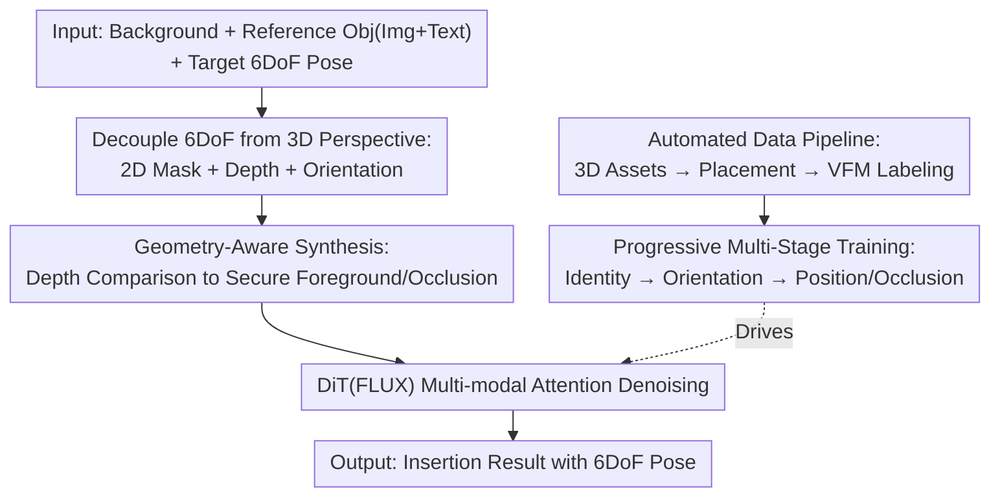

# SpatialHand: Generative Object Manipulation from 3D Perspective

**Conference**: ICLR 2026  
**OpenReview**: [https://openreview.net/forum?id=VpsqfCac2B](https://openreview.net/forum?id=VpsqfCac2B)  
**Project Page**: [https://spatialhand.github.io/](https://spatialhand.github.io/)  
**Code**: See project page  
**Area**: 3D Vision / Diffusion Models / Image Editing  
**Keywords**: Object Insertion, 6DoF Pose, Depth Conditioning, Orientation Control, Occlusion Relationships

## TL;DR
SpatialHand elevates generative object insertion from the 2D image plane to a "3D perspective." By decoupling 6DoF poses into three conditional streams—2D position (mask), depth (depth map), and 3D orientation (latent embedding)—and feeding them into a FLUX diffusion Transformer, paired with an automated synthetic data pipeline and progressive multi-stage training, it achieves precise 3D localization, arbitrary rotation, and correct occlusion control for inserted objects.

## Background & Motivation
**Background**: Generative object insertion and movement (e.g., Paint-by-Example, AnyDoor, UniReal, ObjectMover) can already place objects into images with high identity preservation and environmental blending. These methods primarily utilize inpainting: given a scene image with a mask and a reference object, the diffusion model generates the object within the masked area.

**Limitations of Prior Work**: These methods are confined to the **2D plane**. A simple 2D mask cannot determine the precise position of an object in real 3D space, leading to significant ambiguity—summarized into two categories (see Fig. 2): ① **Position Ambiguity**: Should the inserted object be in front of or behind existing objects? Masks lack depth information, leaving occlusions to model guesswork. ② **Orientation Ambiguity**: Which direction should the object face? 2D conditions provide no orientation information.

**Key Challenge**: To achieve truly controllable AR/VR-style object manipulation, one must specify complete 6DoF poses (3D position + 3D orientation) to ensure spatial alignment and correct occlusion. Current 3D-aware editing (e.g., Object-3DIT, Diffusion Handles, Image Sculpting) follows an explicit route: "convert to point cloud/mesh → edit in 3D → project back." This approach is technically complex, high-latency, and suffers from the **inability to capture the back side** of objects from monocular point clouds, causing failures in large-angle rotations and occlusion reconstruction. Thus, a trade-off exists: either simple 2D without 3D control, or explicit 3D that is precise but heavy and fragile.

**Goal**: Enable a one-stage image generation model to natively understand and follow 6DoF pose conditions without introducing explicit 3D reconstruction, achieving precise 3D localization, arbitrary rotation, and correct occlusion.

**Key Insight**: The authors observe that while it is difficult for diffusion models to directly understand "3D coordinates," they **follow 2D masks and depth maps very well**. Therefore, instead of forcing 3D coordinates, 3D positions are represented **implicitly** as a combination of "2D position + depth," while orientation is separately encoded into the latent space.

**Core Idea**: Decouple 6DoF poses into 2D positions (masked images), depth (composited depth maps), and 3D orientation (MLP projection added to latents). By using modalities the model already excels at to carry 3D information, spatial conditions are encoded implicitly and naturally, bypassing the need for explicit 3D reconstruction.

## Method

### Overall Architecture
SpatialHand uses the open-source text-to-image model **FLUX-Dev.1** (MM-DiT structure) as a base, transforming it into an object insertion model supporting 6DoF pose conditions. The core involves decomposing the task of "precisely placing an object" into three conditional streams. Given a background, a reference object (image + text), and a target 6DoF pose, the method decouples the pose into **2D position (geometry-aware masked image), depth (composited depth map), and 3D orientation (azimuth/elevation/in-plane parameters via MLP embedding)**. These are concatenated with noise tokens and reference object tokens into a long sequence and sent to the DiT for global interaction and denoising via multi-modal attention.

Due to a lack of paired "object-image-pose" data, an offline **automated data construction pipeline** is used (synthetic 3D assets → simulated placement → VFM-based pose labeling) to produce 370k training pairs. This is followed by **progressive multi-stage training** to teach the model identity preservation, orientation following, and finally position/occlusion control.

### Key Designs

**1. Decoupling 6DoF Pose Conditions from a 3D Perspective: Replacing raw 3D coordinates with mask+depth+orientation**

This design directly addresses the ambiguity where "2D masks lack 3D position and orientation." Instead of making the model understand 3D coordinates, 6DoF is split into three conditions the model is already adept at following. For **3D position**, Depth Anything predicts the scene depth map, and the depth values in the mask area are modified to the target insertion depth. Thus, the 2D mask manages "where on the plane" and the depth map manages "how deep," together defining the 3D position. For **3D orientation**, the parameters azimuth $\varphi$, elevation $\theta$, and in-plane rotation $\delta$ (following Orient Anything) describe the **absolute orientation** relative to a canonical front. A **zero-initialized MLP** projector $P(\cdot)$ maps these three parameters to the latent dimension, which is added to the reference object condition. The final input sequence is $[X,\ \tilde{C}_{mask},\ \tilde{C}_{depth},\ C_{obj}+P([\varphi,\theta,\delta])]$, where $X$ represents noise tokens. Unlike previous novel view synthesis methods relying on "relative rotation," using absolute orientation allows precise, text-independent direction control.

**2. Geometry-Aware Synthesis: Handling occlusion via depth comparison rather than guesswork**

With only a masked scene and a reference object, the model does not know which existing objects should occlude the inserted one. This design compares the scene depth map with the target insertion depth to **identify foreground objects that should remain visible**—objects shallower than the insertion point. These objects are **preserved** in both the masked scene image and the depth map, forcing correct occlusion where "foreground objects stay in front." This produces geometry-aware masked images $\tilde{C}_{mask}$ and depth maps $\tilde{C}_{depth}$. This step ensures the inserted object "slides behind" existing ones naturally, maintaining both occlusion and identity.

**3. Automated Training Data Pipeline: Synthetic 3D assets + Rendering/Generation + VFM labeling**

Paired "object-image-6DoF" triplets are rare in reality. The authors designed a three-step pipeline to simulate "placing objects in 3D space": **① 3D Asset Synthesis**: Using Hunyuan-3D 2.0 to generate 43k high-quality 3D meshes from common categories, rendering 20 random views per mesh for visual conditions and using Qwen-2.5-VL for captions. **② Placement Simulation**: Two routes—Blender simulation for perfect identity but lower diversity, and UNO/ChatGPT-4o for realistic diversity with slightly weaker consistency. **③ 3D Information Annotation**: Grounding-DINO + SAM provide 2D positions, Depth Anything provides depth, and Orient Anything provides 3D orientation. After filtering via DINO similarity and confidence scores, **370k high-fidelity training pairs** are obtained.

**4. Progressive Multi-Stage Training: Incrementally adding constraints from identity to orientation and position**

Simultaneously following object identity, 2D mask, depth, and 3D orientation is complex. Training is split into three stages: **Stage 0 Identity Preservation Pre-training**: Initialized with pre-trained FLUX-1 dev + UNO subject-driven LoRA. **Stage 1 Novel View Synthesis Fine-tuning**: Uses two renderings of the same 3D object as reference and target, guided by Orient Anything orientations, to teach the model to understand 3D rotation (60k steps). **Stage 2 3D-aware Insertion Fine-tuning**: Trains on the full dataset to insert objects into scenes at specified poses while preserving backgrounds (20k steps). Both stages use rank 512 LoRA. Ablations show skipping Stage 1 causes orientation accuracy (Acc@30°) to drop from 52.0 to 28.7, proving the necessity of the "learn orientation then placement" approach.

## Key Experimental Results

### Main Results
The benchmark consists of 20 scene images and 20 high-quality Objaverse objects, forming 1,600 test samples. Metrics include DINO/CLIP for identity/semantic consistency, AbsRel↓ for depth precision, and Acc@30°↑ for orientation accuracy.

3D-aware object insertion (Visual + Text conditions, Table 1):

| Method | DINO↑ | AbsRel↓ | Acc@30°↑ | Adherence↑ (Subj.) |
| :--- | :--- | :--- | :--- | :--- |
| Gemini-2.0-Flash | 81.2 | 33.2 | 16.0 | 2.10 |
| GPT-4o | 80.5 | 38.6 | 20.2 | 2.67 |
| Nano Banana | 80.9 | 32.1 | 17.5 | 2.25 |
| **Ours (SpatialHand)** | **81.7** | **19.8** | **52.0** | **4.27** |

Even GPT-4o fails to maintain spatial states via text instructions alone, highlighting the necessity of dedicated 3D conditions.

3D-aware object movement (Table 2):

| Task | Metric | Object3DiT | Diffusion Handles | GPT-4o | **Ours** |
| :--- | :--- | :--- | :--- | :--- | :--- |
| Rotation | Acc@30°↑ | 31.4 | 20.7 | 19.5 | **47.8** |
| Translation | mIoU↑ / AbsRel↓ | 0.45 / 35.4 | 0.28 / 20.7 | 0.24 / 38.2 | **0.72 / 17.9** |
| Occlusion | VLM-Acc↑ | 55.2 | 49.7 | 59.5 | **82.6** |

SpatialHand significantly outperforms explicit point-cloud methods (Diffusion Handles), especially in occlusion accuracy (82.6).

### Ablation Study
3D-aware insertion ablation (Table 3):

| Configuration | DINO↑ | AbsRel↓ | Acc@30°↑ | Description |
| :--- | :--- | :--- | :--- | :--- |
| Full Model | 81.7 | 19.8 | 52.0 | Complete |
| Visual condition only | 78.8 | 18.5 | 46.8 | Identity drops (DINO −2.9) |
| w/o Geo-aware synthesis | 80.2 | 25.5 | 48.8 | Depth error rises (AbsRel +5.7) |
| w/o Stage 1 (Stage 2 only) | 79.8 | 18.2 | 28.7 | Orientation accuracy plunges |

### Key Findings
- **Stage 1 is critical**: Removing novel view fine-tuning drops orientation accuracy significantly, proving orientation understanding must be learned before placement.
- **Geo-aware synthesis improves depth**: It helps the model resolve depth relationships and foreground occlusion.
- **Text captions help identity**: VLM-generated captions aid identity preservation, providing a useful complement to visual features.

## Highlights & Insights
- **"Native Modalities for 3D"**: Instead of raw 3D coordinates, using masks and depth maps communicates 3D intent in the model's "native language," avoiding the overhead of explicit reconstruction.
- **Occlusion by Calculation**: Geometry-aware synthesis changes occlusion from "guessing" to "calculating" via depth comparison, a lightweight yet effective design for spatial relations.
- **Decomposed Human-like Placement**: The data pipeline breaks "placing an object" into scalable, automated steps, providing a blueprint for other tasks lacking paired data.

## Limitations & Future Work
- **Dependency on VFMs**: Accuracy is capped by the performance of Depth Anything, Orient Anything, etc.
- **Synthetic Gap**: Training on synthetic assets rendered in simulated scenes may not fully generalize to all complex real-world lighting or materials.
- **Discrete Movement**: Object movement is implemented via "delete + re-insert" rather than end-to-end continuous motion.
- Symmetric objects or those without a clear "front" may still pose challenges for orientation labeling and control.

## Related Work & Insights
- **vs. Paint-by-Example / AnyDoor**: These focus on identity preservation in 2D but cannot resolve 3D position/orientation ambiguities. SpatialHand adds these dimensions.
- **vs. Object-3DIT / Diffusion Handles**: These use explicit 3D chains (point clouds/meshes) which suffer from high latency and occlusion holes. SpatialHand uses implicit 3D guidance in a one-stage model for simplified, more robust editing.

## Rating
- **Novelty**: ⭐⭐⭐⭐⭐ (Elegant decoupling of 6DoF into model-native modalities).
- **Experimental Thoroughness**: ⭐⭐⭐⭐ (Solid insertion/movement tasks; base benchmark is relatively small).
- **Writing Quality**: ⭐⭐⭐⭐ (Clear motivation and intuitive pipeline illustrations).
- **Value**: ⭐⭐⭐⭐⭐ (Directly addresses AR/VR requirements with reusable insights for controllable generation).

<!-- RELATED:START -->

## Related Papers

- [\[ICLR 2026\] Ctrl&Shift: High-Quality Geometry-Aware Object Manipulation in Visual Generation](ctrlshift_high-quality_geometry-aware_object_manipulation_in_visual_generation.md)
- [\[ICLR 2026\] H2OFlow: Grounding Human-Object Affordances with 3D Generative Models and Dense Diffused Flows](h2oflow_grounding_human-object_affordances_with_3d_generative_models_and_dense_d.md)
- [\[CVPR 2026\] CraftMesh: High-Fidelity Generative Mesh Manipulation via Poisson Seamless Fusion](../../CVPR2026/3d_vision/craftmesh_high-fidelity_generative_mesh_manipulation_via_poisson_seamless_fusion.md)
- [\[ICLR 2026\] Einstein Fields: A Neural Perspective To Computational General Relativity](einstein_fields_a_neural_perspective_to_computational_general_relativity.md)
- [\[ICLR 2026\] Generalizable Coarse-to-Fine Robot Manipulation via Language-Aligned 3D Keypoints](generalizable_coarse-to-fine_robot_manipulation_via_language-aligned_3d_keypoint.md)

<!-- RELATED:END -->
