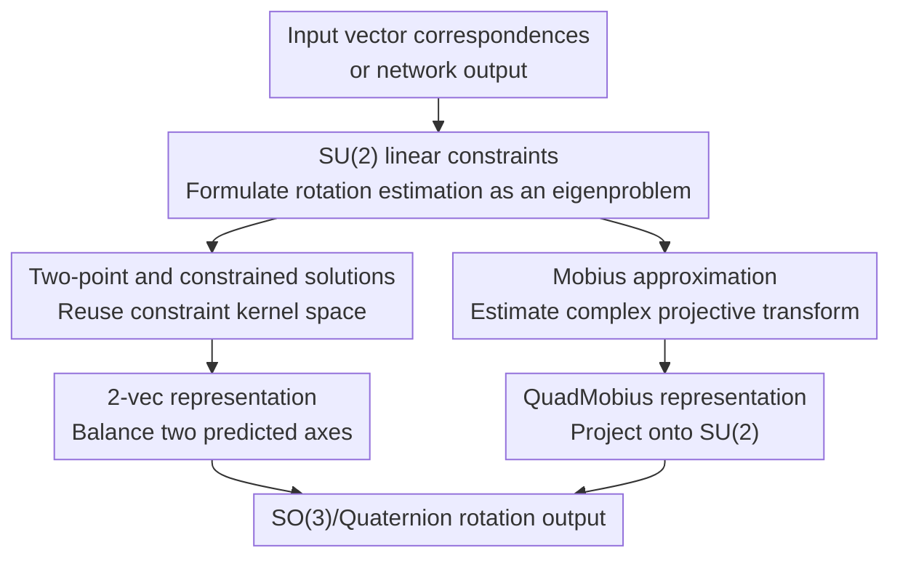

# Special Unitary Parameterized Estimators of Rotation

**Conference**: ICLR2026  
**OpenReview**: [https://openreview.net/forum?id=VaS6xcDrTb](https://openreview.net/forum?id=VaS6xcDrTb)  
**Code**: https://github.com/akschion/SUPER  
**Area**: 3D Vision  
**Keywords**: Rotation Estimation, Wahba's Problem, SU(2), SO(3), Rotation Representations

## TL;DR
This paper re-derives the classical Wahba rotation estimation problem using the special unitary group $SU(2)$, yielding linear quaternion constraints, a closed-form two-point solution, and two network-oriented continuous rotation representations. Among these, 2-vec generally outperforms Gram-Schmidt within the same dimensionality, and QuadMobius achieves state-of-the-art or competitive results across multiple rotation learning tasks.

## Background & Motivation
**Background**: 3D rotation is a fundamental object in pose estimation, camera localization, robotics, spacecraft attitude determination, and 3D vision. Classical geometry typically uses rotation matrices, Euler angles, and quaternions. In vector alignment problems, Wahba's problem formulates rotation estimation as minimizing the weighted squared error over $SO(3)$, which is solved via algorithms such as SVD, Davenport's Q-method, and QUEST.

**Limitations of Prior Work**: While these classical methods are mature, two gaps remain from a modern learning perspective. First, many algorithms rely on matrix decomposition or eigenvalue computation, treating rotation as a projection result onto $SO(3)$ without fully exploiting the $SU(2)$ structure (isomorphic to quaternions) to construct more direct linear constraints. Second, neural networks directly regressing low-dimensional parameters like Euler angles or quaternions suffer from discontinuities, singularities, or double cover issues. Existing solutions like the 6D Gram-Schmidt by Zhou et al., Levinson's SVD representation, or Peretroukhin's QCQP/Bingham representations alleviate these issues but still possess biases, unbalanced gradients, or high computational costs.

**Key Challenge**: Rotation learning requires a network-friendly, continuous, high-dimensional representation, yet the rotation itself must reside on a strict geometric manifold. If the representation is too compact, topological discontinuities hurt learning; if it is too loose, the method of projection to $SO(3)$ determines how errors are distributed, how gradients flow, and how noise is amplified.

**Goal**: The authors aim to answer two connected questions: whether new linear constraints and closed-form solutions for Wahba's problem can be derived from the $SU(2)$ perspective, and whether these constraints can be transformed into better-behaved rotation output layers for neural networks.

**Key Insight**: $SU(2)$ is isomorphic to unit quaternions and acts naturally on spheres or complex projective spaces via stereographic projection/Mobius transformations. In other words, a 3D rotation can be viewed as an $SO(3)$ matrix or an $SU(2)$ complex matrix; the complex linear structure of the latter allows "aligning one direction to another" to be expressed as a linear constraint on rotation parameters.

**Core Idea**: Use $SU(2)$ to rewrite Wahba's problem into linear quaternion constraints, then distill these geometric constraints into two differentiable rotation representations: 2-vec and QuadMobius.

## Method

### Overall Architecture
This paper does not propose a single network architecture but establishes a set of $SU(2)$ rotation estimation formulas, from which mappings for deep learning are extracted. The process consists of three layers: re-expressing Wahba's problem, obtaining classical optimization and two-point closed-form solutions using linear constraints, and turning "optimal alignment" and "Mobius-to-SU(2) projection" into neural network output layers.

For classical rotation estimation, inputs are reference directions $a_i$, target directions $b_i$, and weights $w_i$. The output minimizes the weighted chordal loss. The paper provides three paths: stereographic plane, 3D sphere, and Mobius approximation. The first two yield strictly optimal solutions, while the third is an approximation that is differentiable and suitable for learning. For the learning side, network outputs are interpreted as axis vectors or Hermitian matrices, mapped to valid rotations via these geometric operations.

### Key Designs
**1. $SU(2)$ Linear Constraints: Transforming Wahba's Problem into a Quaternion Eigenproblem**

Wahba's problem minimizes $\sum_i w_i\|b_i - Ra_i\|^2$ over $R \in SO(3)$. A key observation is that if spherical points are projected to complex projective space, the action of an $SU(2)$ matrix $U=\begin{bmatrix}\alpha&\beta\\-\bar\beta&\bar\alpha\end{bmatrix}$ corresponds to rotation. For a pair of projected points $z_i, p_i$, the spherical chordal distance can be written as a complex projective cross-product: $\|a-b\|^2=4|z_1p_2-z_2p_1|^2/(\|z\|^2\|p\|^2)$. Thus, "coincidence after rotation" becomes a linear constraint on $\alpha, \beta, \bar\alpha, \bar\beta$.

Using complex plane coordinates, the authors format this as $A_iu=0$. Mapping $\alpha=w_q+x_q i, \beta=y_q+z_q i$ to a quaternion $q=[w_q,x_q,y_q,z_q]^T$, each observation corresponds to a real matrix $D_i$. Under noise, the solution is:

$$
\min_{\|q\|=1} \|Dq\|^2 = \min_{\|q\|=1} q^T G_P q,
$$

where $G_P=\sum_i w_i' D_i^T D_i$. The optimal $q$ is the eigenvector corresponding to the smallest eigenvalue of $G_P$. This formulation, like Davenport's Q-method, solves a 4D eigenproblem but follows a different derivation path from $SU(2)$ linear constraints, naturally extending to residual calculations and closed-form solutions.

**2. 3D Sphere and Two-Point Closed-Form Solution: Reusing Constraint Kernels on 3D Vectors**

If inputs are already 3D unit vectors, stereographic projection is unnecessary. The authors use a mapping $\chi(a)$ to write 3D vectors as $2\times2$ complex matrices, yielding an equivalent error from $P_i \approx UZ_iU^H$. Since the Frobenius norm is invariant under unitary transformation, constraints are written as $P_iU-UZ_i=0$, expanding to real linear constraints $Q_iq=0$. This yields:

$$
\min_{\|q\|=1} q^T G_S q,
\quad G_S=\sum_i w_i Q_i^TQ_i.
$$

The insight here is that the constraint rank for a single vector is usually 2: a single pair of directions fixes two degrees of freedom, leaving rotation around that direction ambiguous. The intersection of kernel spaces for two noise-free points identifies a unique rotation. The paper provides a concise closed-form solution for the two-point Wahba problem: without weights, the optimal rotation aligns $a_1+a_2 \rightarrow b_1+b_2$ and $a_1-a_2 \rightarrow b_1-b_2$ simultaneously. This allows two-point pose estimation and robust IRLS to be handled with a unified set of linear constraints.

**3. 2-vec: Balancing Projections over Gram-Schmidt's "Axis Favoritism"**

The 6D representation by Zhou et al. splits network outputs into two 3D axes $b_x, b_y$ and applies Gram-Schmidt (GS) orthogonalization. The issue is that GS prioritizes the first axis: it fixes the $x$-axis and projects the $y$-axis onto the perpendicular plane, resulting in biased errors and gradients. Ours 2-vec uses a 6D output but interprets them as two target direction observations, generating rotation via the unweighted two-point Wahba solution.

$b_y$ is rescaled to match the magnitude of $b_x$, denoted as $b'_y=\|b_x\|b_y/\|b_y\|$. Normalized sum and difference directions are constructed: $b_+=(b_x+b'_y)/\|b_x+b'_y\|$ and $b_-=(b_x-b'_y)/\|b_x-b'_y\|$. Since the reference axes sum/difference are fixed as $a_+=(1,1,0)/\sqrt2$ and $a_-=(1,-1,0)/\sqrt2$, the rotation matrix is:

$$
R=\left[\frac{1}{\sqrt2}(b_+ + b_-),\; \frac{1}{\sqrt2}(b_+ - b_-),\; b_- \times b_+\right].
$$

Intuition: Instead of asking "should the first axis be fully trusted?", it asks "what rotation is supported collectively by both predicted axes?" This preserves the computational efficiency of 6D representations while distributing errors more evenly. Gradient analysis shows that the ratio $\|\nabla_{b_x}L\|/\|\nabla_{b_y}L\|$ for 2-vec is centered near 1, whereas GS often exhibits skew ratios between 10 and 100.

**4. QuadMobius: Learning Stable Mobius Intermediates for $SU(2)$ Projections**

QuadMobius stems from the paper's Mobius approximation. Unlike direct rotation estimation, it relaxes $SU(2)$ constraints to estimate a general $2\times2$ complex Mobius transformation $M$. For projected correspondences, $A_i'm=0$ yields a Hermitian matrix $G_M=A'^HA'$. The optimal $m$ is the complex eigenvector of $G_M$. Then $m$ is reshaped into $M$, normalized by its determinant, and projected to the nearest special unitary matrix.

In the learning context, the network outputs 16 real numbers $\Theta$, arranged into a $4\times4$ Hermitian matrix $G_M(\Theta)$. The smallest eigenvector gives a Mobius transform $M$, which is mapped to $Q\in SU(2)$ via two methods: using SVD/polar decomposition for the nearest unitary matrix, or an algebraic formula $Q=M^*+\operatorname{adj}(M^*)^H$ to avoid forward SVD. This two-stage structure decouples learning a noise-resistant geometric intermediate from enforcing valid rotation, allowing the $SU(2)$ projection to provide stable gradients.

### Loss & Training
The traditional Wahba experiments use angular distance $\theta_{err}=\cos^{-1}(2(q_{est}\cdot q_{gt})^2-1)$ in degrees. Learning experiments primarily use Chordal L2: $\|R_{pred}-R_{gt}\|_F^2$.

ModelNet10-SO3 experiments use a ShuffleNetV2-1.5 backbone with ImageNet pre-training and two FC layers. The optimizer is Adam with a learning rate of $5\times10^{-4}$. Inverse Kinematics follows the settings from Zhou et al. for 2 million steps. Cambridge Landmarks experiments utilize the training code from Chen et al., initializing with GoogLeNet and jointly optimizing translation and rotation. QuadMobius versions utilize algebraic projections in the forward pass; the paper provides manual derivatives for complex eigendecomposition and polar decomposition.

## Key Experimental Results

### Main Results
Traditional Wahba solver experiments show that the two strict $SU(2)$ solvers match the precision of optimal methods like Davenport's Q-method, QUEST, and FLAE. The Mobius approximation is more sensitive to noise but provides stronger gradients in learning scenarios.

| Setting | Method | Median Angle Error $\epsilon=10^{-5}$ | Median Angle Error $\epsilon=0.1$ | Median Runtime |
|------|------|------------------------------|---------------------------|--------------|
| $n=3$ | Q-method | 7.4676e-4 | 7.4868 | 3.583 us |
| $n=3$ | QUEST | 7.4676e-4 | 7.4868 | 0.250 us |
| $n=3$ | Ours $G_P$ | 7.4676e-4 | 7.4868 | 4.084 us |
| $n=3$ | Ours $G_S$ | 7.4676e-4 | 7.4868 | 3.625 us |
| $n=3$ | Ours $G_M$ | 1.2614e-3 | 12.608 | 0.917 us |
| $n=100$ | Q-method | 1.2487e-4 | 1.2551 | 5.375 us |
| $n=100$ | Ours $G_P$ | 1.2487e-4 | 1.2551 | 9.917 us |
| $n=100$ | Ours $G_S$ | 1.2487e-4 | 1.2551 | 6.500 us |

In learning rotation representations, QuadMobius and 2-vec alternate as top performers across different categories for ModelNet10-SO3. QMSVD achieved the lowest mean error in Inverse Kinematics, while QMAlg performed best on King's College and Shop Facade in the Cambridge Landmark dataset.

| Task / Data | Metric | GS | QCQP | SVD | 2-vec | QMAlg | QMSVD |
|-------------|------|----|------|-----|-------|-------|-------|
| ModelNet Chair | Mean $\theta_{err}$ | 13.606 | 13.131 | 13.061 | **12.544** | 12.604 | 13.157 |
| ModelNet Sofa | Median $\theta_{err}$ | 5.469 | 5.476 | 5.812 | 6.217 | 5.657 | **5.421** |
| ModelNet Toilet | Mean $\theta_{err}$ | 6.586 | 6.070 | 6.135 | 6.069 | 6.079 | **6.026** |
| Inverse Kinematics | Mean joint error | 1.629 | 1.511 | 1.550 | 1.574 | 1.510 | **1.509** |
| Cambridge King's | Mean $\theta_{err}$ | 3.298 | 3.204 | 3.292 | 3.085 | **2.631** | 2.706 |
| Cambridge Shop | Mean $\theta_{err}$ | 6.559 | 6.802 | 7.117 | 7.118 | **6.317** | 6.715 |

### Ablation Study
The paper analyzes the mechanisms of 2-vec and QuadMobius through gradient statistics rather than simple module swaps. A key ablation examines QuadMobius component splits: showing gradient distribution differences between projection-only, eigendecomposition-only, and the full two-stage method.

| Configuration | 50% Grad Magnitude | 25-75% Quantile | 10-90% Quantile | Description |
|------|--------------|-----------------|-----------------|------|
| Projection only | 3.23e-5 | 9.90e-6 | 1.98e-5 | Direct 8D complex matrix projection to $SU(2)$ |
| Eig. no norm | 3.41e-5 | 1.00e-5 | 2.02e-5 | Eigenvector only, no normalized rotation projection |
| Eig. norm | 2.51e-5 | 9.41e-6 | 1.78e-5 | Eigenvector followed by simple normalization |
| QuadMobius | **2.20e-5** | **6.98e-6** | **1.17e-5** | Eigen + Mobius to $SU(2)$ projection |

Gradient analysis for 2-vec reveals that Gram-Schmidt is on average 11% worse, with 2-vec winning 41 out of 52 evaluated metrics. 2-vec provides more balanced learning signals to both predicted axes.

### Key Findings
- Strict $G_P$ and $G_S$ solvers do not sacrifice accuracy in Wahba problems, essentially reproducing classical optimal solver performance, though current speeds do not yet exceed highly optimized QUEST/FLAE implementations.
- The Mobius approximation is fragile for noisy traditional solving but advantageous as a network representation, as the network learns a stable intermediate $G_M$.
- 2-vec provides significant value as a minor modification to 6D representations, correcting the structural bias of Gram-Schmidt while maintaining similar computational and singular region properties.
- QuadMobius is the most stable across tasks, particularly where gradients must pass through rotation layers (e.g., Inverse Kinematics).

## Highlights & Insights
- The beauty of this paper lies in using $SU(2)$ as a unified language: the same linear constraints explain Wahba's problem, derive two-point solutions, and provide neural network output representations. It connects classical pose estimation to deep rotation regression.
- 2-vec is a practical drop-in replacement. Existing 6D rotation heads in 3D vision can be converted to 2-vec without changing output dimensions, effectively removing "greedy" axis biases.
- The intermediate Mobius transformation in QuadMobius is insightful: it suggests networks can predict a looser but geometrically meaningful object before projecting to the target manifold.
- The transition from theory to optimized C++ solvers and differentiable PyTorch modules makes the contributions highly accessible for engineering systems.

## Limitations & Future Work
- The computational overhead of QuadMobius is notably higher than 2-vec, GS, or SVD. Training QMAlg takes ~1.223 ms per batch ($B=128$) compared to simpler methods, which may be a concern for large-scale real-time systems.
- The Mobius approximation is more fragile in noisy classical settings, indicating it is not a general-purpose numerical replacement for QUEST but specifically suited for learning.
- 2-vec shares similar singular regions with Gram-Schmidt (e.g., when axes collapse). Numerical protections remain necessary during deployment.
- There is a lack of validation on large-scale 6D pose, SLAM/SfM frontends, or closed-loop robotic control. Verifying QuadMobius in end-to-end visual localization pipelines would be a natural next step.
- Theoretically, $SU(2)$ methods could extend to rotation estimation with uncertainty, robust losses, and multi-sensor fusion.

## Related Work & Insights
- **vs. Davenport Q-method / QUEST / FLAE**: These are classical quaternion solvers. Ours $G_P$ / $G_S$ match their optimality but provide better interpretations for residuals and two-point solutions via $SU(2)$ linear constraints.
- **vs. Zhou et al. 6D Gram-Schmidt**: Both use 6D outputs. GS greedily fixes the first axis, while 2-vec treats them as two observations to be balanced via Wahba's problem, resulting in more balanced gradients.
- **vs. Levinson et al. SVD representation**: SVD projects a matrix onto $SO(3)$. QuadMobius projects a Mobius intermediate onto $SU(2)$, providing a geometric buffer that appears more stable in experiments like Inverse Kinematics.
- **vs. Peretroukhin et al. QCQP / Bingham belief**: QCQP uses quaternion optimization for output. QuadMobius shares the emphasis on continuous representations but optimizes the gradient stability via Mobius transformations and structured $SU(2)$ projections.

## Rating
- Novelty: ⭐⭐⭐⭐⭐ (Integrates $SU(2)$ re-formulation, closed-form solutions, and learning representations).
- Experimental Thoroughness: ⭐⭐⭐⭐ (Covers traditional solving, synthetic learning, and three public tasks).
- Writing Quality: ⭐⭐⭐⭐ (Clear logic, though requires a strong background in $SU(2)$ and Mobius transforms).
- Value: ⭐⭐⭐⭐⭐ (2-vec is easily deployable; QuadMobius provides a high-precision alternative for rotation learning).

<!-- RELATED:START -->

## Related Papers

- [\[CVPR 2026\] Learning to Infer Parameterized Representations of Plants from 3D Scans](../../CVPR2026/3d_vision/learning_to_infer_parameterized_representations_of_plants_from_3d_scans.md)
- [\[AAAI 2026\] Parameterized Approximation Algorithms for TSP on Non-Metric Graphs](../../AAAI2026/3d_vision/parameterized_approximation_algorithms_for_tsp_on_non-metric_graphs.md)
- [\[CVPR 2026\] RINO: Rotation-Invariant Non-Rigid Correspondences](../../CVPR2026/3d_vision/rino_rotation-invariant_non-rigid_correspondences.md)
- [\[CVPR 2025\] Extreme Rotation Estimation in the Wild](../../CVPR2025/3d_vision/extreme_rotation_estimation_in_the_wild.md)
- [\[CVPR 2025\] Cross-View Completion Models are Zero-shot Correspondence Estimators](../../CVPR2025/3d_vision/cross-view_completion_models_are_zero-shot_correspondence_estimators.md)

<!-- RELATED:END -->
