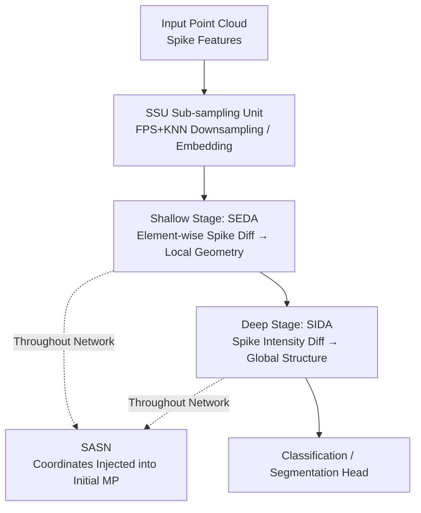

# Spiking Discrepancy Transformer for Point Cloud Analysis

**Conference**: ICLR 2026  
**OpenReview**: [https://openreview.net/forum?id=7Brnh0aNFn](https://openreview.net/forum?id=7Brnh0aNFn)  
**Code**: None  
**Area**: 3D Vision  
**Keywords**: Spiking Neural Networks, Point Cloud Analysis, Spiking Transformer, Spiking Discrepancy Attention, Energy Efficiency

## TL;DR
To address the issues in Spiking Neural Networks (SNNs) for point cloud analysis, where "dot-product attention tends to smooth edges and struggles to model local and global features simultaneously," this paper proposes using the **discrepancy** between spike sequences instead of dot-product similarity as the attention mechanism. Combined with a spatial-aware spiking neuron that injects coordinates into the initial membrane potential, the hierarchical Spiking Discrepancy Transformer achieves SOTA within the SNN domain, with energy consumption at only a few percent of ANN SOTA.

## Background & Motivation
**Background**: Spiking Neural Networks are known for their binary spikes, event-driven nature, and updating membrane potentials only upon spike arrival, making them naturally energy-efficient and suitable for neuromorphic hardware. Recent works like Spikformer and Spike-Driven Transformer have "spiked" the self-attention of Transformers (Spiking Self-Attention, SSA), achieving a good energy-accuracy balance in 2D image classification and detection.

**Limitations of Prior Work**: Most Spiking Transformers are limited to 2D vision. Applying vanilla SSA directly to 3D point clouds presents three specific problems: First, "salient points" at object edges or category boundaries are crucial for prediction, but SSA, based on dot-product similarity aggregation, tends to focus on highly similar points, thereby **smoothing or ignoring** these geometric mutation edge features. Second, point clouds often involve tens of thousands of points (far more than 2D tokens), making the computation of global dependencies in SSA unaffordable. Third, point clouds contain significant redundancy, and SSA cannot easily balance local and global modeling. Additionally, dot-product SSA does not naturally satisfy **translation invariance**, which is highly valued in 3D tasks.

**Key Challenge**: While spiking brings energy efficiency, it inevitably introduces information loss. SSA specifically suffers from spike dot-product mismatch in the channel dimension, further weakening representation; the "seeking commonality" nature of dot-product similarity is contrary to the "edges = geometric mutations = low similarity" requirement of point clouds.

**Goal**: To design an efficient attention mechanism for 3D that highlights discriminative edge features, extends from local smoothness to global modeling, and restores lost spatial information within the spiking framework.

**Key Insight**: The observation is that since the discriminative power of point clouds comes from "local spike misalignment," one should not use dot-products to "seek commonality" but directly measure the **discrepancy** between spikes. This is analogous to lateral inhibition in cortical neurons, where neighboring neuronal activities inhibit each other to enhance edge contrast.

**Core Idea**: Use the spike subtraction between Query and Key as the attention matrix instead of the SSA dot-product. Shallow stages use fine-grained element-wise discrepancy to capture local geometry, while deep stages use coarse-grained spike intensity discrepancy to capture global structure; a spiking neuron that encodes coordinates into the initial membrane potential is used to recover spatial information.

## Method

### Overall Architecture
The Spiking Discrepancy Transformer (SDT) is a hierarchical encoder composed of several stages in series, performing progressive downsampling and point set modeling. The input consists of point cloud features in spike form. Each stage first passes through a **Spiking Sub-sampling Unit (SSU)** for sampling and embedding, then enters an SDT block for attention and MLP. The core innovation is replacing SSA with the **Spiking Discrepancy Attention Mechanism (SDAM)**: it defines "spiking discrepancy" $SD$—a spike-driven feature metric obtained directly by subtracting spike sequences—as the attention: $\text{SDAM}(Q,K,V)=SD(Q,K)\circ V$. SDAM has two variants based on depth: shallow stages use **SEDA** to capture fine-grained element-wise discrepancies between center and neighbor points (local geometry), and deep stages use **SIDA** to describe global topological structure via macroscopic spike intensity differences. The spiking neurons throughout the network are replaced with **SASN (Spatial-aware Spiking Neuron)**, which encodes sampling point coordinates into the initial membrane potential using trigonometric functions to restore spatial information lost in the spike representation. 3D classification defaults to 4 stages, with the first half using SEDA and the second half using SIDA.

### Key Designs

**1. Spiking Discrepancy SD and SDAM: Using "Difference" Instead of "Similarity"**

This is the central mechanism addressing the bottlenecks where SSA smooths edges and lacks translation invariance. SSA uses dot-product similarity for aggregation, giving high weights to similar points, which dilutes scores in geometric mutation edge regions, resulting in "edge blurring." SDAM does the opposite: it uses the **spike difference** between Query and Key as the attention matrix, $\text{SDAM}(Q,K,V)=SD(Q,K)\circ V$, where $SD$ is a spike-driven metric obtained from subtracting spike sequences, and $\circ$ is a spike-driven operator that varies by attention scope (local/global). The authors analogize this to cortical neuron responses to multi-channel asynchronous spike mismatches—lateral inhibition enhancing edge contrast. Since discrepancy measures are insensitive to global shifts, SDAM naturally satisfies the translation invariance of spike features: in Table 1, after random rotation/translation/scaling of the dataset, SDAM accuracy drops by only 1.2–1.3%, whereas SSA drops by 2.8–3.6%, and even the ANN-based Point Transformer drops by 2–3%. SDAM is implemented as two variants, SEDA and SIDA, managing shallow local and deep global features, respectively.

**2. SEDA: Shallow Element-wise Spike Discrepancy for Local Geometry**

SEDA addresses the issue of "diluted geometric edge features," assuming that local geometric discriminability comes from spike misalignment between neighboring points. Given a center query point spike feature $q\in S^{T\times C}$ and its $n$ neighbor key features $k=\{k_j\}$ ($T$ is time steps, $C$ is channels), SEDA first calculates pairwise multi-channel spike differences $SD_j = q - k_j$, then sums them and passes them through a spiking neuron $SD(q,k)=\text{SN}(\sum_{j=1}^{n} SD_j * s)$ (where $s$ is a synaptic scaling factor). Finally, it acts as an element-wise mask on the center value point: $\text{SEDA}(q,k,v)=SD(q,k)\odot v$. It captures the **fine-grained spike variation trends** of the center point relative to its neighbors. The t-SNE visualization (Figure 2) shows that SEDA makes points within the same part cluster more tightly (intra-part compactness) and increases the gap between different parts (inter-part expansion), whereas SSA features are dispersed with overlapping parts and geometric blurring—indicating that SEDA indeed learns precise spatial positional features.

**3. SIDA: Deep Spike Intensity Discrepancy for Global Structure**

In deeper stages, points have been downsampled to a smaller number, requiring global structure rather than pairwise neighbor relationships. SIDA builds on the local discriminability of SEDA by using macroscopic differences in **spike intensity** (the cumulative value of spikes at a location, a purely additive statistic) to capture the global view: topological significance arises from the contrast of population-level firing intensities between different regions. Given global spike features $Q,K,V\in S^{T\times N\times C}$, $SD(Q,K)=\text{SN}((\sum_C Q - \sum_C K^T)*s)$, then $\text{SIDA}(Q,K,V)=SD(Q,K)\cdot V$. Summing along channels coarsens element-wise differences into intensity differences, which bypasses the computational cost of dense dot-products on thousands of points and is more robust to spike information loss (statistics are naturally noise-resistant) while maintaining translation invariance. Figure 3 shows that SIDA produces sparse and precise spike activations at critical positions of point cloud skeletons (airplane wings/tail/nose, lamp shade/pole/base), whereas SSA either focuses on secondary regions or repeatedly emphasizes the same part. The hierarchical synergy of SEDA (shallow local) and SIDA (deep global) allows the network to capture both fine-grained details and global geometric relationships.

**4. SASN: Injecting Coordinates into Initial Membrane Potential**

Spiking features lose information when modeling complex spatial positions, intensifying as the network deepens. SASN is based on the premise that initial membrane potential (IMP) affects neuronal dynamics; thus, embedding spatial information into IMP enhances spatio-temporal perception. Since point sampling is decoupled from the network, coordinates of selected points can be encoded into the spiking neuron's IMP in a **non-learnable** way using trigonometric functions before processing. According to the LIF update rule, the membrane potential at the first time step changes from $\frac{1}{\tau}X[1]$ to $H[1]=(1-\frac{1}{\tau})P[0]+\frac{1}{\tau}X[1]$, where $P[0]$ is the positional encoding corresponding to that neuron. SASN can directly replace regular spiking neurons to facilitate spatio-temporal information interaction in SNN point cloud processing; the paper also ablates the insertion positions.

## Loss & Training
Downsampling in the SSU uses Farthest Point Sampling (FPS) with no learnable parameters, and center-neighbor sampling uses K-Nearest Neighbors (KNN); the embedding transformation is $X'_l=\text{Linear}(\text{SN}(\text{CAT}(X_l,X^k_l)))$, followed by max pooling + average pooling to aggregate neighborhood features $Y_l=\text{MP}(X'_l)+\text{AP}(X'_l)$. The SDT block includes SDAM and MLP, defaulting to membrane potential shortcut residuals. Neurons are implemented via SpikingJelly, trained using PyTorch on 4×RTX 4090; hyperparameters vary by dataset (e.g., SGD, lr 5e-2, 300 epochs for ModelNet40; AdamW for ScanObjectNN), with time steps $T$ defaulting to 4.

## Key Experimental Results

### Main Results
3D Classification (ModelNet40 / ScanObjectNN, OA is Overall Accuracy):

| Method | Type | Params(M) | ModelNet40 OA | ScanObjectNN OA | Energy(mJ, ModelNet40) |
|------|------|--------|---------------|-----------------|----------------------|
| PointMLP | ANN | 12.60 | 94.10 | 85.40 | 72.38 |
| Point-GPT | ANN | 19.46 | 94.00 | 86.90 | 20.48 |
| E-3DSNN | SNN | 3.27 | 91.70 | 83.91 | 1.76 |
| SPT | SNN | 9.64 | 91.43 | 82.23 | 13.3 |
| **Ours (T=4)** | SNN | **2.25** | **92.46** | **86.19** | **1.33** |

Ours achieves SOTA across the SNN board: with only 2.25M parameters, it outperforms E-3DSNN (ModelNet40) by 0.76% and SPT (ScanObjectNN) by 3.96%. Compared to ANNs, the accuracy is only slightly lower, but the energy consumption on ModelNet40 is only 1.8% of PointMLP (1.33mJ vs 72.38mJ), and on ScanObjectNN, it is only 10.3% of Point-GPT (2.11mJ vs 20.47mJ). Segmentation results follow: 69.6% mIoU on S3DIS (vs 67.4% for E-3DSNN); and ShapeNetPart cat./ins. mIoU is 2.0%/1.3% higher than E-3DSNN, with energy consumption at only 1.06% / 3.73% of ANN-SOTA.

### Ablation Study
Attention variants and hierarchical framework (Table 6, placement of attention in 4 stages) + SASN (Figure 4):

| Configuration | ModelNet40 OA | ScanObjectNN OA | Description |
|------|---------------|-----------------|------|
| SDT (SEDA Shallow + SIDA Deep + SASN) | 92.46 | 86.19 | Full Model |
| w/o SASN | 91.16 (-1.30) | 84.37 (-1.82) | Removed SASN |
| SASN in SIDA only | 91.81 (-0.65) | 85.13 (-1.06) | Partial insertion |
| SASN in SSU only | 91.93 (-0.53) | 85.43 (-0.76) | Partial insertion |
| All SSA | Lower | Lower | SEDA/SIDA both superior to vanilla SSA |

Time step ablation (Table 7): OA on ModelNet40 for $T=1/2/4/6$ is 92.18 / 92.34 / 92.46 / 91.93, with $T=4$ being optimal; spatial temporal cues are scarce in 3D, and excessively large $T$ only brings redundant computation. Depth/width ablation (Table 8) shows diminishing returns from increasing depth or width while significantly raising parameters and energy; finally, a 4-stage setup with widths [48, 96, 192, 384] was selected.

### Key Findings
- **SASN contributes most**: Removing it drops ScanObjectNN by 1.82% and ModelNet40 by 1.30%. More comprehensive insertion (SSU+SEDA+SIDA) is better, proving that injecting coordinates into initial membrane potential is a substantial compensation for spike point cloud representations.
- **Hierarchical SEDA + SIDA outperforms single types**: They excel in local and global contexts respectively; combination is necessary for detail and topology.
- **Translation invariance as a hidden bonus of SDAM**: Accuracy drop after spatial transformation is minimal (1.2–1.3% vs 2.8–3.6% for SSA), representing a structural advantage of "seeking difference" over "seeking commonality."
- **Extreme energy efficiency**: Using ~2.25M parameters and single-digit mJ energy to approach ANN SOTAs of hundreds of mJ demonstrates the potential of SNNs in 3D point clouds.

## Highlights & Insights
- **Replacing "Seeking Commonality" with "Seeking Difference"**: Attention traditionally uses similarity (dot-product) aggregation. This paper insights that point cloud discriminability resides exactly at geometric mutations (low similarity), so it uses spike differences as the attention matrix—this reversal fixes edge blurring and provides translation invariance for free.
- **Dual-variant hierarchy**: SEDA for element-wise (fine-grained local) and SIDA for channel-summed intensity (coarse-grained global) utilizes the same "discrepancy" principle to cover local-to-global scales while bypassing global attention's complexity via "intensity statistics."
- **Initial membrane potential as a spatial information carrier**: SASN uses non-learnable trigonometric encoding to pack coordinates into IMP, restoring the lost spatial information of spiking with almost zero extra parameters—a strategy that could be migrated to other SNN spatio-temporal tasks.

## Limitations & Future Work
- Increasing time steps $T$ leads to performance drops ($T=6$ is worse than $T=4$), which authors attribute to scarce temporal cues in 3D—meaning the multi-time-step advantage of SNNs is hard to exploit on static point clouds.
- There is still a 1–2% accuracy gap compared to ANN SOTA (PointMLP 94.10, Point-GPT 86.90). The selling point is energy efficiency, and it may not be suitable for accuracy-critical scenarios.
- Many mechanistic explanations (lateral inhibition, cortical analogies) are in the appendix, with the main text relying more on intuitive arguments; the specific forms of the SD operator $\circ$ ($\odot$ mask vs $\cdot$ matrix mult) vary by scenario, and their validity in more complex tasks like detection remains to be verified.
- Code is not open-source, resulting in a high barrier to reproduction.

## Related Work & Insights
- **vs SSA / Spikformer**: They fully spike the Transformer but remain in 2D using dot-product similarity; Ours switches to spike discrepancy and splits into SEDA/SIDA for 3D edge discriminability and local-global modeling.
- **vs E-3DSNN / SPT (SNN Point Cloud)**: E-3DSNN uses spiking sparse convolution, and SPT does only single local feature extraction, losing the global view; Ours uses unified discrepancy attention to manage both local and global scales with fewer parameters (2.25M) and higher accuracy/lower energy.
- **vs Point Transformer Series (ANN)**: ANNs use floating-point encoding for richer information and higher accuracy but consume orders of magnitude more energy; Ours approaches their accuracy within a few mJ, positioning it as an "efficiency-first" 3D point cloud solution.

## Rating
- Novelty: ⭐⭐⭐⭐⭐ Switching attention from "commonality dot-product" to "discrepancy spike difference" as a hierarchical design is an original contribution to 3D Spiking Transformers.
- Experimental Thoroughness: ⭐⭐⭐⭐ Covers classification, semantic segmentation, and part segmentation, with ablations on attention combinations, time steps, depth/width, and sparsity, though key explanations are concentrated in the appendix.
- Writing Quality: ⭐⭐⭐⭐ Clear chain of motivation-mechanism-visualization, with consistent formulas and symbols.
- Value: ⭐⭐⭐⭐ Provides a SOTA SNN-based reference for energy-sensitive 3D point cloud processing (autonomous driving, robotics).

<!-- RELATED:START -->

## Related Papers

- [\[ICLR 2026\] 3DSMT: A Hybrid Spiking Mamba-Transformer for Point Cloud Analysis](3dsmt_a_hybrid_spiking_mamba-transformer_for_point_cloud_analysis.md)
- [\[ICCV 2025\] Efficient Spiking Point Mamba for Point Cloud Analysis](../../ICCV2025/3d_vision/efficient_spiking_point_mamba_for_point_cloud_analysis.md)
- [\[AAAI 2026\] Graph Smoothing for Enhanced Local Geometry Learning in Point Cloud Analysis](../../AAAI2026/3d_vision/graph_smoothing_for_enhanced_local_geometry_learning_in_point_cloud_analysis.md)
- [\[ICLR 2026\] RayI2P: Learning Rays for Image-to-Point Cloud Registration](rayi2p_learning_rays_for_image-to-point_cloud_registration.md)
- [\[CVPR 2026\] ECKConv: Learning Coordinate-based Convolutional Kernels for Continuous SE(3) Equivariant Point Cloud Analysis](../../CVPR2026/3d_vision/learning_coordinate-based_convolutional_kernels_for_continuous_se3_equivariant_a.md)

<!-- RELATED:END -->
