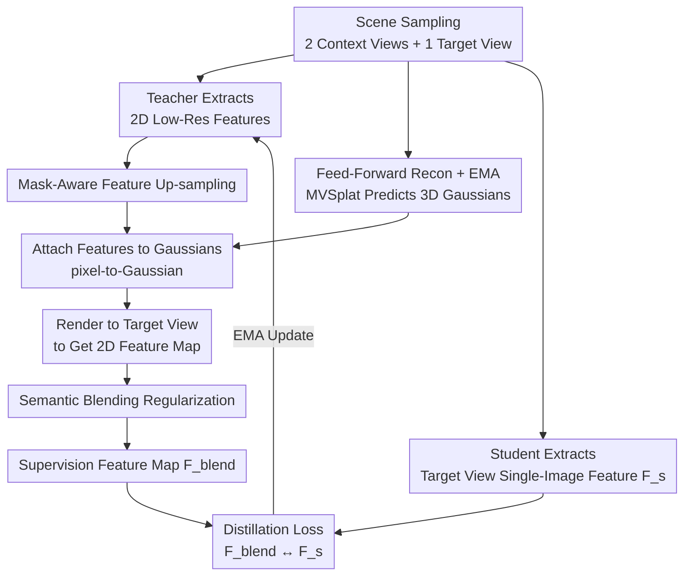

# Splat and Distill: Augmenting Teachers with Feed-Forward 3D Reconstruction for 3D-Aware Distillation

**Conference**: ICLR 2026  
**arXiv**: [2602.06032](https://arxiv.org/abs/2602.06032)  
**Code**: Yes (GitHub)  
**Area**: 3D Vision / Vision Foundation Models  
**Keywords**: 3D-Aware Distillation, 3D Gaussian Splatting, Feed-Forward Reconstruction, Vision Foundation Models, Student-Teacher

## TL;DR

In a student-teacher distillation framework, the teacher is augmented with a pre-trained feed-forward 3D reconstruction model (MVSplat). By lifting 2D features to a 3D Gaussian representation and rendering them to novel views, the student learns geometrically consistent 3D-aware 2D features. This approach comprehensively outperforms existing methods across downstream tasks including depth estimation, normal estimation, semantic segmentation, and multi-view correspondence.

## Background & Motivation

**Background**: Vision Foundation Models (VFMs) such as DINOv2, trained on large-scale 2D data via self-supervised distillation, achieve excellent performance on 2D tasks like semantic segmentation. However, these models inherently lack 3D awareness, limiting their performance in tasks requiring an understanding of 3D geometry, such as depth estimation, surface normal prediction, and multi-view correspondence.

**Limitations of Prior Work**:
1. **FiT3D** lifts 2D features to a 3DGS representation via per-scene optimization and renders them to generate training data for fine-tuning VFMs. Since input features from different views are inherently inconsistent, the optimization process results in "least-squares compromises," leading to semantic blurring and feature-averaging artifacts.
2. **MEF** enforces feature consistency through multi-view correspondences but relies solely on feature similarity constraints at corresponding points, failing to provide a complete and dense geometric understanding.
3. Per-scene optimization methods are computationally expensive and require a large number of Gaussians, making them difficult to scale.

**Key Challenge**: To imbue 2D features with 3D awareness, feature learning must be constrained by multi-view 3D geometry. However, per-scene optimization is slow and produces "averaging" artifacts due to inconsistent input features. While feed-forward reconstruction is fast, it has previously been utilized only for appearance reconstruction rather than semantic features.

**Goal**: Within a student-teacher distillation framework, a frozen feed-forward 3D reconstruction model (MVSplat) serves as an augmenting component for the teacher. 2D features extracted by the teacher undergo mask-aware up-sampling and are attached to 3D Gaussians. These are then rendered to target views and processed via semantic blending to generate high-quality supervision signals. The student learns to match the teacher's 3D-aware features from a single 2D image, ultimately achieving geometric consistency. The teacher is iteratively updated via EMA to avoid static feature averaging issues.

## Method

### Overall Architecture

Splat and Distill (SnD) integrates feed-forward 3D reconstruction into the DINO/DINOv2 student-teacher self-distillation framework, ensuring the teacher's supervision signals possess inherent geometric consistency. In each iteration, two context views and one target view are sampled from a scene $\mathcal{S} = \{(\mathbf{I}_i, \mathbf{P}_i)\}_{i=1}^N$. A frozen MVSplat model predicts a set of 3D Gaussian primitives $\{(\mu_j, \Sigma_j, \alpha_j)\}$ from the context images. The teacher's 2D features are up-sampled, attached to these Gaussians, rendered, and blended at the target view. The resulting feature map $\mathbf{F}_{blend}^{tgt}$ acts as the supervision signal. The student must match these 3D-aware features using only a single 2D image of the target view, while the teacher is continuously updated via the student's EMA.

### Key Designs

**1. Mask-Aware Feature Up-sampling: Eliminating Cross-Object Feature Leakage**

The resolution of the teacher's output feature map ($h \times w$) is $\times 14$ lower than the input image ($H \times W$). Standard bilinear interpolation would mix features from different objects, resulting in "dirty" features at boundaries when attached to Gaussians. SnD employs semantic mask-guided interpolation: $\mathbf{F}_u^{high} = \sum_{v \in \mathcal{N}(u)} w_{uv} \cdot \mathbf{F}_v^{low}$, where weights $w_{uv}$ are non-zero only if $\text{mask}(v) = \text{mask}(u)$. This ensures features are interpolated only from neighbors within the same semantic region, maintaining sharp object boundaries. Replacing this with standard bilinear interpolation increased the ScanNet++ depth RMSE from 0.3299 to 0.3309.

**2. Semantic Blending Regularization: Correcting Geometric Artifacts from Sparse Views**

Reconstructing a 3D scene from only two context views inevitably introduces local geometric inconsistency artifacts when rendered to novel views. SnD corrects this by averaging rendered features within semantic boundaries: $\mathbf{F}_{blend}(u) = \alpha \cdot \mathbf{F}_{rendered}(u) + (1-\alpha) \cdot \frac{1}{|\mathcal{M}_u|} \sum_{v \in \mathcal{M}_u} \mathbf{F}_{rendered}(v)$, where $\alpha = 0.5$ and $\mathcal{M}_u$ includes all pixels sharing the same semantic mask as pixel $u$. This smoothing within masks eliminates minor geometric jitter without blurring edges. This step is critical; removing blending entirely drops the depth RMSE to 0.3435.

**3. Feed-Forward Reconstruction + EMA: Creating a Self-Augmenting Dynamic Loop**

The fundamental flaw in per-scene optimization (like FiT3D) is that teacher features are static. Since input views are inconsistent, optimization settles for a "least-squares compromise," causing semantic blurring. SnD updates the teacher via the student's EMA: $\theta_t \leftarrow \lambda \theta_t + (1-\lambda) \theta_s$. As training progresses, the teacher's 2D features become more consistent, improving the quality of features fed into MVSplat and subsequently enhancing the rendered supervision, creating a positive feedback loop. The distillation objective is $\min_{\theta_s} \mathcal{L}_{distill}(\text{head}(\mathbf{F}_s^{tgt}), \text{sg}(\text{head}(\mathbf{F}_{blend}^{tgt})))$. Freezing the teacher increases RMSE from 0.3299 to 0.3444, confirming the value of the closed-loop consistency learning.

## Key Experimental Results

### Main Results

Linear probing evaluations were conducted on ScanNet++, ScanNet, and NYUv2, comparing against DINOv2, FiT3D, and MEF.

**Monocular Depth Estimation (ViT-Small)**:

| Method | ScanNet++ RMSE↓ | ScanNet RMSE↓ | NYUv2 RMSE↓ |
|------|:---:|:---:|:---:|
| DINOv2 | 0.3777 | 0.2817 | 0.5210 |
| FiT3D | 0.3506 | 0.2713 | 0.5075 |
| MEF | 0.4000 | 0.3042 | 0.5656 |
| **Ours** | **0.3299** | **0.2555** | **0.4912** |

**Surface Normal Estimation (NYUv2 RMSE↓)**:

| Method | ViT-Small | ViT-Base |
|------|:---:|:---:|
| DINOv2 | 30.99 | 31.40 |
| FiT3D | 30.57 | 30.57 |
| MEF | 33.05 | 32.60 |
| **Ours** | **28.93** | **29.37** |

**Semantic Segmentation (ViT-Small, mIoU↑)**:

| Method | ScanNet++ | ScanNet | NYUv2 |
|------|:---:|:---:|:---:|
| DINOv2 | 29.54 | 51.27 | 64.73 |
| FiT3D | 31.77 | 54.50 | 66.33 |
| MEF | 27.44 | 47.44 | 63.17 |
| **Ours** | **31.78** | **56.01** | **67.50** |

**Out-of-Distribution Generalization (ViT-Base)**: Achieved 50.01 mIoU on ADE20K (FiT3D: 48.29) and an RMSE of 2.1741 on KITTI depth estimation (FiT3D: 2.2485), demonstrating strong transfer capability from indoor to outdoor environments.

### Ablation Study

Ablation analysis on ScanNet++ using ViT-Small:

| Configuration | Seg mIoU↑ | Depth RMSE↓ |
|----------|:---:|:---:|
| w/o Blending (A) | 30.99 | 0.3435 |
| Bilinear instead of Mask Up-sampling (B) | 31.46 | 0.3309 |
| Cosine Loss instead of Distill Loss (C) | 31.27 | 0.3310 |
| Frozen Teacher (D) | 31.90 | 0.3444 |
| Context Views instead of Target View (E) | 32.08 | 0.3332 |
| SAM Mask instead of GT Mask (F) | 31.51 | 0.3328 |
| Direct Feature Rendering Loss (G) | 31.40 | 0.3430 |
| Baseline Configuration (H) | 30.66 | 0.3520 |
| **Full Model** | **31.78** | **0.3299** |

Findings: (1) Semantic blending and mask-aware up-sampling are key to depth estimation gains; (2) The EMA learnable teacher improves RMSE from 0.3444 to 0.3299; (3) SAM masks perform nearly as well as GT masks, proving practical utility.

## Highlights & Insights

### Value

1. **Elegant Concept**: Embedding feed-forward 3D reconstruction into distillation avoids the bottlenecks of per-scene optimization and averaging artifacts.
2. **Comprehensive Evaluation**: Extensive testing across four tasks, multiple datasets, and OOD scenarios with thorough ablation.
3. **Dynamic EMA Update**: The teacher-student loop ensures feature quality improves continuously during training.
4. **Practicality**: The use of SAM masks makes the method applicable without manual annotations.

### Limitations

1. Performance depends on the quality of the pre-trained MVSplat; reconstruction failures may introduce harmful supervision.
2. Training was limited to ScanNet++ data; reconstruction quality in large-scale outdoor scenes may be constrained.
3. Requires multi-view training data, limiting application in contexts where only single-image data is available.

## Rating

⭐⭐⭐⭐ — The method is novel and clear, with solid experiments, representing a significant contribution to 3D-aware VFMs.

<!-- RELATED:START -->

## Related Papers

- [\[ICLR 2026\] ARTDECO: High-Fidelity Online 3D Reconstruction with Hierarchical Gaussian Structure + Feed-forward Priors](artdeco_toward_high-fidelity_on-the-fly_reconstruction_with_hierarchical_gaussia.md)
- [\[CVPR 2026\] SR3R: Rethinking Super-Resolution 3D Reconstruction With Feed-Forward Gaussian Splatting](../../CVPR2026/3d_vision/sr3r_rethinking_super-resolution_3d_reconstruction_with_feed-forward_gaussian_sp.md)
- [\[CVPR 2026\] TokenSplat: Token-aligned 3D Gaussian Splatting for Feed-forward Pose-free Reconstruction](../../CVPR2026/3d_vision/tokensplat_token-aligned_3d_gaussian_splatting_for_feed-forward_pose-free_recons.md)
- [\[CVPR 2026\] AnchorSplat: Feed-Forward 3D Gaussian Splatting with 3D Geometric Priors](../../CVPR2026/3d_vision/anchorsplat_feed-forward_3d_gaussian_splatting_with_3d_geometric_priors.md)
- [\[ICLR 2026\] Lyra: Generative 3D Scene Reconstruction via Video Diffusion Model Self-Distillation](lyra_generative_3d_scene_reconstruction_via_video_diffusion_model_self-distillat.md)

<!-- RELATED:END -->
