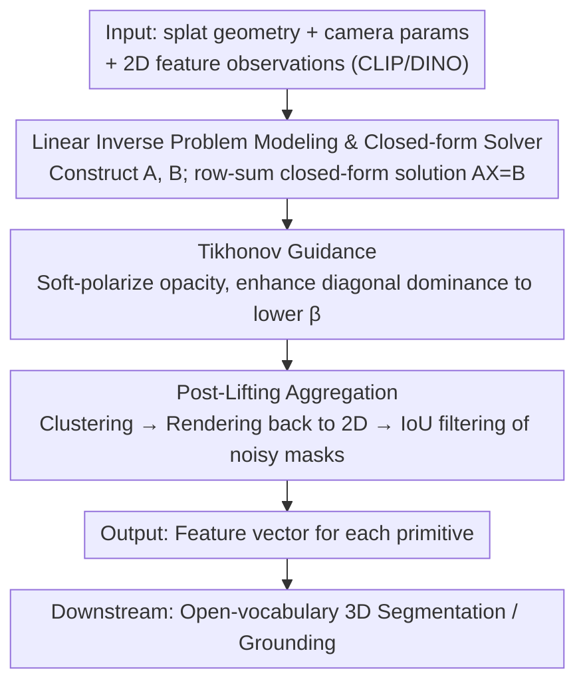

# Splat Feature Solver

**Conference**: ICLR 2026  
**arXiv**: [2508.12216](https://arxiv.org/abs/2508.12216)  
**Code**: Available (GitHub)  
**Area**: 3D Vision / 3D Scene Understanding  
**Keywords**: Feature Lifting, 3D Gaussian Splatting, Linear Inverse Problem, Open-Vocabulary 3D Segmentation, Tikhonov Regularization

## TL;DR

The problem of feature lifting in 3D splat representations is unified and modeled as a sparse linear inverse problem $AX=B$. A closed-form solver is proposed with a provable $(1+\beta)$-approximation error bound under convex loss. Combined with Tikhonov Guidance and Post-Lifting Aggregation filtering, the method achieves SOTA performance in open-vocabulary 3D segmentation.

## Background & Motivation

**Background**: Splat-based 3D representations (3DGS, 2DGS, etc.) have achieved real-time high-fidelity rendering. However, lifting rich 2D semantic features (CLIP, DINO, etc.) to 3D primitives remains a challenge. Existing methods are categorized into training-based optimization, grouping-based association, and heuristic forward projection.

**Limitations of Prior Work**: (1) Lack of a unified mathematical framework to define the feature lifting problem; (2) Absence of theoretical guarantees regarding the proximity of the solution to the optimal one; (3) Existing methods often focus solely on SAM+CLIP features and 3DGS kernels, limiting generalization; (4) Failure to explicitly handle multi-view inconsistencies and noisy masks.

**Key Challenge**: Feature lifting is essentially a sparse, row-stochastic linear inverse problem that becomes ill-conditioned due to noisy masks and incompleteness. Existing methods either require expensive training or lack theoretical grounding.

**Goal**: Establish a formal mathematical framework for feature lifting, provide a closed-form solution with error bounds, and handle multi-view noise.

**Key Insight**: By utilizing the row-stochastic nature of alpha blending rendering, feature lifting can be transformed into a standard linear inverse problem. The optimal solution to a proxy loss can then be derived using Jensen's inequality.

**Core Idea**: Feature lifting can be formulated as $AX=B$, where $A$ is the rendering weight matrix. The closed-form solution provided by the row-sum preconditioner, $x_j = \frac{\sum_i A_{ij} B_i}{\sum_i A_{ij}}$, has a provable $(1+\beta)$-approximation guarantee under convex loss.

## Method

### Overall Architecture

The process of "lifting 2D dense features to 3D splat primitives" is viewed as solving a sparse linear inverse problem. Taking pre-computed splat geometry, camera parameters, and 2D feature observations (CLIP, DINO, etc.) as input, the rendering weight matrix $A$ and observation vector $B$ are constructed, reducing the problem to $AX=B$. Instead of training, a closed-form solution is provided via a row-sum preconditioner, supported by two regularization modules: Tikhonov Guidance, which soft-polarizes opacity during solving to enhance the diagonal dominance and stabilize the ill-conditioned system; and Post-Lifting Aggregation, which filters out noisy masks via clustering after features are lifted. The final output is a feature vector for each primitive, used for downstream tasks like open-vocabulary 3D segmentation.

### Key Designs

**1. Linear Inverse Problem Modeling & Closed-form Solver: Elevating Heuristic Row-sum Weighting to an Optimal Solution with Error Guarantees**

Existing feature lifting methods lack a unified framework and theoretical guarantees on solution quality. This work formalizes the problem as $AX=B$, where $A \in \mathbb{R}^{R \times P}$ ($R$ rays, $P$ primitives) is the rendering weight matrix from alpha blending. A key observation is that alpha blending is naturally row-stochastic, i.e., $\sum_j A_{ij} \approx 1$. Consequently, Jensen's inequality is used to construct a proxy loss $\mathcal{J}(x) = \sum_i \sum_j A_{ij} \|x_j - B_i\| \geq \mathcal{L}(x)$, which yields the row-sum preconditioner closed-form solution $x_j = \frac{\sum_i A_{ij} B_i}{\sum_i A_{ij}}$. This avoids the high cost of SGD training and proves $\mathcal{L}(x') \leq (1+\beta)\mathcal{L}(\hat{x})$, where $\beta$ measures the feature dispersion of the optimal solution along the line of sight. This bound unifies row-sum rules independently discovered by works like CosegGaussians, Occam's LGS, and DrSplat as special cases of the same closed-form solution and provides the first proof of their approximate optimality.

**2. Tikhonov Guidance: Reducing the Error Bound $\beta$ via Non-linear Soft Polarization**

The linear system $A$ may be rank-deficient or near-singular, leading to an ill-conditioned problem and a large $\beta$. While traditional Tikhonov regularization $\|Ax-b\|^2 + \|\lambda I\|^2$ performs linear adjustments, this method modifies the construction of $A$. Based on the property that $\beta$ is negatively correlated with the diagonal dominance of $A^T A$ (Property 4), a non-linear soft polarization is applied to the opacity activation function during the feature lifting phase. This pushes opacity values toward 0 or 1, concentrating contributions on each ray to a single primitive. In the extreme case where each row of $\tilde{A}$ has only one non-zero entry (value 1), it yields the global optimum. This enhances the diagonal dominance of $A^T A$ and lowers $\beta$ without modifying the geometry or harming RGB rendering quality.

**3. Post-Lifting Aggregation: Filtering Inconsistent SAM Masks from the Data Side**

Multi-view inconsistencies are often caused by mask noise rather than true semantic differences (e.g., one view segments only noodles, while another segments the bowl and noodles together). Instead of handling this noise during solving, a cleaning step is performed after lifting: the Tikhonov-Guided solution $\tilde{x}$ is reused as clustering features to assign each splat to a cluster. Cluster IDs are then rendered back to 2D using one-hot encoding, and argmax is used to obtain a cluster mask. Finally, the IoU between each SAM mask and the cluster mask is calculated, and masks with an IoU below a threshold are discarded. Unlike LAGA, which requires learning separate affinity features and performing view-dependent clustering, this method reuses the existing solution and is simpler to implement.

### Loss & Training

The entire method requires no training and relies solely on closed-form solutions, which is why it completes in minutes rather than hours.

## Key Experimental Results

### Main Results

| Dataset (LeRF-OVS) | Metric (mIoU) | Ours | LAGA (Prev. SOTA) | Gain |
|------------------|-----------|------|-------------|------|
| Figurines | mIoU | 67.6 | 64.1 | +3.5 |
| Ramen | mIoU | 62.3 | 56.6 (N2F2) | +5.7 |
| Mean (4 scenes) | mIoU | 65.1 | 64.0 (LAGA) | +1.1 |

### Ablation Study

| Configuration | Metric | Description |
|------|------|------|
| w/o Tikhonov + w/o Post-Agg | Cosine Sim ~90% | Basic solver already has strong lifting capability |
| + Tikhonov Guidance | mIoU Improvement | Enhances diagonal dominance to reduce $\beta$ |
| + Post-Lifting Aggregation | Optimal mIoU | Further improvement by filtering noisy masks |
| Multi-feature (DINO/ViT/ResNet) | Cosine >80% | Validates feature-agnostic capability |

### Key Findings

- The row-sum preconditioner completes feature lifting in minutes, significantly faster than training-based methods.
- Tikhonov Guidance effectively reduces $\beta$ by enhancing diagonal dominance, matching theoretical predictions.
- Most multi-view inconsistencies stem from mask noise rather than semantic changes; Post-Lifting Aggregation effectively filters these.

## Highlights & Insights

- Modeling feature lifting as a linear inverse problem is a key insight that unifies three categories of methods (integrating row-sum rules from CosegGaussians, Occam's LGS, and DrSplat).
- The $(1+\beta)$-approximation error bound provides the first theoretical guarantee for feature lifting.
- Completely kernel-agnostic and feature-agnostic: the framework handles arbitrary kernels (3DGS/2DGS/Beta Splatting) and features (CLIP/DINO/ViT/ResNet).

## Limitations & Future Work

- The $\beta$ bound depends on the feature dispersion of the optimal solution, which is difficult to estimate a priori.
- Although the IoU threshold in Post-Lifting Aggregation is automatically selected, it remains sensitive to the scene.
- The closed-form solution assumes $\sum \omega_p \approx 1$ (row-stochasticity), which may degrade in extremely sparse scenes.

## Related Work & Insights

- **vs DrSplat**: DrSplat simplifies row-sum using top-K truncation without theoretical guarantees; this work proves that the full row-sum is $(1+\beta)$-optimal.
- **vs LAGA**: LAGA requires training affinity models and view-dependent clustering; this method is completely training-free and outperforms LAGA on LeRF-OVS.
- **vs LangSplat**: LangSplat requires end-to-end training and PCA compression; this method uses a closed-form solution and leads significantly in mIoU.

## Rating

- Novelty: ⭐⭐⭐⭐ Linear inverse problem modeling is an elegant unified framework with strong theoretical contributions.
- Experimental Thoroughness: ⭐⭐⭐ Good coverage of LeRF-OVS, but could benefit from more benchmarks.
- Writing Quality: ⭐⭐⭐⭐ Clear theoretical derivation, though some notation is occasionally mixed.
- Value: ⭐⭐⭐⭐ Establishes a theoretical foundation for 3D feature lifting and is likely to become a standard reference for future work.

<!-- RELATED:START -->

## Related Papers

- [\[ICLR 2026\] Splat the Net: Radiance Fields with Splattable Neural Primitives](splat_the_net_radiance_fields_with_splattable_neural_primitives.md)
- [\[ICLR 2026\] Splat and Distill: Augmenting Teachers with Feed-Forward 3D Reconstruction for 3D-Aware Distillation](splat_and_distill_augmenting_teachers_with_feed-forward_3d_reconstruction_for_3d.md)
- [\[ICLR 2026\] Light of Normals: Unified Feature Representation for Universal Photometric Stereo](light_of_normals_unified_feature_representation_for_universal_photometric_stereo.md)
- [\[CVPR 2026\] Deep Feature Deformation Weights](../../CVPR2026/3d_vision/deep_feature_deformation_weights.md)
- [\[CVPR 2026\] ST4R-Splat: Spatio-Temporal Referring Segmentation in 4D Gaussian Splatting](../../CVPR2026/3d_vision/st4r-splat_spatio-temporal_referring_segmentation_in_4d_gaussian_splatting.md)

<!-- RELATED:END -->
