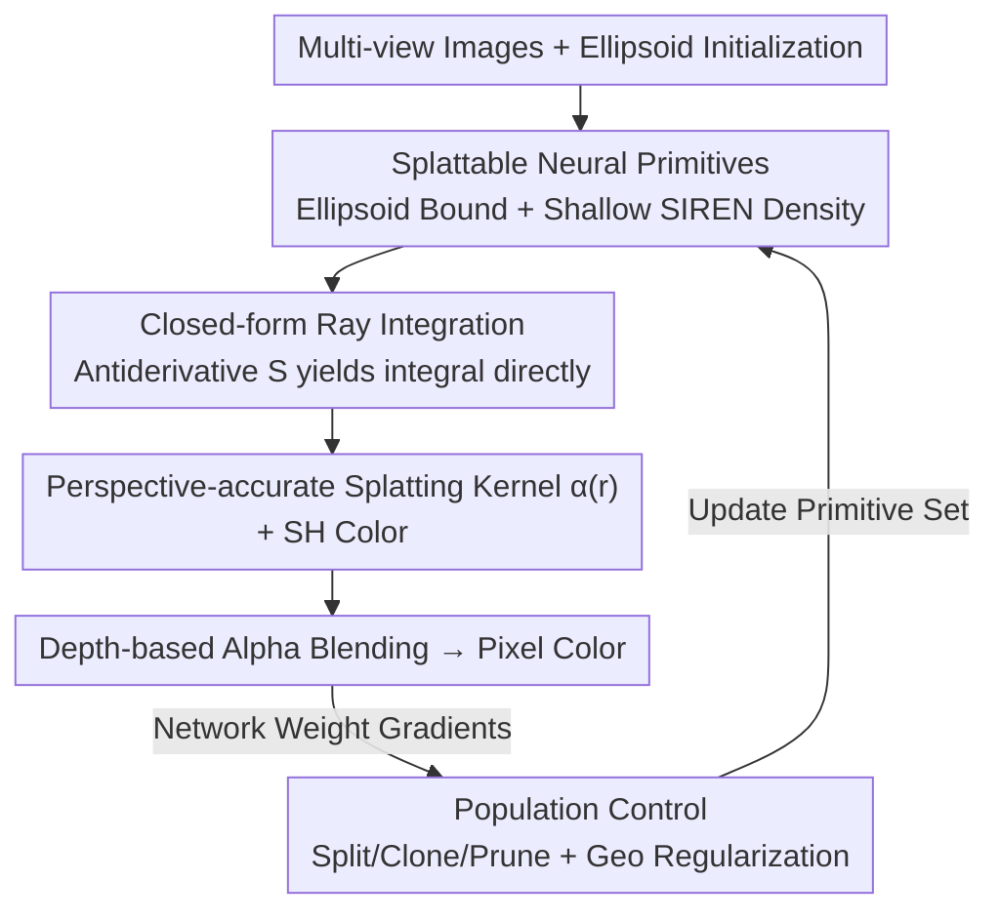

# Splat the Net: Radiance Fields with Splattable Neural Primitives

**Conference**: ICLR 2026  
**OpenReview**: [https://openreview.net/forum?id=v3ejhJxT1W](https://openreview.net/forum?id=v3ejhJxT1W)  
**Paper**: [Project Page](https://vcai.mpi-inf.mpg.de/projects/SplatNet/)  
**Code**: None (Project page only)  
**Area**: 3D Vision / Radiance Fields / Novel View Synthesis  
**Keywords**: Radiance fields, neural primitives, splatting, closed-form integration, novel view synthesis

## TL;DR
This paper proposes "splattable neural primitives," where the density field of each primitive is represented by a shallow neural network (SIREN) bounded spatially by an ellipsoid. By deriving a **closed-form solution** for the density integral along view rays, the method maintains the high expressivity of neural representations while achieving the efficient splatting of 3DGS. It achieves quality and speed comparable to 3DGS using 10× fewer primitives and 6× fewer parameters for novel view synthesis.

## Background & Motivation
**Background**: Radiance fields are the dominant representation for modeling 3D scene appearance. Development has followed two trajectories: **neural representations** (e.g., NeRF), which use neural networks to fit $F_\theta:(x,d)\to(\sigma,c)$ with high expressivity, and **primitive-based representations** (e.g., 3D Gaussian Splatting, 3DGS), which decompose scenes into millions of simple analytical voxel functions (e.g., 3D Gaussians) that are projected into 2D kernels for splatting.

**Limitations of Prior Work**: A "dichotomy" exists between these routes. Neural representations are expressive but require costly **ray marching**, where every sampling point must pass through the network. Primitive-based representations render quickly via alpha blending of projected kernels but suffer from weak expressivity. The symmetric shapes and soft boundaries of 3DGS Gaussians struggle to represent complex solid structures (e.g., curved teapot handles or sharp leaf edges), necessitating a **massive number** of primitives, which increases memory consumption.

**Key Challenge**: Efficient splatting requires a **computationally tractable closed-form solution** for the primitive density integral along a ray (i.e., $\alpha_i(r)=1-\exp(-\int \sigma_i\,dt)$). It is widely assumed that only "simple manual analytical shapes" (Gaussians, Beta distributions, etc.) can satisfy this, creating a trade-off between expressivity and splattability.

**Goal**: To break this trade-off by enabling primitive density fields to be **neural networks** (high expressivity) while ensuring their ray integrals **remain closed-form** (splattable).

**Key Insight**: The authors observe a neglected mathematical fact: **single-hidden-layer shallow networks** are universal approximators that can also be **integrated in closed form** (based on Lloyd et al. 2020, Subr 2021). Designing primitive density fields as shallow networks captures both "neural expressivity" and "analytical integrability."

**Core Idea**: Parametrize each primitive's density field using an "ellipsoid-bounded single-hidden-layer periodic activation network" and derive closed-form antiderivatives along arbitrary rays. This converts neural density fields into perspective-accurate 2D splatting kernels, completely bypassing ray marching.

## Method

### Overall Architecture
The method represents a radiance field as a mixture of voxel primitives $\{P_i\}$. Each primitive performs two functions: ① It defines a local density field $\sigma(x)$ using a shallow neural network bounded by an ellipsoid. ② During rendering, for an ellipsoid intersected by a ray, the entry and exit points $t_{in}, t_{out}$ are calculated. The **closed-form antiderivative** is used to directly compute the density integral, yielding the opacity kernel $\alpha(r)$ for that pixel. Finally, kernels from all primitives are depth-sorted and alpha-blended from front-to-back. Color is represented using Spherical Harmonics (SH) for view dependency.

The pipeline follows a "neural representation $\to$ analytical integration $\to$ splatting" sequence. The density $\sigma$ is **never directly evaluated** during training or rendering; all computations utilize its antiderivative $S$.

### Key Designs

**1. Splattable Neural Primitives: Periodic Networks as Density Fields with Ellipsoidal Constraints**

To resolve the conflict between expressivity and splattability, the density field of each primitive is defined as a **shallow neural network** instead of a fixed analytical shape. Each primitive is bounded by an ellipsoid $B$ (center $x_B$, scaling $s_B$, rotation quaternion $q_B$). The density field is:

$$\sigma(x)=f_\sigma\!\left(\frac{x-x_B}{\|s_B\|_\infty}\right),\quad f_\sigma(x)=W_2\big(\cos(\omega_0(W_1 x+b_1))\big)+b_2,$$

where $f_\sigma$ is a SIREN-style network with a single hidden layer of width $N_\sigma$ and periodic activations. This structure acts similarly to a Fourier series where $W_1, b_1$ control frequency and phase, and $W_2, b_2$ control amplitude and bias. Using this network ensures the primitive is a universal approximator while remaining **integrable in closed form**. With only 99 parameters per primitive (approx. 1.6× a Gaussian), these neural fields can deform into complex shapes impossible for Gaussians, allowing for far fewer primitives. Parameters are set to $N_\sigma=8$ and $\omega_0=30$.

**2. Closed-form Ray Integration: Perspective-Accurate Kernels without Ray Marching**

The key to splatting is calculating the integral $\hat\alpha=\int_{t_{in}}^{t_{out}}\sigma(o+td)\,dt$ along ray $r(t)=o+td$. This work derives a **closed-form antiderivative**:

$$S(t;o,d)=\big[W_2\oslash(\omega_0\cdot W_1 d)\big]\sin\!\big(\omega_0(t\cdot W_1 d+W_1 o+b_1)\big)+t\cdot b_2,$$

resulting in $\hat\alpha=S(t_{out})-S(t_{in})$. The final kernel is $\alpha(r)=1-\exp(-\max(0,\hat\alpha))$. Ray-ellipsoid intersection yields $t_{in}$ and $t_{out}$ analytically. Unlike 3DGS, which relies on an **affine approximation** of the projection operator, this integral is performed along the actual ray, making the result **perspective-accurate**. View consistency is maintained as the density field depends only on 3D position.

**3. Population Control and Geometric Regularization: Adaptive Management of Neural Primitives**

The authors replace the screen-space gradient densification of 3DGS with a criterion based on **network weight gradient magnitudes**. Primitives are cloned or split if gradients exceed a threshold and pruned if they fall too low, without opacity resets. A **geometric regularization** term is added to penalize extreme anisotropy by minimizing the standard deviation of the scaling vector $s_B$ components, preventing ellipsoids from degenerating into thin lines. Training is extended to 100k steps to accommodate the more complex optimization landscape.

### Loss & Training
The loss function follows 3DGS (L1 + D-SSIM) with the addition of the anisotropy regularization. Network weights are initialized following Sitzmann et al. ($W_1\sim U(-1/3,1/3)$, $W_2\sim \pm\sqrt{6/N_\sigma}/\omega_0$). Color utilizes SH coefficients with four bands. The system is implemented in PyTorch + CUDA, trained on A40 GPUs, and benchmarked on RTX 4090.

## Key Experimental Results

### Main Results
On real-world scenes (Mip-NeRF360 / Tanks&Temples / Deep Blending), Ours is the **only method that is both "splattable" and "neural"**:

| Dataset | Metric | Ours | 3DGS | Note |
|--------|------|------|------|------|
| Mip-NeRF360 | PSNR / FPS / Mem(MB) | 27.21 / 115 / **93** | 27.21 / 152 / 734 | Equal quality, ~1/8 memory |
| Tanks&Temples | PSNR / FPS / Mem(MB) | 23.59 / 158 / **80** | 23.14 / 188 / 411 | Slightly higher quality, ~1/5 memory |
| Deep Blending | PSNR / FPS / Mem(MB) | 29.20 / 178 / **82** | 29.41 / 154 / 676 | Similar quality, ~1/8 memory |

Compared to monolithic neural representations (INGP, MipNeRF360, etc., at <1–9 FPS), this method is over an order of magnitude faster. It achieves 3DGS-level quality with **10× fewer primitives and 6× fewer parameters**.

On the Synthetic NeRF dataset under constrained memory budgets, Ours consistently outperforms 3DGS:

| Memory Budget | 0.1MB | 0.4MB | 1.0MB | 2.0MB | 4.0MB | Unlimited |
|----------|-------|-------|-------|-------|-------|-----------|
| 3DGS PSNR | 23.1 | 25.6 | 27.2 | 28.4 | 29.6 | 33.3 |
| Ours PSNR | **24.7** | **27.6** | **28.9** | **30.4** | **31.4** | 33.4 |

### Ablation Study

| Configuration | Key Finding | Note |
|------|---------|------|
| vs AutoInt | AutoInt is view-inconsistent | AutoInt uses ray depth for parametrization, leading to density changes across views. Ours is naturally consistent. |
| Network $N_\sigma$ | Benefit diminishes in real scenes | $N_\sigma=16$ helps in toy scenes, but real-world optimization is under-constrained. |
| Frequency $\omega_0$ | Higher values recover high-freq structures | $\omega_0$ controls the upper bound of representable frequencies. |
| Geo Regularization | Suppresses extreme anisotropy | Without it, primitives often degenerate into elongated shapes. |
| Initialization | Random 33.36 vs Mesh 33.40 | Robust to initialization; behavior aligns with 3DGS. |

### Key Findings
- **Expressivity originates from the representation**: A small number of neural primitives can fit complex structures like teapot handles; on the Ficus scene, a single primitive can reconstruct an entire leaf.
- **Advantage comes from representation, not framework**: Benefits are achieved without complex memory control mechanisms (like T-3DGS), though such mechanisms are orthogonal and could be added.
- **Slower convergence is the trade-off**: Neural field optimization requires 100k iterations (longer than Gaussians) to achieve significant reductions in primitive count and memory.

## Highlights & Insights
- **Mathematical Leverage**: Using the fact that single-layer networks are both universal approximators and closed-form integrable is a clever pivot to resolve the expressivity vs. splattability constraint.
- **No Direct Density Evaluation**: By never sampling the density field and relying purely on the antiderivative $S$, the method seamlessly bridges neural density with efficient integration.
- **Perspective Accuracy**: Unlike the affine projection approximations in 3DGS, this method integrates along the actual ray, providing a blueprint for perspective-accurate splatting.
- **The "Neuralized Primitive" Paradigm**: While previous works used neural components to regularize or augment Gaussians, this work makes the **kernel function itself** neural.

## Limitations & Future Work
- **Convergence Speed**: Training takes 100k iterations, significantly longer than standard Gaussian representations.
- **Control Frameworks**: The method does not yet incorporate specific memory-taming frameworks like T-3DGS, which could further improve compactness.
- **Diminishing Returns of Capacity**: Increased $N_\sigma$ shows less gain in real scenes due to optimization constraints, suggesting that the full potential of stronger primitives is not yet fully released by current optimization strategies.
- **No Open Source Code**: Reproducibility remains an obstacle for the community.

## Related Work & Insights
- **vs 3DGS**: 3DGS uses fixed Gaussians and affine approximations. Ours uses neural density fields with closed-form, perspective-accurate integration, requiring far fewer primitives and less memory.
- **vs NeRF / INGP / MipNeRF360**: These are expressive but slow (<1–14 FPS) due to ray marching. Ours provides neural expressivity at splatting speeds.
- **vs GES / ConvSplat / BetaGS**: These iterate on manual analytical kernel shapes. This work is unique in "neuralizing" the kernel itself.
- **vs AutoInt**: AutoInt's parametrization causes view-dependency in density; this work ensures multi-view consistency by construction.

## Rating
- Novelty: ⭐⭐⭐⭐⭐ First to implement the splatting kernel as a neural network with closed-form ray integration.
- Experimental Thoroughness: ⭐⭐⭐⭐ Extensive datasets and budget-constrained tests, though lacking ultra-large scale scenes.
- Writing Quality: ⭐⭐⭐⭐⭐ Excellent categorization of atomic vs. neural representations and clear mathematical derivation.
- Value: ⭐⭐⭐⭐⭐ Significant reduction in primitive count (10×) and memory (1/8×) with portable representation insights.

<!-- RELATED:START -->

## Related Papers

- [\[CVPR 2026\] Evidential Neural Radiance Fields](../../CVPR2026/3d_vision/evidential_neural_radiance_fields.md)
- [\[ICLR 2026\] Einstein Fields: A Neural Perspective To Computational General Relativity](einstein_fields_a_neural_perspective_to_computational_general_relativity.md)
- [\[ICLR 2026\] Splat Feature Solver](splat_feature_solver.md)
- [\[CVPR 2026\] MU-GeNeRF: Multi-view Uncertainty-guided Generalizable Neural Radiance Fields for Distractor-aware Scene](../../CVPR2026/3d_vision/mu-generf_multi-view_uncertainty-guided_generalizable_neural_radiance_fields_for.md)
- [\[ICLR 2026\] Learning Physics-Grounded 4D Dynamics with Neural Gaussian Force Fields](learning_physics-grounded_4d_dynamics_with_neural_gaussian_force_fields.md)

<!-- RELATED:END -->
