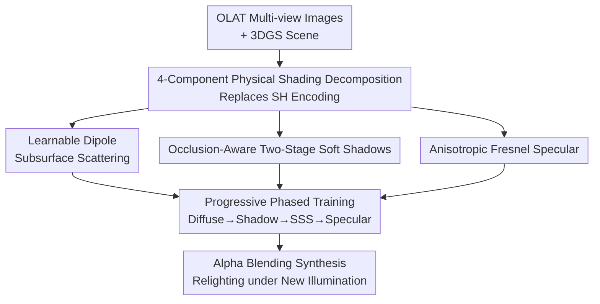

# SSD-GS: Scattering and Shadow Decomposition for Relightable 3D Gaussian Splatting

**Conference**: ICLR 2026  
**OpenReview**: [https://openreview.net/forum?id=7m2Dqz9g05](https://openreview.net/forum?id=7m2Dqz9g05)  
**Code**: https://github.com/irisfreesiri/SSD-GS  
**Area**: 3D Vision  
**Keywords**: Relightable, 3D Gaussian Splatting, Subsurface Scattering, Soft Shadows, Physically-based Decomposition

## TL;DR
SSD-GS replaces the "spherical harmonic coefficients" in 3D Gaussian Splatting with a physically interpretable four-term shading decomposition: "diffuse + specular + shadow + subsurface scattering." Combined with learnable dipole scattering, occlusion-aware two-stage soft shadows, and progressive training, it significantly outperforms existing methods in relighting fidelity for complex materials like metals and translucent objects.

## Background & Motivation

**Background**: For relightable 3D reconstruction from One-Light-At-a-Time (OLAT) data, the mainstream approach involves extending physical shading within the 3D Gaussian Splatting (3DGS) framework. 3DGS represents scenes using a set of anisotropic Gaussian points, offering fast rendering and high quality, making it a compelling alternative to NeRF volume rendering.

**Limitations of Prior Work**: Existing 3DGS relighting methods employ overly coarse shading decompositions. One category (GaussianShader, GI-GS, R3DG) only models diffuse and specular components and assumes static lighting during training, failing under novel illumination. Another category based on OLAT, despite having dynamic lighting supervision, handles shadows and scattering crudely—GS3 offloads shadows and residual effects to pixel-level deferred rendering, failing to capture soft shadows and indirect light; OLAT Gaussians relies on a proxy mesh for normal supervision, making it extremely sensitive to geometric quality; RNG replaces physical shading with a latent appearance code, sacrificing interpretability.

**Key Challenge**: Light transport in real-world materials is non-linear, producing visually critical phenomena such as gradient soft shadows and subsurface scattering (SSS). However, existing methods either approximate these effects with black-box neural networks (uninterpretable and hard to control) or ignore them entirely (insufficient fidelity), with failures being most prominent on anisotropic metals and translucent materials. Prior work has struggled to achieve both physical interpretability and high-frequency effect fidelity simultaneously.

**Goal**: Explicitly decompose radiance into four physically interpretable components—diffuse, specular, shadow, and subsurface scattering—modeling each with either analytical models or lightweight neural fields. This ensures each component can be independently supervised and controlled while maintaining generalization under unseen lighting.

**Key Insight**: Mature physical models already exist in classical computer graphics—dipole diffusion provides a closed-form approximation for multiple scattering in translucent media, and Fresnel + anisotropic Spherical Gaussians (ASG) can express metallic highlights. Rather than having a neural network approximate these effects from scratch, it is better to embed these "heritage" physical models into the per-Gaussian shading of 3DGS, with the neural network only responsible for predicting the physical parameters.

**Core Idea**: Replace the original spherical harmonic color encoding of 3DGS with a "four-component physical shading decomposition + physical model foundation + neural parameter prediction + progressive introduction" strategy. This restores physical interpretability and high-frequency fidelity while maintaining rasterization efficiency.

## Method

### Overall Architecture
The input to SSD-GS is a set of multi-view images captured/synthesized under OLAT conditions (one point light source per image), and the output is a Gaussian scene that can be relit under novel lighting. The process can be summarized as: maintaining the Gaussian geometry and rasterization pipeline of 3DGS but replacing the color of each Gaussian with a four-component physical shading function:

$$C_i = (c_d f_d + c_s f_s)\cdot S(\mathbf{x}) + c_{sss} f_{sss}$$

where $f_d, f_s, and f_{sss}$ are scalar reflection intensities for diffuse, specular, and subsurface scattering respectively; $c_d, c_s, c_{sss}\in\mathbb{R}^3$ are their learned base colors; and $S(\mathbf{x})$ is the soft shadow attenuation factor. Note that shadows only modulate the diffuse and specular components (direct illumination), while the scattering term is added separately (as scattering originates from within the medium and should not be attenuated by surface shadows). This color is calculated per Gaussian and then synthesized into pixels via standard alpha blending, aligned with ground truth using per-pixel losses.

The four components are not trained simultaneously; they are introduced progressively from "coarse to fine": starting with diffuse, then adding shadows, scattering, and finally specular components, allowing the network to gradually decouple complex light-material effects.

### Key Designs

**1. Four-Component Physical Shading Decomposition: Replacing the SH Black Box with Four Interpretable Terms**

Original 3DGS uses Spherical Harmonics (SH) to encode view-dependent colors per Gaussian. However, SH is inherently limited to smooth, low-frequency angular changes, lacks representational power for high-frequency effects like specular highlights or scattering, and offers no physical meaning for individual control. SSD-GS reformulates the color as $C_i = (c_d f_d + c_s f_s)\cdot S(\mathbf{x}) + c_{sss} f_{sss}$, assigning a dedicated term to diffuse, specular, shadow, and scattering. This allows for per-component supervision, visualization, and editing—enabling precise changes to the contribution of an individual light source during relighting rather than global relighting via environment maps. This structure forms the backbone of the paper; the following designs define how each term is calculated.

**2. Learnable Dipole Subsurface Scattering: Using Physical Models as a Foundation for Neural Parameter Prediction**

Subsurface scattering in translucent materials (skin, jade, wax, marble) is notoriously difficult to model. Existing SSS-GS methods use a neural network to learn scattering radiance as a residual additive term, which is uninterpretable and relies on dense supervision. SSD-GS adopts the classic standard dipole diffusion model (Jensen 2001), which provides a closed-form BSSRDF to approximate multiple scattering in homogeneous media:

$$f_{sss}(r) = \frac{\alpha'}{4\pi}\left[\frac{z_r(\sigma_t d_r + 1)e^{-\sigma_t d_r}}{d_r^3} + \frac{z_r z_v(\sigma_t d_r + 1)e^{-\sigma_t d_v}}{d_v^3}\right]$$

where $\alpha' = \sigma_s/(\sigma_s+\sigma_a)$, $\sigma_t = \sigma_s+\sigma_a$, $z_r, z_v$ are depths of real/virtual dipole sources, and $d_r, d_v$ are distances from the shading point to the sources. Crucially, while the physical formula is fixed, the scattering coefficient $\sigma_s$, absorption coefficient $\sigma_a$, and surface separation distance $r$ are predicted by a 6-layer MLP neural field $\Theta_{SSS}$ based on the Gaussian center $\mathbf{x}$, light/view directions, normals, and a per-Gaussian material embedding $m\in\mathbb{R}^6$, rescaled to physically plausible ranges via sigmoid ($\sigma_s,\sigma_a\in[0.05,2.05]$, $r\in[0.1,3.1]$). Normals are derived directly from the Gaussian local coordinate system, eliminating the need for external proxy meshes—this ensures stability even in areas with geometric noise.

**3. Occlusion-Aware Two-Stage Soft Shadows: Volumetric Visibility for Foundation, Neural Refinement for Contact Shadows**

Soft shadows are another major challenge. GS3's pixel-level deferred rendering introduces noise and fails to capture sharp boundaries. SSD-GS uses a two-stage approach. The first stage estimates geometric visibility: for each Gaussian, a shadow ray is cast toward the light source for every pixel it covers. Per-ray transmittance $v_i = \prod_{k\in O_i}(1-\alpha_k)$ is accumulated, then weighted by the Gaussian's projected density $\rho_i$ to get the coarse visibility $\hat{v}_g = \frac{\sum_i \rho_i v_i}{\sum_i \rho_i}$. This continuous volumetric visibility naturally yields smooth, geometrically consistent soft shadows. The second stage performs neural refinement: since coarse visibility may miss contact shadows, fine geometric details, or material-dependent attenuation, a small 3-layer MLP $\Theta_{shad}$ takes the Gaussian center, incident light direction, coarse visibility $\hat{v}$, and material embedding $m$ to predict the final shadow attenuation term $S(\mathbf{x}) = \Theta_{shad}(\mathbf{x}\mid\hat{v},\omega_i,m)$. Physical visibility provides the correct global trend and interpretability, while neural refinement adds high-frequency details.

**4. Anisotropic Fresnel Specular + Progressive Phased Training: Representing Metallic Highlights and Decoupling Components Coarse-to-Fine**

The specular term must represent high-frequency view-dependent reflections for materials like metals or fabrics. SSD-GS uses a Fresnel factor (Schlick) modulating Anisotropic Spherical Gaussian (ASG) bases: Fresnel captures the sharp increase in reflection intensity near grazing angles, while ASG bases compactly represent anisotropic highlights, reproducing effects like brushed metal or cloth. The diffuse term uses a standard Lambertian BRDF as a foundation for stable low-frequency appearance. However, training all four components simultaneously leads to interference (gradient overlap causes specular and scattering to compete to explain the same appearance). Consequently, the authors adopt progressive training: introducing components in the order of "Diffuse → Shadow → SSS → Specular" using iteration thresholds. Camera pose refinement is activated after shadows are introduced, and light source position refinement begins during the specular phase. Ablations show this physical ordering (Schedule I) is superior to joint training (H), swapped order (J), or adding all terms at once after a warm-up (K)—simultaneous introduction causes training interference and undermines decoupling quality.

### Loss & Training
The final image is aligned with ground truth using a per-pixel loss. Training follows the progressive phased strategy described in point 4. All scenes share a default configuration to ensure stability and reproducibility. Camera poses and light positions are continuously refined during training (poses after the shadow phase, lights at the specular phase). Real-world data is trained for 100K iterations, while the SSS-GS synthetic set is trained for 60K for fair comparison.

## Key Experimental Results

### Main Results
Substantial comparisons were conducted against vanilla 3DGS, GI-GS (representing static lighting relighting), GS3, and RNG (representing OLAT relighting) on the NRHints real-world OLAT dataset (7 scenes) and the GS3 synthetic dataset (6 scenes), all using 100K iterations and identical settings. Representative test set (unseen lighting) PSNR values:

| Dataset | Scene | Ours | GS3 | RNG | 3DGS |
|--------|------|------|-----|-----|------|
| NRHints | FurScene | **30.73** | 28.22 | 27.69 | 18.48 |
| NRHints | Pixiu | **31.12** | 29.70 | 28.86 | 18.55 |
| NRHints | Cat | **27.68** | 27.41 | 26.61 | 14.53 |
| GS3 Synthetic | AnisoMetal | **30.04** | 28.82 | 25.92 | 17.10 |
| GS3 Synthetic | Translucent | **32.39** | 32.20 | 28.57 | 16.49 |

The advantage is most pronounced in scenes with prominent scattering or specular effects (AnisoMetal, Translucent, FurScene), while matching GS3 in low-frequency dominant scenes, demonstrating strong cross-scene generalization.

On the SSS-GS synthetic dataset specifically emphasizing subsurface scattering (60K iterations, black background alignment), compared with SSS-GS and KiloOSF:

| Method | Test PSNR | Test SSIM | Test LPIPS | FPS | GPU |
|------|-----------|-----------|------------|-----|-----|
| KiloOSF | 25.91 | 0.93 | 0.097 | 14.4 | RTX 4090 |
| SSS-GS | 35.01 | 0.972 | 0.040 | 154.8 | RTX 4090 |
| Ours (w/o Opt) | 37.44 | 0.984 | 0.0186 | 66.3 | RTX 3090 |
| Ours (w/ Opt) | **38.35** | **0.986** | **0.0158** | 61.5 | RTX 3090 |

Even using a weaker RTX 3090, the proposed method comprehensively outperforms SSS-GS on an RTX 4090 in PSNR/SSIM/LPIPS, validating the effectiveness of the physical SSS term.

### Ablation Study
Ablations on reflectance components and training schedules were conducted on the real-world *Pixiu* scene (test set):

| Configuration | Test PSNR | Test SSIM | Test LPIPS | Description |
|------|-----------|-----------|------------|------|
| A: Diffuse Only | 20.19 | 0.5583 | 0.1061 | Baseline |
| B: + Specular | 20.57 | 0.6683 | 0.0992 | Add specular |
| C: + Scattering | 24.81 | 0.9274 | 0.0857 | Add scattering (SSIM jump) |
| D: Full Model | **31.12** | **0.9452** | **0.0791** | All four terms |
| E: Full − Specular | 30.60 | 0.9429 | 0.0844 | Drop in performance |
| F: Full − Scattering | 30.41 | 0.7204 | 0.0850 | SSIM drops to 0.72 |
| H: Joint Training | 31.09 | 0.9441 | 0.0812 | Simultaneous |
| I: Progressive Physical (Ours)| **31.12** | **0.9452** | **0.0791** | Diffuse→Shadow→SSS→Specular |
| J: Progressive Non-physical | 31.10 | 0.9443 | 0.0807 | Swap last two orders |
| K: Progressive Merged | 31.05 | 0.9449 | 0.0794 | Add all after warm-up |

### Key Findings
- **Scattering is the most significant contributor**: Moving from B (diffuse+specular, SSIM 0.67) to C by adding scattering causes SSIM to jump to 0.93. Removing scattering (F) causes SSIM to crash to 0.72—without it, diffuse and shadow components attempt to "absorb" the appearance belonging to scattering, creating translucency artifacts and destroying shadow sharpness.
- **Training schedule differences are small in metrics but large visually**: While PSNR for I/H/J/K all hover around 31, visual decomposition quality varies. Schedule K causes interference where specular and scattering gradients overlap, reducing decoupling quality—these artifacts are clear in visual decompositions despite being masked in scalar metrics, proving the necessity of structured supervision and progressive learning.
- **Physical ordering (I, SSS before Specular) is superior to non-physical (J) and joint (H)**, validating the coarse-to-fine design.

## Highlights & Insights
- The hybrid paradigm of **physical model foundation + neural parameter prediction** is ingenious: classical formulas like dipole diffusion and Fresnel+ASG are fixed and interpretable, while the neural network only fills in scene-specific physical parameters. This maintains interpretability while leveraging neural fitting power, proving more stable and controllable than pure black-box residuals (SSS-GS, RNG).
- **Deriving normals from Gaussians rather than proxy meshes** is a key decoupling: addressing the weakness of OLAT Gaussians, which is sensitive to mesh quality. This approach remains stable on noisy geometry and could be transferrable to any 3DGS extension relying on normal supervision.
- The design choice that **shadows only modulate direct light while scattering is added separately** reflects physical intuition: surface shadows should not attenuate scattering light from within the medium. The formula $C_i = (c_d f_d + c_s f_s)\cdot S(\mathbf{x}) + c_{sss} f_{sss}$ hardcodes this, preventing component leakage.
- The discovery that **scalar metrics are insensitive while visual decomposition reveals issues** is noteworthy: small PSNR differences between training schedules despite large differences in visual quality serves as a reminder that decomposition tasks should not rely solely on PSNR/SSIM.

## Limitations & Future Work
- The authors acknowledge that multi-bounce global illumination (GI) is not explicitly modeled; only the most perceptually important low-frequency indirect effects are captured through continuous volumetric visibility and the learned scattering term.
- The current implementation is based on the rasterization pipeline and cannot fully characterize physical light transport; future integration with ray/path tracing could enhance physical realism.
- The scattering model uses a homogeneous dipole approximation, which may be insufficient for heterogeneous or strongly anisotropic media. Per-Gaussian embeddings are flexible but lack an explicit material grouping structure. The authors suggest using a learned material latent space to group Gaussians for more structured control.
- Evaluation focused on OLAT single point light settings; generalization to complex lighting like environment maps or area lights has not been fully verified.

## Related Work & Insights
- **vs SSS-GS**: Both model subsurface scattering, but SSS-GS uses a neural network to learn scattering radiance as a residual and blends it via learned weights, making it uninterpretable and dependent on dense supervision. This work uses physical dipoles with neural parameters, outperforming SSS-GS on its own dataset using weaker hardware.
- **vs GS3**: GS3 models diffuse/specular at the Gaussian level but offloads shadows and residuals to pixel-level deferred rendering, missing soft shadows and indirect light. This work makes shadows a per-Gaussian two-stage process, resulting in sharper boundaries and less noise.
- **vs RNG**: RNG uses latent appearance codes for shadow quality at the cost of interpretability, losing fine-scale reflections and geometric details (e.g., a cat's nose reconstructed as a white block). This work maintains interpretable shading while preserving high-frequency details.
- **vs GI-GS / GaussianShader / R3DG**: These assume static lighting and are limited to global relighting via environment maps. This work, based on OLAT, supports controllable relighting at the individual light source level.

## Rating
- Novelty: ⭐⭐⭐⭐ The four-component decomposition is a combinational innovation, but the engineering integration of "physical model foundation + neural parameter prediction" into 3DGS is robust.
- Experimental Thoroughness: ⭐⭐⭐⭐ Covers 18 scenes across real and synthetic datasets with thorough ablations on components and schedules, though light diversity could be expanded beyond OLAT.
- Writing Quality: ⭐⭐⭐⭐ Clear formulas and insightful ablation analysis (scalar vs. visual differences); the framework diagram is intuitive.
- Value: ⭐⭐⭐⭐ Establishes a solid foundation for physically interpretable, editable relightable rendering; single-light controllable relighting is directly applicable to AR/VR and film.

<!-- RELATED:START -->

## Related Papers

- [\[ICLR 2026\] MoE-GS: Mixture of Experts for Dynamic Gaussian Splatting](moe-gs_mixture_of_experts_for_dynamic_gaussian_splatting.md)
- [\[ICLR 2026\] ODE-GS: Latent ODEs for Dynamic Scene Extrapolation with 3D Gaussian Splatting](ode-gs_latent_odes_for_dynamic_scene_extrapolation_with_3d_gaussian_splatting.md)
- [\[ICLR 2026\] Mobile-GS: Real-time Gaussian Splatting for Mobile Devices](mobile-gs_real-time_gaussian_splatting_for_mobile_devices.md)
- [\[CVPR 2026\] RelightAnyone: A Generalized Relightable 3D Gaussian Head Model](../../CVPR2026/3d_vision/relightanyone_a_generalized_relightable_3d_gaussian_head_model.md)
- [\[ICLR 2026\] CLoD-GS: Continuous Level-of-Detail via 3D Gaussian Splatting](clod-gs_continuous_level-of-detail_via_3d_gaussian_splatting.md)

<!-- RELATED:END -->
