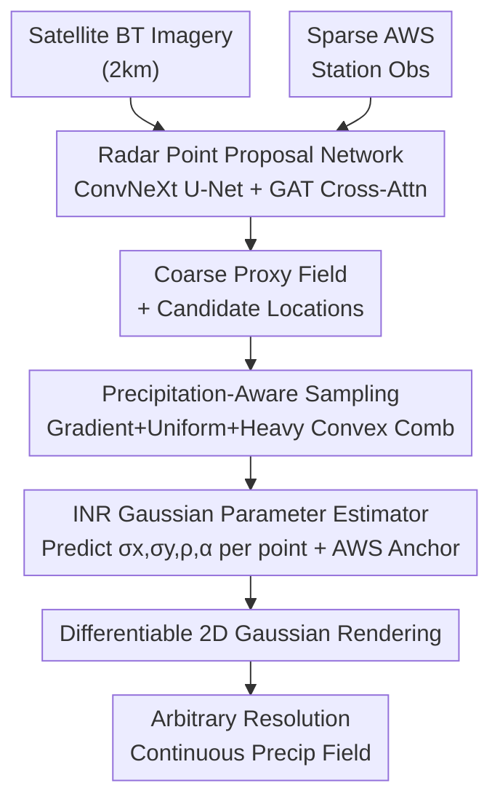

# Station2Radar: Query-Conditioned Gaussian Splatting for Precipitation Field

**Conference**: ICLR 2026  
**arXiv**: [2603.00418](https://arxiv.org/abs/2603.00418)  
**Code**: None  
**Area**: 3D Vision / Meteorological Remote Sensing  
**Keywords**: Gaussian Splatting, Precipitation Field Reconstruction, Implicit Neural Representation, Satellite-Station Fusion, Resolution-Agnostic Rendering

## TL;DR
The authors propose Query-Conditioned Gaussian Splatting (QCGS), the first work to introduce 2D Gaussian Splatting into precipitation field generation. By fusing satellite imagery with sparse Automatic Weather Station (AWS) observations, QCGS achieves resolution-flexible precipitation field reconstruction under radar-free conditions, improving RMSE by over 50% compared to traditional gridded products.

## Background & Motivation

**Background**: Precipitation forecasting relies on heterogeneous data sources—weather radar offers high accuracy but limited geographical coverage and high maintenance costs; weather stations provide accurate point measurements but are extremely sparse; satellites provide high-resolution wide-area coverage but cannot directly retrieve rainfall intensity. Most current deep learning precipitation forecasting methods (e.g., ConvLSTM, Diffusion Models) use radar as the primary input.

**Limitations of Prior Work**: Radar networks are unavailable in most parts of the world (especially developing countries), limiting the applicability of radar-centric methods. Traditional radar-free solutions mainly employ classical interpolation methods (Barnes, Kriging) using fixed Gaussian weights to extend station observations onto a grid, but these methods severely blur precipitation boundaries and are highly sensitive to station density. Satellite-based direct estimation methods (e.g., Sat2Radar) suffer from systemic biases and produce fixed-resolution outputs.

**Key Challenge**: Accurate reconstruction of precipitation fields requires: (1) anchoring accuracy from ground truth (only from stations), (2) spatially continuous coverage (only from satellites), and (3) resolution flexibility (not available in existing methods). These three requirements cannot be unified within existing frameworks.

**Goal**: How to generate high-resolution, structurally clear, and continuous precipitation fields by fusing satellite imagery and sparse weather station observations without relying on radar?

**Key Insight**: The authors observe that classical Gaussian weight interpolation is mathematically equivalent to a special case of Gaussian Splatting—traditional interpolation uses fixed isotropic kernels, while GS allows for learnable anisotropic kernels, adaptive amplitudes, and resolution-agnostic rendering. This observation bridges classical meteorological methods with new computer vision techniques.

**Core Idea**: Combine 2D Gaussian Splatting with Implicit Neural Representations (INR), using satellite features as conditions to predict adaptive Gaussian parameters and selectively rendering only in precipitation support regions to achieve efficient, resolution-flexible precipitation field generation.

## Method

### Overall Architecture
QCGS is a three-stage pipeline: the input consists of satellite brightness temperature images (2km resolution) and sparse AWS station observations, and the output is a continuous precipitation field at an arbitrary resolution. (1) The Radar Point Proposal Network fuses satellite and AWS information to generate a coarse precipitation proxy field and identify precipitation support locations; (2) The Precipitation-Aware Sampling Strategy selects query points from the proxy field; (3) The INR-based Gaussian Parameter Estimator predicts Gaussian splatting parameters for each query point, finally generating the precipitation field via differentiable 2D Gaussian rendering. Training is split into two stages—first training the Point Proposal Network, then training the Gaussian rendering module on fixed proposals.

### Key Designs

**1. Radar Point Proposal Network: Identifying "where it is raining" using a coarse proxy field**

The first step of the pipeline addresses the issue that satellites provide broad but indirect associations with rainfall, while AWS stations are accurate but sparse. To merge them into a coarse map that pinpoints rainfall locations, the authors pass satellite brightness temperature (BT) images through a ConvNeXt U-Net encoder-decoder to extract dense spatial features. Simultaneously, a Graph Attention Network (GAT, 3 layers, 8 heads) is used to extract robust representations $z^t$ from irregular AWS observations (containing missing values and outliers). This station representation is then injected into the U-Net decoder via cross-attention. The network outputs a coarse precipitation field $\hat{R}^t$ and a set of candidate rainfall locations for subsequent sampling. The advantage of GAT is its inherent ability to handle irregular distributions and noise, while cross-attention achieves cross-modal alignment—satellites govern "spatial structure" and stations govern "ground truth rainfall presence and intensity." In ablation studies, the addition of AWS fusion improved the CSI from 0.62 to 0.73, indicating this step is the primary contributor to the method's performance.

**2. Precipitation-Aware Sampling Strategy: Placing Gaussian kernels only where necessary**

Standard GS renders the entire image plane, but in precipitation fields, most areas have no rain; placing Gaussian kernels point-by-point there is wasteful. QCGS modifies this by sampling query points only in the rainfall regions identified by the coarse proxy field. The sampling probability is defined as a convex combination of three terms: a gradient term $G$ to increase sampling density near precipitation boundaries for sharpness, a uniform term $U$ to ensure overall coverage, and a heavy precipitation term $H$ using a temperature-scaled softmax to prioritize intense rainfall areas. The mixing weights for the three terms are 0.3/0.4/0.3, followed by Non-Maximum Suppression (NMS) to remove redundant points. The motivation is that light rain rarely causes disasters, while heavy precipitation is a high-impact event, making it more efficient to tilt the computational budget toward heavy rainfall and boundaries. The CSI for the triple combination (0.76) was higher than uniform sampling (0.68) or any single/double term combination, confirming the effectiveness of this bias.

**3. INR-based Gaussian Parameter Estimator: Assigning a learnable, anchorable anisotropic Gaussian to each query point**

Traditional GS optimizes parameters per image, requiring retraining for new scenes and lacking generalization; this module uses a conditioned INR to overcome this limitation. Conditioned on intermediate satellite features, it predicts a set of Gaussian parameters $\{\sigma_x, \sigma_y, \rho, \alpha\}$ for each query point through cross-attention. The first three define an anisotropic covariance matrix (providing better fit to directional structures than fixed isotropic kernels), and $\alpha$ controls the amplitude. The INR network is a 5-layer MLP (hidden dimension 128, sinusoidal positional encoding). Since parameter prediction is based on satellite conditional features, the model generalizes across regions and seasons. A critical detail is ground truth anchoring: at AWS stations with non-zero precipitation, the $\alpha$ of that point is directly set to the station observation value. This serves as a hard constraint to avoid systemic biases common in pure satellite-driven methods like Sat2Radar. The predicted kernels are synthesized into a continuous precipitation field at arbitrary resolution via differentiable 2D rendering.

### Loss & Training
The total loss is a combination of reconstruction error and regularization: $\mathcal{L} = \text{MSE}(\tilde{R}^t, R^t) + \lambda_\sigma \sum_n (\sigma_x^{(n)} + \sigma_y^{(n)}) + \lambda_\alpha \sum_n \alpha^{(n)}$. The regularization terms for covariance ($\lambda_\sigma = 10^{-3}$) and amplitude ($\lambda_\alpha = 10^{-4}$) prevent the Gaussian kernels from over-expanding and causing excessive smoothing. Training uses the Adam optimizer (lr $10^{-4}$, cosine schedule), batch size 16, 100 epochs, and 8×H200 GPUs.

## Key Experimental Results

### Main Results

| Method | Type | Resolution | RMSE↓ | CSI↑ | FSS↑ | CC↑ |
|------|------|--------|-------|------|------|-----|
| Pix2PixHD | Deep Learning | 0.5km | 2.45 | 0.59 | 0.71 | 0.55 |
| NPM | Deep Learning | 0.5km | 1.95 | 0.59 | 0.78 | 0.68 |
| BBDM | Deep Learning | 0.5km | 1.68 | 0.64 | 0.84 | 0.75 |
| Kriging | Classical | 2.0km | 2.43 | 0.50 | 0.69 | 0.45 |
| **QCGS** | **Ours** | **0.5km** | **1.23** | **0.74** | **0.91** | **0.90** |
| **QCGS** | **Ours** | **2.0km** | **1.00** | **0.76** | **0.96** | **0.93** |

In comparison with global operational products, QCGS also leads significantly in daily accumulated precipitation: RMSE 6.68 vs. IMERG 14.08 / MSWEP 12.44, CC 0.95 vs. max 0.78.

### Ablation Study

| Configuration | CSI↑ | Note |
|------|------|------|
| U-Net (ConvNeXt) only | 0.62 | Pure satellite baseline |
| + AWS fusion | 0.73 | Station fusion contribution +0.11 |
| + AWS fusion + GS (Full) | 0.76 | GS rendering adding +0.03 |
| Uniform sampling only | 0.68 | Lacks focus on boundaries and heavy rain |
| Triple mixed sampling | 0.76 | Optimal combination |
| K=1000 points | 0.69 | Insufficient points |
| K=6000 points | 0.76 | Best cost-performance |
| K=9000 points | 0.77 | Diminishing marginal returns |

### Key Findings
- AWS fusion is the largest contributor (CSI +0.11), proving that sparse but accurate ground observations are crucial for precipitation field reconstruction.
- The resolution flexibility provided by Gaussian Splatting allows a model trained at 2km to outperform deep learning baselines trained at 0.5km when evaluated at 0.5km.
- Power Spectral Density (PSD) analysis shows that QCGS is the closest to the radar spectrum across all spatial scales, while operational products lose variance at high wavenumbers.

## Highlights & Insights
- The observation of equivalence between classical meteorological interpolation and Gaussian Splatting is very clever—traditional Gaussian weighting is a fixed isotropic special case of GS, allowing techniques from the 3DGS community to transfer naturally to meteorology.
- The selective rendering design is elegant: by placing Gaussian kernels only in precipitation areas and avoiding useless computation in the massive non-precipitating zones, it achieves a win-win for efficiency and accuracy.
- The AWS anchoring strategy is simple but effective—setting the amplitude at station locations directly to observations serves as a hard constraint, ensuring the generated field is perfectly accurate at known points.

## Limitations & Future Work
- Dependency on AWS station data—applicability is limited in regions with sparse station networks (e.g., Africa, oceans); future work could explore degradation schemes for pure satellite modes.
- Experiments are restricted to the South Korea region (480×480 grid); global-scale expansion remains an open challenge.
- The Point Proposal Network and Gaussian rendering module are trained in two stages; end-to-end joint training might yield further improvements.
- The work only handles precipitation field "generation" and does not involve temporal forecasting; combining it with temporal extrapolation could build a complete radar-free precipitation forecasting system.

## Related Work & Insights
- **vs. Sat2Radar (NPM)**: NPM is pure satellite-driven with fixed resolution output; QCGS uses multi-source fusion and is resolution-flexible, reducing RMSE by 37%.
- **vs. Classical Interpolation (Kriging)**: Kriging uses fixed, isotropic kernels; QCGS learns adaptive anisotropic kernels, increasing CSI from 0.50 to 0.76.
- **vs. 2D GS Image Methods (GaussianImage)**: Image GS requires per-image optimization and cannot generalize; QCGS achieves cross-scene generalization via conditioned INR.
- This paradigm of transferring emerging CV technologies (GS/INR) to scientific domains is noteworthy; similar methods could be applied to other geophysical variables like temperature or wind fields.

## Rating
- Novelty: ⭐⭐⭐⭐ First to introduce 2D GS to precipitation generation; creative observation of interpolation-GS equivalence.
- Experimental Thoroughness: ⭐⭐⭐⭐ Comprehensive cross-scale comparisons (snapshot/hourly/daily) and solid ablation studies including PSD analysis.
- Writing Quality: ⭐⭐⭐⭐ Clear motivation, unified mathematical notation, and high-quality figures.
- Value: ⭐⭐⭐⭐ Opens a new paradigm for radar-free precipitation monitoring, though regional constraints reduce immediate global impact.

<!-- RELATED:START -->

## Related Papers

- [\[ICLR 2026\] Augmented Radiance Field: A General Framework for Enhanced Gaussian Splatting](augmented_radiance_field_a_general_framework_for_enhanced_gaussian_splatting.md)
- [\[ICLR 2026\] Horseshoe Splatting: Handling Structural Sparsity for Uncertainty-Aware Gaussian-Splatting Radiance Field Rendering](horseshoe_splatting_handling_structural_sparsity_for_uncertainty-aware_gaussian-.md)
- [\[ICLR 2026\] LiTo: Surface Light Field Tokenization](lito_surface_light_field_tokenization.md)
- [\[ICLR 2026\] Positional Encoding Field](positional_encoding_field.md)
- [\[ICLR 2026\] Distractor-free Generalizable 3D Gaussian Splatting](distractor-free_generalizable_3d_gaussian_splatting.md)

<!-- RELATED:END -->
