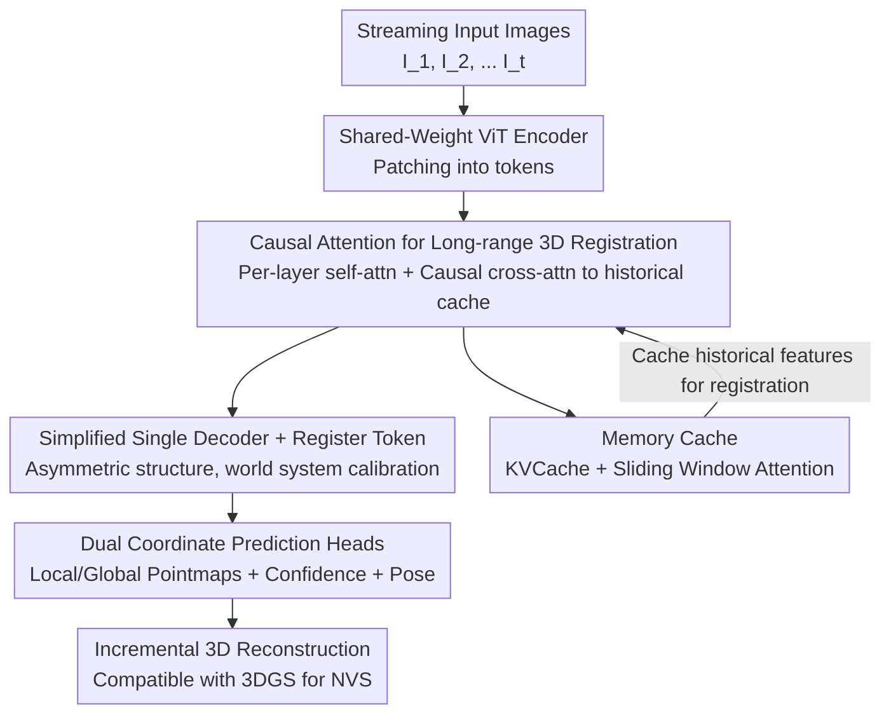

# STream3R: Scalable Sequential 3D Reconstruction with Causal Transformer

**Conference**: ICLR 2026  
**OpenReview**: [https://openreview.net/forum?id=RTTYGeC2Io](https://openreview.net/forum?id=RTTYGeC2Io)  
**Paper**: [Project Page](https://nirvanalan.github.io/projects/stream3r)  
**Code**: https://github.com/ (See project page)  
**Area**: 3D Vision  
**Keywords**: Streaming 3D Reconstruction, Causal Transformer, Pointmap Regression, KVCache, Dynamic Scenes

## TL;DR
STREAM3R reformulates dense 3D reconstruction as a "frame-by-frame causal attention problem in a decoder-only Transformer." Whenever a new image arrives, it performs causal cross-attention with the cached historical frame features to regress pointmaps. This enables incremental online reconstruction using KVCache and sliding window attention similar to LLMs, achieving performance superior to or comparable with existing streaming methods in depth estimation and 3D reconstruction for both static and dynamic scenes, while offering faster inference.

## Background & Motivation

**Background**: DUSt3R pioneered the paradigm of "directly regressing pointmaps with a Transformer," transforming binocular stereo reconstruction into dense pointmap regression to jointly estimate depth, pose, and intrinsics. Subsequent works like MASt3R, Fast3R, and VGG-T extended this from two views to tens or hundreds of images, providing a more unified multi-view reconstruction solution.

**Limitations of Prior Work**: However, these methods assume the input is a **fixed batch of images**. In reality, many scenarios are **streaming**—such as autonomous vehicles exploring new environments or processing long video sequences—where the reconstruction must be updated immediately as each frame arrives. Current methods like Fast3R or VGG-T require full re-computation from scratch for every new frame, which involves significant redundant calculation and cannot handle long videos as full-attention costs explode with sequence length. Spann3R uses a fixed-size memory module for incremental reconstruction but suffers from severe cumulative drift and fails in dynamic scenes. The most relevant concurrent work, CUT3R, uses an RNN paradigm to handle streaming inputs, but RNNs are incompatible with modern network architectures and hardware acceleration, have limited memory capacity, and struggle with long-range dependencies.

**Key Challenge**: The fundamental requirement for streaming 3D reconstruction is "incorporating new frame content onto previous reconstruction results at each step"—which is exactly how **causal attention + KVCache** works in LLMs (predicting each step by reusing prior computations). Existing 3D reconstruction methods either use expensive bidirectional full-attention/global optimization (non-incremental) or limited-capacity RNN states (weak modeling). Neither path correctly addresses the "streaming" nature of the problem.

**Goal**: Design a reconstructor capable of online, incremental processing of unstructured or streaming image inputs, possessing strong geometric priors for generalization to dynamic scenes while remaining naturally compatible with modern LLM training and inference infrastructure.

**Key Insight**: The authors observe that unidirectional causal attention Transformers have been proven efficient for reusing historical computations in language and audio tasks. Streaming 3D reconstruction also requires "registering new frames based on historical observations," making the two structures highly isomorphic. Therefore, instead of using BERT-style bidirectional attention like Fast3R or VGG-T, the authors adopt a **decoder-only (GPT-style)** approach.

**Core Idea**: Reformulate pointmap prediction as "sequential registration with causal attention"—where new frames only perform causal cross-attention with **cached historical frame features** to regress pointmaps, enabling online reconstruction with linear overhead via KVCache and sliding window attention.

## Method

### Overall Architecture
STREAM3R takes a sequence of uncalibrated RGB images $(I)^N_t$ (either unstructured sets or videos) and outputs per-frame local coordinate pointmaps $\hat{X}^{local}_t$, global coordinate pointmaps $\hat{X}^{global}_t$ (with the camera frame of $I_1$ as the world system), and relative camera poses $\hat{P}_t \in \mathbb{R}^9$ (including intrinsics and extrinsics).

The pipeline uses the DUSt3R backbone but modifies the decoder: each new image is first split into $K$ tokens by a weight-shared ViT encoder $F_t = \text{Encoder}(I_t)$ and fed into a **single** causal decoder. Each decoder layer first performs intra-frame self-attention, then lets the current frame tokens perform causal cross-attention against the **cached features from all previous frames** for that layer. After decoding, two DPT heads regress local/global pointmaps and confidence scores, and one head regresses the pose. Processed frame features are stored in a Memory Cache (KVCache) to serve as references for subsequent registration—allowing online context accumulation and incremental 3D output without needing an independent decoder for every frame.

### Key Designs

**1. Causal Attention for Streaming 3D Registration: Pointmap Prediction as a Decoder-only Sequential Problem**

To solve the core contradiction of "full-attention being non-incremental vs. RNN memory being too small," STREAM3R transforms the decoding of each frame into causal cross-attention against historical frames. Specifically, in each decoder block, after intra-frame self-attention, the current frame's $i$-th layer features $G^{i-1}_t$ cross-attend to the features of **all historical frames** at the same layer:

$$G^i_t = \text{DecoderBlock}^i\left(G^{i-1}_t,\; G^{i-1}_0 \oplus G^{i-1}_1 \oplus \cdots \oplus G^{i-1}_{t-1}\right)$$

This differs from DUSt3R’s bidirectional symmetric cross-attention (limited to two views), VGG-T/Fast3R’s full-sequence bidirectional attention, and CUT3R’s interaction with a single learnable state. It is strictly unidirectional; new frames can only see the past, making it naturally compatible with KVCache to cache historical tokens and reuse them, avoiding re-computation. The authors found that this sequential registration inductive bias perfectly fits the requirements of online reconstruction, leading to faster convergence and the ability to model long-range dependencies.

**2. Simplified Single Decoder + Register Token: Scaling from Two Views to Arbitrary Frames**

The DUSt3R decoder is a symmetric dual-branch design ($\text{Decoder}_1, \text{Decoder}_2$), inherently limited to two images. To support arbitrary frame counts, STREAM3R removes the symmetric design and **retains only a single decoder** $\text{Decoder} = \text{Decoder}_1$ to process all frames. Each block contains one SelfAttn (intra-frame) and one CrossAttn (causal attention to history). The first two frames are still processed using the DUSt3R two-view convention due to lack of historical context, but all frames from the third onward use the causal operation in Eq. (2).

To allow the model to identify the canonical world coordinate system, the authors add a learnable register token element-wise to the first frame tokens: $F_1 = F_1 + [\text{reg}]$. Through this [reg] tag, the model learns to output global points relative to the first frame as the world system **without needing independent decoders for each of the N frames**. Unlike Fast3R, no positional encodings are added to other frames for simplicity—sequential registration implicitly encodes order.

**3. LLM-style KVCache + Sliding Window Attention: Linear or Constant Cache Growth**

The biggest advantage of a decoder-only architecture is natural compatibility with modern LLM training/inference infra. Bidirectional methods process all views jointly, causing attention memory to grow quadratically; STREAM3R processes frames sequentially and uses FlashAttention to reduce memory growth from quadratic to linear. The KVCache grows **linearly** with the number of frames (at 100 frames, STREAM3Rα uses only 16.32 GB, بينما VGG-T reaches 63.63 GB).

Furthermore, it supports sliding window attention without any fine-tuning. STREAM3R-W[5] always attends only to the "first frame + latest 5 frames," keeping the KVCache size **constant** (stable at 3.72 GB for 100 frames) while achieving depth accuracy comparable to or better than full caching. This completely decouples steaming reconstruction memory from sequence length, a scalability neither RNN nor global optimization methods provide.

### Loss & Training
The training follows and extends DUSt3R’s pointmap loss. For local/global pointmaps, a confidence-aware regression loss is used: $L_{conf} = \sum_{(\hat{x},\hat{c})} \left( \hat{c} \cdot \lVert \frac{\hat{x}}{\hat{s}} - \frac{x}{s} \rVert^2 - \alpha \log \hat{c} \right)$, where $\hat{s}, s$ are normalization factors for scale-invariant supervision. For metric-scale datasets, $\hat{s} := s$ is set to output metric pointmaps. The pose loss parameterizes $\hat{P}_t$ as quaternions $\hat{q}_t$, translation $\hat{\tau}_t$, and focal length $\hat{f}_t$, using L2 loss for all three. Predicting redundant local and global pointmaps is shown to simplify training and allow training on 3D datasets with only partial labels. The model is trained using AdamW, batch 64, learning rate 1e-4 for 400K steps. Each batch randomly samples 4–10 frames with resolutions mixed between $224^2$ and $512\times384$. Training takes 7 days on 8 A100 GPUs.

## Key Experimental Results

### Main Results
Single-view depth estimation (zero-shot, out-of-domain): STREAM3Rβ (initialized from VGG-T) achieves the best performance on most datasets.

| Dataset | Metric | STREAM3Rβ | VGG-T | CUT3R |
|---------|--------|-----------|-------|-------|
| Sintel  | Abs Rel ↓ / δ<1.25 ↑ | **0.228 / 70.7** | 0.271 / 67.7 | 0.428 / 55.4 |
| Bonn    | Abs Rel ↓ / δ<1.25 ↑ | **0.061 / 96.7** | 0.053 / 97.3 | 0.063 / 96.2 |
| KITTI   | Abs Rel ↓ / δ<1.25 ↑ | **0.063 / 95.5** | 0.076 / 93.3 | 0.092 / 91.3 |
| NYU-v2  | Abs Rel ↓ / δ<1.25 ↑ | **0.057 / 95.7** | 0.060 / 94.8 | 0.086 / 90.9 |

Video depth estimation (per-sequence scale alignment, with KITTI FPS): SOTA among streaming methods and approximately 40% faster than CUT3R.

| Method | Type | Sintel Abs Rel ↓ | KITTI Abs Rel ↓ | FPS ↑ |
|--------|------|------------------|-----------------|-------|
| CUT3R  | Stream | 0.421 | 0.118 | 16.58 |
| STREAM3Rβ | Stream | **0.264** | **0.080** | 12.95 |
| STREAM3Rβ-W[5] | Stream | 0.279 | 0.083 | **32.93** |
| STREAM3Rα | Stream | 0.478 | 0.116 | 23.48 |

3D Reconstruction (7-Scenes, sparse 3–5 frames): STREAM3Rβ matches or exceeds offline global optimization methods in Acc/Comp/NC and is 50%+ faster than CUT3R.

| Method | Acc(Mean) ↓ | Comp(Mean) ↓ | NC(Mean) ↑ | FPS ↑ |
|--------|-------------|--------------|------------|-------|
| CUT3R  | 0.126 | 0.154 | 0.727 | 17.00 |
| STREAM3Rβ | **0.122** | **0.101** | **0.746** | 20.12 |

### Ablation Study
Comparing the proposed decoder-only architecture against CUT3R’s RNN architecture using the same dataset, MASt3R initialization, and compute (evaluated at the same iteration).

| Config | Sintel Abs Rel ↓ | KITTI Abs Rel ↓ | 7-Scenes Acc(Mean) ↓ | Description |
|--------|------------------|-----------------|----------------------|-------------|
| CUT3R (RNN) | 0.598 | 0.157 | 0.480 | Limited state memory capacity |
| STREAM3Rα (Ours) | **0.535** | **0.141** | **0.328** | Causal attention + Full cache |

### Key Findings
- **Decoder-only converges faster**: Although STREAM3R attends to a longer context than CUT3R’s constant state, it runs 60% more training steps in the same time and converges faster. This is because CUT3R requires a state update after each read, whereas STREAM3R attends directly to cached features, bypassing serial update overhead.
- **Global branch shows the largest gap**: Both architectures converge similarly for the local head $\text{Head}_{local}$, but Ours is significantly faster for the global head $\text{Head}_{global}$. This suggests a single state has limited capacity for registering new frames into a global world system, whereas causal full caching retains sufficient history.
- **Sliding window is nearly free**: STREAM3Rβ-W[5] only looks at 5 historical frames with a constant KVCache, yet it outperforms full caching on Bonn / KITTI, achieving the fastest FPS among streaming methods.
- **Robustness to first-frame corruption**: After corrupting the first frame with a Real-ESRGAN degradation pipeline, CUT3R’s Acc jumped from 0.126 to 0.335, while STREAM3R only rose from 0.122 to 0.223.

## Highlights & Insights
- **"LLM-ification" of 3D Reconstruction**: The core insight is the structural isomorphism between streaming reconstruction and causal language modeling—"registering new frames on historical observations" ≈ "predicting the next token based on history." Once formulated this way, the entire LLM infrastructure (KVCache, sliding window, FlashAttention, mixed precision) can be reused, providing massive gains in scalability and engineering maturity.
- **Minimalist expansion with single decoder + register token**: Instead of multiple decoders or complex positional encodings, a single learnable [reg] token is used to anchor the world system. This neatly extends the symmetric two-view structure to arbitrary frames.
- **Redundant Dual Coordinate Prediction**: Regressing both local and global pointmaps might seem redundant, but it simplifies training and allows leveraging 3D datasets with only partial labels—a trick transferable to other multi-task geometric predictions.
- **Constant Cache for Sliding Window**: Maintaining accuracy with a constant KVCache enables truly infinite online video processing, a feature neither RNNs (due to drift) nor global optimization (due to quadratic cost) can provide.

## Limitations & Future Work
- **First two frames follow DUSt3R convention**: The sequence start lacks historical context and is not yet fully unified into the causal paradigm; the initialization stage remains a special case.
- **Reliance on the first frame as the world anchor**: Defining the global coordinate system via the first frame is a DUSt3R tradition. While experiments show robustness to low-quality/low-overlap first frames, the anchor selection itself is a single-point dependency. Failure modes in extreme cases warrant further study.
- **Compute-limited Ablations**: Ablation models were only trained at $224^2$ resolution and for only 7 epochs on a subset of data due to compute constraints. The upper bound under full training is not yet explored.
- **Future Directions**: Integrating the first two frames into the unified causal framework, introducing multi-anchor or adaptive world systems, and verifying drift accumulation on even longer videos are natural extensions.

## Related Work & Insights
- **vs. DUSt3R / MASt3R**: These treat reconstruction as pointmap regression but only handle two views and require expensive global alignment. Ours retains the pointmap advantages but uses a single decoder + causal attention to scale to arbitrary frames without post-processing alignment.
- **vs. Fast3R / VGG-T**: These use bidirectional full-attention for multi-view fusion, requiring full re-calculation for new frames and quadratic memory growth. Ours uses a decoder-only causal path with linear KVCache growth for online incremental updates.
- **vs. Spann3R / CUT3R**: Spann3R uses a fixed memory module with high drift and fail in dynamic scenes; CUT3R uses an RNN state with limited capacity and hardware incompatibility. Ours uses causal full cache + sliding window, modeling long-range dependencies while remaining compatible with FlashAttention/KVCache for faster convergence and higher accuracy.
- **vs. MonST3R**: MonST3R fine-tunes DUSt3R for dynamic scenes but still requires sliding-window-style per-video global alignment; Ours provides feed-forward 4D reconstruction without per-video optimization or post-alignment.

## Rating
- Novelty: ⭐⭐⭐⭐⭐ Reformulating streaming 3D reconstruction as a decoder-only causal attention problem creates a clear isomorphism with the LLM paradigm, offering fresh perspectives and infrastructure reuse.
- Experimental Thoroughness: ⭐⭐⭐⭐ Covers single/video depth, 3D reconstruction, memory/FPS, robustness, and downstream NVS. Rich comparisons, though core ablations were limited by compute to lower resolutions.
- Writing Quality: ⭐⭐⭐⭐⭐ The derivation of motivation (streaming ↔ causal isomorphism) is clear and powerful; methods and formulas are cleanly presented.
- Value: ⭐⭐⭐⭐⭐ Online/long-sequence 3D perception is a critical need for autonomous driving, robotics, and VR. Constant cache and LLM infra compatibility provide high engineering value.

<!-- RELATED:START -->

## Related Papers

- [\[ICLR 2026\] Streaming Visual Geometry Transformer](streaming_visual_geometry_transformer.md)
- [\[ICLR 2026\] IGGT: Instance-Grounded Geometry Transformer for Semantic 3D Reconstruction](iggt_instance-grounded_geometry_transformer_for_semantic_3d_reconstruction.md)
- [\[ICLR 2026\] NOVA3R: Non-pixel-aligned Visual Transformer for Amodal 3D Reconstruction](nova3r_non-pixel-aligned_visual_transformer_for_amodal_3d_reconstruction.md)
- [\[CVPR 2026\] Online3R: Online Learning for Consistent Sequential Reconstruction Based on Geometry Foundation Model](../../CVPR2026/3d_vision/online3r_online_learning_for_consistent_sequential_reconstruction_based_on_geome.md)
- [\[CVPR 2026\] ART: Articulated Reconstruction Transformer](../../CVPR2026/3d_vision/art_articulated_reconstruction_transformer.md)

<!-- RELATED:END -->
