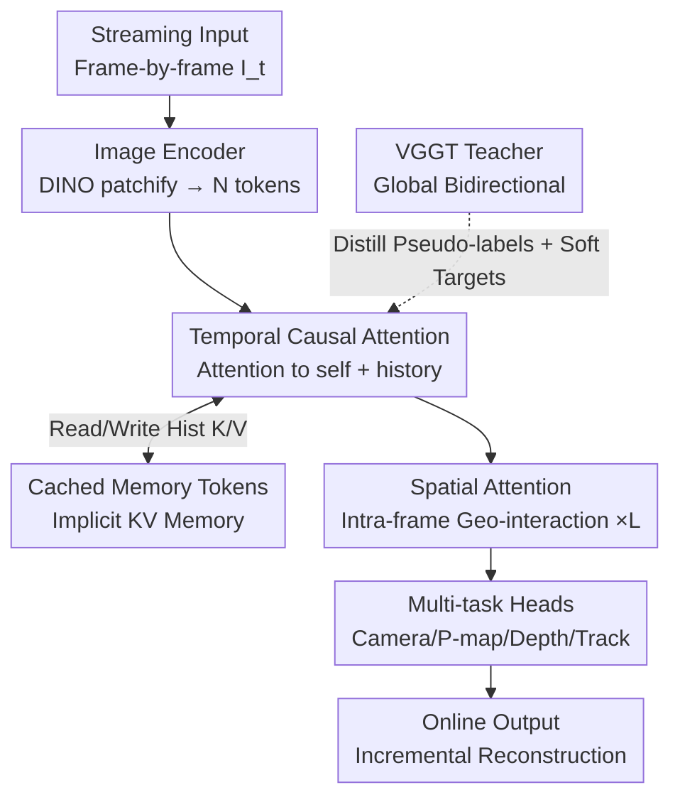

# Streaming Visual Geometry Transformer

**Conference**: ICLR 2026  
**OpenReview**: [https://openreview.net/forum?id=5APgTKsnx8](https://openreview.net/forum?id=5APgTKsnx8)  
**Paper**: [Project Page](https://wzzheng.net/StreamVGGT/)  
**Code**: https://github.com/ (Project page links to StreamVGGT)  
**Area**: 3D Vision  
**Keywords**: Streaming 3D Reconstruction, Causal Transformer, KV Cache Memory, Knowledge Distillation, Online Perception

## TL;DR
This paper proposes StreamVGGT, which transforms the offline global-attention-based VGGT into a causal Transformer utilizing "temporal causal attention + cached memory tokens." This enables 3D geometric reconstruction to be updated incrementally frame-by-frame (reducing latency from $O(N^2)$ to $O(N)$). By distilling from the original VGGT as a teacher for low-cost training, StreamVGGT approaches the performance of the offline VGGT and outperforms existing streaming methods across multiple 3D reconstruction, depth, and pose benchmarks.

## Background & Motivation
**Background**: Restoring 3D geometry (point clouds, depth, camera poses) from video is a fundamental task in computer vision. Recent learning-based methods, such as pairwise regression in DUSt3R/MASt3R or feed-forward large models like Fast3R/VGGT, bypass explicit geometric constraints and global optimization of SfM/MVS to directly predict dense 3D structures end-to-end. Among these, VGGT is a "Visual Geometry Grounding Transformer" with 1.2B parameters that achieves SOTA accuracy by allowing all frames to interact via global self-attention in a single forward pass to jointly predict intrinsics, extrinsics, depth, point maps, and 2D tracks.

**Limitations of Prior Work**: Global interaction methods like VGGT follow an **offline paradigm**; their self-attention requires re-encoding the entire sequence whenever a new image arrives. This introduces two issues: (1) token-pair complexity is $O(N^2)$, leading to exploding memory and latency as sequences lengthen (e.g., at 40 frames, VGGT inference takes 2089 ms and 11.4 GB VRAM per frame); (2) this "recalculating the full sequence" approach contradicts the causality of human perception, which only sees the past and cannot look ahead, making incremental frame-by-frame reconstruction impossible.

**Key Challenge**: The most accurate global attention mechanisms are inherently non-causal and non-incremental, whereas streaming applications (autonomous driving, robotics, AR/VR) strictly require low latency and frame-by-frame updates. Existing streaming methods (e.g., Spann3R, CUT3R, Point3R) utilize external memory banks or recurrent states for increments, but they either drift on long/dynamic sequences or face expensive recurrent training, while the accumulation of errors in causal architectures remains unresolved.

**Goal**: Convert VGGT into a streaming model capable of frame-by-frame increments, low latency, and controllable memory while retaining VGGT-level accuracy and minimizing training costs.

**Key Insight**: The authors draw inspiration from the philosophy of autoregressive Large Language Models (LLMs). Since LLMs use causal attention + KV caching to generate tokens in a streaming fashion, 3D reconstruction can similarly cache "key/values of historical frames" as implicit memory and advance frame-by-frame using causal attention. This avoids the need for complex, explicitly designed memory read/write mechanisms.

**Core Idea**: Replace the global self-attention of VGGT with "temporal causal self-attention," using K/V from historical frames as cached implicit memory to achieve $O(N)$ incremental reconstruction. Subsequently, use the dense bidirectional VGGT as a teacher to distill the causal student model, achieving near-teacher accuracy at low cost.

## Method

### Overall Architecture
StreamVGGT adopts the three-stage backbone of VGGT—**Image Encoder → Spatio-temporal Decoder → Multi-task Heads**—but replaces all global self-attention layers in the decoder with an alternating structure of "spatial attention + temporal causal attention." Sequential video frames $\{I_t\}_{t=1}^{T}$ are input, where each frame $I_t\in\mathbb{R}^{3\times H\times W}$ is first patchified by DINO into $N$ image tokens $F_t\in\mathbb{R}^{N\times C}$. The decoder restricts each token to attend only to "itself + historical frames," outputting geometric tokens $G_t$. Finally, three task heads predict point maps, depth maps, camera poses, and tracks frame-by-frame from $G_t$. The first frame is marked as the global reference frame using a learnable camera token, and subsequent frames are incrementally aligned within this shared coordinate system, thus the pipeline **requires no post-processing for global alignment**.

The same weights are used for training and inference in two modes: **During training**, the entire sequence is fed at once, with a causal mask ensuring each token only attends to the past to learn true streaming behavior. **During inference**, images arrive frame-by-frame, and K/V pairs calculated for historical frames are cached as implicit memory. The current frame only performs cross-attention with the cache, replicating the causal attention learned during training and avoiding full sequence recalculation.

### Key Designs

**1. Temporal Causal Attention: Replacing Global $O(N^2)$ with Causal $O(N)$**

This represents the core shift from the offline paradigm. VGGT's global self-attention allows every token to attend to every other token in the sequence: $\{G_t\}_{t=1}^{T}=\text{Decoder}(\text{Global SelfAttn}(\{F_t\}_{t=1}^{T}))$. While accurate, it has $O(N^2)$ complexity and requires recalculation for every new frame. The authors replace all global self-attention in the decoder with temporal causal attention $\{G_t\}_{t=1}^{T}=\text{Decoder}(\text{Temporal SelfAttn}(\{F_t\}_{t=1}^{T}))$, where each token only attends to the current and previous frames, reducing latency to $O(N)$. The decoder stacks $L=24$ alternating layers of spatial attention (intra-frame token interaction for single-frame geometry) and temporal causal attention (inter-frame but look-back only). This preserves rich cross-frame context for spatial consistency while naturally fitting the causal structure of streaming data.

**2. Cached Memory Tokens: Incremental Inference with Implicit KV Caching**

While sequences are input entirely during training, streaming inference occurs frame-by-frame. Recalculating the forward pass for all history would revert the system back to offline performance. The authors introduce an implicit memory mechanism, caching the tokens $M\in\mathbb{R}^{T\times N\times C}$ (history key/value pairs for each layer). When current frame $T$ arrives, cross-attention is performed only between "current frame tokens $F_T$" and "cached memory $\{M_t\}_{t=1}^{T-1}$":

$$G_T = \text{Decoder}(\text{CrossAttn}(F_T, \{M_t\}_{t=1}^{T-1})),\quad M_T = \text{TokenCachedMemory}(G_T).$$

This accurately replicates training-time causal attention during inference—historical information is reused from the cache rather than recalculated. Ablations show that incremental inference with cached memory yields almost identical precision to "full sequence input," proving the cache is virtually lossless while providing immense speedups (reducing 5th-frame inference from 850 ms to 88 ms).

**3. VGGT-based Knowledge Distillation: Low-cost Training for Causal Students**

Causal architectures are suitable for low-latency inference but training them across datasets from scratch requires massive labeling. The authors use the dense bidirectional VGGT as a teacher to distill geometric understanding into the causal student. The teacher provides dense **pseudo-labels** for camera parameters, depth, point maps, and tracks, unifying multi-task supervision without full ground truth. The training loss follows the VGGT design $L = L_{\text{camera}} + L_{\text{depth}} + L_{\text{pmap}}$, but substitutes ground truth with teacher outputs. Cameras use Huber loss $L_{\text{camera}}=\sum_i\|\hat g_i - g_i\|_\epsilon$, while depth/point map losses include teacher-provided confidence weighting and gradient terms (e.g., $L_{\text{depth}}=\sum_i\|\hat\Sigma^D_i\odot(\hat D_i-D_i)\| + \|\hat\Sigma^D_i\odot(\nabla\hat D_i-\nabla D_i)\| - \alpha\log\hat\Sigma^D_i$). Teacher soft targets and confidence estimates act as effective regularization, improving robustness and generalization.

**4. Window/K-Nearest Neighbor Pruning for Long Sequences: Controlling Cache Growth**

The cost of cached memory is that the number of tokens grows linearly with the sequence length. Long videos can cause memory and latency to spiral (e.g., 200 frames without pruning leads to 733 ms latency and 25.3 GB VRAM). The authors provide two pruning strategies: **Window Streaming** segments the sequence into fixed-length blocks, reconstructing within blocks and aligning them using predicted camera extrinsics. **K-Nearest Neighbor Caching** restricts each frame to attend only to the tokens of the $K$ most recent frames. Strategic pruning (e.g., a 50-frame window) on 200-frame sequences bounds VRAM to 8.2 GB and latency to 219 ms, with accuracy remaining comparable to unpruned versions.

### Loss & Training
- Total Loss: $L = L_{\text{camera}} + L_{\text{depth}} + L_{\text{pmap}}$, using VGGT teacher outputs as pseudo-ground truth.
- Camera loss utilizes Huber loss for outlier robustness. Depth and point map losses include confidence weighting, gradient consistency, and a $-\alpha\log\Sigma$ confidence regularization term.
- Initialized with VGGT weights; image backbone is frozen while ~950M parameters are fine-tuned for 10 epochs. 
- Optimizer: AdamW with linear warmup (first 0.5 epoch) followed by cosine decay; peak learning rate 1e-6. Each iteration samples 10 frames with the longest side resized to 518.

## Key Experimental Results

### Main Results
3D Reconstruction (7-Scenes / NRGBD / ETH3D), Lower Acc/Comp/Overall is better:

| Dataset | Metric | StreamVGGT | CUT3R (Streaming SOTA) | VGGT (Offline) |
|--------|------|-----------|-----------------|-----------|
| 7-Scenes | Acc Mean↓ | 0.129 | 0.126 | 0.088 |
| NRGBD | Comp Mean↓ | 0.074 | 0.076 | 0.077 |
| ETH3D | Overall↓ | **0.577** | 1.411 | 0.686 |

On ETH3D, StreamVGGT outperforms the offline VGGT (0.577 vs 0.686) using only current and historical frames, significantly leading over CUT3R (1.411). Single-frame depth (Table 4) exceeds existing streaming SOTAs across Sintel/Bonn/KITTI/NYU. Pose estimation (Table 6) shows ScanNet ATE 0.048 and TUM-dynamics ATE 0.026, approaching offline VGGT performance while providing streaming capabilities.

Efficiency Comparison (Table 7, Online setting, Per-frame Latency/VRAM):

| Frames | StreamVGGT (ms/GB) | CUT3R (ms/GB) |
|------|--------------------|---------------|
| 1 | 63 / 2.1 | 101 / 3.4 |
| 10 | 120 / 3.2 | 99 / 3.6 |
| 40 | 216 / 6.6 | 102 / 4.2 |

Compared to offline VGGT (2089 ms at 40 frames), StreamVGGT achieves a nearly 10x speedup at 216 ms.

### Ablation Study
| Configuration | 7-Scenes Acc↓ | Description |
|------|---------------|------|
| StreamVGGT (w/ KD) | 0.129 | Full Model |
| StreamVGGT (w/o KD) | 0.202 | No distillation, error rises significantly |
| VGGT Teacher (Global) | 0.088 | Offline Upper Bound |

Cache Mechanism Ablation (Table 10, frame 5):

| Configuration | Infer Time | Peak VRAM |
|------|---------|---------|
| w/o FlashAttn & Cache | 1135.9 ms | 5.4 GB |
| w/ FlashAttn | 850.7 ms | 2.3 GB |
| w/ FlashAttn & Cache | **88.2 ms** | 2.7 GB |

### Key Findings
- **Cached Memory Tokens drive speedups**: Adding FlashAttention primarily reduces memory (850 ms with 2.3 GB), but the caching mechanism provides the latency cut from 850 ms to 88 ms.
- **Distillation is vital for precision**: Stripping KD nearly doubles the error on 7-Scenes/NRGBD, suggesting causal students struggle to learn high-quality representations with limited resources without teacher pseudo-labels.
- **Window pruning is nearly lossless**: For 200 frames, using a 50-frame window reduces VRAM from 25.3 GB to 8.2 GB and latency from 733 ms to 219 ms, with slightly improved accuracy.

## Highlights & Insights
- **Migration of LLM KV cache to 3D reconstruction**: Instead of complex explicit memory read/writes, caching historical K/V as implicit memory is simple and strictly consistent with training behavior.
- **Train-Inference Consistency**: Training with sequential input + causal masks and inferring frame-by-frame with caching ensures the cache approximation is lossless, avoiding the typical train/test gap in causal architectures.
- **Distilling strong offline to online**: Using "accurate but non-streaming" VGGT as a teacher to supervise "streaming but hard-to-train" causal students provides a paradigm for other tasks.
- **Immediate engineering benefits**: The causal structure allows for the direct application of highly optimized operators like FlashAttention-2.

## Limitations & Future Work
- **Linear expansion of cache**: VRAM and latency still increase with sequence length unless pruning is used. Pruning strategies can be sensitive to scene context.
- **Precision gap**: While approaching the offline VGGT teacher, the inherent information loss from causality means it rarely exceeds the teacher's precision on static metrics.
- **Dynamic scenes**: Although verified on TUM-dynamics, adaptation to highly dynamic scenes or extrapolation far from observed areas remains a challenge for future work.

## Related Work & Insights
- **vs VGGT (Offline Teacher)**: VGGT uses global interactions for an upper bound on accuracy but is $O(N^2)$ and non-causal. This work uses causal attention + caching to reach $O(N)$ streaming with 10x speedup.
- **vs CUT3R / Spann3R (Streaming Memory)**: These use explicit memory pools or recurrent states which are prone to drift. Ours uses implicit KV caching with better train-inference consistency.
- **vs Point3R**: Point3R uses spatial pointer memory for explicit geometric alignment; this work adopts a simpler "LLM causal + cache" route that leads in tasks like single-frame depth.

## Rating
- Novelty: ⭐⭐⭐⭐ Cleanly migrates LLM causal + KV cache paradigm to 3D geometry; clear logic.
- Experimental Thoroughness: ⭐⭐⭐⭐⭐ Comprehensive coverage of 3D reconstruction, depth, pose, and 4D tasks across 10 tables.
- Writing Quality: ⭐⭐⭐⭐ Clear structure and intuitive diagrams.
- Value: ⭐⭐⭐⭐ Provides a practical, reusable causal+distillation solution for low-latency online 3D perception.

## Related Papers

- [\[ICLR 2026\] Quantized Visual Geometry Grounded Transformer](quantized_visual_geometry_grounded_transformer.md)
- [\[ICLR 2026\] FastVGGT: Fast Visual Geometry Transformer](fastvggt_fast_visual_geometry_transformer.md)
- [\[CVPR 2026\] LongStream: Long-Sequence Streaming Autoregressive Visual Geometry](../../CVPR2026/3d_vision/longstream_long-sequence_streaming_autoregressive_visual_geometry.md)
- [\[CVPR 2026\] Fast Spatial Tracking with Visual Geometry Transformer](../../CVPR2026/3d_vision/fast_spatial_tracking_with_visual_geometry_transformer.md)
- [\[CVPR 2026\] DVGT: Driving Visual Geometry Transformer](../../CVPR2026/3d_vision/dvgt_driving_visual_geometry_transformer.md)

<!-- RELATED:END -->

<!-- RELATED:START -->

## Related Papers

- [\[ICLR 2026\] Quantized Visual Geometry Grounded Transformer](quantized_visual_geometry_grounded_transformer.md)
- [\[ICLR 2026\] FastVGGT: Fast Visual Geometry Transformer](fastvggt_fast_visual_geometry_transformer.md)
- [\[CVPR 2026\] LongStream: Long-Sequence Streaming Autoregressive Visual Geometry](../../CVPR2026/3d_vision/longstream_long-sequence_streaming_autoregressive_visual_geometry.md)
- [\[CVPR 2026\] DVGT: Driving Visual Geometry Transformer](../../CVPR2026/3d_vision/dvgt_driving_visual_geometry_transformer.md)
- [\[ICLR 2026\] STream3R: Scalable Sequential 3D Reconstruction with Causal Transformer](stream3r_scalable_sequential_3d_reconstruction_with_causal_transformer.md)

<!-- RELATED:END -->
