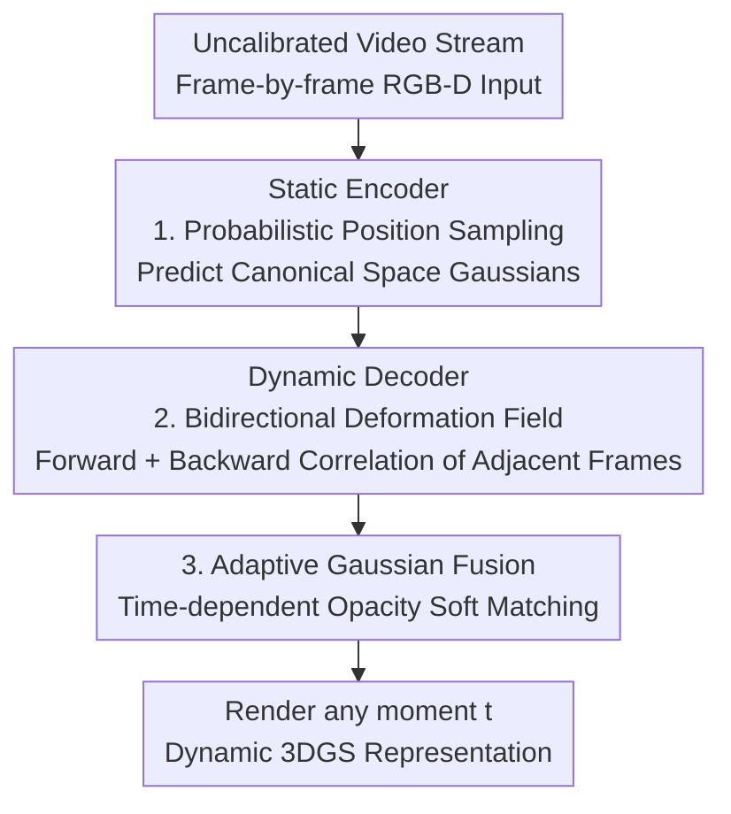

# StreamSplat: Towards Online Dynamic 3D Reconstruction from Uncalibrated Video Streams

**Conference**: ICLR 2026  
**arXiv**: [2506.08862](https://arxiv.org/abs/2506.08862)  
**Code**: [https://streamsplat3d.github.io/](https://streamsplat3d.github.io/)  
**Area**: 3D Vision  
**Keywords**: Dynamic 3D Reconstruction, 3D Gaussian Splatting, Online Reconstruction, Feed-forward Model, Video Streams

## TL;DR

StreamSplat proposes a fully feed-forward online dynamic 3D reconstruction framework. Through three innovations—probabilistic position sampling, bidirectional deformation fields, and adaptive Gaussian fusion—it can instantly generate dynamic 3DGS representations from uncalibrated video streams, achieving a speed 1200x faster than optimization-based methods.

## Background & Motivation

Real-time dynamic 3D reconstruction (4D reconstruction) is critical in fields such as robotics, AR/VR, and autonomous driving. However, existing methods have fundamental limitations:

**Background**: Mainstream dynamic 3DGS methods (e.g., 4DGS, DGMarbles) require access to the complete video sequence and undergo hours of per-scene iterative optimization, involving a multi-step pipeline of camera calibration → static Gaussian optimization → deformation field learning → temporal fusion.

**Limitations of Prior Work**: Even state-of-the-art methods still require 30 minutes to 24 hours to process a single scene, making them undeployable for real-time applications.

**Key Challenge**: Almost all methods require pre-calibrated camera parameters. Existing feed-forward 3DGS methods (pixelSplat, NoPoSplat, StreamGS) only support static scenes; dynamic variants still require calibration and full sequence access.

**Goal**: The authors propose the core research question: **Can online quality and functionality comparable to offline methods be achieved under completely online conditions using uncalibrated video streams?**

## Method

### Overall Architecture

StreamSplat processes "online dynamic reconstruction" as a pure feed-forward pipeline. It maintains a set of Gaussians in a canonical space $\tilde{\mathcal{G}}(t)$. For each incoming frame, the current frame is encoded into new Gaussians, bidirectional deformations between it and adjacent frames are predicted, and new and old Gaussians are adaptively fused using time-dependent opacity for direct rendering. The entire process requires no camera calibration and no backtracking through the entire video. Specifically, a **static encoder** first encodes the current frame (RGB-D + 8×8 patches) via a Transformer into Gaussians in canonical space, where positions are provided by **probabilistic position sampling**. A **dynamic decoder** then uses Gaussian embeddings from two adjacent frames to predict a **bidirectional deformation field** (forward pushing previous Gaussians to the current time, backward pulling current Gaussians to the previous time). Finally, **adaptive Gaussian fusion** performs soft matching of forward and backward Gaussians based on time-dependent opacity to obtain a renderable dynamic 3DGS for any time $t$. Training is divided into two stages: first, training the static encoder to learn single-frame Gaussians and depth, then freezing it to train the dynamic decoder responsible for cross-frame motion, decoupling motion modeling from appearance reconstruction.

### Key Designs

**1. Probabilistic Position Sampling: Mitigating Local Optima in Feed-forward 3DGS**

3DGS is extremely sensitive to Gaussian position initialization, and feed-forward models regressing positions in one pass easily get stuck in local optima. StreamSplat therefore does not directly regress coordinates but predicts a truncated normal distribution for each 3D offset and samples from it: $\boldsymbol{o} \sim \mathcal{N}_{[-1,1]}(\boldsymbol{\mu}_p, \boldsymbol{\Sigma}_p)$, then recovers the final position in a pixel-aligned manner $\boldsymbol{\mu}_i = (u_i + o_{i,0},\; v_i + o_{i,1},\; g(o_{i,2}))$, where the depth mapping is $g(z) = 2/(1+z)$. The randomness from sampling allows the model to explore the space fully in the early training stages and converge to stable optimal positions later—removing it in ablation studies leads to a direct 6.36dB drop in PSNR, making it the most significant design gain.

**2. Bidirectional Deformation Fields: Robustly Correlating Adjacent Frames and Handling Gaussian Dynamics**

Traditional approaches re-instantiate Gaussians for every frame and iteratively optimize, which is naturally incompatible with feed-forward frameworks. StreamSplat instead jointly models motion in both forward and backward directions: the forward field deforms the previous frame's Gaussians $\mathcal{G}_{t-1}$ to the current time $t$, and the backward field deforms the current frame's Gaussians $\mathcal{G}_t$ back to $t-1$. This symmetric structure provides robust cross-frame correspondences, naturally expresses the appearance and disappearance of Gaussians, and makes "what to predict and what to supervise" symmetric and clear in end-to-end training, thus eliminating frame-by-frame iteration.

**3. Adaptive Gaussian Fusion: Soft Matching with Time-dependent Opacity**

To maintain temporal consistency online, one must decide when each Gaussian appears and fades out. Hard assignments or iterative fusion are both slow and brittle. StreamSplat modulates the opacity of each Gaussian over time: $\alpha(t) = \alpha \cdot \frac{\sigma(-\gamma_0(|t - t_0| - \gamma_1))}{\sigma(\gamma_0 \cdot \gamma_1)}$, where $t_0$ is the frame where the Gaussian was created, $\gamma_0$ controls the transition rate, and $\gamma_1$ controls the fade-out window width. In this way, forward and backward Gaussians are implicitly fused: reconstruction loss induces soft matching, where persistent Gaussians are naturally propagated, and appearing or disappearing Gaussians increase or decrease smoothly with opacity, maintaining inter-frame consistency without hard assignments or iterative fusion.

### Loss & Training

**Stage 1 - Static Encoder**:
$$\mathcal{L}_{\text{static}} = \mathcal{L}_{\text{recon}}(\hat{I}_t, I_t) + \lambda_{\text{depth}} \mathcal{L}_{\text{depth}}(\hat{D}_t, D_t)$$
The depth loss uses a scale-and-shift invariant form, introducing an adaptive decay factor $\hat{\lambda}_{\text{depth}}$ to reduce the influence of noisy pseudo-depths.

**Stage 2 - Dynamic Decoder** (Encoder frozen):
$$\mathcal{L}_{\text{dynamic}} = \mathbb{E}_t[\mathcal{L}_{\text{recon}} + \lambda_{\text{depth}} \mathcal{L}_{\text{depth}} + \lambda_{\text{mask}} \mathcal{L}_{\text{mask}}]$$
An auxiliary reconstruction loss for moving foreground regions is added, using segmentation masks from DAVIS/YouTube-VOS for supervision.

## Key Experimental Results

### Main Results

| Dataset | Metric | Ours (StreamSplat) | Prev. SOTA | Gain |
|--------|------|------|----------|------|
| DAVIS Key Frame | PSNR↑ | 37.83 | 42.33 (MonST3R) | Competitive |
| DAVIS Key Frame | LPIPS↓ | 0.016 | 0.012 (MonST3R) | Close |
| DAVIS Middle-4 | PSNR↑ | **23.66** | 21.33 (DGMarbles) | +2.33 |
| DAVIS Middle-4 | LPIPS↓ | **0.193** | 0.313 (DGMarbles) | -0.12 |
| RE10K Average | PSNR↑ | **29.51** | 23.73 (DGMarbles) | +5.78 |
| 8-frame Interp. | PSNR↑ | **22.10** | 21.09 (AMT) | +1.01 |

### Ablation Study

| Configuration | PSNR (Key)↑ | PSNR (Mid)↑ | Description |
|------|---------|---------|------|
| w/o Prob. Sampling | 31.47 | - | Deterministic prediction, -6.36dB |
| w/o Depth Superv. | 36.68 | - | Spatial structure distortion |
| w/o Bidir. Deform. | - | 18.89 | Loss of pixel-aligned structure |
| Full (Ours) | **37.83** | **23.66** | Complete model |

### Key Findings

- StreamSplat is the only method supporting near real-time dynamic 3D reconstruction at 0.049s per frame, 1200x faster than optimization methods.
- It is competitive with MonST3R on keyframe reconstruction, but the latter requires post-optimization and is limited to keyframes.
- It outperforms all baselines on intermediate frame reconstruction, including 2D video interpolation methods.
- It supports online reconstruction for video streams of arbitrary length.

## Highlights & Insights

1. **Online Paradigm Breakthrough**: Achieves feed-forward online dynamic 3D reconstruction on uncalibrated video streams for the first time, overturning the traditional offline multi-stage pipeline.
2. **Probabilistic Position Sampling**: Simple and effective solution to the local optima problem of feed-forward 3DGS, providing massive improvement (+6.36dB).
3. **Adaptive Opacity Fusion**: Soft matching via time-dependent opacity cleverly avoids the hard assignments and iterative fusion found in traditional methods.
4. **Canonical Space Design**: Uses an orthogonal canonical space to bypass per-scene camera calibration, where camera motion is absorbed into Gaussian dynamics.

## Limitations & Future Work

- Keyframe reconstruction quality is slightly lower than MonST3R (point cloud representation), but the latter does not support online processing.
- Input resolution is limited to 512×288; high-resolution scenes may lose detail.
- Evaluated only on short-to-medium length videos; error accumulation in extremely long sequences requires more validation.
- The orthographic projection assumption might be limited in scenes with strong perspective effects.

## Related Work & Insights

- NoPoSplat (Ye et al., 2024) and StreamGS (Li et al., 2025) address pose-free and online problems respectively but are limited to static scenes.
- The concept of bidirectional deformation can be generalized to other temporal modeling tasks (video generation, autonomous driving prediction).
- The lifecycle management idea of adaptive Gaussian fusion originated from Zhao et al. (2024).

## Rating

- Novelty: ⭐⭐⭐⭐⭐ First to achieve online feed-forward dynamic 3D reconstruction from uncalibrated streams, with three synergistic technical innovations.
- Experimental Thoroughness: ⭐⭐⭐⭐ Covers multiple dynamic/static benchmarks with detailed ablations, though lacks evaluation on longer videos.
- Writing Quality: ⭐⭐⭐⭐⭐ Clear motivation, logically sound methodology, and high-quality figures.
- Value: ⭐⭐⭐⭐⭐ 1200x speedup holds significant practical value, opening a new paradigm for online dynamic reconstruction.

<!-- RELATED:START -->

## Related Papers

- [\[ICLR 2026\] WorldTree: Towards 4D Dynamic Worlds from Monocular Video Using Tree-Chains](worldtree_towards_4d_dynamic_worlds_from_monocular_video_using_tree-chains.md)
- [\[CVPR 2026\] V-DPM: 4D Video Reconstruction with Dynamic Point Maps](../../CVPR2026/3d_vision/v-dpm_4d_video_reconstruction_with_dynamic_point_maps.md)
- [\[ICLR 2026\] Uncertainty-Aware 3D Reconstruction for Dynamic Underwater Scenes](uncertainty-aware_3d_reconstruction_for_dynamic_underwater_scenes.md)
- [\[ICLR 2026\] Lyra: Generative 3D Scene Reconstruction via Video Diffusion Model Self-Distillation](lyra_generative_3d_scene_reconstruction_via_video_diffusion_model_self-distillat.md)
- [\[CVPR 2026\] OnlineHMR: Video-based Online World-Grounded Human Mesh Recovery](../../CVPR2026/3d_vision/onlinehmr_video-based_online_world-grounded_human_mesh_recovery.md)

<!-- RELATED:END -->
