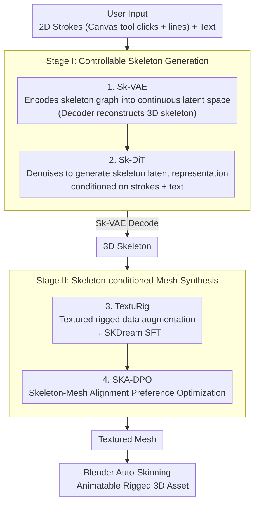

# Stroke3D: Lifting 2D Strokes into Rigged 3D Model via Latent Diffusion Models

**Conference**: ICLR 2026  
**arXiv**: [2602.09713](https://arxiv.org/abs/2602.09713)  
**Code**: [https://whalesong-zrs.github.io/Stroke3D_project_page/](https://whalesong-zrs.github.io/Stroke3D_project_page/)  
**Area**: 3D Vision  
**Keywords**: 3D Generation, Skeleton Generation, Graph Diffusion, Rigging, DPO

## TL;DR

Stroke3D achieves the first direct generation of rigged 3D mesh models from user-drawn 2D strokes and text prompts. It employs a skeleton-first two-stage pipeline: first generating controllable 3D skeletons using Graph VAE + Graph DiT, followed by high-quality mesh generation enhanced by the TextuRig dataset and SKA-DPO optimization.

## Background & Motivation

Rigged 3D assets are fundamental for 3D deformation and animation, widely used in AR/VR, robotics simulation, and the film industry. Existing methods face two critical limitations:

**Difficulty in generating animatable geometry**: Many 3D generation methods (MVDream, CLAY, etc.) only produce static geometry, lacking the skeletal hierarchy required for animation. Skeleton-conditioned methods like SKDream are limited by the scarcity of high-quality paired datasets.

**Lack of structural control in skeleton creation**: Existing skeleton generation methods (MagicArticulate, UniRig) follow an end-to-end mesh-to-skeleton paradigm, lacking explicit structural constraints, which leads to skeletons appearing in unnecessary locations or missing at key joints.

The core innovation lies in a **skeleton-driven workflow**: unlike traditional methods that generate a mesh before rigging, Stroke3D generates the skeleton from 2D strokes first, then generates the mesh conditioned on that skeleton.

## Method

### Overall Architecture

Stroke3D deconstructs the problem of "obtaining animatable 3D assets from a single hand-drawn sketch" into a skeleton-first two-stage process. Users first use a canvas tool to click joints and connect them into strokes, resulting in a 2D graph topologically isomorphic to the target 3D skeleton. The first stage transforms this sketch into a 3D skeleton using a pair of graph latent diffusion models: Sk-VAE encodes 3D skeleton graphs into a continuous latent space (with the decoder responsible for skeleton reconstruction), while Sk-DiT denoises and generates skeleton latent representations in this space conditioned on 2D strokes and text. These are then restored to full 3D skeletons via the Sk-VAE decoder, allowing the sketch to directly determine the skeletal topology. The second stage synthesizes textured meshes conditioned on this skeleton: first, the TextuRig dataset is used to enhance SKDream via Supervised Fine-Tuning (SFT) to improve texture quality, followed by SKA-DPO, which uses "skeleton-mesh alignment" as a reward for preference optimization to "pin" the mesh to the skeleton. Finally, the mesh is processed via Blender auto-skinning to produce an animatable rigged asset.

### Key Designs

**1. Skeleton Graph VAE (Sk-VAE): Compressing irregular skeleton topology into a diffusable continuous latent variable**

Skeletons are naturally graphs rather than tensors. Performing diffusion directly on joint coordinates loses topology and makes convergence difficult; thus, they are compressed into a latent space. Here, the 3D skeleton is represented as an undirected graph $\mathcal{G} = (\mathbf{X}, \mathbf{E})$, where $\mathbf{X} \in \mathbb{R}^{N \times 3}$ represents joint coordinates and $\mathbf{E}$ represents the topological edges describing parent-child connections. The encoder uses GCN paired with TransformerConv to aggregate local neighborhoods and model long-range connections, mapping the entire graph to a continuous latent space. Training uses $L_2$ reconstruction loss plus a very light KL regularization ($kl\_\beta = 1 \times 10^{-8}$). The KL coefficient is minimized to ensure the latent space is smooth enough for sampling without sacrificing reconstruction accuracy, as joint position shifts of even a few millimeters can deviate rigging results.

**2. Skeleton Graph DiT (Sk-DiT): Generating skeletons via 2D strokes and text**

With the latent space defined, the generation end must convert sparse user sketches into structurally sound 3D skeletons. Sk-DiT follows the DiT framework but replaces standard self-attention with TransformerConv to handle graph-structured data. It adds a cross-attention layer to incorporate CLIP-encoded text embeddings, allowing semantic hints like "giraffe" to constrain skeletal proportions. 2D strokes are concatenated with the noisy latent representation after feature mapping to provide per-joint structural guidance. Training is simplified by not requiring real hand-drawn data: perturbations are applied directly to the 2D projections of 3D skeletons to simulate human drawing errors. The denoising objective is $\mathcal{L}_{\text{Sk-DiT}} = \mathbb{E}_{\mathbf{z}_0, t, \epsilon, \mathbf{J}_{xy}, \mathbf{E}, \mathbf{c}_{\text{text}}} \left[\|\epsilon_\phi(\mathbf{z}_t, t, \mathbf{J}_{xy}, \mathbf{E}, \mathbf{c}_{\text{text}}) - \epsilon\|_2^2\right]$, where the conditions include projected joints $\mathbf{J}_{xy}$, topological edges $\mathbf{E}$, and text $\mathbf{c}_{\text{text}}$. The authors discovered that this structural condition is essential; without it, the model fails to converge on large-scale data.

**3. TextuRig Dataset: Addressing the lack of textures in rigged models**

The second stage requires the mesh generator to "grow geometry" based on the skeleton. However, most rigged models in Objaverse-XL lack textures, leading to poor visual quality. To solve this, the authors built a data pipeline: they filtered models with texture maps or vertex colors and used Gemini to rewrite descriptive annotations. Ultimately, 6,800 high-quality samples were added to the original 24,000 SKDream training samples, specifically targeting the previously scarce "skeleton-textured mesh-text" triplets.

**4. SKA-DPO (Skeleton-Mesh Alignment Preference Optimization): Using preference learning to align mesh with skeleton**

Even with SFT, generated meshes may still misalign with the skeleton (limbs protruding outside the mesh, self-intersection at joints). The authors adapted DPO from image diffusion to 3D: a reference model generates pairs of multi-view image candidates for each skeleton-text pair, which are then evaluated for alignment quality using the SKA Score. Well-aligned samples are treated as "winners" and poorly aligned as "losers." This preference dataset is used to fine-tune the model with the DiffusionDPO objective: $\mathcal{L}(\theta) = -\mathbb{E} \log\sigma\big(-\beta(\|\epsilon^{win} - \epsilon_\theta(x_t^{win}, t)\|_2^2 - \|\epsilon^{win} - \epsilon_{\text{ref}}(x_t^{win}, t)\|_2^2 - (\text{lose term}))\big)$. By using skeleton-mesh alignment rather than human annotation as the reward signal, the model effectively self-supervises its geometric adherence to the skeleton. Tests showed the best balance was achieved with a margin of 0.1 between winner/loser weights.

### Loss & Training

Sk-VAE is trained for 500K iterations using $L_2$ reconstruction and $10^{-8}$ KL regularization. Sk-DiT is trained for 500K iterations using standard diffusion denoising loss with Classifier-Free Guidance (CFG). For the mesh stage, the model undergoes 9K steps of SFT with TextuRig to improve texture, followed by 1K steps of SKA-DPO for alignment optimization.

## Key Experimental Results

### Main Results

| Dataset/Metric | Ours (Stroke3D) | MagicArticulate | UniRig | SKDream |
|--------|------|----------|------|------|
| CD-J2J (All)↓ | **0.048** | 0.052 | 0.063 | 0.111 |
| CD-J2B (All)↓ | **0.039** | 0.041 | 0.051 | 0.092 |
| CD-B2B (All)↓ | **0.034** | 0.034 | 0.041 | 0.083 |
| SKA MeanInst.↑ | **87.83** | - | - | 80.43 |
| SKA MeanClass↑ | **84.36** | - | - | 74.38 |

### Ablation Study

| Configuration | MeanInst.↑ | MeanClass↑ | Notes |
|------|---------|---------|------|
| SKDream baseline | 80.43 | 74.38 | Original baseline |
| +TextuRig (SFT) | 82.37 | 76.84 | Gain +1.9 from SFT |
| +SKA-DPO | 85.57 | 81.12 | Gain +5.1 from DPO |
| +TextuRig & SKA-DPO | **87.83** | **84.36** | Complementary gain +7.4 |

### Key Findings

- Structural conditions (2D strokes) are crucial for convergence; training without them on large datasets makes convergence difficult.
- Skeleton generation is robust to input sparsity; CD scores remain stable when fewer than 5 joints are removed.
- An SKA-DPO preference score margin of 0.1 achieves the optimal balance.
- Generated skeleton-mesh pairs can be directly animated via Blender auto-skinning, demonstrating good structural integrity.

## Highlights & Insights

1. **Skeleton-First Paradigm**: Reverses the traditional mesh-then-rigging workflow, providing users with direct structural control.
2. **Clever 2D-to-3D Bridging**: The canvas tool allows users to create topologically isomorphic 2D inputs via point-and-click, elegantly bridging the 2D-3D domain gap.
3. **RL in 3D Generation**: Introduces DPO from language/image models to 3D mesh generation, using skeleton-mesh alignment as a reward signal.
4. **Modular Design**: Decouples skeleton generation and mesh synthesis, allowing each to be improved independently.

## Limitations & Future Work

- Skeleton joint counts are limited to 0-30; complex skeletal structures may be constrained.
- Input is only provided from an orthographic 2D perspective; multi-view guidance could improve quality.
- The TextuRig dataset size (6.8K) is still relatively small; larger-scale data could yield further improvements.
- Auto-skinning quality depends on Blender tools; end-to-end skinning is a future direction.

## Related Work & Insights

- MagicArticulate and UniRig represent the trend of autoregressive skeleton generation but lack explicit structural control.
- SKDream’s MCF skeleton + conditional generation provides a baseline; Stroke3D significantly enhances this via better data and optimization strategies.
- The concept of preference optimization from DiffusionDPO (Wallace et al., 2024) is effectively adapted for the 3D domain.

## Rating

- Novelty: ⭐⭐⭐⭐⭐ First to generate rigged 3D meshes from 2D strokes; skeleton-first pipeline is pioneering.
- Experimental Thoroughness: ⭐⭐⭐⭐ Skeletons and meshes are evaluated on standard benchmarks with thorough ablations, though a user study is missing.
- Writing Quality: ⭐⭐⭐⭐ Methodology is clear and figures are informative, though some sections are slightly lengthy.
- Value: ⭐⭐⭐⭐ Lowers the barrier for creating 3D animated assets, though adoption by professional artists remains to be verified.

<!-- RELATED:START -->

## Related Papers

- [\[CVPR 2026\] 2D-LFM: Lifting Foundation Model without 3D Supervision](../../CVPR2026/3d_vision/2d-lfm_lifting_foundation_model_without_3d_supervision.md)
- [\[ICCV 2025\] Repurposing 2D Diffusion Models with Gaussian Atlas for 3D Generation](../../ICCV2025/3d_vision/repurposing_2d_diffusion_models_with_gaussian_atlas_for_3d_generation.md)
- [\[ICLR 2026\] SceneTransporter: Optimal Transport-Guided Compositional Latent Diffusion for Single-Image Structured 3D Scene Generation](scenetransporter_optimal_transport-guided_compositional_latent_diffusion_for_sin.md)
- [\[ICLR 2026\] Lyra: Generative 3D Scene Reconstruction via Video Diffusion Model Self-Distillation](lyra_generative_3d_scene_reconstruction_via_video_diffusion_model_self-distillat.md)
- [\[ICCV 2025\] Representing 3D Shapes with 64 Latent Vectors for 3D Diffusion Models](../../ICCV2025/3d_vision/representing_3d_shapes_with_64_latent_vectors_for_3d_diffusion_models.md)

<!-- RELATED:END -->
