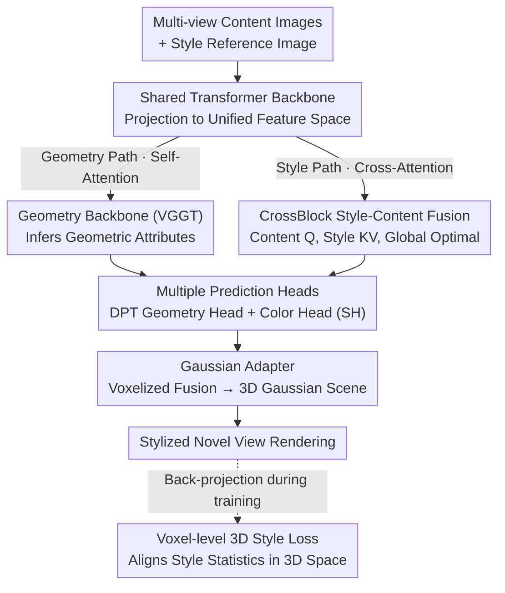

# Stylos: Multi-View 3D Stylization with Single-Forward Gaussian Splatting

**Conference**: ICLR 2026  
**arXiv**: [2509.26455](https://arxiv.org/abs/2509.26455)  
**Code**: [https://github.com/HanzhouLiu/Stylos](https://github.com/HanzhouLiu/Stylos)  
**Area**: 3D Vision  
**Keywords**: 3D Style Transfer, Gaussian Splatting, Cross-view Consistency, Voxel Style Loss, Feed-forward Model

## TL;DR

Stylos proposes a single-forward 3D style transfer framework. Through a dual-path design (geometry self-attention + style cross-attention) sharing a Transformer backbone and a voxel-level 3D style loss, it achieves zero-shot 3D stylization from uncalibrated inputs, supporting scaling from single-view to hundreds of views.

## Background & Motivation

3D style transfer aims to transfer reference styles while maintaining scene geometry and cross-view consistency. Existing methods face three major limitations:

**NeRF/3DGS methods require per-scene optimization**: Although StyleRF and StyleGaussian are more efficient than NeRF, they still require per-scene fitting and cannot achieve true real-time 3D stylization.

**Weak generalization capability**: Current methods are limited to scene-specific training and cannot generalize to unseen categories, scenes, and styles.

**2D style loss lacks 3D consistency**: Classic Gram matrix or AdaIN (matching channel statistics) operate at the image level and cannot explicitly guarantee multi-view structural consistency.

The most relevant work, Styl3R (Wang et al., 2025b), proposes a feed-forward framework, but its design is only for 2-8 input views and does not focus specifically on strong multi-view consistency.

## Method

### Overall Architecture

Stylos addresses the challenge of outputting both geometry and stylized appearance in a single forward pass starting from a set of uncalibrated images. Its core is a **Shared Transformer Backbone + Dual-Path** design: content and style images are first projected into a unified feature space, then split into two paths—the geometry path retains self-attention, deriving geometric attributes (position, scale, rotation, opacity) by inheriting from the VGGT geometric backbone; the style path uses a CrossBlock in the Style Aggregator to inject style into content tokens via cross-attention. The outputs of the two paths are sent to their respective prediction heads (DPT geometry head for geometric parameters, color head for spherical harmonic coefficients), then voxelized and fused into a 3D Gaussian scene via the Gaussian Adapter for rendering. Since geometry is handled entirely by the self-attention backbone and style only affects color through cross-attention, the framework naturally achieves decoupling of geometry and style—the same geometry can be paired with different styles, and strong styles will not disturb the structure. During training, a voxel-level 3D style loss is introduced, back-projecting multi-view rendered features into a voxel grid to align style statistics in 3D space, thereby embedding "cross-view consistency" directly into the optimization objective.

### Key Designs

**1. CrossBlock Style-Content Fusion Module: Injecting style into Transformer without damaging geometry**

The biggest risk in style transfer is disrupting the structure for the sake of coloring. Stylos inserts a cross-attention layer between the self-attention and MLP of a standard Transformer Block: content tokens act as Query, and style tokens act as Key/Value, allowing content to actively "retrieve" style rather than being overwritten by it. The authors provide three topologies—Frame CrossBlock allows each view to interact with the style independently (conservative but lacking coordination); Global CrossBlock concatenates all views into a global sequence, using self-attention to ensure multi-view geometric consistency and cross-attention to broadcast style uniformly; Hybrid uses Frame then Global. Global CrossBlock is found to be optimal (PSNR improvement of 0.79dB on the Pizza scene) because global self-attention locks cross-view consistency while cross-attention spreads the same style evenly across all views, avoiding inconsistency caused by frame-wise coloring.

**2. Multi-Prediction Head Design: Assigning distinct roles to geometry, style, and camera**

To maintain the decoupling of geometry and style, Stylos connects the dual-path outputs to separate prediction heads. The geometry head is a DPT regression head, directly outputting Gaussian point positions, scales, rotations, and opacities from the geometric backbone features. The color head separately receives the Style Aggregator output to predict spherical harmonic coefficients $c_m$ for appearance. Additionally, there is a camera head from VGGT to estimate extrinsic and intrinsic parameters, and a depth DPT head to predict scene geometry as auxiliary supervision. Finally, the Gaussian Adapter assembles the prediction vectors from the geometry and color heads into complete 3D Gaussian parameters. This partition ensures structure prediction only comes from backbone features and is not directly influenced by style conditions, preventing style branch gradients from polluting the geometry. High-quality structure is maintained by reusing VGGT pre-trained weights.

**3. Voxel-level 3D Style Loss: Moving style statistic matching from 2D to 3D space**

Classic Gram/AdaIN style losses match channel statistics frame-by-frame at the image level, failing to explicitly constrain multi-view consistency—the same surface might be stylized differently across views. Stylos fuses multi-view rendered features into a voxel grid $\mathcal{G}_b^l$ via differentiable back-projection, aligning style statistics directly in 3D space:

$$\mathcal{L}_{\text{sty}}^{3D} = \frac{1}{B} \sum_{b=1}^B \sum_{l=1}^5 \alpha_l \left(\|\mu(\mathcal{G}_b^l) - \mu(\mathcal{S}_b^l)\|_2^2 + \|\sigma(\mathcal{G}_b^l) - \sigma(\mathcal{S}_b^l)\|_2^2\right)$$

Here, the mean $\mu$ and standard deviation $\sigma$ of features within voxels are matched with style statistics $\mathcal{S}_b^l$ across 5 feature levels with weights $\alpha_l$. Compared to image-level losses (independent per frame) and scene-level losses (concatenating multi-view 2D features but remaining in 2D space), voxel-level loss ensures consistency because statistics are defined on the 3D grid; the same surface corresponds to the same voxel regardless of the viewing angle. This design improved ArtScore from 4.78 (image-level) to 9.15.

### Loss & Training

Training is split into two stages, corresponding to the decoupling of geometry and style. Stage 1 is geometry pre-training, where the geometry is learned end-to-end using VGGT weight initialization. To allow the network early exposure to the style path without degrading into an identity map, a random input view is chosen for color jittering as a temporary style reference. The loss includes a reconstruction term and a distillation term: $\mathcal{L}_{\text{stage1}} = \mathcal{L}_{\text{rec}} + \lambda_{\text{distill}} \mathcal{L}_{\text{distill}}$. Stage 2 is stylization fine-tuning, where the entire geometry module is frozen and only the Style Aggregator and color head are updated, ensuring coloring does not affect geometry. The loss combines reconstruction, voxel-level 3D style, content, CLIP, and total variation regularization:

$$\mathcal{L}_{\text{stage2}} = \mathcal{L}_{\text{rec}} + \lambda_{\text{style}} \mathcal{L}_{\text{style}}^{3D} + \lambda_{\text{cnt}} \mathcal{L}_{\text{content}} + \lambda_{\text{clip}} \mathcal{L}_{\text{clip}} + \lambda_{\text{tv}} \mathcal{L}_{\text{TV}}$$

## Key Experimental Results

### Main Results

| Dataset/Scene | Metric | Stylos | StyleGaussian | Styl3R | Description |
|--------|------|------|----------|------|------|
| T&T Short LPIPS↓ | Consistency | **0.033-0.047** | 0.031-0.038 | - | Competitive |
| T&T Long LPIPS↓ | Consistency | **0.153** | 0.157 | - | Better long-range consistency |
| CO3D ArtScore↑ | Art Quality | **9.15** | - | - | Highest with voxel loss |
| CO3D Reconstruction PSNR↑ | Recon | 21.68 | - | - | Global CrossBlock |

### Ablation Study

| Configuration | Short RMSE↓ | ArtScore↑ | Description |
|------|---------|---------|------|
| Image-level style loss | 0.038 | 4.78 | Baseline |
| Scene-level style loss | 0.036 | 9.12 | +4.34 ArtScore |
| 3D Voxel-level loss | **0.034** | **9.15** | Optimal 3D |

### Key Findings

- Global CrossBlock outperforms Frame and Hybrid variants across all test categories.
- Voxel-level 3D style loss is superior to 2D style loss in both consistency and artistic quality.
- Quality is stable when the number of views per batch is within 32; edge artifacts appear when exceeding 64 (training set up to 24 views).
- Image-level loss sometimes fails completely to transfer style (e.g., in the donut scene).

## Highlights & Insights

1. **Geometry-Style Decoupling**: Backbone features drive only geometry, while CrossBlock influences only color, providing a clear and modular concept.
2. **2D→3D Style Loss Evolution**: Systematically advancing from image-level → scene-level → voxel-level, providing a clear ablation path.
3. **Strong Scalability**: The framework naturally supports 1 to hundreds of views, requiring only batch size adjustments.
4. **Resilient Geometry via VGGT**: Leverages a pre-trained 3D foundation model to ensure high-quality geometry.

## Limitations & Future Work

- Quality degradation occurs beyond 32 views, possibly requiring larger training batches for coverage.
- Only static scenes were evaluated; stylized dynamic scenes represent a future direction.
- Style reference only supports a single image; multi-style reference could provide richer control.
- Further analysis is needed regarding the impact of voxelization resolution on style quality.

## Related Work & Insights

- VGGT (Wang et al., 2025a) and AnySplat (Jiang et al., 2025) provide strong foundations for pose-free 3D reconstruction.
- Feature-level style/content losses from ArtFlow (An et al., 2021) are effectively extended to 3D voxel space.
- The concept of voxel-level statistic matching may be applicable to other tasks requiring 3D consistency.

## Rating

- Novelty: ⭐⭐⭐⭐ Voxel-level 3D style loss and CrossBlock design are innovative, though the overall framework combines mature components.
- Experimental Thoroughness: ⭐⭐⭐⭐ Systematic ablation and multi-dataset evaluation, though baseline comparisons could be more extensive.
- Writing Quality: ⭐⭐⭐⭐ Clear structure and complete derivation, though some descriptions could be more concise.
- Value: ⭐⭐⭐⭐ The first truly scalable single-forward 3D stylization method with clear practical value.

<!-- RELATED:START -->

## Related Papers

- [\[CVPR 2026\] EcoSplat: Efficiency-controllable Feed-forward 3D Gaussian Splatting from Multi-view Images](../../CVPR2026/3d_vision/ecosplat_efficiency-controllable_feed-forward_3d_gaussian_splatting_from_multi-v.md)
- [\[ICLR 2026\] Open-Set Semantic Gaussian Splatting SLAM with Expandable Representation](open-set_semantic_gaussian_splatting_slam_with_expandable_representation.md)
- [\[ICLR 2026\] Distractor-free Generalizable 3D Gaussian Splatting](distractor-free_generalizable_3d_gaussian_splatting.md)
- [\[CVPR 2026\] BRepGaussian: CAD Reconstruction from Multi-View Images with Gaussian Splatting](../../CVPR2026/3d_vision/brepgaussian_cad_reconstruction_from_multi-view_images_with_gaussian_splatting.md)
- [\[CVPR 2026\] SplatSuRe: Selective Super-Resolution for Multi-view Consistent 3D Gaussian Splatting](../../CVPR2026/3d_vision/splatsure_selective_super-resolution_for_multi-view_consistent_3d_gaussian_splat.md)

<!-- RELATED:END -->
