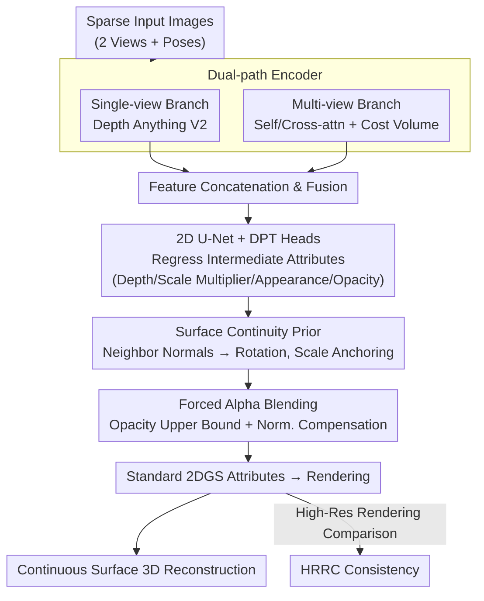

# SurfSplat: Conquering Feedforward 2D Gaussian Splatting with Surface Continuity Priors

**Conference**: ICLR 2026  
**arXiv**: [2602.02000](https://arxiv.org/abs/2602.02000)  
**Code**: [https://hebing-sjtu.github.io/SurfSplat-website/](https://hebing-sjtu.github.io/SurfSplat-website/)  
**Area**: 3D Vision  
**Keywords**: 2D Gaussian Splatting, Feedforward 3D Reconstruction, Surface Continuity, High-Resolution Rendering Consistency, Sparse View

## TL;DR

SurfSplat proposes a feedforward 3D reconstruction framework based on 2DGS. It binds Gaussian rotation and scale to neighborhood positions via surface continuity priors, addresses color bias through a forced alpha blending strategy, and introduces the High-Resolution Rendering Consistency (HRRC) metric to reveal reconstruction quality differences at high resolutions.

## Background & Motivation

Current feedforward 3DGS methods show excellent NVS metrics at standard resolutions, but suffer from a severe overlooked issue:

**Degenerated 3D Scenes**: Reconstructions are actually discrete, color-biased point clouds rather than continuous surfaces, exposing severe artifacts (holes, color bias, surface fractures) under close-up or off-axis views.

**Underutilized Anisotropy**: Learnable Gaussian primitives struggle to decouple geometry and texture using only gradient supervision, causing Gaussians to degenerate into near-spherical shapes.

**Failure of Evaluation Metrics**: Standard PSNR/SSIM/LPIPS at original resolution fail to capture geometric inaccuracies, masking true reconstruction quality.

The authors observe: **Direct training of 2DGS is more challenging than 3DGS**—the planar nature of 2D Gaussians causes small geometric perturbations to result in large rendering deviations, a problem exacerbated under limited supervision.

## Method

### Overall Architecture

SurfSplat addresses surface degeneration and color bias in feedforward 2DGS under sparse views. The reconstruction backbone is a feedforward pipeline: sparse images are first processed by a dual-path encoder (a single-view branch using Depth Anything V2 for monocular priors, and a multi-view branch using self/cross-attention to build a cost volume). Features are concatenated and fused before being sent to a 2D U-Net with DPT heads to regress intermediate attributes such as depth, scale multipliers, appearance components, and opacity. Instead of regressing Gaussian parameters independently, the "Gaussian Processor" converts these intermediate values into geometrically consistent standard 2DGS attributes using **surface continuity priors** and **forced alpha blending** to render continuous surfaces. In addition to the reconstruction backbone, the authors propose the **HRRC (High-Resolution Rendering Consistency)** metric to evaluate geometric defects hidden by standard PSNR.

### Key Designs

**1. Surface Continuity Prior: Deriving Gaussian poses from neighborhood geometry rather than independent regression**

Gaussians under direct supervision tend to degenerate into near-spherical, disconnected point clouds because rotation and scale lack spatial constraints when predicted independently. SurfSplat assumes that visible geometry in real scenes consists of smooth, continuous surfaces where adjacent pixels correspond to spatially adjacent surface elements. Thus, a Gaussian's pose should be determined by its 3D position and its neighborhood. Specifically, for a 3D position $\mathbf{p}_0$ at pixel $(h,w)$, Sobel filters compute two tangent vectors $\mathbf{t}_1, \mathbf{t}_2$, yielding a local normal $\mathbf{n}$ via cross product. The Rodrigues formula rotates the default orientation to this normal direction: $\mathbf{R} = \mathbf{I} + [\mathbf{v}]_\times + \frac{1-c}{\|\mathbf{v}\|^2}[\mathbf{v}]_\times^2$, where $\mathbf{v} = \mathbf{n}_0 \times \mathbf{n}$ and $c = \mathbf{n}_0^\top \mathbf{n}$. Scale is also anchored to geometry: initial scales $\bar{\sigma}_u, \bar{\sigma}_v$ are estimated based on image-space neighbor distances, while the network predicts scale multipliers $\hat{\sigma}_u, \hat{\sigma}_v$ within $[1/3, 3]$ for refinement. Finally, $\sigma_u = \bar{\sigma}_u \hat{\sigma}_u$, and the 2DGS depth-axis scale $\sigma_w$ is fixed to zero. This ensures adjacent Gaussians align as continuous surfaces, decoupling geometry from texture.

**2. Forced Alpha Blending: Preventing models from over-relying on sparse high-opacity Gaussians**

The surface continuity prior can cause the model to learn high-opacity Gaussians, making occluded Gaussians contribute negligible weight to alpha blending. This hinders gradient flow to deeper 3D structures. SurfSplat caps opacity with an upper bound $\tau_{\text{opa}} < 1$ (set to 0.6), forcing all Gaussians to participate in rendering. Simultaneously, colors are initialized to the DC component of spherical harmonics, and a normalization compensation is applied to the output: $C = C/\alpha$ when $\alpha \geq \tau_\alpha$, offsetting the darkening caused by the upper bound. This preserves the representational power of multi-layer surfaces and eliminates color bias.

**3. HRRC Metric: High-Resolution Rendering Consistency to expose geometric defects**

Standard PSNR/SSIM/LPIPS at original resolutions are insensitive to geometric inaccuracies. SurfSplat proposes rendering the reconstructed scene at $2\times$ and $4\times$ resolutions and comparing them with bicubic-upsampled Ground Truth: $\text{HRRC}_{\text{metric}} = \text{metric}(\hat{I}^{HR}, \hat{I}^{GT\uparrow})$. Upscaling reveals holes caused by sparsity, degenerated Gaussian shapes, and surface discontinuities, effectively distinguishing models with true 3D geometry from those that merely overfit sparse training views.

### Loss & Training

The training objective is a weighted sum of MSE and LPIPS across supervised views:

$$L_{\text{gs}} = \sum_{m=1}^M \left(\text{MSE}(I_{\text{render}}^m, I_{\text{gt}}^m) + \lambda \cdot \text{LPIPS}(I_{\text{render}}^m, I_{\text{gt}}^m)\right)$$

where $\lambda = 0.05$. Training is conducted at 256×256 resolution. The Depth Anything V2 backbone is fine-tuned with a learning rate of $2 \times 10^{-6}$, while other layers use $2 \times 10^{-4}$.

## Key Experimental Results

### Main Results

| Method | RE10K 256 PSNR↑ | RE10K 512 PSNR↑ | RE10K 1024 PSNR↑ | RE10K Avg PSNR↑ |
|------|------|------|------|------|
| DepthSplat | **27.504** | 20.031 | 16.385 | 21.307 |
| MVSplat | 26.359 | 20.408 | 17.966 | 21.578 |
| Ours-L | 27.537 | **26.331** | **24.897** | **26.255** |

### Ablation Study

| Configuration | Standard PSNR | HRRC 2× PSNR | HRRC 4× PSNR | Note |
|------|---------|---------|---------|------|
| 3DGS (DepthSplat) | 27.504 | 20.031 | 16.385 | Severe HRRC degradation |
| 2DGS (SurfSplat-L) | 27.537 | 26.331 | 24.897 | Stable HRRC |
| w/o Surface Prior | Lower | Significantly Lower | Significantly Lower | Surface discontinuity |
| w/o Forced Blending | Lower | Lower | Lower | Color bias |

### Key Findings

- **HRRC Reveals the Truth**: While DepthSplat performs best at standard resolution (27.5), it drops sharply to 16.4 at 1024 resolution. SurfSplat only drops to 24.9, proving it reconstructs true 3D structure.
- MVSplat and TranSplat also degrade significantly under HRRC (around 18 at 1024), indicating surface degeneration is a common issue in feedforward 3DGS.
- Cross-dataset evaluations (DL3DV, ScanNet) verify generalization capability.
- pixelSplat (multi-Gaussian per pixel) performs relatively well on HRRC (24.9) as redundant Gaussians partially fill surface holes.

## Highlights & Insights

1. **High Diagnostic Value**: Identifies the widely ignored surface degeneration problem in feedforward 3DGS; the HRRC metric is highly generalizable.
2. **Geometric-driven Attribute Prediction**: Deriving rotation from position via Sobel filters and the Rodrigues formula is elegant and physically intuitive.
3. **First Success for 2DGS in Feedforward Scenarios**: Demonstrates that 2DGS (surfels) is more suitable than 3DGS (ellipsoids) for feedforward reconstruction, providing better anisotropy and geometric accuracy.
4. **Clever Forced Blending**: Solves local optima by capping opacity, ensuring representation of multi-layer surfaces.

## Limitations & Future Work

- PSNR gains at standard resolution are marginal compared to DepthSplat; advantages are mainly reflected in HRRC.
- The single-Gaussian-per-pixel setting may not sufficiently cover highly complex scenes.
- The HRRC metric relies on bicubic-upsampled GT, which is not true high-resolution GT.
- Evaluated only on static scenes; dynamic scene extension is a future direction.

## Related Work & Insights

- Huang et al. (2024) proposed 2DGS for per-scene optimization; SurfSplat is the first to introduce it into a feedforward framework.
- The depth interaction design of DepthSplat (Xu et al., 2024b) is partially inherited, but SurfSplat replaces independent attribute regression with surface priors.
- The HRRC metric design can be extended to evaluate other 3D generation tasks.

## Rating

- Novelty: ⭐⭐⭐⭐ Surface continuity priors and HRRC are innovative, though components combine established techniques.
- Experimental Thoroughness: ⭐⭐⭐⭐⭐ Comprehensive across three datasets, multiple resolutions for HRRC, multiple backbones, and cross-dataset evaluation.
- Writing Quality: ⭐⭐⭐⭐ Clear problem definition, persuasive visualizations, and complete mathematical derivations.
- Value: ⭐⭐⭐⭐ Significant reference value for the community regarding HRRC and surface degeneration.

<!-- RELATED:START -->

## Related Papers

- [\[ICLR 2026\] YoNoSplat: You Only Need One Model for Feedforward 3D Gaussian Splatting](yonosplat_you_only_need_one_model_for_feedforward_3d_gaussian_splatting.md)
- [\[CVPR 2026\] 3D Gaussian Splatting with Self-Constrained Priors for High Fidelity Surface Reconstruction](../../CVPR2026/3d_vision/3d_gaussian_splatting_with_self-constrained_priors_for_high_fidelity_surface_rec.md)
- [\[ICLR 2026\] Mesh Splatting for End-to-end Multiview Surface Reconstruction](mesh_splatting_for_end-to-end_multiview_surface_reconstruction.md)
- [\[AAAI 2026\] MeshSplat: Generalizable Sparse-View Surface Reconstruction via Gaussian Splatting](../../AAAI2026/3d_vision/meshsplat_generalizable_sparse-view_surface_reconstruction_via_gaussian_splattin.md)
- [\[ICLR 2026\] Distractor-free Generalizable 3D Gaussian Splatting](distractor-free_generalizable_3d_gaussian_splatting.md)

<!-- RELATED:END -->
