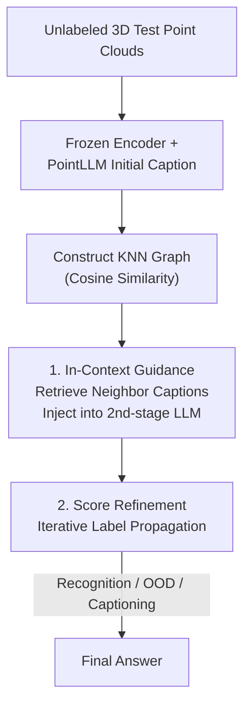

# Test-Time Optimization of 3D Point Cloud LLM via Manifold-Aware In-Context Guidance and Refinement

**Conference**: ICLR 2026  
**OpenReview**: [https://openreview.net/forum?id=qsra0EsUpe](https://openreview.net/forum?id=qsra0EsUpe)  
**Code**: https://github.com/handsome999KK/PGLLM  
**Area**: 3D Vision / Multimodal VLM  
**Keywords**: 3D Point Cloud LLM, Test-Time Optimization, In-Context Learning, Label Propagation, OOD Detection

## TL;DR
This paper proposes Point-Graph LLM (PGLLM), which organizes unlabeled support sets into a KNN graph at test time without retraining. It injects 3D captions of neighboring samples as in-context guidance into a second-stage LLM and performs score refinement via label propagation to correct noisy predictions. This approach improves the accuracy and robustness of 3D recognition, OOD detection, and captioning with almost zero additional computational overhead.

## Background & Motivation

**Background**: The mainstream approach for extending Multimodal Large Language Models (MLLMs) to 3D understanding involves equipping LLMs with a point cloud encoder to process colored 3D object point clouds. A representative work, PointLLM, uses a "point cloud encoder + LLaMA" two-stage pipeline: the first stage generates a text description (caption), and the second stage uses an LLM (such as GPT-4) to perform downstream tasks like classification or captioning based on that description.

**Limitations of Prior Work**: Such methods suffer from a critical flaw—**each point cloud is interpreted in isolation**. 3D point clouds exhibit high inter-class visual similarity (e.g., a pointed black object may look like both a "boat" and a "bathtub"). When the model only views the caption of a single sample, it easily confuses fine-grained categories. Furthermore, LLM-generated classification confidence scores are often overconfident or miscalibrated (GPT-4 scores frequently hit 0 or 100), causing the FPR95 in OOD detection to remain near 100.

**Key Challenge**: Single-sample inference discards the structural information of the data manifold. Samples of the same category should be close in the feature space and provide mutual evidence; however, isolated interpretation wastes this "collective consistency."

**Goal**: Without retraining or fine-tuning, utilize the manifold structure at test-time to solve two problems: (1) finding appropriate context examples for query samples; (2) calibrating LLM confidence scores using neighborhood consistency.

**Key Insight**: The authors draw inspiration from the success of In-Context Learning (ICL)—the ability of LLMs to generalize to new tasks given a few examples in the prompt depends on the examples being "relevant and informative." For a query point cloud, **its neighbors in the feature space are naturally the most relevant examples**. By organizing the support set into a graph, examples can be retrieved via nearest neighbor search.

**Core Idea**: Use a "test-time constructed data manifold graph" to simultaneously retrieve neighbor captions as in-context examples to enrich the prompt and perform label propagation to smooth and correct LLM prediction scores, all with zero training.

## Method

### Overall Architecture
PGLLM receives a batch of unlabeled 3D test point clouds and outputs final answers for downstream tasks (recognition / OOD detection / captioning). The process involves three steps: first, extract features using a frozen point cloud encoder (Point-BERT) and generate initial captions via PointLLM; second, construct a KNN graph in the feature space to capture local geometric relationships; finally, perform two layers of optimization—**using neighbor captions as in-context guidance for the second-stage LLM, followed by score refinement via iterative label propagation**. These steps are completed entirely at test-time without updating model weights.

### Key Designs

**1. Manifold Graph Construction: Turning Unlabeled Support Sets into Searchable Structures**

Addressing the limitation of isolated interpretation, this step serves as the foundation. Given an unlabeled support set $D_u=\{x_i\}_{i=1}^{N_u}$, features $p_i=f_p(x_i)$ are extracted using a pre-trained encoder $f_p$, and captions $c_i$ are generated using PointLLM. A graph $G=(V,E)$ is constructed where nodes are point clouds and edge weights represent cosine similarities, pruned into a sparse KNN adjacency matrix:

$$W_{ij} = \begin{cases} e_{ij} & \text{if } e_{ij}\in \text{TopK}(\{e_{ij}\}_{j=1}^{N_u}) \\ 0 & \text{otherwise}\end{cases}, \quad e_{ij}=\frac{\langle p_i,p_j\rangle}{\|p_i\|\cdot\|p_j\|}$$

In experiments, $K=3$. New query samples are integrated via low-overhead dynamic graph expansion. This graph supports both example retrieval and score propagation.

**2. In-Context Guidance: Using Neighbor Captions as Examples for Context-Aware Inference**

Addressing the issue of LLMs confusing similar categories, the $K$ nearest neighbors for a query $x_i$ provide a caption set $C_i=\{c_{i1},\dots,c_{iK}\}$. These are appended to the query prompt for the second-stage LLM (e.g., GPT-4). As shown in Figure 1, if PointLLM misidentifies a "pointed black boat" as a "car," but neighbor captions describe similar objects as "bathtub," the LLM can infer that "boat" is not in the candidates while similar samples are "bathtubs," thus correcting the prediction. This injects semantically related manifold knowledge into the inference process without retraining.

**3. Label Propagation Score Refinement: Correcting Overconfident Predictions via Consistency**

Addressing miscalibrated LLM confidence (e.g., GPT-4's 0/100 scores breaking OOD detection), the LLM is prompted to output **class-wise confidence scores**. These form an initial score matrix $S_0\in\mathbb{R}^{l\times N_u}$, which is refined via label propagation on graph $W$:

$$S_t = \alpha S_{t-1}\tilde{W} + (1-\alpha)S_0, \quad \tilde{W}=D^{-\frac{1}{2}}WD^{-\frac{1}{2}}, \quad \hat{y}_j=\arg\max_i (S_t)_{ij}$$

$\tilde{W}$ is the normalized adjacency matrix, $\alpha=0.5$ balances the original output and neighbor propagation, and $T=5$ iterations are performed. For OOD detection, the smoothed scalar confidence $S(x_i)$ is compared against a threshold $\delta$. This step pulls outlier predictions back to consistency with neighbors, smoothing the distribution and significantly reducing FPR95. For captioning, neighbor captions are used for in-context rewriting to polish the results.

### Example: Correcting "Boat" to "Bathtub"
Consider a point cloud with the ground truth "bathtub" that looks like a pointed black object. PointLLM generates the caption "a stylish black boat." The second-stage LLM, seeing "boat" is not in the class list, might misclassify it as "car." With PGLLM, 3 neighbors are found with captions like "cartoon black bathtub" and "black ceramic bathtub." Including these in the prompt allows the LLM to reason: "Though this is called a boat, similar samples are called bathtubs, and boat is not an option," leading to the correct classification. Score refinement then solidifies this choice through neighbor reinforcement.

## Key Experimental Results

### Main Results

3D OOD Detection (ModelNet40 / ShapeNetCore, AUROC↑ / FPR95↓, Average):

| Method | 2nd LLM | MN40 AUROC | MN40 FPR95 | SN AUROC | SN FPR95 |
|------|---------|-----------|-----------|----------|----------|
| MCM | – | 81.0 | 66.8 | – | – |
| GSP | – | 78.8 | 73.0 | 80.4 | 65.5 |
| PointLLM-7B | GPT-4 | 80.0 | 100.0 | 87.7 | 97.4 |
| **PGLLM_T (Ours)** | GPT-4 | **85.9** | **52.1** | **91.1** | **29.6** |
| PGLLM_T (Ours) | DeepSeek-V3 | 82.1 | 65.8 | 90.9 | 39.1 |
| **PGLLM_T (Ours)** | MiniGPT-3D+GPT-4 | **88.1** | 45.0 | 90.8 | 44.9 |

3D Recognition (ModelNet40 ACC↑) and Captioning (Objaverse):

| Method | 2nd LLM | Avg. Recognition ACC | Captioning GPT-4 |
|------|---------|------------|-----------------|
| MiniGPT-3D | GPT-4 | 60.9 | 57.1 |
| PointLLM-7B | GPT-4 | 52.6 | 44.9 |
| **PGLLM_T (Ours)** | GPT-4 | **62.5** | 50.5 |
| PGLLM_T (Ours) | DeepSeek-V3 | 62.3 | – |

PGLLM_T improves AUROC by +4.9% and reduces FPR95 from 100 to 52.1 compared to the previous best MCM on ModelNet40. In recognition, it outperforms the strongest baseline MiniGPT-3D by +1.6%.

### Ablation Study

| In-Context Guidance | Score Propagation | MN40 ACC | MN40 AUROC | MN40 FPR95 | SN ACC | SN AUROC | SN FPR95 |
|:---:|:---:|:---:|:---:|:---:|:---:|:---:|:---:|
| – | – | 52.5 | 80.4 | 100.0 | 55.5 | 88.2 | 54.9 |
| • (Direct NN) | – | 59.7 | 83.3 | 100.0 | 60.7 | 89.2 | 47.2 |
| ✓ (Graph Retrieval) | – | 60.2 | 83.1 | 100.0 | 61.0 | 89.5 | 46.0 |
| – | ✓ | 56.7 | 83.5 | 62.0 | 59.3 | 89.8 | 44.7 |
| ✓ | ✓ | **63.1** | **85.9** | **52.1** | **62.4** | **91.1** | **29.6** |

### Key Findings
- **Complementary Modules**: In-context guidance improves recognition (52.5 to 60.2) but fails to fix FPR95 (stuck at 100 due to GPT-4's hard scores). Score propagation reduces FPR95 significantly (100 to 62) but has less impact on ACC. Both are required for optimal performance.
- **Graph Retrieval vs. Direct NN**: Using the KNN graph (✓) performs slightly better than direct nearest color sample retrieval (•), indicating the utility of local geometric relations.
- **Mechanism Dependency**: The gains hold across various LLMs including Qwen3-VL-8B and DeepSeek-V3. Llama3.1-8B is less effective, likely due to a conversational bias that struggles with numerical probability sequences.
- **Robust Support Sets**: Both transductive (using the test set, PGLLM_T) and inductive (using Objaverse, PGLLM_O) configurations outperform baselines.

## Highlights & Insights
- **Dual-Purpose Graph**: A single KNN manifold graph serves as both a retrieval source for ICL and a carrier for label propagation, providing an economical structure for multi-task improvement.
- **Precise Diagnosis**: The authors identify the specific "GPT-4 hard score → failure of FPR95" issue and solve it with label propagation, converting hard scores into separable soft distributions.
- **Plug-and-Play**: The method is model-agnostic and weights-free, applicable to any "encoder + two-stage LLM" pipeline across different modalities.

## Limitations & Future Work
- **Captioning Performance**: PGLLM does not yet reach SOTA in 3D captioning, attributed to small test set sizes hindering optimal graph construction.
- **Reliance on LLM Numerical Output**: The method requires LLMs to output reliable class-wise confidence scores; models like Llama3.1-8B struggle with this.
- **Support Set Density**: The effectiveness of the manifold graph assumes a sufficiently dense support set where neighbors are likely to be of the same class.

## Related Work & Insights
- **vs. PointLLM / MiniGPT-3D**: These models interpret point clouds in isolation. PGLLM adds a test-time layer for "neighbor reference + collective calibration" without changing their weights.
- **vs. Feature-based OOD (MCM / GSP)**: While these methods use feature spaces of backbones or VLMs, PGLLM is the first to introduce an LLM framework for 3D OOD detection, achieving superior AUROC/FPR95.
- **vs. General ICL**: Unlike traditional ICL that uses manual or random examples, PGLLM integrates manifold learning into example selection, systematically organizing the prompt for the 3D domain.

## Rating
- Novelty: ⭐⭐⭐⭐
- Experimental Thoroughness: ⭐⭐⭐⭐
- Writing Quality: ⭐⭐⭐⭐
- Value: ⭐⭐⭐⭐

<!-- RELATED:START -->

## Related Papers

- [\[ICLR 2026\] GOOD: Geometry-guided Out-of-Distribution Modeling for Open-set Test-time Adaptation in Point Cloud Semantic Segmentation](good_geometry-guided_out-of-distribution_modeling_for_open-set_test-time_adaptat.md)
- [\[ICLR 2026\] Quartet of Diffusions: Structure-Aware Point Cloud Generation through Part and Symmetry Guidance](quartet_of_diffusions_structure-aware_point_cloud_generation_through_part_and_sy.md)
- [\[ICLR 2026\] TTT3R: 3D Reconstruction as Test-Time Training](ttt3r_3d_reconstruction_as_test-time_training.md)
- [\[CVPR 2026\] tttLRM: Test-Time Training for Long Context and Autoregressive 3D Reconstruction](../../CVPR2026/3d_vision/tttlrm_test-time_training_for_long_context_and_autoregressive_3d_reconstruction.md)
- [\[CVPR 2026\] Mamba Learns in Context: Structure-Aware Domain Generalization for Multi-Task Point Cloud Understanding](../../CVPR2026/3d_vision/mamba_learns_in_context_structure-aware_domain_generalization_for_multi-task_poi.md)

<!-- RELATED:END -->
