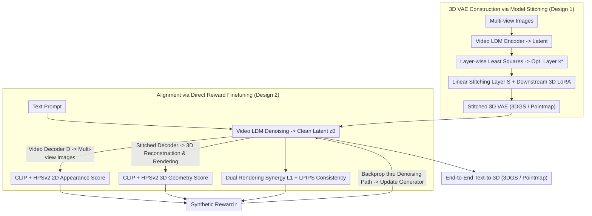

# Text-to-3D by Stitching a Multi-view Reconstruction Network to a Video Generator

**Conference**: ICLR 2026 Oral  
**arXiv**: [2510.13454](https://arxiv.org/abs/2510.13454)  
**Code**: [Project Page](https://gohyojun15.github.io/VIST3A/)  
**Area**: 3D Vision/Generation  
**Keywords**: Text-to-3D, Model Stitching, Video Generator, 3D Reconstruction, 3DGS, Direct Reward Finetuning, Pointmap

## TL;DR
The VIST3A framework is proposed, which seamlessly interfaces the latent space of a pretrained video generator with feed-forward 3D reconstruction models (such as AnySplat/MVDUSt3R/VGGT) via model stitching. Subsequently, direct reward finetuning is employed to align the generative model with the stitched 3D decoder, achieving high-quality end-to-end text-to-3DGS and text-to-pointmap generation. It consistently outperforms existing methods on T3Bench, SceneBench, and DPG-Bench.

## Background & Motivation

**Background**: Text-to-3D generation has become a new research frontier. Early Score Distillation Sampling (SDS) methods (e.g., DreamFusion) require slow per-scene optimization. Multi-stage pipelines (generating images then lifting to 3D) suffer from error accumulation and engineering complexity. The latest trend involves end-to-end Latent Diffusion Models (LDM) directly generating 3D representations.

**Mechanism of LDM Routes**: These methods reuse priors from pretrained 2D image/video models, finetuning them into multi-view latent generators, and then training a VAE-style decoder to decode the latents into 3D representations like 3DGS.

**Limitations of Prior Work—Weak Decoders**: Existing methods simply adapt 2D VAEs into 3D output decoders, essentially requiring the model to learn 3D reconstruction capabilities from scratch. This necessitates massive training data, yet the performance lags significantly behind specialized 3D foundation models (DUSt3R, VGGT, AnySplat, etc.). As 3D foundation models become stronger, this "self-trained decoder" performance gap will widen.

**Limitations of Prior Work—Weak Alignment**: The generative model and the VAE decoder are trained separately. Generation losses (diffusion loss/flow matching) only indirectly promote 3D consistency, leading generated latents to deviate from the decoder's input distribution, resulting in poor reconstruction quality. Even adding rendering losses based on single-step sampling fails to fully consider the entire denoising trajectory.

**Core Idea**: Instead of training a 3D decoder from scratch, existing state-of-the-art 3D foundation models are reused as decoders via model stitching. Reward finetuning is then applied to ensure the latents produced by the generator fall within the valid input domain of the stitched decoder.

## Method

### Overall Architecture
VIST3A addresses the dual dilemmas in end-to-end text-to-3D: learning decoders from scratch and misalignment between the generator and decoder. It moves away from self-trained 3D decoders via a two-step approach. First, it "stitches" the front-half encoder of a pretrained video LDM to the back-half of an off-the-shelf feed-forward 3D reconstruction model (MVDUSt3R/VGGT/AnySplat) at an optimal intermediate layer $k^\star$ using a linear stitching layer to form a new 3D VAE. Second, it uses direct reward finetuning to calibrate the video generator—specifically the clean latent $z_0$ produced by the denoising loop—to the valid input domain of this stitched decoder. Neither step requires 3D annotations: the stitching stage uses the original 3D model's outputs as self-supervised pseudo-labels, while the alignment stage relies solely on differentiable scorers and rendering for rewards.

### Key Designs

**1. 3D VAE Construction via Model Stitching: Joining Two Networks with Linear Mapping**

The Core Problem is how to connect the latent space of a video LDM to a 3D reconstruction network that was not designed to receive it. The method first identifies the optimal stitching layer between the two networks: $N$ samples are passed through the video encoder to obtain latents $\mathbf{B} \in \mathbb{R}^{N \times D_\mathcal{E}}$. Then, every layer $k$ of the 3D model is scanned to obtain its activations $\mathbf{A}_k \in \mathbb{R}^{N \times D_F^k}$. A linear stitching layer $\mathbf{S}^*_k = (\mathbf{B}^\top \mathbf{B})^{-1} \mathbf{B}^\top \mathbf{A}_k$ is fitted using a closed-form least squares solution for each layer. The layer $k^\star$ with the minimum fitting MSE is selected as the stitch point. This step reveals a non-obvious fact: despite being trained independently on different data, there exists a layer where latents can be highly consistent with 3D model activations through a single linear transformation. Once $k^\star$ is found, the stitched VAE $\mathcal{M}_{\text{stitched}} = F_{k^\star+1:l} \circ \mathbf{S} \circ \mathcal{E}(\mathbf{x})$ is assembled, where the stitching layer is implemented as 3D convolutions and layers after $k^\star$ are finetuned using LoRA. During training, the original 3D model's output $\mathbf{y}$ is used as pseudo-labels for self-supervised fitting via $\ell_1$ loss, inheriting the 3D foundation model's reconstruction capacity without 3D ground truth.

**2. Alignment via Direct Reward Finetuning: Calibrating Latents to the Decoder's Domain**

While the stitched decoder is powerful, it is trained on inputs from the encoder $\mathcal{E}$, whereas during inference, latents are generated from noise via a denoising loop. If these distributions deviate, decoding quality collapses. Thus, a reward term is subtracted from the generation loss, with the total objective being $L_{\text{total}} = L_{\text{gen}} - r(z_0(\theta, c, z_T), c)$, where $z_0$ is the clean latent denoised from noise $z_T$ under condition $c$. The reward $r$ is synthesized from three components: first, the original video decoder $\mathcal{D}$ decodes the latent into multi-view images for CLIP and HPSv2 scoring of text alignment and visual quality; second, the stitched decoder $\mathcal{D}_{\text{stitched}}$ decodes the same latent into a 3D scene, which is rendered and scored similarly; third, images from the video decoder and 3D renderings are compared using $\ell_1$ + LPIPS at the same viewpoint to penalize geometric inconsistency. Gradients are backpropagated through the full denoising path using DRTune for stability, with computational overhead managed by random timestep sampling.

## Key Experimental Results

### Main Results

**Text-to-3DGS Performance (Table 1)**

| Method | T3Bench Imaging↑ | T3Bench CLIP↑ | SceneBench Imaging↑ | SceneBench CLIP↑ |
|------|:---:|:---:|:---:|:---:|
| Matrix3D-omni | 43.05 | 25.06 | 46.65 | 24.04 |
| Director3D | 54.32 | 30.94 | 47.79 | 29.31 |
| SplatFlow | 46.09 | 29.48 | 48.85 | 29.43 |
| VideoRFSplat | 46.52 | 30.13 | 58.19 | 29.76 |
| **Ours: Wan+MVDUSt3R** | **58.83** | **32.75** | **62.08** | **30.26** |
| **Ours: Wan+AnySplat** | 57.03 | 31.38 | **64.87** | 30.18 |

VIST3A outperforms all baselines in both object-level (T3Bench) and scene-level (SceneBench) synthesis. On DPG-Bench, the gap is even larger: VIST3A Global score is 81.82 vs. the best baseline at 69.70.

**DPG-Bench Detailed Text Alignment Evaluation (Table 2)**

| Method | Global↑ | Entity↑ | Attribute↑ | Relation↑ | Other↑ |
|------|:---:|:---:|:---:|:---:|:---:|
| SplatFlow | 69.70 | 68.43 | 65.55 | 50.49 | 40.91 |
| VideoRFSplat | 36.36 | 56.93 | 66.89 | 48.53 | 31.82 |
| **Ours: Wan+MVDUSt3R** | **81.82** | **84.31** | **86.13** | 68.93 | **54.55** |
| **Ours: Wan+AnySplat** | 78.79 | **85.58** | 84.12 | **76.70** | 45.45 |

VIST3A demonstrates overwhelming superiority in understanding and following complex text prompts, with most dimensions exceeding 80%.

**Ablation Study: Stitching NVS Evaluation (Table 3)**

| Method | PSNR↑ | SSIM↑ | LPIPS↓ |
|------|:---:|:---:|:---:|
| SplatFlow | 19.10 | 0.671 | 0.278 |
| VideoRFSplat | 19.05 | 0.674 | 0.281 |
| AnySplat (Original) | 20.85 | 0.695 | 0.238 |
| **Wan+AnySplat (Stitched)** | 21.29 | 0.718 | 0.232 |

The NVS capability of AnySplat actually improves after stitching, as the video VAE latents provide richer appearance representations.

## Highlights & Insights

1.  **Iterative Innovation in Model Stitching**: This work is the first to elevate model stitching from a "network representation analysis tool" to a "practical technique for building 3D VAEs," proving that independently trained video VAEs and 3D reconstruction models share linearly alignable intermediate representations.
2.  **Plug-and-Play Framework**: VIST3A flexibly combines different video generators (Wan, CogVideoX, SVD, Hunyuan) and 3D models (AnySplat, MVDUSt3R, VGGT), showing strong adaptability.
3.  **Refined Direct Reward Finetuning**: Three reward components cover 2D visual quality, 3D geometric quality, and cross-modal consistency, all without requiring ground-truth annotations.
4.  **New Task Capabilities**: Beyond text-to-3DGS, it achieves the new task of text-to-pointmap and can generate coherent large-scale scenes without training on long sequences.

## Limitations & Future Work

1.  **Dependency on Base Models**: Generative quality is capped by the capabilities of the chosen video and 3D models; stitching cannot compensate for fundamental flaws in the base models.
2.  **Linear Stitching Assumption**: The assumption of a linear mapping during stitching might degrade if model architectures are vastly different and their representations are non-linearly related.
3.  **Computational Cost of Reward Alignment**: Direct reward finetuning involves unrolling the denoising path and rendering 3D scenes, which is memory-intensive.
4.  **Dynamic Scenes**: The framework focuses on static scenes and does not yet address dynamic 4D content generation.

## Related Work & Insights

-   **SDS Optimization**: DreamFusion, Magic3D, ProlificDreamer — Slow per-scene optimization.
-   **Multi-stage Pipelines**: Zero-1-to-3, MVDream -> SV3D/DreamView -> 3D lifting — Subject to error accumulation.
-   **End-to-End LDM Route**: SplatFlow, Director3D, VideoRFSplat — Suffers from weak decoders and poor alignment.
-   **Feed-forward 3D Reconstruction**: DUSt3R -> MASt3R -> MVDUSt3R -> VGGT -> AnySplat — Increasingly powerful 3D foundation models.
-   **Model Stitching**: Lenc & Vedaldi (2015), Bansal et al. (2021) — First application to 3D VAE construction.

## Rating

⭐⭐⭐⭐ (4/5)

-   **Novelty** ⭐⭐⭐⭐⭐: The application of model stitching to 3D VAE construction is ingenious.
-   **Experimental Thoroughness** ⭐⭐⭐⭐⭐: Comprehensive evaluations across three benchmarks, user studies, and cross-model combinations.
-   **Writing Quality** ⭐⭐⭐⭐: Clear motivation, complete methodology, and high-quality figures.
-   **Value** ⭐⭐⭐⭐: Offers a plug-and-play framework that benefits from future 2D and 3D foundation model advancements.

<!-- RELATED:START -->

- **AnySplat**: [2412.03511](https://arxiv.org/abs/2412.03511)
- **MVDUSt3R**: [2411.14445](https://arxiv.org/abs/2411.14445)
- **Wan 2.1**: [2502.16431](https://arxiv.org/abs/2502.16431)

<!-- RELATED:END -->

## Related Papers

- [\[CVPR 2025\] MUSt3R: Multi-view Network for Stereo 3D Reconstruction](../../CVPR2025/3d_vision/must3r_multi-view_network_for_stereo_3d_reconstruction.md)
- [\[CVPR 2026\] GaussFusion: Improving 3D Reconstruction in the Wild with A Geometry-Informed Video Generator](../../CVPR2026/3d_vision/gaussfusion_improving_3d_reconstruction_in_the_wild_with_a_geometry-informed_vid.md)
- [\[ICLR 2026\] Peering into the Unknown: Active View Selection with Neural Uncertainty Maps for 3D Reconstruction](peering_into_the_unknown_active_view_selection_with_neural_uncertainty_maps_for_.md)
- [\[ICLR 2026\] ReconViaGen: Towards Accurate Multi-view 3D Object Reconstruction via Generation](reconviagen_towards_accurate_multi-view_3d_object_reconstruction_via_generation.md)
- [\[ICLR 2026\] ReLi3D: Relightable Multi-View 3D Reconstruction with Disentangled Illumination](reli3d_relightable_multi-view_3d_reconstruction_with_disentangled_illumination.md)

<!-- RELATED:END -->
