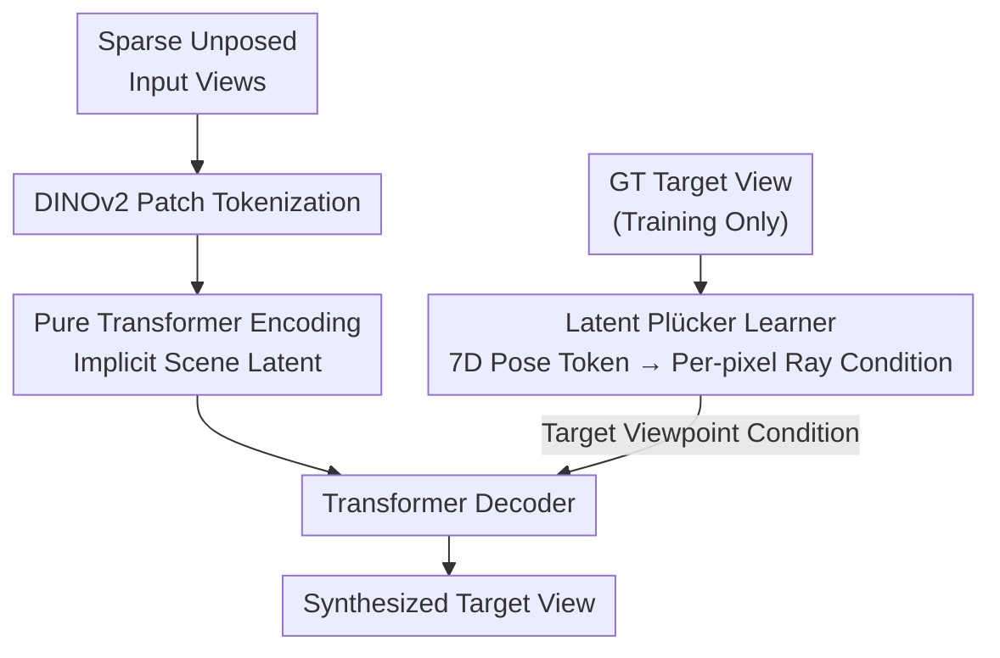

# The Less You Depend, the More You Learn: Synthesizing Novel Views from Sparse, Unposed Images with Minimal 3D Knowledge

**Conference**: ICLR 2026  
**OpenReview**: [https://openreview.net/forum?id=QXc2NBJFHr](https://openreview.net/forum?id=QXc2NBJFHr)  
**Code**: None  
**Area**: 3D Vision / Novel View Synthesis  
**Keywords**: Feed-forward NVS, unposed, data scalability, implicit 3D, Plücker rays  

## TL;DR
This paper systematically demonstrates the scalability law that "the less one depends on explicit 3D knowledge, the more one can learn from large-scale data." Based on this, the authors propose UP-LVSM—a pure Transformer feed-forward NVS framework that requires no explicit scene structure or camera pose annotations. By utilizing a self-supervised "Latent Plücker Learner," it synthesizes high-fidelity novel views directly from unposed 2D images, outperforming methods trained with ground-truth poses.

## Background & Motivation

**Background**: Feed-forward novel view synthesis (NVS) has recently split into two technical routes. One is **bias-driven**: forcing human-priors of 3D knowledge into the architecture—such as using hand-crafted explicit 3D representations like NeRF/3DGS or camera poses annotated by SfM algorithms like COLMAP (e.g., MVSplat, NoPoSplat). The other is **data-centric**: avoiding predefined 3D structures and representing the scene implicitly as latent tokens, allowing spatial understanding to emerge from massive 2D image datasets (e.g., LVSM, Rayzer).

**Limitations of Prior Work**: While both routes have proven effective, it remains unclear which is more scalable and yields better ultimate performance as data becomes increasingly abundant. Bias-driven methods perform impressively on small datasets due to strong geometric priors, but it is unknown whether they are "permanently superior" or "merely winning at the starting line." This question has not been systematically quantified.

**Key Challenge**: Explicit 3D knowledge is a double-edged sword. When data is scarce, strong structural biases acts as a **scaffold**, using priors to compensate for insufficient information. However, as data volume grows, these same biases become **shackles**, restricting the model from learning complex patterns directly from data and becoming a performance bottleneck for scaling. Furthermore, poses annotated by SfM are based on heuristic geometric algorithms and are often erroneous; depending on them for training implies an indirect dependence on noisy 3D knowledge.

**Goal**: First, to quantify the relationship between "3D knowledge dependence" and "data scalability" to verify the underlying law; then, to design a framework that removes both types of dependencies (explicit scene structure and pose annotation) to see if a purely data-driven approach can outperform pose-dependent methods.

**Key Insight**: The authors categorize existing methods across two dimensions: "explicit scene structure" and "pose availability." They use increasing subsets of RealEstate10K (from 1K to 66K scenes) to quantify the scalability metric: "average increase in PSNR/SSIM/LPIPS for every 4x increase in training data." The results consistently reveal that **methods with less dependence on explicit 3D knowledge exhibit faster performance growth as data increases, eventually surpassing competitors that rely on 3D knowledge**—hence the title "the less you depend, the more you learn."

**Core Idea**: Since lower dependence leads to better scalability, the authors eliminate dependencies entirely by proposing **UP-LVSM** (Unposed Large View Synthesis Model). It uses neither explicit 3D representations nor any poses (neither for input nor target). Through a self-supervised Latent Plücker Learner, it learns a set of camera geometries in latent space, unlocking full data scaling potential from pure 2D images.

## Method

### Overall Architecture

UP-LVSM operates under the most challenging **unposed setting**: input views have no poses $P_I$, and target views have no poses $P_T$. The model must learn viewpoints from the implicit signal that "multiple images of the same scene serve as positive samples." The overall architecture is a pure Transformer encoder-decoder: input views are first converted into patch tokens using DINOv2 and encoded by a Transformer into an implicit **scene latent**; the decoder then takes the scene latent and a **Latent Plücker** condition describing the target viewpoint to synthesize the target image.

The key difficulty lies in the fact that rendering requires a "target viewpoint" condition, which is unavailable in the unposed setting. The proposed solution is to attach a **Latent Plücker Learner** during **training**: acting like an autoencoder, it encodes the ground-truth target image into an extremely compact 7-dimensional pose token, which is then analytically upsampled into per-pixel Plücker ray conditions for the decoder. This provides the necessary viewpoint signal for rendering while preventing the leakage of target image content due to the 7D bottleneck, thereby learning a meaningful camera pose representation in a self-supervised manner without any 3D supervision.

### Key Designs

**1. Pure Transformer Implicit Modeling without Explicit 3D Knowledge: Treating scenes as learnable latents rather than hand-crafted 3D representations**

Addressing the bottleneck of explicit 3D structures in large-scale data, UP-LVSM follows the logic of LVSM by completely abandoning predefined representations like NeRF/3DGS and their associated differentiable rendering formulas. It represents the scene $S$ as a set of implicit latent tokens. The rendering function $R$ is also replaced by a learnable Transformer network. Formally, it remains $S = A(\cdot)$ and $T = R(S, P_T)$, but both $A$ and $R$ are neural networks. The advantage is that the model is not locked into any geometric inductive biases and can learn complex spatial patterns directly from data. Experiments show that this "bias-free" structure allows it to significantly distance itself from MVSplat and NoPoSplat on 66K scenes (Avg. Gain of 2.63 PSNR per 4x data vs. only 0.12 for NoPoSplat).

**2. Latent Plücker Learner: Learning camera poses via a 7D bottleneck under self-supervision to bypass pose annotations**

This is the core contribution of the paper, addressing the lack of $P_T$ ground-truth in the unposed setting. A naive approach would be to learn a high-dimensional latent pose, but this would lead to severe **information leakage**—the latent would encode the target image content, causing the model to "cheat" rather than learn viewpoints. Conversely, a dimension too low might be insufficient for pixel-level rendering. The authors use an autoencoder with a clever trade-off: the encoder distills the target image into an extremely compact **7D pose token** (3D translation $x$ + 4D quaternion $q$). This low-dimensional bottleneck physically cannot contain image content, preventing leakage. This 7D token is then **analytically upsampled** into per-pixel, fine-grained conditions by mapping classical Plücker ray embeddings into this learned latent space.

Plücker ray embedding is a mature method for encoding camera poses into pixel-aligned tokens: given image $I \in \mathbb{R}^{H\times W\times 3}$, the pose of each pixel is encoded as:

$$\hat{P} = \mathrm{concat}(o \times d,\ d) \in \mathbb{R}^{H\times W\times 6}$$

where $o$ is the camera center and $d$ is the ray direction for that pixel. The innovation lies in deriving $o, d$ from the learned 7D latent pose rather than ground-truth poses. This maintains rich per-ray conditions while compressing learnable pose parameters to a minimum. By sharing this latent space across all scenes during training, the model eventually learns a meaningful and generalizable camera pose representation with zero 3D supervision. Ablations show this design is significantly better than "directly using SfM poses" (28.82 vs. 26.00 PSNR) or "using the pose estimator from Sajjadi et al." (vs. 20.92, which is unstable with large data).

**3. DINOv2 Tokenizer as a 3D-Aware Starting Point: Using pretrained visual features for input encoding**

UP-LVSM uses DINOv2 to tokenize input images (adjusting resolution to $224\times224$ with patch size 14 to align with DINOv2). This choice is deliberate: DINOv2 features carry strong cross-view correspondences, providing a strong foundation for learning 3D perception from pure 2D data. Subsequent 3D awareness probe experiments verify this—UP-LVSM’s correspondence estimation accuracy approaches or even locally exceeds DINOv2 and is far higher than CLIP/MAE, indicating the implicit framework successfully grows real spatial understanding on top of DINOv2.

### Loss & Training

Training utilizes only a **reconstruction loss** $\mathcal{L}_{\mathrm{recon}}$, measuring the difference between the synthesized target view $T$ and the ground truth $\tilde{T}$, without any pose or 3D supervision. The Latent Plücker Learner is only active during training (not needed for inference). To ensure fair comparison, all baselines were retrained from scratch using the same $224\times224$ resolution, patch size 14, and training splits, rather than using official checkpoints.

## Key Experimental Results

### Main Results

Evaluated on RealEstate10K across different overlap levels, UP-LVSM outperforms pose-dependent methods across the board without using any poses, especially in scenarios with minimal overlap (the hardest):

| Configuration | Input Pose Used | PSNR↑ | SSIM↑ | LPIPS↓ |
|------|:---:|------|------|------|
| MVSplat (3DGS, posed) | ✓ | 26.45 | 0.874 | 0.123 |
| LVSM (latent, posed) | ✓ | 27.60 | 0.874 | 0.117 |
| NoPoSplat (3DGS, posed-target) | ✗ | 25.46 | 0.854 | 0.137 |
| **UP-LVSM (unposed)** | ✗ | **28.82** | **0.891** | **0.104** |

On the small-overlap subset, UP-LVSM achieves 24.54 PSNR, far exceeding LVSM’s 22.71, suggesting the unposed framework is more robust under weakly constrained inputs.

The scalability results—quantifying the average gain per 4x data—show that lower dependence leads to higher gains:

| Method | No Structural Bias | No Input Pose | Avg. Gain (ΔPSNR) |
|------|:---:|:---:|------|
| NoPoSplat | ✗ | ✗ | 0.12 |
| MVSplat | ✗ | ✓(posed) | 0.39 |
| LVSM | ✓ | ✗ | 0.64 |
| PT-LVSM | ✓ | ✓ | 1.72 |
| **UP-LVSM** | ✓ | ✓✓(even no target pose) | **2.63** |

### Ablation Study

Comparison of different sources for target pose $P_T$ in the Latent Plücker Learner:

| Configuration | PSNR↑ | SSIM↑ | LPIPS↓ | Description |
|------|------|------|------|------|
| (a) SfM Annotated Poses | 26.00 | 0.825 | 0.135 | Reverts to posed-target; SfM noise hurts performance |
| (b) Sajjadi Pose Estimator | 20.92 | 0.521 | 0.558 | Effective on small data; unstable on large data |
| (c) **Latent Plücker Learner** | **28.82** | **0.891** | **0.104** | 7D bottleneck + Plücker embedding; avoids leakage |

### Key Findings
- **The less you depend, the faster you scale**: The bias-driven NoPoSplat is competitive at 1K scenes but stagnates at 66K (Avg. Gain 0.12). UP-LVSM starts lower but has the steepest acceleration (2.63), eventually surpassing all methods—directly proving "the less you depend, the more you learn."
- **Pose annotation as a hidden bottleneck**: LVSM and PT-LVSM are both data-driven, differing only in input pose requirements. PT-LVSM (unposed) scales significantly better (1.72) than LVSM (0.64), which the authors attribute to noise in SfM poses.
- **Zero-shot generalization outperforms local training**: RE10K → ACID cross-dataset tests (27.33 PSNR) even outperform direct training on ACID (27.21), showing that gains from massive data volume can outweigh domain gaps.
- **Implicit frameworks learn real 3D**: On 3D awareness probes, UP-LVSM’s correspondence accuracy is close to DINOv2 and far exceeds CLIP/MAE. Attention visualizations also reveal clear cross-view correspondences.

## Highlights & Insights
- **Turning philosophical debate into measurable laws**: The authors move beyond intuitive arguments about which method is "better" by decomposing "3D knowledge dependence" into structural bias and poses. By quantifying scalability with "gain per data doubling," they turn a slogan into a reproducible trend curve.
- **The 7D bottleneck is a masterstroke**: Learning latent poses is prone to information leakage. Using a 7D physical bottleneck (translation + quaternion) to restrict capacity, then analytically expanding it via Plücker upsampling for fine-grained rendering, provides a general strategy for "learning a low-dimensional factor while preventing full-image leakage."
- **Counter-intuitive "Less is More"**: While priors are generally considered beneficial, this paper provides a counterexample for the big-data era—priors are scaffolds for scarce data that should be removed once data is abundant.

## Limitations & Future Work
- **Reliance on large data**: UP-LVSM's performance is significantly lower than bias-driven methods at small scales (21.03 vs. 25.24 PSNR at 1K scenes). The core argument holds only when data is sufficient.
- **Dataset-specific conclusions**: Scalability laws were mainly quantified on RealEstate10K. On the Objaverse object-level dataset, while UP-LVSM still has the highest gain (2.11), its absolute performance lags behind LVSM, indicating varying law strength across data distributions.
- **Training-only pose learning**: The Latent Plücker Learner requires ground-truth target views during training for self-supervision. The framework relies on the "same scene, multiple views" implicit structure; how it degrades with single-view or extremely sparse data remains to be explored.

## Related Work & Insights
- **vs. LVSM**: Both use pure Transformer latent modeling, but LVSM requires input pose $P_I$. UP-LVSM removes even this, relying on the Latent Plücker Learner to fill in viewpoint info, leading to superior scalability (2.63 vs. 0.64) and performance (28.82 vs. 27.60).
- **vs. NoPoSplat**: NoPoSplat uses explicit 3DGS and a posed-target setting. UP-LVSM removes explicit structure and all poses, proving that "removing the scaffold" allows for a higher ceiling with large data.
- **vs. Sajjadi et al. (SRT-based)**: Both seek to learn latent poses. SRT uses key-value querying + masking, which is unstable at scale (20.92 PSNR). This paper uses a 7D bottleneck + analytical Plücker upsampling, which is leak-proof and scales stably.

## Rating
- Novelty: ⭐⭐⭐⭐⭐ Quantifying design philosophy as scalability laws and solving unposed self-supervision with a 7D Plücker bottleneck is highly novel.
- Experimental Thoroughness: ⭐⭐⭐⭐⭐ Scalability curves across 4 datasets, overlap classification, zero-shot tests, and 3D probes create a complete evidentiary chain.
- Writing Quality: ⭐⭐⭐⭐ The structure of "establishing the law before proposing the method" is clear. Some implementation details are slightly thin outside the appendix.
- Value: ⭐⭐⭐⭐⭐ Provides actionable guiding principles for NVS in the big-data era, with significant potential impact on the "priors vs. data" debate.

<!-- RELATED:START -->

## Related Papers

- [\[ICLR 2026\] YoNoSplat: You Only Need One Model for Feedforward 3D Gaussian Splatting](yonosplat_you_only_need_one_model_for_feedforward_3d_gaussian_splatting.md)
- [\[ICLR 2026\] Fused-Planes: Why Train a Thousand Tri-Planes When You Can Share?](fused-planes_why_train_a_thousand_tri-planes_when_you_can_share.md)
- [\[ICLR 2026\] UFO-4D: Unposed Feedforward 4D Reconstruction from Two Images](ufo-4d_unposed_feedforward_4d_reconstruction_from_two_images.md)
- [\[CVPR 2025\] You See it, You Got it: Learning 3D Creation on Pose-Free Videos at Scale](../../CVPR2025/3d_vision/you_see_it_you_got_it_learning_3d_creation_on_pose-free_videos_at_scale.md)
- [\[ICCV 2025\] SpatialSplat: Efficient Semantic 3D from Sparse Unposed Images](../../ICCV2025/3d_vision/spatialsplat_efficient_semantic_3d_from_sparse_unposed_images.md)

<!-- RELATED:END -->
