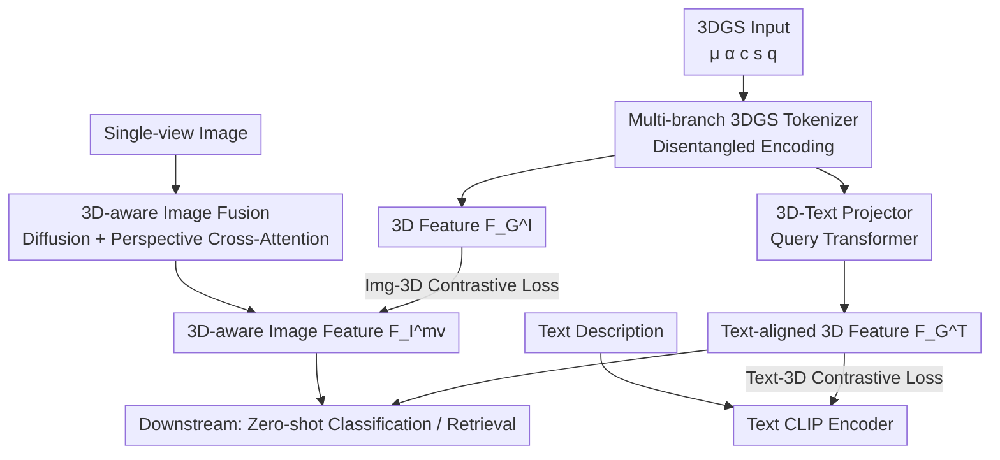

# TIGaussian: Disentangle Gaussians for Spatial-Aware Text-Image-3D Alignment

**Conference**: ICLR 2026  
**OpenReview**: [https://openreview.net/forum?id=CbzCID5lkD](https://openreview.net/forum?id=CbzCID5lkD)  
**Code**: https://github.com/RUiN-jiarun/TIGaussian  
**Area**: 3D Vision / Multi-modal Alignment  
**Keywords**: 3D Gaussian Splatting, Cross-modal Alignment, Attribute Disentanglement, Multi-view Fusion, Contrastive Learning

## TL;DR
TIGaussian刷新了文本-图像-3DGS三模态对齐的SOTA。该方法通过多分支编码器解耦3D Gaussian Splatting (3DGS) 的内在属性，利用扩散先验将单视图图像补充为多视图融合特征，并使用 Query Transformer 将3D特征投影至文本空间。

## Background & Motivation
**Background**: Text-image contrastive pre-training (CLIP/EVA-CLIP) has successfully aligned image and text features. Recent research aims to incorporate the "third modality"—3D—into the same embedding space to support downstream tasks like zero-shot classification, cross-modal retrieval, and scene recognition. While early 3D work utilized point clouds (PointCLIP, ULIP, Uni3D) or voxels (TriCoLo), UniGS recently achieved SOTA by using 3DGS as a 3D representation through distillation from the Uni3D pre-trained model.

**Limitations of Prior Work**: The authors identify two specific flaws in UniGS, the current leading 3DGS method. First is **entangled 3D encoding**: each Gaussian primitive in 3DGS possesses fundamentally different attributes, such as position $\mu$, opacity $\alpha$, color $c$, scaling $s$, and rotation $q$. UniGS concatenates these into a homogeneous feature vector, ignoring their distinct distributions and geometric meanings, which leads to information interference and loss of detail. Second is **degraded 3D awareness**: during image-3D alignment, only a single random view is used, failing to capture global context and destroying cross-view consistency, which weakens the perceptual capability of 3D features.

**Key Challenge**: 3DGS is an explicit representation with heterogeneous attributes and inherent multi-view renderability. However, existing methods neither disentangle these attributes nor utilize multi-view capabilities to compensate for single-view bias, essentially treating 3DGS as homogeneous point clouds.

**Goal**: This work addresses three sub-problems: (1) how to encode heterogeneous 3DGS attributes into a compact and generalizable 3D latent representation; (2) how to eliminate single-view bias in image-3D alignment; and (3) how to bridge the modality gap between continuous 3D feature spaces and discrete text embeddings.

**Core Idea**: A tri-modal alignment framework customized for 3DGS features, consisting of a **multi-branch 3DGS tokenizer** for attribute disentanglement, **diffusion-augmented multi-view fusion** for 3D-aware image completion, and a **3D-text projector** for text-side alignment.

## Method

### Overall Architecture
TIGaussian accepts three modalities: an object represented by 3DGS, its single-view image, and a text description. The goal is to align them into a shared 512-dimensional embedding space. The process involves three collaborative branches: the 3D branch uses a multi-branch tokenizer to encode Gaussians into structured latent features $F_G^I$; the image branch utilizes multi-view diffusion to expand a single view into 6 views, followed by perspective-aware cross-attention to fuse them into 3D-aware features $F_I^{mv}$; and the text branch encodes text $F_T$ via CLIP while mapping 3D features to the text space as $F_G^T$ using a projector. Two contrastive losses, $L(F_G^I, F_I^{mv})$ and $L(F_G^T, F_T)$, are used for alignment. Since CLIP already pre-aligns text and images, no additional image-text contrastive loss is calculated.

### Key Designs

**1. Multi-branch 3DGS Tokenizer: "Divide and Conquer" for Attributes**

This design addresses the entangled encoding issue. The attributes of a Gaussian $G=\{\mu, \alpha, c, s, q\}$ differ significantly: $\mu$ is spatial, $c$ is appearance, and $s, q$ represent shape. Treating them identically causes information loss. The authors use Farthest Point Sampling (FPS) to downsample to 1024 Gaussians and group them into patches via kNN. Each attribute is then sent to **dedicated encoding branches** $\{E_\mu, E_\alpha, E_c, E_s, E_q\}$. Each branch uses a three-layer MLP tailored to the attribute: $E_\mu$ uses a PointNet-like structure with max pooling for permutation invariance; $E_\alpha, E_c$ use sigmoid activations to constrain ranges; and $E_s, E_q$ use normalization layers. From an information bottleneck perspective, disentanglement allows each branch to adaptively compress attribute-specific signals. Features are finally fused into a uniform token with prior injection from a pre-trained Uni3D-S model.

**2. Diffusion-Augmented Multi-view Fusion: Completing 3D Awareness with Generative Priors**

This design tackles 3D perception degradation. Aligning with a single random view causes overfitting to that perspective. Instead of using expensive multi-view triplets, the authors use a pre-trained multi-view diffusion model (Hunyuan3D-v1 MVD-std) to generate $N$ views $D(I,\Phi)=\{I_0,\dots,I_N\}$ from a single image $I$. These are encoded via CLIP and combined using **perspective-aware cross-attention**: the original view feature $F_I$ acts as the query, while generated multi-view features with sinusoidal positional encodings $PE(\Phi)$ act as keys/values. $F_I^{mv}=\text{LayerNorm}(F_I+Attn(Q,K,V))$. This "injects" the diffusion model's consistency prior into the 3DGS features, making them robust across viewpoints.

**3. 3D-Text Projector: Aligning 3D Manifolds to Text Embeddings**

To bridge the gap between 3D and text, the authors introduce a query transformer. A set of learnable queries $F_q\in\mathbb{R}^{N_q\times d}$ acts as soft prompts, iteratively extracting text-relevant information from 3D features through 6 transformer layers (self-attention, cross-attention with 3D features, and MLP). The refined queries are pooled into $F_G^T$. This "warps" the continuous 3DGS latent manifold to match the structure of discrete text embeddings, facilitating easier alignment.

### Loss & Training
The total loss is a weighted sum of two InfoNCE contrastive losses:
$$L = \lambda_T L(F_G^T, F_T) + \lambda_I L(F_G^I, F_I^{mv})$$
where $\lambda_T=\lambda_I=0.5$. The image branch uses Open-CLIP ViT-B-16, and the 3D tokens are guided by Uni3D-S. Training is conducted on Objaverse for 15 epochs using AdamW ($1\text{e-}4$), followed by finetuning on ABO and SUN RGBD for 20 epochs each using 4 A100 GPUs.

## Key Experimental Results

### Main Results
Zero-shot Classification (Top-1 Accuracy, %):

| Dataset | Metric | TIGaussian | UniGS | Duoduo CLIP | Gain (vs UniGS) |
|--------|------|------------|-------|-------------|------|
| Objaverse-LVIS | Top-1 | 41.76 | 37.64 | 38.05 | +4.12 |
| ABO | Top-1 | 61.70 | 52.33 | 57.82 | +9.37 |

Cross-modal Retrieval (Top-1, Objaverse-LVIS / Objaverse):

| Task | TIGaussian | UniGS | Uni3D |
|------|------------|-------|-------|
| Image-3D Retrieval Top-1 | 54.11 | 41.78 | 39.65 |
| Text-3D Retrieval Top-1 | 21.20 | 21.00 | 16.70 |

Scene Recognition (SUN RGBD, Top-1): TIGaussian achieved 76.46 vs UniGS 68.92, an improvement of ~7.5 points. The gain in image-3D retrieval on ABO (from 26.69 to 66.15) validates the effectiveness of multi-view fusion.

### Ablation Study
Ablation on Objaverse (Tkn.=Tokenizer, MV.=Multi-view, MVF.=Fusion module, TP.=Projector; Cl./TR./IR.=Class./Text-Ret./Img-Ret. Top-1):

| Config | Tkn | MV | MVF | TP | Cl. | TR. | IR. |
|------|-----|----|----|-----|-----|-----|-----|
| Exp1 (≈UniGS) | - | - | - | - | 33.64 | 18.50 | 39.87 |
| Exp2 | ✓ | - | - | - | 35.57 | 19.15 | 41.68 |
| Exp4 | ✓ | ✓ | ✓ | - | 38.68 | 19.20 | 53.75 |
| Exp5 | ✓ | - | - | ✓ | 35.71 | 20.80 | 40.52 |
| Exp7 (Full) | ✓ | ✓ | ✓ | ✓ | 41.76 | 21.20 | 54.11 |

### Key Findings
- **Tokenizer is vital for extraction**: Comparing Exp1 to Exp2 shows consistent gains across all tasks, proving it is a superior 3D context extractor.
- **Multi-view fusion drives image retrieval**: Exp4 shows a massive jump in IR (41.68 to 53.75), confirming its role in eliminating viewpoint bias.
- **3D-Text projector specifically aids text tasks**: Exp5 shows targeted improvement in text retrieval (19.15 to 20.80) with minimal impact elsewhere, indicating clear functional modularity.

## Highlights & Insights
- **"Attribute Disentanglement" treats 3DGS properly**: Recognizing that spatial, appearance, and morphology attributes require different architectures (e.g., sigmoid for color vs. maxpool for structure) is a natural but previously overlooked insight.
- **"Free" multi-view consistency via diffusion**: Using pre-trained generative models as 3D perception priors saves the cost of collecting real multi-view data while providing robustness.
- **Clear interpretability**: The modular design—tokenizer for 3D abstraction, fusion for image perspective, and projector for text alignment—shows a clear one-to-one mapping between modules and performance gains.

## Limitations & Future Work
- **Generalization**: Performance may degrade in complex outdoor scenes or cluttered multi-object environments.
- **Text Label Dependency**: Alignment quality depends on training labels, which are often LLM-generated and potentially biased. Future work could explore hybrid expert supervision.
- **Dependency**: The method relies on the external Hunyuan3D model; the sensitivity to the number of views $N$ or different diffusion backbones remains unexplored.

## Related Work & Insights
- **vs UniGS**: Both use 3DGS, but UniGS uses homogeneous encoding and single-view alignment. TIGaussian improves upon this by disentangling attributes and using multi-view fusion.
- **vs Uni3D**: While Uni3D is a SOTA 1B point cloud model, TIGaussian uses its features as a prior while upgrading the representation to 3DGS with customized encoding.
- **vs Duoduo-CLIP**: These methods use multi-view images to represent 3D, sacrificing the efficiency of explicit 3D representations. TIGaussian maintains 3DGS efficiency while achieving better results.

## Rating
- Novelty: ⭐⭐⭐⭐ Disentangled 3DGS attributes combined with diffusion priors is highly targeted.
- Experimental Thoroughness: ⭐⭐⭐⭐ Comprehensive tasks and interpretable ablations, though hyperparameter sensitivity is lacking.
- Writing Quality: ⭐⭐⭐⭐ Clear motivation-to-design mapping.
- Value: ⭐⭐⭐⭐ Sets a new 3DGS cross-modal SOTA with open-source code.

<!-- RELATED:START -->

## Related Papers

- [\[CVPR 2026\] Geometry-Aware Cross-Modal Graph Alignment for Referring Segmentation in 3D Gaussian Splatting](../../CVPR2026/3d_vision/geometry-aware_cross-modal_graph_alignment_for_referring_segmentation_in_3d_gaus.md)
- [\[ECCV 2024\] 3D Congealing: 3D-Aware Image Alignment in the Wild](../../ECCV2024/3d_vision/3d_congealing_3d-aware_image_alignment_in_the_wild.md)
- [\[CVPR 2026\] Text–Image Conditioned 3D Generation](../../CVPR2026/3d_vision/text-image_conditioned_3d_generation.md)
- [\[CVPR 2026\] SPAN: Spatial-Projection Alignment for Monocular 3D Object Detection](../../CVPR2026/3d_vision/span_spatial-projection_alignment_for_monocular_3d_object_detection.md)
- [\[CVPR 2026\] CrowdGaussian: Reconstructing High-Fidelity 3D Gaussians for Human Crowd from a Single Image](../../CVPR2026/3d_vision/crowdgaussian_reconstructing_high-fidelity_3d_gaussians_for_human_crowd_from_a_s.md)

<!-- RELATED:END -->
