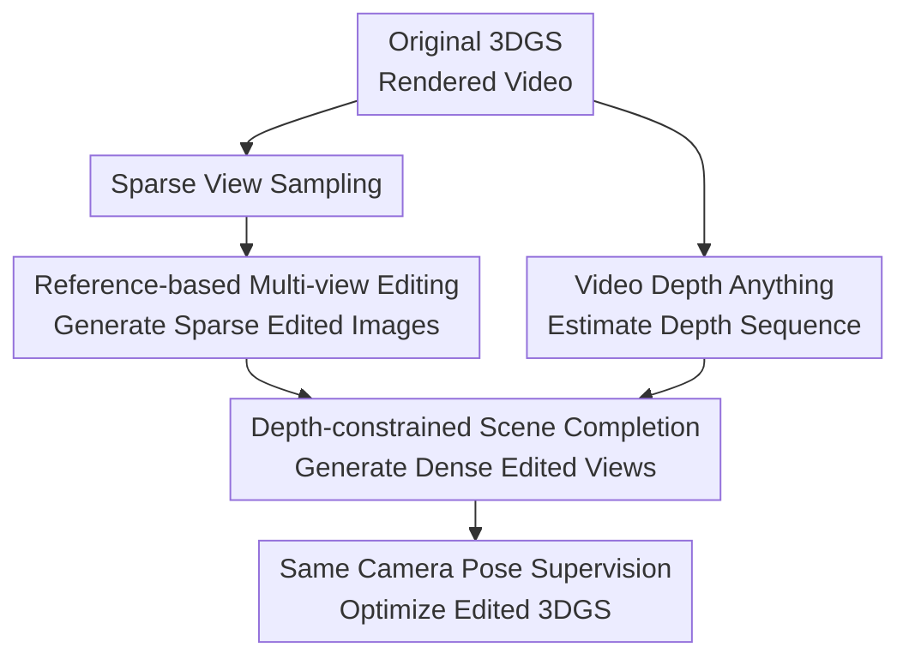

# TINKER: Diffusion's Gift to 3D--Multi-View Consistent Editing From Sparse Inputs without Per-Scene Optimization

**Conference**: ICLR 2026  
**OpenReview**: [https://openreview.net/forum?id=j7Vt2lp2jX](https://openreview.net/forum?id=j7Vt2lp2jX)  
**Code**: Will be released after acceptance  
**Area**: 3D Vision  
**Keywords**: Multi-view consistent editing, 3DGS editing, diffusion models, sparse views, scene completion

## TL;DR
TINKER transforms large-scale 2D image editing models and video diffusion models into a 3D-oriented multi-view consistent editing pipeline. It generates dense consistent views from one or a few edited reference images and completes high-quality 3DGS editing without requiring per-scene optimization of the editing model.

## Background & Motivation
**Background**: Current common practices in 3D scene editing involve using 2D diffusion editors to generate edited images for several views, which then serve as supervision to optimize NeRF or 3D Gaussian Splatting (3DGS). The appeal of this paradigm lies in leveraging the semantic editing capabilities of 2D generative models while grounding the final result in a renderable 3D representation.

**Limitations of Prior Work**: Issues arise regarding multi-view consistency and practical costs. Many methods either fine-tune diffusion models or 3D representations on a per-scene basis or require repetitive parameter tuning to suppress drift between views. Even if a single image edit is high-quality, colors, textures, and styles across different camera positions may not align. Generating dozens of consistent edited views for 3DGS optimization is prohibitively expensive.

**Key Challenge**: Large-scale 2D editing models are powerful but operate on the image plane, lacking the awareness that a 3D scene should share a single editing intent across views. The authors observe that while concatenating two views horizontally and feeding them to an image editor allows for decent local consistency within the pair, there is no global anchor between different concatenation pairs, leading to inter-pair inconsistency. Directly using an edited image as a reference to edit another unedited view also fails because base models are not pre-trained for such reference-based multi-view editing configurations.

**Goal**: TINKER aims to solve three sub-problems: first, teaching image editing models to propagate edits to another view based on an edited reference; second, completing edited views for a large number of camera positions from sparse edited views; and third, stably using these dense edited views for 3DGS optimization while avoiding the need to retrain the editing model for every test scene.

**Key Insight**: Instead of training a 3D editing model from scratch, the system "elicits" the implicit 3D awareness already learned by diffusion models. An image editing model handles high-fidelity semantic editing, while a video diffusion model completes continuous views along camera trajectories, using depth conditions to bind the video generation's degrees of freedom to the original 3D geometry.

**Core Idea**: Use synthetic reference-based multi-view editing data to teach the 2D editing model to "edit one view while looking at another," then use a depth-constrained video scene completion model to expand sparse edits into dense consistent supervision, thereby bypassing per-scene optimization.

## Method

### Overall Architecture
TINKER takes an original 3DGS scene $G$, an editing instruction, and rendered camera trajectory videos as input. The system samples sparse views from the rendered video and uses a multi-view consistent image editing model to obtain sparse edited references. It then estimates depth for the entire video and passes these sparse references and the depth sequence to a scene completion model to generate dense edited views along the trajectory. Finally, these views are used to optimize the original 3DGS into an edited version $G'$.

In the few-shot case, sparse reference views cover key regions of the scene, and the completion model fills the rest. In the one-shot case, an initial reference view is used to generate a batch of new views, which then serve as further references to propagate edits until sufficient coverage is achieved. Notably, "no per-scene optimization" means the editing and completion models are not retrained; the 3DGS representation is still optimized using the generated dense views.

### Key Designs
**1. Reference-based Multi-view Editing Data: Turning In-pair Consistency into Propagation Ability**

The first step is not to assume base models understand "references," but to construct the missing training distribution. The authors randomly select two views $I_a, I_b$ of the same scene from 3D-aware datasets, concatenate them, and feed them with LLM-generated instructions $P$ to a base editor $E$ to get locally consistent edits $I'_a, I'_b = E(Concat(I_a, I_b), P)$. This leverages the base model's capacity for in-pair consistency to create training data.

To avoid low-quality samples, DINOv2 features are used for dual-filtering. If the edited image is too similar to the original ($s_{noedit} > \tau_{noedit}$), the edit failed. If the similarity between the two edited views ($s_{mv} = sim(f(I'_a), f(I'_b))$) is below $\tau_{mv}$, multi-view consistency is insufficient. Surviving samples are reorganized into "unedited image + edited reference from another view" as input and "edited target + reference" as output for LoRA fine-tuning. The model learns to extract editing intent from the reference and propagate it.

**2. Sparse-to-Dense Scene Completion: Rewriting 3D Editing as Reconstruction**

Editing every view solely with the reference-based model is inefficient and prone to detail drift. TINKER introduces a scene completion model. Instead of learning "edit video A to video B" (for which data is scarce), it learns "reconstruct the full original scene from sparse views and geometric conditions." During training, the model sees original videos, sparse frames, and depth sequences to reconstruct the video. At test time, replacing reference frames with edited views effectively propagates the edited appearance through the scene.

This reformulation is critical. It transforms a task lacking editing labels into a reconstruction task supported by abundant 3D/video data while preserving the interface for editing: if sparse references contain the "blue wall" or "oil painting" appearance, the completion model propagates it to other views with matching geometry under depth constraints.

**3. Depth Conditions over Ray Maps: Binding Degrees of Freedom with Explicit Geometry**

Many multi-view works encode camera parameters into ray maps. The authors find this insufficient for 3D editing as ray maps do not directly constrain object silhouettes or occlusions, leading to deformations. TINKER uses depth maps as the core condition because they explicitly describe scene structure and spatial layout under camera motion.

Using Wan2.1 1.3B as a backbone, depth maps and reference views are tokenized and concatenated with noisy latent tokens: $X^t_{input}=Concat(Z_t,D,V)$. Training loss is only applied to the noisy latent output. This forces the model to treat depth and references as constraints rather than generation targets. Text embeddings are fixed to focus the model on geometry-consistent appearance propagation.

**4. Positional Encoding Binding for Reference Views**

If reference views are just input as tokens, the model does not naturally know their position in the trajectory. TINKER assigns the same positional encoding to a reference view as the target $j$-th frame and its corresponding depth tokens: $PE(V)=PE(D_j)=PE(X_j)$. This binds the reference view as an appearance anchor for a specific camera position, combined with depth to propagate style and texture.

## Loss & Training
The multi-view consistent editing model uses Flux Kontext with flow matching. For the synthesized editing pairs, the loss is: $Loss=E_{z_0,t}\|E_\theta(z_t,t,P)-u(z'_t)\|_2^2$. The training distribution forces the model to "see" the reference edit in one half of the image and generate it in the other.

The scene completion model (Wan2.1 1.3B) is initialized on OpenVid-1M and fine-tuned on 3D datasets (DL3DV, Re10k, etc.) with depth from Video Depth Anything. The flow matching loss is $Loss=E_{z_0,t}\|\Phi_\theta(X^t_{input},t)-u(Z_t)\|_2^2$, where $X^t_{input}$ includes the noisy latent, depth tokens, and reference tokens.

## Key Experimental Results

### Main Results
TINKER is compared with state-of-the-art 3D editing methods on Mip-NeRF-360 and IN2N.

| Method | CLIP-dir↑ | DINO↑ | Aesthetic↑ | 24G GPU Viable | Avg. Edit Time↓ |
|------|-----------|-------|------------|----------------|---------------|
| DGE | 0.102 | 0.948 | 5.747 | Yes | 10min |
| GaussCtrl | 0.123 | 0.957 | 5.624 | No | 20min |
| TIP-Editor | 0.084 | 0.875 | 5.397 | No | 35min |
| EditSplat | 0.102 | 0.956 | 5.661 | Yes | 19min |
| TINKER one-shot | 0.143 | 0.958 | 6.214 | Yes | 15min |
| TINKER few-shot | 0.157 | 0.959 | 6.338 | Yes | 15min |

TINKER achieves a better balance between editing strength, consistency, visual quality, and resource efficiency. It also outperforms FLUX-adapted versions of prior methods like Instruct-GS2GS-FLUX.

### Ablation Study
Ablation of the multi-view consistent editing model shows that LoRA fine-tuning significantly improves global consistency (DINO score) without sacrificing semantic direction.

| Configuration | DINO↑ | CLIP-dir↑ | Aesthetic↑ |
|------|-------|-----------|------------|
| Pre-fine-tuning | 0.862 | 0.277 | 7.058 |
| Post-fine-tuning | 0.943 | 0.281 | 6.973 |

Comparison of conditions for scene completion:

| Configuration | Text-Image Sim↑ | DINO↑ | Aesthetic↑ |
|------|------------------------|-------|------------|
| Ours-Ray-Map | 0.783 | 0.931 | 6.214 |
| Ours-Depth | 0.821 | 0.978 | 0.6586 |

### Key Findings
- **Reference-based fine-tuning** is the source of global consistency. DINO improves from 0.862 to 0.943.
- **Horizontal concatenation** of more than two images degrades quality due to compression; 2-image pairs are optimal.
- **Depth conditions** are superior to ray maps for 3D editing as they provide explicit geometric constraints.
- **4D Potential**: TINKER demonstrates consistency in editing dynamic scenes using 4DGS.

## Highlights & Insights
- TINKER cleverly uses the existing in-pair consistency of 2D base models to generate a dataset that teaches them global propagation.
- Reformulating editing as a reconstruction task allows leveraging massive 3D/video datasets that lack editing labels.
- Depth is used as a "hard" geometric constraint rather than a "soft" prompt, ensuring the generated views are suitable for 3D representation optimization.

## Limitations & Future Work
- The synthesized data may still contain minor inconsistencies from the base model.
- The model is not designed for large geometric deformations that conflict with the original depth maps.
- Future work could include active reference selection to automatically identify the most informative views for propagation.

## Related Work & Insights
- **vs Instruct-GS2GS**: TINKER avoids heavy per-scene iterative editing cycles by relying on pre-trained scene completion.
- **vs DGE / GaussCtrl**: TINKER adapts better to DiT/flow architectures by using data-driven propagation rather than relying strictly on U-Net feature alignment.
- **vs Cat3D**: While ray maps describe camera relations, TINKER's depth maps provide the explicit geometric grounding necessary for stylized 3D editing.

## Rating
- **Novelty**: ⭐⭐⭐⭐⭐ High. Excellent formulation of reference-based propagation and reconstruction-based completion.
- **Experimental Thoroughness**: ⭐⭐⭐⭐☆ Solid benchmarks and ablations, though more failure case analysis would be beneficial.
- **Writing Quality**: ⭐⭐⭐⭐☆ Clear motivation and technical descriptions.
- **Value**: ⭐⭐⭐⭐⭐ High potential as a foundation for sparse-input 3D/4D editing workflows.

<!-- RELATED:START -->

## Related Papers

- [\[CVPR 2026\] Multi-view Consistent 3D Gaussian Head Avatars 'without' Multi-view Generation](../../CVPR2026/3d_vision/multi-view_consistent_3d_gaussian_head_avatars_without_multi-view_generation.md)
- [\[ICLR 2026\] Nano3D: A Training-Free Approach for Efficient 3D Editing Without Masks](nano3d_a_training-free_approach_for_efficient_3d_editing_without_masks.md)
- [\[ICLR 2026\] Path Matters: Unveiling Geometric Implicit Bias via Curvature-Aware Sparse View Optimization](path_matters_unveiling_geometric_implicit_bias_via_curvature-aware_sparse_view_o.md)
- [\[ICLR 2026\] ReconViaGen: Towards Accurate Multi-view 3D Object Reconstruction via Generation](reconviagen_towards_accurate_multi-view_3d_object_reconstruction_via_generation.md)
- [\[ECCV 2024\] GaussCtrl: Multi-View Consistent Text-Driven 3D Gaussian Splatting Editing](../../ECCV2024/3d_vision/gaussctrl_multi-view_consistent_text-driven_3d_gaussian_splatting_editing.md)

<!-- RELATED:END -->
