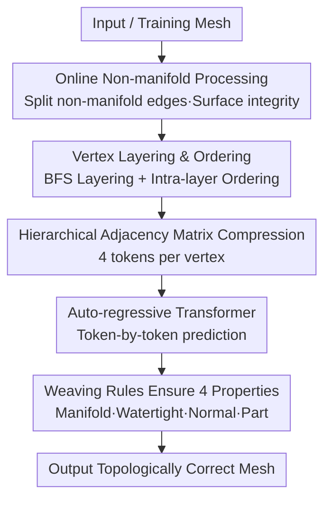

# Topology-Preserved Auto-regressive Mesh Generation in the Manner of Weaving Silk

- **Conference**: ICLR 2026
- **arXiv**: [2507.02477](https://arxiv.org/abs/2507.02477)
- **Code**: [Project Page](https://gaochao-s.github.io/pages/MeshSilksong/)
- **Area**: 3D Vision / Mesh Generation
- **Keywords**: Mesh Generation, Auto-regressive, Topology Preservation, Mesh Tokenization, Manifold, Watertight

## TL;DR

A mesh tokenization algorithm inspired by "silk weaving" is proposed. It provides a canonical topological framework through vertex layering and ordering, ensuring manifoldness, watertightness, normal consistency, and part-awareness of generated meshes while achieving SOTA compression efficiency.

## Background & Motivation

Auto-regressive mesh generation is a significant direction in recent 3D content creation. However, existing methods (MeshAnything v2, EdgeRunner, BPT, DeepMesh) treat meshes as simple collections of triangular faces and lack awareness of global topological structures, leading to:

**Inability to guarantee watertightness**: Generations contain holes, affecting applications like 3D printing and physical simulation.

**Lack of part-awareness**: Absence of connected component concepts makes it difficult to capture small but important parts (e.g., eyes).

**Inconsistent normal directions**: Flipped face normals cause rendering artifacts.

**Non-manifold topology**: Local patch methods (BPT, DeepMesh) cannot guarantee manifold properties.

**Core Contribution**: The first mesh tokenization algorithm that simultaneously ensures manifoldness, watertightness detection, normal consistency, and part-awareness.

## Method

### Overall Architecture

The method reformulates "mesh generation" as "weaving silk": first, a set of canonical layering rules organizes disordered triangular faces into layers of ordered vertices (similar to silk threads woven side-by-side). Then, each vertex and its connectivity within the current layer and with adjacent layers are compressed into a compact token sequence for prediction by an auto-regressive model. Because the weaving rules themselves constrain edges to lie only within or between adjacent layers, topological properties like manifoldness, watertightness, normal consistency, and part-awareness are inherently embedded in the tokenization rather than fixed post-hoc. Before training, an online non-manifold processing step converts more real meshes into trainable samples.

### Key Designs

**1. Vertex Layering and Ordering: A Canonical "Lat-Long" Framework**

Existing methods treat meshes as isolated triangles, losing global topology. Here, for each connected component, a starting half-edge $j$-$m$ is selected based on y-z-x coordinate sorting. BFS is then used with the shortest graph distance to the origin $j$ as the layer index $L$, assigning all vertices to layers. Vertices within the same layer are ordered by traversing half-edges (provable via mathematical induction). Each vertex is uniquely labeled as $\mathcal{V}_i^L$, where $L$ is the layer index and $i$ is the intra-layer order. This step prepares the mesh for "weaving," where all connectivity is described within "intra-layer" and "inter-layer" local scopes.

**2. Hierarchical Adjacency Matrix Compression: 4 Tokens per Vertex**

With the layering framework, vertex connectivity is split into two classes. Intra-layer connections (blue edges) are represented by a symmetric 0-1 matrix $\mathcal{S}_L$ (size $M \times M$). A fixed window $W=8$ for binary compression covers 99.1% of cases, defaulting to COO format for extremely dense scenarios. Inter-layer connections (red edges) use a 0-1 matrix $\mathcal{B}_L$ (size $M \times N$). This is compressed using RLE-style encoding of continuous "1"s into $(x, y)$ (start column index, length), further simplified as a "Stars and Bars" combinatorial problem such that each row requires only one token. Each vertex $\mathcal{V}_i^L$ generates 4 tokens: 2 position tokens $V_{(L,i)}$ (using block-offset representation), 1 intra-layer topology token $S_{(L,i)}$, and 1 inter-layer topology token $B_{(L,i)}$. This achieves 26.65 bits/face and a 0.22 compression ratio.

**3. Weaving Rules for Geometric Properties**

The layered and ordered weaving approach makes four topological properties almost "free." Since edges only appear within or between adjacent layers as triangles are filled layer-by-layer, **manifold topology** is strictly guaranteed. Holes only occur if a 0 in the adjacency matrix is incorrectly predicted as a connection; thus, **watertightness** can be directly detected and repaired. By defining ascending half-edge directions for layer $L$ and descending for layer $L-1$, vertices of every triangle are traversed counter-clockwise, ensuring **normal consistency**. Introducing a special token $C$ to mark the start of connected components allows the model to perceive and generate independent **parts** like eyes.

**4. Online Non-Manifold Processing: Utilizing Real Data**

Real-world data often contains non-manifold edges shared by more than 3 faces. Discarding them loses training samples. Unlike Libigl's degree-priority merging, this method detects the "edge-graph" structure $\mathcal{G}$ around non-manifold vertices and requires it to form a pure cycle to ensure surface integrity after splitting. This online processing allows non-manifold data into the training set—ablations show that adding non-manifold data improves NC from 0.688 to 0.801.

### Loss & Training

The model is supervised token-by-token using standard cross-entropy loss $\mathcal{L}_{ce} = -\sum_{t=1}^{T-1} S_{t+1} \log \hat{S}_t$. To alleviate the long-tail distribution of face counts, a progressive balanced sampling strategy is used. It transitions from instance-based $p_j^{IB}$ to category-based $p_j^{CB}$ (every 100 faces as a category) during training $t$ via $p_j^{PB}(t) = (1 - t/T) p_j^{IB} + (t/T) p_j^{CB}$. Early stages focus on simpler instance-balanced samples, while later stages complement with complex meshes via category balancing. This resampling reduces CD from 0.032 to 0.025 and increases NC from 0.700 to 0.792.

## Key Experimental Results

### Main Results

| Method | CD↓ | HD↓ | NC↑ | |NC|↑ | Bits/face↓ | Comp. Ratio↓ |
|------|-----|-----|-----|-------|------------|--------------|
| EdgeRunner* | 0.053 | 0.144 | 0.418 | 0.789 | 29.61 | 0.47 |
| TreeMeshGPT | 0.030 | 0.103 | 0.706 | 0.892 | 42.00 | 0.22 |
| BPT | 0.027 | 0.094 | 0.770 | 0.909 | 28.48 | 0.26 |
| **Ours** | **0.025** | **0.087** | **0.792** | **0.924** | **26.65** | **0.22** |

### Ablation Study

| Ablation | CD↓ | HD↓ | NC↑ | |NC|↑ |
|------|-----|-----|-----|-------|
| w/ Resampling | 0.025 | 0.087 | 0.792 | 0.924 |
| w/o Resampling | 0.032 | 0.103 | 0.700 | 0.880 |
| Manifold + Non-manifold | 0.022 | 0.080 | 0.801 | 0.932 |
| Manifold Only | 0.027 | 0.090 | 0.688 | 0.871 |

### Key Findings

| Method | Lossless | Manifold | Watertight | Normal Consist. | Part-aware |
|------|------|------|------|----------|----------|
| **Ours** | ✓ | ✓ | ✓ | ✓ | ✓ |
| MeshAnything v2 | ✓ | ✗ | ✗ | ✗ | ✗ |
| EdgeRunner | ✓ | ✓ | ✗ | ✗ | ✗ |
| BPT | ✓ | ✗ | ✗ | ✗ | ✗ |

## Highlights & Insights

1. **Elegant Silk Analogy**: The idea of inter-layer weaving naturally ensures topological properties with clever design.
2. **Unique Guarantee**: The only tokenization method to simultaneously ensure 5 geometric properties.
3. **SOTA Compression Efficiency**: 26.65 Bits/face and a 0.22 compression ratio.
4. **Strong Practicality**: Directly supports downstream applications like 3D printing, physics simulation, and animation rigging.
5. **Data Scaling**: Online non-manifold processing effectively expands the scale of trainable data.

## Limitations & Future Work

1. Vocabulary size is relatively high (up to 10,267), though bits-per-face remains optimal.
2. Requires a predefined maximum intra-layer vertex count $m$, which limits extremely complex meshes.
3. Currently supports only triangular meshes; hybrid polygon support is a future direction.
4. Model size is approximately 500M parameters, requiring roughly 15 days on 16×H800 GPUs.

## Related Work & Insights

- **VQ-VAE Methods**: MeshGPT (Siddiqui et al., 2024) uses encoder-decoders for mesh tokenization.
- **Direct Quantization**: MeshXL and BPT directly quantize triangle vertex coordinates.
- **Tree Traversal**: EdgeRunner and TreeMeshGPT ensure manifoldness via tree structures but suffer from low compression efficiency.
- **Reinforcement Learning**: DeepMesh improves aesthetics via fine-tuning with human feedback.

## Rating

- **Innovation**: ⭐⭐⭐⭐⭐ — The inter-layer weaving concept is original and elegant.
- **Value**: ⭐⭐⭐⭐⭐ — Topological guarantees directly serve industrial applications.
- **Writing Quality**: ⭐⭐⭐⭐ — Clear algorithm descriptions and intuitive diagrams.
- **Value**: ⭐⭐⭐⭐⭐ — Solves key topological issues in auto-regressive mesh generation.

<!-- RELATED:START -->

## Related Papers

- [\[ICCV 2025\] MeshPad: Interactive Sketch-Conditioned Artist-Reminiscent Mesh Generation and Editing](../../ICCV2025/3d_vision/meshpad_interactive_sketch-conditioned_artist-reminiscent_mesh_generation_and_ed.md)
- [\[ICLR 2026\] UFO-4D: Unposed Feedforward 4D Reconstruction from Two Images](ufo-4d_unposed_feedforward_4d_reconstruction_from_two_images.md)
- [\[ICLR 2026\] Reducing Class-Wise Performance Disparity via Margin Regularization](reducing_class-wise_performance_disparity_via_margin_regularization.md)
- [\[ICLR 2026\] Universal Beta Splatting](universal_beta_splatting.md)
- [\[ICCV 2025\] Repurposing 2D Diffusion Models with Gaussian Atlas for 3D Generation](../../ICCV2025/3d_vision/repurposing_2d_diffusion_models_with_gaussian_atlas_for_3d_generation.md)

<!-- RELATED:END -->
