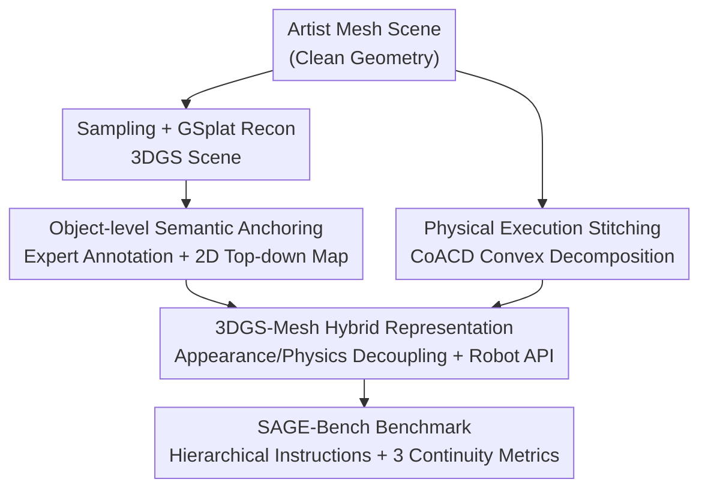

# Towards Physically Executable 3D Gaussian for Embodied Navigation

**Conference**: ICLR 2026  
**OpenReview**: [https://openreview.net/forum?id=HB6KvsqcAn](https://openreview.net/forum?id=HB6KvsqcAn)  
**Code**: https://sage-3d.github.io  
**Area**: 3D Vision / Embodied Navigation / Vision-Language Navigation (VLN)  
**Keywords**: 3D Gaussian Splatting, Vision-Language Navigation, Physical Simulation, Semantic Annotation, Embodied AI

## TL;DR
This paper proposes the SAGE-3D paradigm, upgrading 3DGS from a "rendering-only" scene representation to an environment for training and evaluating embodied agents by adding **object-level semantics** and **physical collision structures**. It releases the InteriorGS dataset with 1k annotated scenes and SAGE-Bench, the first 3DGS-based VLN benchmark (2M trajectory-instruction pairs).

## Background & Motivation
**Background**: Vision-Language Navigation (VLN) requires training agents in simulation to follow natural language instructions, as real-world training is costly and dangerous. Scene representations have evolved from early scanned meshes (Matterport3D, HM3D) to the recent 3D Gaussian Splatting (3DGS)—which is considered a powerful tool for narrowing the sim-to-real gap due to its photorealistic and real-time rendering.

**Limitations of Prior Work**: Compared to scanned meshes, 3DGS offers two natural advantages: it uses discrete Gaussians to represent scenes, allowing objects to be directly annotated (meshes are often a continuous surface where objects are "stuck" together and hard to separate); and it optimizes a continuous radiance field, ensuring consistent realism from arbitrary viewpoints (mesh textures often suffer from seams, stretching, or blurring in novel views). However, current 3DGS is **only used for high-fidelity rendering** and cannot be used directly for VLN due to two fatal flaws: (1) Lack of fine-grained semantics—existing 3DGS scenes only have color and density without instance IDs or object attributes, making it impossible to ground instructions like "walk to the red chair next to the white bookshelf"; (2) Lack of physically executable structures—since Gaussian Splatting is essentially volume rendering, it is difficult to extract smooth surfaces and reliable collision geometries, causing agents to "clip" through walls.

**Key Challenge**: There is a gap between the realistic appearance of 3DGS and its utility as an "executable environmental foundation"—it possesses vision but lacks semantics and physics. Directly inferring surfaces/colliders from Gaussians is difficult and error-prone, and aligning semantics with appearance is equally non-trivial.

**Goal**: While **preserving the photorealistic rendering of 3DGS**, this paper aims to inject object-level semantics and physical executability, transforming it into an environmental base capable of training and evaluating embodied agents.

**Key Insight**: The authors observe that 3DGS scenes are often reconstructed via samples from artist-created mesh scenes. Since the source contains clean meshes, one can **decouple appearance from physics**: using 3DGS for visual appearance and colliders extracted from the source mesh for physics, combining them into a hybrid representation.

**Core Idea**: Use a hybrid paradigm of "3DGS (appearance) + Mesh colliders (physics) + Human object-level annotation (semantics)" to upgrade purely perceptual 3DGS scenes into executable POMDP navigation environments.

## Method

### Overall Architecture
The core of SAGE-3D (Semantically and Physically Aligned Gaussian Environments) is a formal upgrade: converting a 3DGS Gaussian primitive set $G=\{g_i\}_{i=1}^{N}$, overlaid with a semantic layer $M$ and a physical layer $\Phi$, into an executable environment $E_{exec}$:

$$G + M + \Phi \longrightarrow E_{exec}$$

The final environment is modeled as a semantic and physics-augmented POMDP: $E = (U, S, A, O, T, Z; M, \Phi)$, where $U$ is the instruction space, $S$ the continuous state space, $A$ the action space, $O$ the multimodal observation space, and $T, Z$ the physics-driven state transition and rendering functions, respectively.

The pipeline starts from artist-designed mesh scenes: first, 3DGS scenes are reconstructed via sampling (the semantic layer $M$ is annotated at the object level by experts and projected into 2D semantic top-down views); then, colliders are extracted from the source meshes as the physical layer $\Phi$, combined with 3DGS into a hybrid representation and connected to robot APIs. Finally, 2M VLN data points are generated based on this environment to form the SAGE-Bench benchmark, evaluated using three continuity metrics.

### Key Designs

**1. SAGE-3D Paradigm: Formalizing "Watch-only" 3DGS into "Executable" POMDP**

The pain point was that 3DGS had long been just a renderer, lacking a unified framework for embodied learning. This paper first formalizes it as the upgrade process $G + M + \Phi \to E_{exec}$, implemented as a POMDP $E=(U,S,A,O,T,Z;M, \Phi)$. The key is that $T$ and $Z$ are "physics-driven": state transitions are determined by real collision dynamics, and observations are generated by 3DGS rendering, while the agent moves in a **continuous metric space** (rather than teleporting between panoramic nodes). This formalization clarifies that "adding semantics and physics" involves two orthogonal layers $M$ and $\Phi$, allowing 3DGS to retain realistic rendering while gaining semantic referability and physical executability.

**2. Object-level Semantic Anchoring: Supplying Gaussians with Instance IDs and Referable 2D Semantic Maps**

This addresses the pain point that 3DGS lacks instance semantics for grounding fine-grained instructions. Instead of inferring semantics from Gaussians, the authors **reconstruct 3DGS from clean artist meshes**. On average, 3000 camera views are rendered per scene to estimate Gaussian parameters using the open-source GSplat. Then, **expert double-check annotations** are performed on the sampled scenes, assigning categories, instance IDs, and bounding boxes to each object. This results in InteriorGS: 1000 scenes (752 residential + 248 public scenes including concert halls, gyms, etc.), containing 554k object instances and 755 categories.

Since the standard NavMesh process for scanned meshes is not feasible for 3DGS, the authors designed a **2D semantic top-down view**: projection of annotated 3D objects to the ground, with doors labeled by state (open/closed/ajar) and walls marked as non-traversable. To refine footprints from axis-aligned 3D boxes, they sample surface points, project them, and take the 2D convex hull:
$$M_k = \text{Fuse}\left(\text{Hull}\{\Pi_{top}(p) \mid p \in \text{Surf}(o_k)\}\right)$$
where $\text{Surf}(o_k)$ are sampled surface points of object $o_k$, $\Pi_{top}$ is the ground projection, $\text{Hull}(\cdot)$ is the 2D convex hull operator, and $\text{Fuse}(\cdot)$ merges multi-view masks into a consistent footprint. This semantic map supports instruction generation and A* path planning.

**3. Physical Execution Stitching: Appearance/Physics Decoupled 3DGS-Mesh Hybrid Representation**

Even with semantics, 3DGS still lacks collision. The authors completely decouple appearance from physics by taking the artist's triangular mesh for each object and performing **convex decomposition using CoACD** to obtain per-object colliders. In the USDA scene, colliders are defined as **invisible rigid bodies** (responsible for contact and dynamics), while the 3DGS files remain visible (responsible for appearance). Each object is instantiated as a USD prim with rigid body/contact parameters $\Phi_k$. This setup **avoids ray-tracing artist meshes at runtime**, maintaining high-fidelity 3DGS rendering while gaining accurate collision geometry.

Isaac Sim 5.0 supports rendering 3DGS via USDZ exported from 3DGUT, which this hybrid representation complements. The simulator exposes robot APIs for legged/wheeled platforms (Unitree G1/Go2/H1) and drones. Action interfaces support both discrete commands and continuous control (velocity $(v,\omega)$ for ground robots, 6-DoF for drones), providing RGB, depth, semantic segmentation, pose, and contact events with built-in collision detection and recovery.

**4. SAGE-Bench & Three Continuity Metrics: Shifting from "Endpoint Success" to "Motion Quality"**

With the executable environment, the authors built SAGE-Bench (2M trajectory-instruction pairs). Instructions are **hierarchical**: High-level instructions emphasize semantic tasks (Add Object, Scenario Driven, Relative Relationship, Attribute-based, Area-based); Low-level instructions are template-based waypoint actions. High-level instructions are generated by MLLMs based on the 2D semantic map; trajectories are generated via A* on a 1.2m occupancy map.

The framework introduces three **Natural Continuity Metrics** to evaluate motion quality beyond endpoint success:
- **Continuous Success Rate (CSR)**: Measures the proportion of time an agent stays within a tolerance corridor $C$ of the reference path while satisfying task conditions, $\text{CSR}=\frac{1}{T}\sum_{t=1}^{T}s(t)$.
- **Integral Collision Penalty (ICP)**: Integrates the collision intensity sequence $c(t)\in[0,1]$ over time, $\text{ICP}=\frac{1}{T}\sum_{t=1}^{T}c(t)$, capturing both frequency and duration of collisions.
- **Path Smoothness (PS)**: A normalized score based on continuous heading changes, $\text{PS}=1-\frac{1}{T-1}\sum_{t=2}^{T}\min\left(\frac{|\Delta\theta_t|}{\pi},1\right)$, where $\Delta\theta_t=\theta_t-\theta_{t-1}$.

## Key Experimental Results

### Main Results
Evaluation on SAGE-Bench using closed/open-source MLLMs and specialized VLN models shows the benchmark is challenging—most models (except SOTA NaVILA) record SR below 0.15. Fine-tuning on SAGE data yields significant gains:

| Model | SR↑ | OSR↑ | SPL↑ | CSR↑ | ICP↓ | PS↑ |
|------|------|------|------|------|------|------|
| NaVid-base | 0.10 | 0.13 | 0.10 | 0.15 | 0.28 | 0.84 |
| NaVid-SAGE (Ours) | 0.36 | 0.46 | 0.32 | 0.48 | 0.66 | 0.54 |
| NaVILA-base | 0.21 | 0.26 | 0.22 | 0.33 | 0.72 | 0.41 |
| NaVILA-SAGE (Ours) | **0.46** | **0.55** | **0.48** | **0.57** | 0.54 | 0.74 |
| NaVILA (Original) | 0.39 | 0.47 | 0.34 | 0.48 | 0.61 | 0.68 |

NaVILA-SAGE achieved the best task completion. Cross-domain generalization (trained on SAGE-Bench only, tested on VLN-CE R2R Val-Unseen):

| Model | SR↑ | OSR↑ | SPL↑ |
|------|------|------|------|
| NaVILA-base | 0.29 | 0.38 | 0.27 |
| NaVILA-SAGE (Ours) | 0.38 | 0.51 | 0.36 |

NaVILA-SAGE improved SR by **31%** (0.29→0.38) and OSR by 34% on R2R, confirming that 3DGS data, being closer to the real world, possesses strong generalization.

### Ablation Study
Rendering speed and convergence (NaVILA-base, H20 GPU):

| Env Type | Render Time/Frame(ms)↓ | VRAM(MB)↓ | Iter to SR=40%(k)↓ | Time(h)↓ |
|----------|------------------|-----------|----------------------|----------|
| Scanned Mesh (MP3D/HM3D) | 16.7 | 850 | 120 | 4.8 |
| 3DGS-Mesh Hybrid (Ours) | **6.2** | **220** | 160 | 6.2 |

Lower scene/sample counts significantly dropped SR, indicating that both scene diversity and sample volume are critical.

### Key Findings
- **3DGS renders faster but converges slower**: 3DGS per frame is 6.2ms/220MB (VRAM), much better than mesh (16.7ms/850MB). However, it requires more iterations (160k vs 120k) to reach 40% SR because the data is more realistic and complex.
- **Traditional metrics miss motion issues**: NaVILA had 0.39 SR but high ICP (0.61), indicating persistent collisions. ICP revealed "wall-rubbing" behaviors that traditional CR (Collision Rate) misses.
- **High-level instructions are much harder**: SR dropped from 0.56 (low-level) to 0.39 (high-level), highlighting semantic understanding as the real bottleneck in VLN.

## Highlights & Insights
- **"Appearance/Physics Decoupling" is a clever solution**: Instead of struggling to extract smooth surfaces from Gaussians, reverting to the source mesh for colliders allows 3DGS to focus on rendering. This hybrid USD representation is both fast and accurate.
- **Three continuity metrics target VLN evaluation pain points**: Moving evaluation from "did it arrive" to "how well did it travel" is a major step. This approach is transferable to any continuous control navigation task.
- **Data as a generalization engine**: Improving SR by 31% on VLN-CE just by training on SAGE-Bench suggests that realistic 3DGS data is more valuable for real-world alignment than hyperparameter tuning.

## Limitations & Future Work
- **Reliance on artist meshes**: The physics layer and semantic sampling depend on high-quality source meshes, making it less applicable to raw scans (point clouds/noisy depth).
- **Slower convergence**: 3DGS data training takes ~30% longer to converge, posing a burden for researchers with limited compute.
- **Static interactions**: Most objects are static rigid bodies; the environment is not yet fully interactable.
- Future directions: Exploring hybrid representation generation from raw scans, increasing interactive object proportions, and accelerating 3DGS-VLN training convergence.

## Related Work & Insights
- **vs. Scanned Mesh Benchmarks**: Unlike VLN-CE which uses "estimated" geometry from RGB-D scans (leading to stuck objects and texture artifacts), SAGE uses ground truth geometry and photorealistic view-consistent 3DGS.
- **vs. Surface Extraction (SuGaR, etc.)**: While others try to infer surfaces from Gaussians, this work sidesteps the unreliability of surface reconstruction by using source mesh colliders.
- **vs. VLN Models (NaVILA/NaVid)**: This paper provides an environmental foundation rather than just a model; the fact that these models improve significantly after fine-tuning on SAGE data suggests the bottleneck lies in data and environment quality.

## Rating
- Novelty: ⭐⭐⭐⭐⭐ First to upgrade 3DGS into a semantic+physical executable VLN environment.
- Experimental Thoroughness: ⭐⭐⭐⭐ Coverage of 10+ models and multi-dimensional ablations, though real-robot validation is limited.
- Writing Quality: ⭐⭐⭐⭐ Clear formalization and detailed metric definitions.
- Value: ⭐⭐⭐⭐⭐ InteriorGS and SAGE-Bench provide highly reusable infrastructure for the embodied AI community.

<!-- RELATED:START -->

## Related Papers

- [\[CVPR 2026\] Multi-Scale Gaussian-Language Map for Zero-shot Embodied Navigation and Reasoning](../../CVPR2026/3d_vision/multi-scale_gaussian-language_map_for_zero-shot_embodied_navigation_and_reasonin.md)
- [\[CVPR 2025\] RoomTour3D: Geometry-Aware Video-Instruction Tuning for Embodied Navigation](../../CVPR2025/3d_vision/roomtour3d_geometry-aware_video-instruction_tuning_for_embodied_navigation.md)
- [\[ICLR 2026\] OpenFly: A Comprehensive Platform for Aerial Vision-Language Navigation](openfly_a_comprehensive_platform_for_aerial_vision-language_navigation.md)
- [\[CVPR 2026\] MSGNav: Unleashing the Power of Multi-modal 3D Scene Graph for Zero-Shot Embodied Navigation](../../CVPR2026/3d_vision/msgnav_unleashing_the_power_of_multi-modal_3d_scene_graph_for_zero-shot_embodied.md)
- [\[CVPR 2025\] RainyGS: Efficient Rain Synthesis with Physically-Based Gaussian Splatting](../../CVPR2025/3d_vision/rainygs_efficient_rain_synthesis_with_physically-based_gaussian_splatting.md)

<!-- RELATED:END -->
