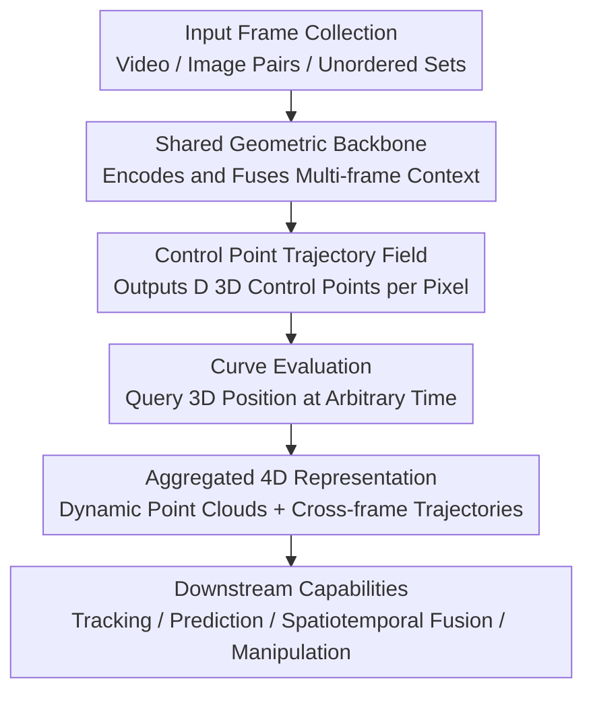

# Trace Anything: Representing Any Video in 4D via Trajectory Fields

**Conference**: ICLR2026  
**OpenReview**: [https://openreview.net/forum?id=BqaChqppVh](https://openreview.net/forum?id=BqaChqppVh)  
**Code**: To be released (the paper states that code and model weights will be made available)  
**Area**: 3D Vision  
**Keywords**: 4D video representation, trajectory fields, dynamic scene reconstruction, 3D point tracking, feed-forward geometric models

## TL;DR
Trace Anything represents every pixel in a video as a continuous 3D trajectory and directly predicts the trajectory field of the entire video through a single feed-forward inference. This achieves efficient 4D dynamic scene representation without requiring depth, optical flow, 2D trackers, or per-scene optimization.

## Background & Motivation
**Background**: Understanding dynamic scenes typically requires simultaneous knowledge of spatial structure and temporal evolution. Traditional 3D reconstruction, SLAM, Dynamic NeRF, Dynamic 3D Gaussian Splatting, and recent feed-forward geometric models like DUSt3R / VGGT / Fast3R can recover cameras, point clouds, or geometry from images or videos. However, in dynamic videos, many methods still first obtain point clouds, depth, or local geometry for each frame, and then rely on optical flow, 2D point tracking, additional trackers, or post-processing optimization to establish cross-frame correspondences.

**Limitations of Prior Work**: This "reconstruct-then-align-then-track" paradigm is prone to error propagation. If depth estimation is biased, optical flow breaks at occlusions, or per-frame point clouds are not placed in a consistent coordinate system, the resulting 4D representation drifts over time. Furthermore, many high-performing methods rely on per-scene optimization or pairwise inference, which is costly for long videos, multi-frame inputs, or unordered image sets, making them less suitable as directly deployable general-purpose video geometric models.

**Key Challenge**: The minimal observation unit of a video is the pixel, yet existing 4D representations often compress pixels into 3D points of a specific frame first, adding correspondences in subsequent steps. This work argues that this order is inverted: if a pixel naturally follows a trajectory over time in the physical world, the more natural fundamental unit is not a "point in a frame," but a "continuous 3D curve triggered by that pixel."

**Goal**: The authors aim to establish an atomic 4D video representation that allows querying the 3D position of every pixel from every frame across the entire duration. This representation must satisfy two key properties: trajectories in static regions should degenerate into nearly stationary points, and corresponding pixels belonging to the same physical object point in different frames should map to the same or consistent 3D trajectories. Simultaneously, the model should complete predictions in a single feed-forward pass without relying on external estimators or per-video optimization.

**Key Insight**: Trace Anything observes that trajectories can be parameterized using a small number of control points. Instead of outputting discrete point clouds per timestep, the network outputs a set of 3D control points for each pixel. Through curve basis functions like B-splines, the 3D position of that pixel can be queried at any time $t \in [0,1]$. This transforms "video representation" from a collection of discrete frames into a continuously queryable 4D trajectory field.

**Core Idea**: Replace per-frame point clouds and cross-frame matching with a Trajectory Field composed of per-pixel 3D parametric curves, and train a feed-forward network, Trace Anything, to directly predict the control points of these curves from input frames.

## Method

### Overall Architecture
The input to Trace Anything is a set of RGB frames, which can be sequential video, image pairs, or unordered image collections capturing the same dynamic scene. The model first encodes each frame into tokens using a geometric backbone, then aggregates context within and across frames via a fusion Transformer, and finally outputs a set of 3D control points for each pixel through a control point head. These control points define continuous trajectories; evaluating the trajectories at different timestamps yields dynamic point clouds, cross-frame 3D correspondences, and downstream-ready 4D representations.

Mathematically, a Trajectory Field is a mapping from a discrete pixel domain to a continuous 3D curve space:
$$
T:[N]\times[H]\times[W]\rightarrow C([0,1],\mathbb{R}^3),\quad (i,u,v)\mapsto x_{i,u,v}(\cdot).
$$
Here, $i$ is the frame index, $(u,v)$ are pixel coordinates, and $x_{i,u,v}(t)$ denotes "the 3D position at time $t$ of the world point corresponding to this pixel in frame $i$." In the implementation, each trajectory is represented by $D$ control points $P^{(k)}_{i,u,v}\in\mathbb{R}^3$ and combined using cubic B-spline basis functions:
$$
x_{i,u,v}(t)=\sum_{k=0}^{D-1}P^{(k)}_{i,u,v}\phi_k(t).
$$
Thus, the network does not predict points frame-by-frame, but rather a continuously queryable 3D curve for every pixel.

### Key Designs
**1. Trajectory Field Representation: From "Point Cloud Frames" to "Pixel-Triggered 3D Curves"**

Traditional dynamic 3D methods often recover the scene as point clouds at each moment and then use optical flow, 2D tracking, or optimization to determine where these points move. Trace Anything encodes this directly into the representation: every pixel in every input frame corresponds to a full-duration 3D trajectory. To find the 3D position of pixel $(u,v)$ from frame $i$ at frame $j$'s time, one simply evaluates the trajectory at $t_j$: $X_{i\rightarrow j}(u,v)=x_{i,u,v}(t_j)$.

The benefit of this design is that cross-frame correspondence is no longer a post-processing product but a natural query result of the trajectory field. Ideal trajectories for static backgrounds degenerate into nearly overlapping control points; sequences of control points predicted from different frames for the same physical point on a dynamic object should be consistent. The paper refers to these properties as C1 and C2, respectively, and enforces them via training objectives.

**2. Control Point Trajectory Field: Compressing Continuous 4D Motion with Sparse Control Points**

If the network were to output 3D coordinates for every pixel at all timesteps, the output volume would scale linearly with the number of frames and struggle to support arbitrary-time queries. This work chooses to output $D$ 3D control points per pixel, using cubic B-splines to obtain continuous trajectories. The control point map $P_i\in\mathbb{R}^{D\times H\times W\times 3}$ is a dense map similar to a depth map or point cloud map, making it suitable for prediction by convolutional or Transformer feature heads; however, it expresses an entire curve rather than just a point in the current frame.

This parameterization also smooths the motion model. For long-range motion, occlusions, and non-rigid deformations, the model does not need to guess positions at every discrete frame independently but learns a continuous path constrained by control points. At the endpoints, clamped B-splines ensure $x_{i,u,v}(0)$ and $x_{i,u,v}(1)$ correspond to the start and end control points, facilitating interpretation of trajectory boundaries; at intermediate times, the basis functions provide differentiable interpolation and velocity estimation.

**3. Feed-forward Shared World Coordinate Prediction: Bypassing External Estimators and Per-scene Optimization**

The Trace Anything network consists of an image encoder, a fusion Transformer, and a control point head. Each frame passes through a shared image encoder, followed by interleaved frame-wise and global attention to fuse multi-frame information. For sequential video, the model incorporates temporal index embeddings; for unordered image sets, the architecture remains applicable, though temporal information must be provided by an auxiliary timestamp head or metadata. The control point head outputs control points in a shared world coordinate system.

This structure continues the advantages of feed-forward geometric models like VGGT and Fast3R: all frames enter the network simultaneously, and the model establishes globally consistent geometric relationships in a single inference pass. Compared to combinations like CoTracker + VGGT, MonST3R, POMATO, or St4RTrack—which require extra tracking, pairwise inference, or global alignment—Trace Anything merges "estimating 3D geometry" and "establishing dynamic correspondence" into one end-to-end task, significantly reducing runtime.

**4. Synthetic Data Platform and Consistency Regularization: Dense Ground Truth for Trajectory Fields**

Trajectory fields require per-pixel 3D ground truth at every time step, which is difficult to obtain in real-world videos. The authors developed a Blender-based synthetic platform to generate over 10K training videos (~120 frames each) featuring indoor/outdoor environments, humans, articulated objects, and camera motion, providing dense annotations for RGB, 2D/3D trajectories, depth, camera poses, and semantic masks.

During training, the core supervision ensures that a trajectory starting from a pixel in frame $i$ lands on the 3D ground truth at the timestamp of frame $j$. Simultaneously, penalties are applied to control point variance in static regions, distance variance within rigid regions, and differences between control points of corresponding pixels across frames. These regularizations transform the C1/C2 properties into optimizable objectives, forcing the network to minimize individual point errors while learning that static regions remain still and rigid structures remain consistent.

### Loss & Training
The primary training loss is the 3D error of the trajectory reprojected to the target time. For pixel $(u,v)$ in frame $i$, the predicted 3D position at time $t_j$, $X_{i\rightarrow j}(u,v)$, is compared against the ground truth $X^{gt}_{i\rightarrow j}(u,v)$ using squared error:
$$
\ell_{i\rightarrow j}(u,v)=\|X_{i\rightarrow j}(u,v)-X^{gt}_{i\rightarrow j}(u,v)\|_2^2.
$$

To handle uncertain areas like occlusions or reflections, the control point head also predicts a confidence $\hat{\Sigma}^{(k)}_{i,u,v}$ for each control point. These are aggregated to the target time via the basis functions:
$$
\hat{\Sigma}_{i\rightarrow j}(u,v)=\sum_{k=0}^{D-1}\hat{\Sigma}^{(k)}_{i,u,v}\phi_k(t_j).
$$
The final confidence-adjusted loss takes the form $\hat{\Sigma}\ell + \alpha\log\hat{\Sigma}$, allowing the model to downweight unreliable points while preventing it from assigning low confidence to all points.

Secondary constraints include: a timestamp loss $L_{time}$ for the timestamp head, a static regularization $L_{static}$ to minimize the variance of control points for pixels in static regions, a rigid regularization $L_{rigid}$ to ensure distances between pixel pairs in rigid regions remain stable over time, and a correspondence regularization $L_{corr}$ to align control point sequences for known cross-frame matches. The total objective is:
$$
L=L_{traj-conf}+\lambda_{time}L_{time}+\lambda_{static}L_{static}+\lambda_{rigid}L_{rigid}+\lambda_{corr}L_{corr}.
$$

## Key Experimental Results

### Main Results
The paper evaluates Trace Anything on a custom benchmark across two settings: 30-frame video clips (requiring all-to-all prediction) and image pairs (estimating motion between frames 5 steps apart). Metrics include 3D endpoint error (EPE), static degradation deviation (SDD), correspondence alignment (CA), and APD3D/AJ.

| Setting | Method | EPEmix↓ | EPEdyn↓ | CA↓ | SDD↓ | Runtime↓ |
|------|------|---------|---------|-----|------|----------|
| 30-frame Video | POMATO* | 0.270 | 0.303 | 5.71 | 1.29 | 80.8s |
| 30-frame Video | St4RTrack* | 0.264 | 0.355 | 6.13 | 1.60 | 21.7s |
| 30-frame Video | Easi3R | 0.308 | 0.324 | 5.15 | 1.55 | 130.9s |
| 30-frame Video | Ours | **0.234** | **0.295** | **5.09** | **1.06** | **2.3s** |
| Image Pairs | POMATO* | 0.175 | 0.313 | 17.72 | 0.66 | 4.20s |
| Image Pairs | St4RTrack* | 0.203 | 0.318 | 13.49 | 0.64 | 1.41s |
| Image Pairs | RAFT-3D | 0.281 | 0.324 | 17.50 | 0.98 | 0.37s |
| Image Pairs | Ours | **0.135** | **0.304** | **12.41** | **0.54** | **0.20s** |

In the video setting, Trace Anything reduces EPEmix from 0.270 (POMATO*) to 0.234 and improves runtime from dozens of seconds to 2.3 seconds. In the image pair setting, it outperforms baselines across almost all metrics while remaining faster than most reconstruction or optimization-based methods. This indicates that the speedup does not come at the cost of geometric consistency.

### Ablation Study
| Configuration | EPEmix↓ | EPEsta↓ | EPEdyn↓ | CA↓ | SDD↓ | Note |
|------|---------|---------|---------|-----|------|------|
| w/o $L_{static}$ | 0.305 | 0.273 | 0.334 | 8.52 | 1.65 | Significant drift in static regions |
| w/o $L_{rigid}$ | 0.247 | 0.236 | 0.321 | 6.22 | 1.13 | Reduced structural maintenance |
| w/o $L_{corr}$ | 0.241 | 0.220 | 0.303 | 6.17 | 1.10 | Lower cross-frame consistency |
| Full loss | **0.234** | **0.218** | **0.295** | **5.09** | **1.06** | Optimal results with all regularizations |

### Key Findings
- **Static Regularization** is the most critical; removing $L_{static}$ increases EPEmix from 0.234 to 0.305, showing that "trajectories degenerating into points" must be explicitly constrained.
- **Correspondence and Rigid Regularizations** primarily benefit geometric consistency, improving CA and dynamic region error.
- **Runtime** is a major advantage; while many baselines take 20 to 200 seconds, Trace Anything takes 2.3 seconds (or 0.20 seconds for image pairs), as expected from a feed-forward model.
- **Generalization**: Qualitative experiments on DAVIS videos and BridgeData V2 robotic pairs demonstrate that trajectory fields can serve both as a tracking output and a general 4D geometric intermediate representation.

## Highlights & Insights
- The core innovation is selecting per-pixel 3D trajectories as the "atoms" of 4D video representation rather than per-frame point clouds. This unifies cross-frame correspondence, dynamic point clouds, velocity estimation, and spatiotemporal fusion into different queries of the same representation.
- Control point maps are an elegant interface: dense and local like depth maps (suitable for network outputs), yet each pixel carries a full-time curve, efficiently expressing continuous 4D motion.
- The method avoids cascading external tools (depth + flow + tracking); by merging these into an end-to-end trajectory field prediction, it reduces error propagation and significantly boosts inference speed.
- The use of an all-to-all benchmark is more rigorous than standard first-to-all point tracking, as it requires any pixel from any frame to initiate a valid full-duration trajectory.

## Limitations & Future Work
- **Domain Gap**: Training relies on synthetic data; real-world reflections, transparencies, and extreme deformations may still pose challenges.
- **Fixed Parameterization**: Using a fixed number of control points is suitable for smooth motion but may lack flexibility for abrupt collisions or topological changes.
- **Geometry Only**: The output is a geometric trajectory field; it does not directly solve for photo-realistic rendering and would need to be paired with appearance models (e.g., 3DGS or NeRF) for novel view synthesis.
- **Scalability**: While faster than optimization-based methods, dense all-to-all queries for high-resolution, long videos can still lead to high VRAM usage.

## Related Work & Insights
- **vs. DUSt3R / VGGT / Fast3R**: These models advanced feed-forward reconstruction but target static geometry. Trace Anything extends this to continuous 3D trajectories for dynamic scenes.
- **vs. MonST3R / POMATO / St4RTrack**: These prioritize dynamic 3D reconstruction but usually rely on pairwise relationships or per-frame point clouds. Trace Anything predicts a shared world-coordinate trajectory field directly.
- **vs. CoTracker / SpatialTracker**: These focus on point tracking. Trace Anything shares the goal of long-range tracking but emphasizes a dense, all-to-all 4D trajectory field.
- **Inspiration**: Trajectory fields can be viewed as the "geometric layer" for video world models. Building language/action conditions or physical constraints on top of this representation may be more interpretable than direct pixel-level prediction.

## Rating
- **Novelty**: ⭐⭐⭐⭐⭐ High. Reimagining pixels as queryable 3D trajectories in a feed-forward framework is a clear and effective paradigm shift.
- **Experimental Thoroughness**: ⭐⭐⭐⭐☆ Good. Includes a new benchmark, strong baselines, and various capability demos, though more closed-loop robotic testing would be beneficial.
- **Writing Quality**: ⭐⭐⭐⭐☆ Clear and well-structured, supported by helpful formulas and diagrams.
- **Value**: ⭐⭐⭐⭐⭐ High. Moves dynamic video geometry from a "cascaded pipeline" to a "queryable representation," providing direct value for 4D reconstruction, tracking, and robotic manipulation.

<!-- RELATED:START -->

## Related Papers

- [\[ICLR 2026\] Depth Anything with Any Prior](depth_anything_with_any_prior.md)
- [\[ICLR 2026\] DA$^{2}$: Depth Anything in Any Direction](da2_depth_anything_in_any_direction.md)
- [\[CVPR 2026\] DetAny4D: Detect Anything 4D Temporally in a Streaming RGB Video](../../CVPR2026/3d_vision/detany4d_detect_anything_4d_temporally_in_a_streaming_rgb_video.md)
- [\[ICLR 2026\] EasyCreator: Empowering 4D Creation through Video Inpainting](easycreator_empowering_4d_creation_through_video_inpainting.md)
- [\[CVPR 2025\] RelationField: Relate Anything in Radiance Fields](../../CVPR2025/3d_vision/relationfield_relate_anything_in_radiance_fields.md)

<!-- RELATED:END -->
