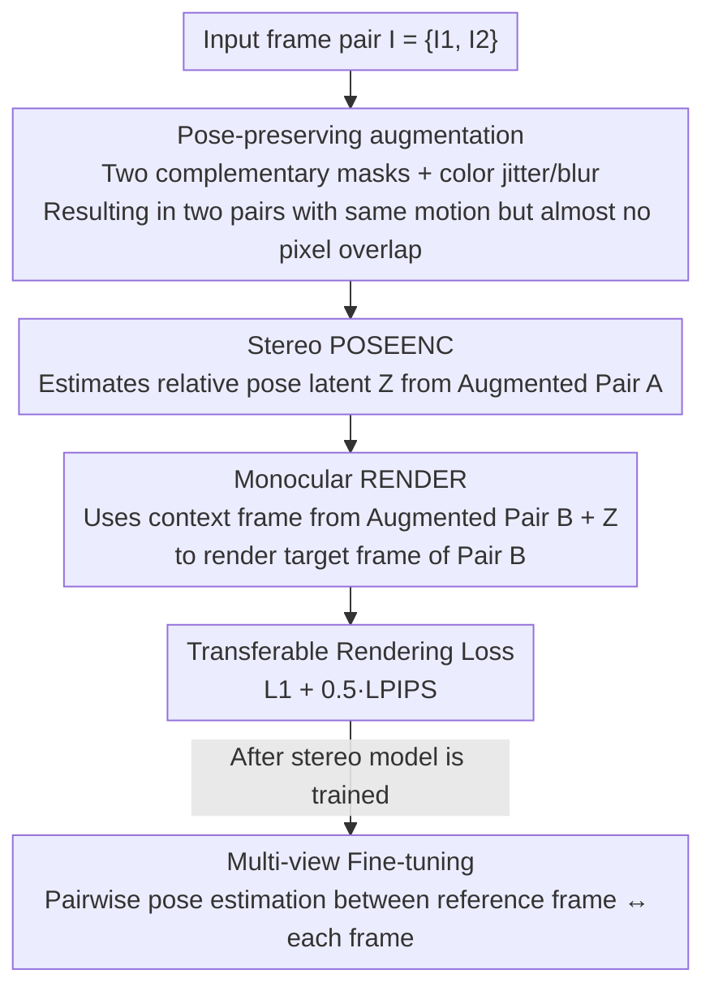

# True Self-Supervised Novel View Synthesis is Transferable

**Conference**: ICLR 2026  
**OpenReview**: [https://openreview.net/forum?id=aJJppqAm6r](https://openreview.net/forum?id=aJJppqAm6r)  
**Paper**: [Project Page](https://www.mitchel.computer/xfactor/)  
**Code**: None (Project page only)  
**Area**: 3D Vision  
**Keywords**: Novel View Synthesis, Self-Supervised, Transferability, Camera Pose, geometry-free

## TL;DR
This paper proposes "transferability" as the core criterion for determining whether a model truly performs Novel View Synthesis (NVS). Based on this, it introduces XFactor—the first model capable of learning cross-scene transferable camera pose representations through pure self-supervision without relying on multi-view geometry. By utilizing two simple designs—a "stereo-monocular model" and a "pose-preserving transferable objective"—it significantly outperforms RayZer and RUST.

## Background & Motivation

**Background**: Current NVS (Novel View Synthesis) is almost entirely built upon multi-view geometry—relying on structure-from-motion algorithms like COLMAP to pre-process multi-view images into $\mathrm{SE}(3)$ camera poses before training networks to render realistic novel views under given poses. To eliminate the dependence on pose labels and leverage large-scale real-world videos, self-supervised NVS has recently emerged, where a pose estimation module and a rendering module are trained jointly end-to-end.

**Limitations of Prior Work**: The authors point out that while existing self-supervised methods (RayZer, RUST) produce decent rendering results, their predicted "poses" are actually **non-transferable**. Applying the same set of poses to different 3D scenes results in different rendered camera trajectories. This means users cannot use a camera trajectory extracted from Scene A to precisely control the rendering of Scene B. In other words, these models are not truly reasoning about views but are instead performing **interpolation** on context frames.

**Key Challenge**: The training objective of self-supervised NVS is typically "auto-encoding"—reconstructing the target frame using scene representations and poses from the same sequence. This objective is too weak: models can take a shortcut by encoding "how to interpolate between current context frames" into the so-called "pose" latent variable. This shortcut satisfies the auto-encoding loss but lacks cross-scene control capabilities.

**Goal**: Moving beyond the vocabulary of multi-view geometry, the paper re-examines "what NVS is when geometry priors are absent" and solves it as a pure machine learning problem: (1) provide a non-$\mathrm{SE}(3)$ dependent criterion for "true NVS"; (2) design a geometry-free, fully self-supervised model that satisfies this criterion.

**Key Insight**: The authors identify that the essential property of NVS is **transferability**—a set of camera poses extracted from one sequence must be able to reproduce the same camera trajectory in any other scene. The validity of a pose representation lies not in whether it can be recognized as $\mathrm{SE}(3)$, but in whether it can render the same trajectory across scenes.

**Core Idea**: Utilize a "strictly extrapolation, no interpolation" stereo-monocular model as the backbone, and directly formulate transferability itself as the training objective. Combined with a pose-preserving augmentation that breaks pixel content while maintaining camera motion, the model is forced to learn pure geometric, cross-scene transferable pose latent variables—without introducing any 3D inductive biases.

## Method

### Overall Architecture

XFactor (Transferable Latent Factorization) formalizes NVS as a latent variable model consisting of a pose encoder `POSEENC`, a scene encoder `SCENEENC`, and a renderer `RENDER`. The authors first redefine "True NVS" with a **criterion**: given two sequences $I^A, I^B$ where target frames share the same camera motion (i.e., $\mathrm{ORACLE}[I^A_T]=\mathrm{ORACLE}[I^B_T]$), if the target pose $Z^A_T$ extracted from sequence A can be used to render the scene representation $S^B$ of sequence B such that $\mathrm{RENDER}[S^B, Z^A_T]\approx I^B_T$, the model's pose is **transferable**. This criterion is equivalent to "controllability," whereas traditional auto-encoding (the case where $I^A=I^B$) is its degenerate form that fail to constrain transferability.

Based on this criterion, the training pipeline (shown below) is concise: given a pair of input frames, **pose-preserving augmentation** is applied to generate two sets of frames with "identical camera motion but almost no overlapping pixel content." The stereo `POSEENC` extracts the relative pose latent $Z$ from the first set; the monocular `RENDER` takes the context frame from the second set plus $Z$ to reconstruct the target frame of the second set. The loss is this cross-set transferable rendering loss. Once the stereo model is trained, it undergoes **multi-view fine-tuning** to extend to multi-frame sequences. Notably, the `ORACLE` (VGGT in this paper) and the TPS metric **are only used during evaluation**; the training process does not rely on any pre-trained or handcrafted geometric oracles.

### Key Designs

**1. Transferability Criterion and TPS Metric: Liberating "True NVS" from Geometric Vocabulary**

The fundamental contribution is the shift in measurement. Previously, the legitimacy of a pose representation was judged by its alignment with $\mathrm{SE}(3)$. This paper argues that what truly matters is whether the pose can **reproduce the same trajectory across scenes**. To quantify this, the authors propose **True Pose Similarity (TPS)**: given a pose oracle and a trajectory comparison metric $d_{\mathrm{SE}(3)^n}$ (e.g., Relative Rotation Accuracy RRA, Relative Translation Accuracy RTA, or combined AUC), the TPS of two sequences is defined as the similarity between their oracle poses: $\mathrm{TPS}(I^A, I^B) \equiv d_{\mathrm{SE}(3)^n}(\mathrm{ORACLE}[I^A], \mathrm{ORACLE}[I^B])$. When evaluating a model, the scene representation $S^B$ of the second sequence and the target pose $Z^A_T$ of the first sequence are used to render a new trajectory, which is then compared against the original trajectory using the oracle: $\mathrm{TPS}(I^A_T, \mathrm{RENDER}[S^B, Z^A_T])$. The authors honestly note that this metric only measures "geometric consistency" and could be exploited by degenerate solutions where $\mathrm{RENDER}[S^B, Z^A_T] \approx I^A_T$; thus, it must be paired with perceptual metrics (like FID) to verify rendering fidelity to the context scene. This criterion serves as the "target" for all designs, and the oracle is used only for scoring, not training.

**2. Stereo-Monocular Model: Closing the Interpolation Shortcut with "Extrapolation-Only" Structure**

In RayZer and RUST, both the pose encoder and the renderer can see **multiple** context views, giving the model room to "cheat" by encoding "how to interpolate between these context frames" into the pose latent. This "pose" naturally fails when the scene (and thus the context frames) changes. To address this, the authors reduce the model to the most extreme case: only one context and one target ($I=\{I_1, I_2\}$, $I_C=\{I_1\}$, $I_T=\{I_2\}$). Here, `POSEENC` becomes a two-view stereo model, `SCENEENC` is absorbed into `RENDER`, and `RENDER` is monocular: $\mathrm{POSEENC}[I_1, I_2]=Z_2$, $\mathrm{RENDER}[I_1, Z_2]=\tilde I_2$. Since the renderer has only one image, there is no other image to interpolate with; the interpolation shortcut is physically blocked, forcing the optimization toward "learning truly transferable poses." This approach aligns with CroCo in representation learning—using a monocular renderer to force the model to learn depth cues.

**3. Transferable Objective and Pose-Preserving Augmentation: Directing Losses and Creating Training Pairs**

While the stereo-monocular structure blocks interpolation, `POSEENC` might still leak target pixel information (rather than pure geometric pose) into the latent variable. The solution is to **explicitly** write transferability as the objective: given two pairs sharing the same relative pose, $I^A=\{I^A_1, I^A_2\}$ and $I^B=\{I^B_1, I^B_2\}$, require the pose latent from A to render the target frame of B: $L \equiv d_I\big(I^B_2, \mathrm{RENDER}[I^B_1, \mathrm{POSEENC}[I^A_1, I^A_2]]\big)$. However, such pairs are rare in real videos. A third insight solves this: for any sequence, applying two **pose-preserving** per-frame augmentations $\mathrm{AUG}$ and $\overline{\mathrm{AUG}}$ (where $\mathrm{ORACLE}[\mathrm{AUG}[I]]=\mathrm{ORACLE}[\overline{\mathrm{AUG}}[I]]=\mathrm{ORACLE}[I]$) creates two sequences with identical motion but non-overlapping pixels. Implementation-wise, the image is sliced into four quadrants, randomly grouped into two complementary masks (e.g., left-right, top-bottom, diagonal) that cover the whole image, plus color jitter and blur. A 5% probability of no masking is kept to allow full-image auto-encoding. Augmentation is only for training. Forcing the model to use A's pose for B's content distills pure geometric, transferable pose representations.

**4. Multi-view Fine-tuning: Extending to Multiple Frames without Re-introducing Interpolation Bias**

The stereo-monocular model handles only single contexts and cannot cover ultra-wide baselines in one forward pass. The second training stage fine-tunes `[POSEENC, RENDER]` for multi-view: sequences are split into a context set and a random target frame. A reference frame $I_R$ (minimizing the maximum baseline to others) is chosen as the basis; pose-preserving augmentation is applied to all frames. `POSEENC` estimates relative poses between the reference and other frames pairwise, and `RENDER` uses the transferable objective to render target frames. This achieves multi-view coverage while avoiding multi-view interpolation bias through "pairwise estimation + transferable objective."

### Loss & Training

`POSEENC` and `RENDER` are multi-view ViTs. The image distance $d_I$ is a linear combination of pixel $L_1$ and LPIPS perceptual loss (weight 0.5). Augmentation masks are generated per sample per batch. Models are trained on a large-scale aggregate of RE10K, DL3DV, MVImgNet, and CO3Dv2. Frames are center-cropped and resized to $256 \times 256$.

## Key Experimental Results

### Main Results: Transferability Test (Table 1, TPS)

4,000 sequence pairs were sampled per dataset, with 5 target frames each. A new trajectory was rendered using the second sequence scene + the first sequence target poses. TPS (RRA/RTA/AUC with $10^\circ$ threshold) measured trajectory consistency, while FID measured quality.

| Metric (AUC@20°↑ / FID↓) | XFactor | RayZer | RUST |
|--------|---------|--------|------|
| RE10K · AUC@20° | **55.2** | 7.6 | 13.8 |
| DL3DV · AUC@20° | **57.2** | 5.9 | 10.8 |
| MVImgNet · AUC@20° | **53.4** | 2.6 | 4.1 |
| CO3Dv2 · AUC@20° | **31.2** | 2.7 | 5.4 |
| RE10K · FID | **4.5** | 43.0 | 16.2 |

XFactor's AUC@20° is ~5x that of RayZer/RUST. Key Conclusion: Even if RayZer and RUST produce reasonable images, they **completely fail the transferability test**, meaning they do not perform true NVS—a direct consequence of multi-view auto-encoding inducing "interpolation latents." RUST is slightly better than RayZer because its strategy of estimating poses from full vs. partial views pushes it toward transferability.

### Pose Probes (Table 2)

By freezing `POSEENC` and training a 3-layer MLP to predict oracle $\mathrm{SE}(3)$ poses from the latents, XFactor demonstrates the strongest representation of true geometry (significantly leading in AUC@10°/20°). This proves that the "stereo-monocular + transferable objective" is also an effective self-supervised representation learning method for 3D camera poses. Interestingly, RayZer/RUST did not fail entirely here, suggesting that **transferability improves geometric reasoning, but strong geometric reasoning does not automatically grant transferability**.

### Ablation Study (Table 3)

Starting from the stereo-monocular XFactor, two pillars (stereo-monocular structure and transferable objective) were ablated.

| Configuration | Key Observation (Transferability) | Note |
|------|---------------------|------|
| XFactor (Full) | Best | stereo-monocular + transferable objective |
| Additional View: Decoder | Degradation | Adding one context view to RENDER (≈ multi-view XFactor) |
| Additional View: Enc+Dec | **Total Collapse** | Adding context views to both POSEENC and RENDER |
| Bottleneck (16-dim latent) | Comparable to XFactor | Weaker geometric representation and limited descriptive power |
| Unconstrained (256-dim, auto-encoding) | Weak | Baseline stereo-monocular without constraints |
| SE(3) & Plücker | **Significantly Worse** | Forced SE(3) prediction + Plücker embeddings |

### Key Findings
- **Multi-view is Poison for Transferability**: Adding even one context view to the RENDER causes gradual degradation; adding it to POSEENC leads to a total collapse—confirming "multi-view = interpolation backdoor."
- **Explicit $\mathrm{SE}(3)$ is Harmful**: Counter-intuitively, forcing the model to parameterize poses as $\mathrm{SE}(3)$ + Plücker embeddings **significantly reduces** transferability, performing worse than the unconstrained baseline. Transferable poses do not require geometric inductive biases.
- **Transferable Objective vs. Bottleneck**: A bottleneck (16-dim) performs similarly in transferability but sacrifises descriptive power (e.g., lighting changes). The transferable objective is more general and improves transferability without explicit constraints.

## Highlights & Insights
- **Redefining the Problem**: Instead of geometric terms, "True NVS" is defined by the input-output behavior of "transferability" and quantified with the TPS metric—translating a 3D problem bound by geometric priors into a pure machine learning problem.
- **Structural Limits over Explicit Constraints**: Blocking interpolation shortcuts relies not on regularization or parameterization, but on the extreme "monocular renderer" structure. This is more effective and general than RayZer's SE(3) bottleneck.
- **Pose-Preserving Augmentations for Self-Supervision**: The use of dual augmentations that preserve an invariant (camera motion) while scattering irrelevant content (pixels) to create training pairs is a technique with broad value in representation learning.
- **Honesty about Metric Exploitation**: The authors proactively identify that TPS only covers geometric consistency and requires perceptual metrics to verify fidelity, which is more credible than reporting a single score.

## Limitations & Future Work
- **Ultra-wide Baseline Limits**: `POSEENC` is restricted to two views, limiting its ability to estimate very wide baselines in a single pass. Achieving multi-view `POSEENC` in a self-supervised manner without interpolation bias remains an open problem.
- **Rendering Artifacts in Deterministic Models**: Borrowed poses can cause blurring and warping when far from the context. This is attributed to XFactor being deterministic rather than generative, lacking means to resolve uncertainty. Future work could introduce camera-controllable generative models.
- **Potential Self-evaluation Bias**: Experiments rely on real videos and oracle (VGGT) scoring; oracle errors propagate to TPS. Dataset difficulty (scene-level vs. object-level) varies, making absolute cross-dataset comparisons difficult.

## Related Work & Insights
- **vs RayZer**: RayZer uses $\mathrm{SE}(3)$ as an information bottleneck. While rendering quality is high, its poses are non-transferable. This paper proves that explicit parameterization in multi-view settings is inferior to unconstrained latents for transferability.
- **vs RUST**: RUST is also geometry-free and uses an information bottleneck (estimating poses from partial views). It is slightly better than RayZer but still suffers from multi-view interpolation bias and incomplete pixel masking. XFactor's complementary masks are more thorough.
- **vs latent action models (e.g., Genie)**: Both extract transition latents from video frames. However, latent action focus on egocentric actions, while this work focuses on recovering "transferable camera pose" representations.

## Rating
- Novelty: ⭐⭐⭐⭐⭐ Redefining true NVS via "transferability" and the TPS metric is a fresh and self-consistent perspective.
- Experimental Thoroughness: ⭐⭐⭐⭐ Four large-scale datasets plus transfer/probe/ablation tests, though code is not yet available and baselines are self-reimplemented.
- Writing Quality: ⭐⭐⭐⭐⭐ Logical progression from criterion to method; motivation and formulas are tightly coupled.
- Value: ⭐⭐⭐⭐⭐ The first geometry-free, self-supervised true NVS model whose pose representations can double as a 3D pose representation learning method.

<!-- RELATED:START -->

## Related Papers

- [\[CVPR 2026\] From None to All: Self-Supervised 3D Reconstruction via Novel View Synthesis](../../CVPR2026/3d_vision/from_none_to_all_self-supervised_3d_reconstruction_via_novel_view_synthesis.md)
- [\[ICCV 2025\] RayZer: A Self-supervised Large View Synthesis Model](../../ICCV2025/3d_vision/rayzer_a_self-supervised_large_view_synthesis_model.md)
- [\[CVPR 2026\] WildRayZer: Self-supervised Large View Synthesis in Dynamic Environments](../../CVPR2026/3d_vision/wildrayzer_self-supervised_large_view_synthesis_in_dynamic_environments.md)
- [\[ICLR 2026\] EA3D: Event-Augmented 3D Diffusion for Generalizable Novel View Synthesis](ea3d_event-augmented_3d_diffusion_for_generalizable_novel_view_synthesis.md)
- [\[ICLR 2026\] Aligned Novel View Image and Geometry Synthesis via Cross-modal Attention Instillation](aligned_novel_view_image_and_geometry_synthesis_via_cross-modal_attention_instil.md)

<!-- RELATED:END -->
