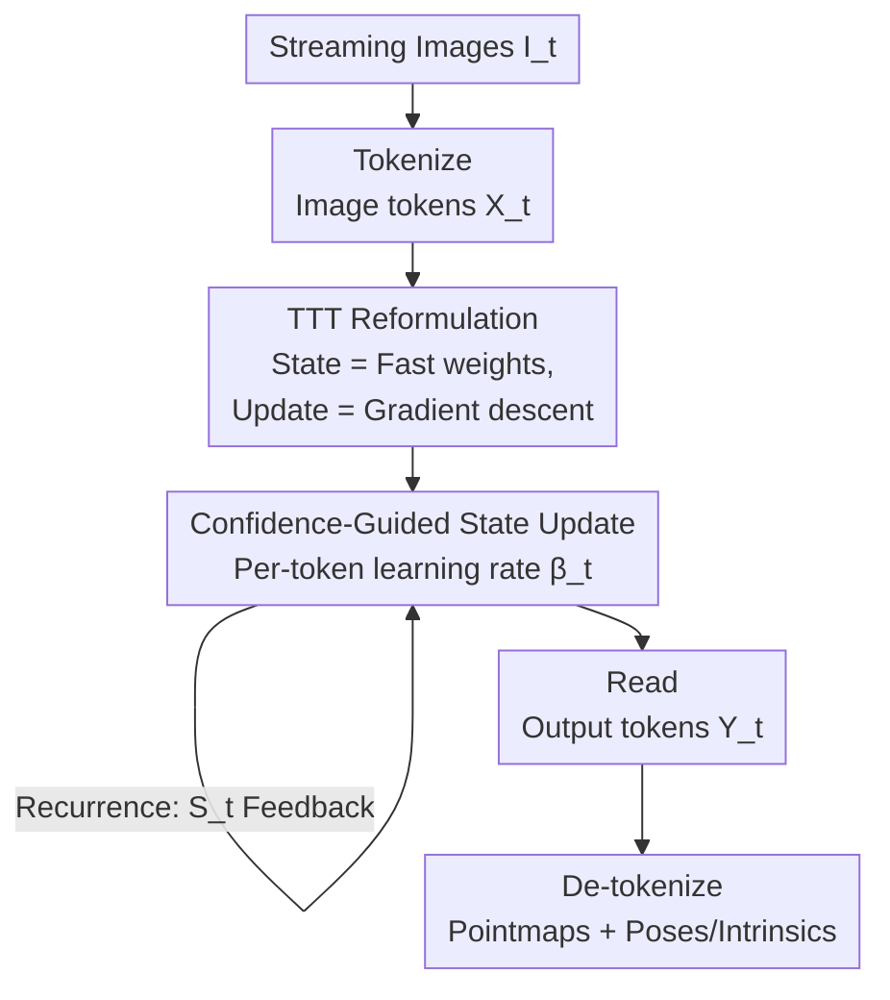

# TTT3R: 3D Reconstruction as Test-Time Training

**Conference**: ICLR 2026  
**OpenReview**: [https://openreview.net/forum?id=aMs6FtNaY5](https://openreview.net/forum?id=aMs6FtNaY5)  
**Code**: https://rover-xingyu.github.io/TTT3R  
**Area**: 3D Vision  
**Keywords**: Online 3D reconstruction, test-time training, recurrent neural networks, length generalization, adaptive learning rate

## TL;DR
The state update of the recurrent 3D reconstruction model CUT3R is reformulated as a test-time online learning problem. By deriving a closed-form, per-token adaptive learning rate based on the alignment confidence between memory states and new observations to gate state updates, this method significantly mitigates long-sequence forgetting without retraining or adding parameters. It improves global pose accuracy by 2× over the baseline while remaining efficient (20 FPS, 6 GB VRAM) for sequences of thousands of images.

## Background & Motivation

**Background**: 3D reconstruction foundation models aim to simultaneously predict camera poses and scene geometry (pixel-aligned pointmaps) from a set of RGB images. Transformer-based full-attention methods (e.g., DUSt3R, VGGT, Fast3R) achieve SOTA performance via global all-to-all attention; however, their computation and memory consumption grow quadratically with sequence length, making them inherently offline—requiring all images to be reprocessed each time a new frame arrives. For real-time streaming reconstruction, recurrent architectures (RNNs) such as CUT3R serve as attractive alternatives by compressing history into a fixed-length state with $O(1)$ complexity and constant memory.

**Limitations of Prior Work**: The primary drawback of the RNN approach is **forgetting**. Models like CUT3R are typically trained on sequences shorter than 64 frames; once the input extends to hundreds or thousands of frames, reconstruction quality degrades sharply, leading to pose drift, fragmented geometry, and ghosting artifacts. This is a "length generalization" problem where the model fails when exceeding its training context length. Point3R attempts to mitigate this with explicit point cloud memory, but this memory grows linearly with the number of reconstructed points, sacrificing the advantage of constant memory and leading to OOM (Out of Memory) after approximately 700 frames.

**Key Challenge**: The state update in CUT3R utilizes softmax cross-attention. Since softmax weights are normalized to sum to $1.0$ along the observation token dimension, this is equivalent to forcing a fixed learning rate of $\beta_t = 1.0$ that writes the new observation **entirely** into the state. Consequently, the model always prioritizes the latest observation and continuously overwrites historical memory, causing catastrophic forgetting. The root cause is the lack of a **flexible gating mechanism to balance "preserving history" vs. "absorbing new information."**

**Goal**: To equip recurrent 3D reconstruction models like CUT3R with length generalization capabilities without retraining or adding any learnable parameters.

**Key Insight**: The authors adopt a perspective from modern RNN research: Test-Time Training (TTT). In TTT, the recurrent state is treated as "fast weights" that are learned online from the input context via gradient descent during inference; meanwhile, the frozen model parameters act as "slow weights" or meta-learners that determine how gradients and learning rates are computed. From this viewpoint, CUT3R's state update is precisely a form of TTT-style online learning, and its "illness" (forgetting) stems from the learning rate being locked at $1.0$.

**Core Idea**: An **alignment confidence** between the memory state and new observations is used to derive a per-token adaptive learning rate $\beta_t$. By replacing the implicit constant $1.0$ in CUT3R with this $\beta_t$, the update intensity of each state token is explicitly gated—updating more when confidence is high and suppressing updates in low-confidence areas (e.g., textureless regions). This results in a training-free, plug-and-play state update rule.

## Method

### Overall Architecture

TTT3R does not modify the CUT3R network or require retraining; it only replaces the state update rule during forward inference. The pipeline remains a standard four-step sequence modeling process: for each streaming image $\bI_t$, it is first **Tokenized** into image tokens $\bX_t$; then, $\bX_t$ is used to **Update** the previous state $\bS_{t-1}$ into $\bS_t$; an output token $\bY_t$ is **Read** from $\bS_t$; and finally, it is **De-tokenized** into pixel-aligned pointmaps $\bP_t$, camera poses $\bT_t$, and intrinsics $\bC_t$.

$$\bX_t = \texttt{Tokenize}(\bI_t),\quad \bS_t = \texttt{Update}(\bS_{t-1}, \bX_t),\quad \bY_t = \texttt{Read}(\bS_t, \bX_t),\quad \bP_t = \texttt{De-tokenize}(\bY_t)$$

The core innovation lies entirely within the $\texttt{Update}$ operator. The authors reformulate this step as TTT—where the state is a fast weight and the update is a single gradient descent step $\bS_t = \bS_{t-1} - \beta_t \nabla(\bS_{t-1}, \bX_t)$. By identifying that CUT3R's softmax update locks the learning rate $\beta_t$ to $1.0$, they replace it with a confidence-guided per-token $\beta_t$.

### Key Designs

**1. Reformulating Recurrent State Update as Test-Time Training: Identifying the Cause of Forgetting**

The authors categorize full-attention and RNN methods into a unified $\texttt{Update}/\texttt{Read}$ framework. Full-attention (VGGT, Fast3R) updates by appending key-value pairs, growing $O(t)$ with frames. RNNs (CUT3R) update via one-to-one cross-attention between the new frame and a fixed-length state: $\bS_t = \bS_{t-1} + \texttt{softmax}(\bQ_{\bS_{t-1}}\bK_{\bX_t}^\top)\bV_{\bX_t}$, which is $O(1)$.

By rewriting this as the TTT standard form $\bS_t = \bS_{t-1} - \beta_t \nabla(\bS_{t-1}, \bX_t)$, the state is treated as fast weights learned online from in-context tokens, while frozen parameters (slow weights) generate the gradient function and learning rate. The analysis reveals that CUT3R's gradient term is $\nabla = -\texttt{softmax}(\bQ_{\bS_{t-1}}\bK_{\bX_t}^\top)\bV_{\bX_t}$. The crucial insight is that softmax normalization across the observation dimension forces $\beta_t = 1.0$. This lacks the flexibility of standard TTT to retain history, transforming the empirical phenomenon of "forgetting" into a specific structural gap of a "missing adjustable learning rate."

**2. Confidence-Guided Per-Token Learning Rate: Soft Gating to Suppress Low-Quality Updates**

To address the locked learning rate, an adaptive $\beta_t \in \mathbb{R}^{n\times 1}$ is introduced. Since cross-attention $\bQ_{\bS_{t-1}}\bK_{\bX_t}^\top$ aggregates information from the observation space $m$ into $n$ state tokens, the authors reuse these attention logits. For each state token, the attention scores across all observation keys are averaged and passed through a sigmoid function to compute its learning rate:

$$\beta_t = \sigma\!\left(\textstyle{\sum_m} \bQ_{\bS_{t-1}}\bK_{\bX_t}^\top\right),\qquad \textstyle\sum_m \equiv \tfrac{1}{m}\textstyle\sum_{i=1}^m$$

The complete closed-form update rule becomes $\bS_t = \bS_{t-1} - \beta_t\big(-\texttt{softmax}(\bQ_{\bS_{t-1}}\bK_{\bX_t}^\top)\bV_{\bX_t}\big)$. High alignment confidence indicates low uncertainty, leading to a larger update step; low confidence (e.g., textureless regions) suppresses the update. This plug-and-play intervention uses existing attention statistics without new parameters or fine-tuning, mitigating forgetting sufficiently to enable online loop closure.

**3. Optional State Reset: Bypassing the "Unexplored State Distribution" Problem**

Confidence gating mitigates but does not fully solve forgetting over very long sequences, where recurrence might push the state into distributions never seen during training ("unexplored state" hypothesis). The authors provide an optional *TTT3R + State Reset* variant: periodically resetting the state to its initial value to prevent overfitting to OOD regions. The resulting chunks are aligned using global metric poses without additional heavy optimization, maintaining CUT3R's speed and memory efficiency.

### Loss & Training
The hallmark of this work is that it is **entirely training-free**. TTT3R is an inference-time intervention on a pre-trained CUT3R model. All changes occur in the forward pass; no weights are fine-tuned, and no learnable parameters are added. The learning rate $\beta_t$ is computed directly from existing attention logits.

## Key Experimental Results

Evaluation spans three tasks: camera pose estimation, video depth estimation, and 3D reconstruction. Tests were conducted on a single 48GB GPU, scaling from 50 to 1000 input views (terminating upon OOM). Offline VGGT (full attention) serves as the accuracy upper bound.

### Main Results (Long-Sequence Performance)

| Task / Dataset | Metrics | TTT3R | CUT3R | Other Online Baselines |
| :--- | :--- | :--- | :--- | :--- |
| Camera Pose / ScanNet, TUM-D | ATE (m) ↓ | Global pose accuracy **2× better** than CUT3R | Long-sequence drift, poor accuracy | Point3R more accurate but OOM > 700 frames; StreamVGGT high latency/OOM prone |
| Video Depth / KITTI, Bonn | Abs Rel ↓ / δ<1.25 ↑ | Best performance throughout, no fine-tuning | Long-sequence degradation | Point3R strong for short seq (≤300), degrades on long seq with scaling issues |
| 3D Recon / 7-scene | Chamfer ↓ / Normal Consistency ↑ | Stable on long sequences, approaches offline VGGT | Severe degradation due to forgetting | VGGT/StreamVGGT OOM quickly |
| Efficiency | FPS / VRAM | **20 FPS / 6 GB**, handles 1000s of images | Equal efficiency (constant memory) | VGGT/Point3R memory grows with frames, prone to OOM |

### Ablation Study

| Configuration | Effect | Description |
| :--- | :--- | :--- |
| TTT3R (Confidence $\beta_t$) | Mitigates forgetting, supports loop closure | Full proposed method |
| Constant $\beta_t = 1.0$ (CUT3R) | Catastrophic forgetting | Softmax locks learning rate to prioritize newest observations |
| Uniform update for all tokens | Suboptimal, dragged down by low-quality updates | Fails to distinguish confidence; textureless regions damage performance |
| + State Reset (Optional) | Further suppresses state overfitting | Periodically prevents state drift into OOD regions |

### Key Findings
- **The root cause of forgetting is the locked learning rate, not capacity**: Reformulating CUT3R as TTT shows that softmax normalization locks $\beta_t=1.0$. Replacing this constant with confidence gating yields a 2× pose improvement with zero extra computational cost.
- **Per-token adaptation is essential**: Updating all state tokens uniformly is hindered by updates from low-quality/textureless regions. Weighting by alignment confidence stabilizes long sequences.
- **No compromise on efficiency**: By reusing existing attention logits, TTT3R maintains the same speed and memory as CUT3R (20 FPS / 6 GB) while handling thousands of frames, whereas Point3R and VGGT variants OOM within hundreds of frames.
- **Mitigation, not elimination**: TTT3R still doesn't match the reconstruction accuracy of offline VGGT; the "unexplored state" degradation on long sequences requires the State Reset backup for stability.

## Highlights & Insights
- **Transferring perspectives from mature fields**: The authors do not invent a new architecture but apply the TTT/fast weight/adaptive learning rate framework (common in LLM research like Mamba-2 or Titans) to 3D reconstruction. This clarifies "forgetting" as a "locked learning rate" problem.
- **Training-free and Plug-and-play**: The method is a simple multiplication with existing logits in the forward pass. It requires no parameter changes or fine-tuning, making the barrier for deployment extremely low.
- **Transferability of confidence gating**: The idea of using internal attention statistics to estimate "how much to trust this update" (selective filtering) is a powerful concept applicable to any streaming model with memory/state.

## Limitations & Future Work
- TTT3R **mitigates but does not cure** forgetting. Long-sequence accuracy still falls short of offline models that retain full history.
- While State Reset provides a fallback, it is a heuristic engineering compromise. The choice of reset periods and cross-chunk alignment control warrants further investigation.
- The "2× improvement" and other conclusions are based on trend lines in the paper, making it difficult to verify exact per-dataset variance without detailed tables.
- Future work could explore more effective, stable, and parallelizable recurrent architectures to push both reconstruction accuracy and length generalization further.

## Related Work & Insights
- **vs. CUT3R**: Both are RNN-based with fixed-length states. CUT3R forgets due to implicit $\beta_t=1.0$; TTT3R improves pose accuracy by 2× for long sequences by changing the update rule for free.
- **vs. Point3R**: Point3R uses explicit memory which leads to OOM at ~700 frames. TTT3R maintains constant memory by improving the update rule of an implicit state instead.
- **vs. StreamVGGT / VGGT**: These use full attention with $O(t)$ state growth, leading to OOM. TTT3R runs in real-time with $O(1)$ memory while approaching their accuracy.
- **vs. Test3R / CVD (Test-time Optimization)**: These methods fine-tune weights on test sequences via backpropagation. TTT3R embeds "learning" into the forward state update, requiring no fine-tuning.

## Rating
- Novelty: ⭐⭐⭐⭐ The TTT interpretation of 3D reconstruction is clever, though the underlying mechanism is borrowed from modern RNN research.
- Experimental Thoroughness: ⭐⭐⭐⭐ Covers three tasks and long-sequence scaling, though results rely heavily on plots rather than raw tables.
- Writing Quality: ⭐⭐⭐⭐⭐ The derivation from unified modeling to TTT reformulation to closed-form rules is logical and compelling.
- Value: ⭐⭐⭐⭐⭐ A zero-cost, training-free intervention that significantly solves a major pain point in online 3D reconstruction.

<!-- RELATED:START -->

## Related Papers

- [\[CVPR 2026\] Scal3R: Scalable Test-Time Training for Large-Scale 3D Reconstruction](../../CVPR2026/3d_vision/scal3r_scalable_test-time_training_for_large-scale_3d_reconstruction.md)
- [\[CVPR 2026\] ZipMap: Linear-Time Stateful 3D Reconstruction via Test-Time Training](../../CVPR2026/3d_vision/zipmap_linear-time_stateful_3d_reconstruction_via_test-time_training.md)
- [\[CVPR 2026\] tttLRM: Test-Time Training for Long Context and Autoregressive 3D Reconstruction](../../CVPR2026/3d_vision/tttlrm_test-time_training_for_long_context_and_autoregressive_3d_reconstruction.md)
- [\[CVPR 2026\] Low-Rank Test-Time Training for Pre-Trained Point Cloud Models](../../CVPR2026/3d_vision/low-rank_test-time_training_for_pre-trained_point_cloud_models.md)
- [\[ICLR 2026\] SpaceControl: Introducing Test-Time Spatial Control to 3D Generative Modeling](spacecontrol_introducing_test-time_spatial_control_to_3d_generative_modeling.md)

<!-- RELATED:END -->
