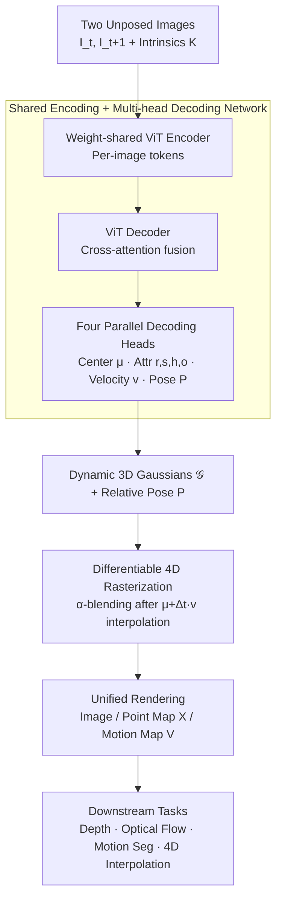

# UFO-4D: Unposed Feedforward 4D Reconstruction from Two Images

- **Conference**: ICLR 2026
- **arXiv**: [2602.24290](https://arxiv.org/abs/2602.24290)
- **Code**: [Project Page](https://ufo-4d.github.io/)
- **Area**: 3D Vision / 4D Reconstruction
- **Keywords**: 4D Reconstruction, Dynamic 3D Gaussians, Feedforward, Scene Flow, Unposed, Self-Supervised

## TL;DR

Ours proposes UFO-4D, a unified feedforward framework that directly predicts dynamic 3D Gaussian representations from only two unposed images, achieving joint consistent estimation of 3D geometry, 3D motion, and camera pose, with performance improvements of up to 3× over existing methods on geometry and motion benchmarks.

## Background & Motivation

Joint estimation of camera pose, 3D geometry, and 3D motion (4D scene reconstruction) from casually captured images is a fundamental challenge in computer vision. Existing methods face the following issues:

**Test-time optimization methods** are slow (taking hours) and rely on pre-computed depth and optical flow.

**Feedforward models** (DUST3R, MonST3R, DynaDUSt3R) perform well on individual tasks but lack a unified architecture.

**4D training data is scarce**: Synthetic data has domain gaps, while real-world data annotations are sparse and noisy.

**Key Insight**: Differentiable rendering of multiple signals (appearance, depth, motion) from a single dynamic 3D Gaussian representation can provide self-supervised training signals and mutually regularize various supervision signals through geometric coupling.

## Method

### Overall Architecture

UFO-4D integrates the joint estimation of "pose + geometry + motion" into a single feedforward function: given two unposed images $\mathbf{I}_t, \mathbf{I}_{t+1}$ and camera intrinsics, the network $f_\theta(\mathbf{I}_t, \mathbf{I}_{t+1}) \mapsto (\mathcal{G}, \mathbf{P})$ outputs a set of dynamic 3D Gaussians $\mathcal{G}$ and the relative camera pose $\mathbf{P}$ in one go. Each Gaussian carries both static geometry (center $\boldsymbol{\mu} \in \mathbb{R}^3$, quaternion rotation $\mathbf{r}$, scale $\mathbf{s}$, spherical harmonic colors $\mathbf{h}$, opacity $o$) and an additional 3D motion vector $\mathbf{v} \in \mathbb{R}^3$. This unified representation, which simultaneously encodes shape and motion, allows all downstream signals—such as depth, optical flow, scene flow, and novel views—to be derived via differentiable rendering, enabling mutual regularization. The entire pipeline consists of two parts: first, a **shared encoding + multi-head decoding network** regresses the two images into the dynamic Gaussians and relative pose; then, a **differentiable 4D rasterizer** renders these Gaussians into images, point maps, and motion maps at any time step and viewpoint. Downstream tasks and training supervision are derived from these rendered results.

### Key Designs

**1. Shared Encoding + Multi-head Decoding Network: Fusing Evidence into Dynamic Gaussians**

To regress geometry and motion simultaneously from two unposed images, the key is to allow the network to extract motion from cross-frame correspondences. UFO-4D uses a weight-shared ViT encoder to process each image separately, followed by a ViT decoder with cross-attention layers to fuse information from both frames, ensuring each pixel's prediction can reference cues from the other frame. After decoding, four parallel heads are used: a center head (DPT) for 3D positions, an attribute head (DPT) for rotation/scale/color/opacity, a velocity head (DPT) for 3D motion vectors, and a pose head (3-layer MLP) to regress the translation and quaternion of the relative pose. For initialization, the Gaussian heads follow NoPoSplat weights, and other parts use MASt3R initialization, inheriting strong geometric priors from static reconstruction before learning motion components on dynamic data.

**2. Differentiable 4D Rasterization: Rendering Images, Point Maps, and Motion Maps via α-blending**

This is the core for turning the unified representation into self-supervision signals. While standard 3DGS only renders appearance, UFO-4D extends the rasterizer to render images, point maps, and scene flow from the same set of Gaussians at any target time $t'$. First, temporal interpolation is performed under a linear motion assumption, shifting each center by $\Delta t \cdot \mathbf{v}$: 
$$\mathcal{G}(t') = \{(\boldsymbol{\mu} + \Delta t \cdot \mathbf{v}, \mathbf{v}, \mathbf{r}, \mathbf{s}, \mathbf{h}, \mathbf{c}, o)_\mathbf{p}\}$$
Then, the same $\alpha$-blending weights used for color are applied to synthesize geometric channels—point maps accumulate Gaussian centers, and motion maps accumulate Gaussian velocities:
$$\mathbf{X}_{t'}(\mathbf{p}) = \sum_{i \in \mathcal{N}_\mathbf{p}^{t'}} \boldsymbol{\mu}_i o_i \prod_{j=1}^{i-1}(1-o_j)$$
$$\mathbf{V}_{t'}(\mathbf{p}) = \sum_{i \in \mathcal{N}_\mathbf{p}^{t'}} \mathbf{v}_i o_i \prod_{j=1}^{i-1}(1-o_j)$$
Because the point map, motion map, and color map share the same Gaussians and blending weights, any supervision backpropagates to all Gaussian parameters, inherently coupling geometry and motion. Furthermore, these rendered geometric channels allow downstream tasks to be derived at zero cost: depth is the last channel of the point map, optical flow is the 2D projection of 3D scene flow, motion segmentation thresholds the scene flow magnitude, and 4D interpolation simply sets $t'$ and the viewpoint to any desired value for rendering.

### Loss & Training

The total loss combines supervised terms (with labels) and self-supervised terms (without labels): $L_{total} = L_{sup} + L_{self}$. Supervised losses cover scene flow, point maps, and pose:
$$L_{sup} = L_{motion} + w_{point} L_{point} + w_{pose} L_{pose}$$
where $L_{motion}$ constrains both Gaussian velocity $\mathbf{v}$ and the rendered motion map $\mathbf{V}$, $L_{point}$ constrains both position $\boldsymbol{\mu}$ and the rendered point map $\mathbf{X}$, and $L_{pose}$ constrains translation and quaternions respectively. This ensures both "explicit Gaussian parameters" and "rendered results" are supervised, preventing a disconnect between representation and rendering. Self-supervised losses are used to counter 4D label scarcity:
$$L_{self} = L_{photo} + w_{smooth} L_{smooth}$$
The photometric term $L_{photo} = \text{MSE} + w_{lpips} \text{LPIPS}$ compares rendered images with ground truth images without requiring any annotations, while $L_{smooth}$ is an edge-aware regularization. Leveraging photometric self-supervision, the model can learn from real-world videos without dense 4D ground truth.

## Key Experimental Results

### Training Data

A mix of: Stereo4D (60%) + PointOdyssey (20%) + Virtual KITTI 2 (20%)

### Main Results

**Geometry Estimation** (Point map EPE, Depth metrics):

| Method | Stereo4D EPE | KITTI EPE | Sintel EPE |
|------|-------------|-----------|-----------|
| DynaDUSt3R | ~0.15 | ~0.80 | - |
| ZeroMSF | ~0.12 | ~0.65 | - |
| **UFO-4D (Ours)** | **~0.05** | **~0.25** | **Best** |

UFO-4D achieves **over 3× improvement** compared to competing methods on Stereo4D and KITTI.

**Motion Estimation** (Scene flow EPE): Also leads by a significant margin.

### Key Findings

1. **Self-supervised loss** significantly improves the quality of geometry and motion estimation.
2. Direct pose estimation outperforms post-processing regression (DUSt3R style).
3. Synthetic + Real hybrid training effectively mitigates domain gaps.
4. 4D interpolation performs well across both novel viewpoints and time steps.

### 4D Interpolation Applications

Ours achieves the first spatio-temporal interpolation from feedforward output: rendering images, depth, and motion at any intermediate time point and viewpoint.

## Highlights & Insights

1. **Unified Representation**: A single dynamic 3D Gaussian representation simultaneously solves geometry, motion, and pose estimation.
2. **Self-supervised Training**: Photometric reconstruction loss requires no labels, effectively overcoming data scarcity.
3. **Coupled Regularization**: Geometry and motion share Gaussian primitives, allowing supervision signals to mutually regularize.
4. **New Application**: Feedforward 4D interpolation (spatio-temporal interpolation of images + geometry + motion).
5. **Performance Leap**: Gain of over 3× in EPE metrics.

## Limitations & Future Work

1. Linear motion assumption limits the modeling of complex non-rigid motion.
2. Only processes two-frame inputs, unable to model long-term temporal dependencies.
3. Dependence on camera intrinsics as input (though usually available).
4. Optimal ratios for training data mixing strategies require manual adjustment.
5. Reconstruction in large occluded areas may lack accuracy.

## Related Work & Insights

- **Static 3D Reconstruction**: DUSt3R (Wang et al., 2024b), MASt3R (Leroy et al., 2024) learn strong priors for end-to-end reconstruction.
- **Dynamic 3D Reconstruction**: MonST3R (Zhang et al., 2025a) fine-tunes static models for dynamic scenes but lacks temporal correspondence.
- **Dense 4D Reconstruction**: Test-time optimization methods offer high quality but are slow; existing feedforward methods require pose input or separate task heads.

## Rating

- **Novelty**: ⭐⭐⭐⭐⭐ — Unified 4D representation + self-supervised framework is a significant contribution.
- **Utility**: ⭐⭐⭐⭐ — High potential for real-time applications with feedforward inference.
- **Clarity**: ⭐⭐⭐⭐⭐ — Systematic and clear methodology with complete derivations.
- **Significance**: ⭐⭐⭐⭐⭐ — Moves dense 4D reconstruction from the optimization era into the feedforward era.

<!-- RELATED:START -->

## Related Papers

- [\[CVPR 2025\] Dyn-HaMR: Recovering 4D Interacting Hand Motion from a Dynamic Camera](../../CVPR2025/3d_vision/dyn-hamr_recovering_4d_interacting_hand_motion_from_a_dynamic_camera.md)
- [\[ICCV 2025\] LongSplat: Robust Unposed 3D Gaussian Splatting for Casual Long Videos](../../ICCV2025/3d_vision/longsplat_robust_unposed_3d_gaussian_splatting_for_casual_long_videos.md)
- [\[CVPR 2026\] TeHOR: Text-Guided 3D Human and Object Reconstruction with Textures](../../CVPR2026/3d_vision/tehor_text-guided_3d_human_and_object_reconstruction_with_textures.md)
- [\[ICLR 2026\] Reducing Class-Wise Performance Disparity via Margin Regularization](reducing_class-wise_performance_disparity_via_margin_regularization.md)
- [\[ICLR 2026\] Topology-Preserved Auto-regressive Mesh Generation in the Manner of Weaving Silk](topology-preserved_auto-regressive_mesh_generation_in_the_manner_of_weaving_silk.md)

<!-- RELATED:END -->
