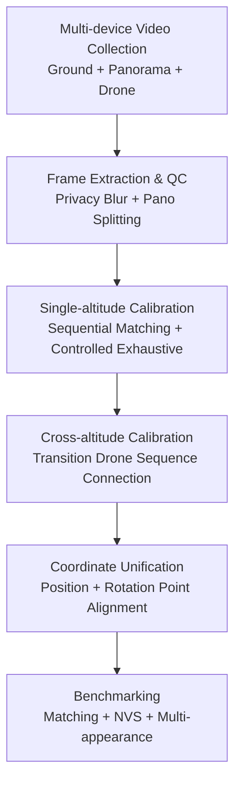

# ULTRA-360: Unconstrained Dataset for Large-scale Temporal 3D Reconstruction across Altitudes and Omnidirectional Views

**Conference**: ICLR 2026  
**OpenReview**: [https://openreview.net/forum?id=7W2w6pPvGA](https://openreview.net/forum?id=7W2w6pPvGA)  
**Code**: None  
**Area**: 3D Vision  
**Keywords**: Large-scale 3D reconstruction, Temporal scene reconstruction, Omnidirectional view, Multi-altitude collection, Camera calibration

## TL;DR
ULTRA-360 constructs a large-scale real-world image dataset covering campus-level buildings, four-season appearances, ground-level and aerial multi-altitude views, and perspective and 360-degree cameras. Using a semi-automatic calibration pipeline and multi-category reconstruction benchmarks, it reveals key shortcomings in current large-scale temporal 3D/4D reconstruction regarding cross-altitude matching, doppelganger disambiguation, densification, and multi-appearance modeling.

## Background & Motivation
**Background**: NeRF, 3D Gaussian Splatting, and various large-scene neural rendering methods can generate high-quality new view synthesis in indoor, object-level, street-view, or aerial scenes. Simultaneously, SfM, local feature matching, scene graph optimization, and hierarchical Gaussian representations are improving, making it increasingly feasible to recover camera poses and dense scenes from consumer camera images.

**Limitations of Prior Work**: These advancements are often evaluated across disjoint benchmarks: some datasets focus only on ground-level views, others only on aerial views; some have single-season lighting; while others from internet photos lack control over time, camera types, and appearance. Such evaluations may prove a module effective in a restricted setting but fail to address real-world digitalization: where exactly do automatic calibration and dense reconstruction fail when digitizing a real campus or urban area for free exploration?

**Key Challenge**: Large-scale immersive reconstruction requires satisfying several conflicting conditions: ground images offer rich details but only see facades and proximity; aerial images cover roofs and global structures but lack ground detail; cross-season, day-night, and weather variations provide realistic temporal dynamics but complicate matching and appearance modeling; panoramic cameras offer immersive fields of view but introduce noise from stitching, occlusions, and the operator. Existing datasets rarely cover all these aspects, failing as end-to-end stress tests for 3D/4D reconstruction.

**Goal**: The authors aim to establish a dataset closer to real digital twin requirements: featuring campus-wide spatial scope, multi-season/multi-time collection over two years, ground-level perspective cameras, 360 panoramas, and drones at multiple altitudes (60m, 100m, 120m). It also provides human-verified camera calibration to systematically evaluate feature matching, SfM, scene graph optimization, dense reconstruction, and multi-appearance NVS.

**Key Insight**: Instead of proposing a single new model, the paper packages the dataset, calibration pipeline, and benchmarks into an end-to-end testbed. The observation is: if a benchmark lacks real difficulties like cross-altitude, panoramic views, multi-season changes, and repetitive textures, models may score high on pretty view interpolation but fail to expose floaters, incorrect geometry, and appearance overfitting during free exploration.

**Core Idea**: Utilizing 20 buildings in a real campus with 37.7K calibrated images and multi-modal collection to push large-scale temporal 3D reconstruction from "single-scene pretty rendering" to an "end-to-end real-world stress test across altitudes, seasons, and camera types."

## Method

### Overall Architecture
The core product of ULTRA-360 is not a single network but a reproducible experimental testbed: consumer-grade devices collect multi-season, multi-altitude, and multi-view videos in a real campus; frames are extracted, quality-checked, privacy-blurred, and panoramas are split into image sets for SfM and NVS. Then, a unified camera system is obtained through a semi-automatic scene graph and coordinate alignment pipeline. Finally, feature matching, scene graph optimization, and dense reconstruction methods are benchmarked. Inputs are iPhone, Insta360, and DJI drone videos; outputs are calibrated images for 20 buildings in a unified coordinate system across multiple appearances.

Data collection covers 20 academic halls over 140 acres across two years. Statistically, iPhones provide 19 videos (7,134 frames) mainly in summer/autumn, clear/cloudy/night, at $\sim 70^\circ$ FoV. Insta360 provides 31 videos (23,260 frames) covering spring/winter, clear/cloudy/night, at $360^\circ$ FoV. DJI Mini 3 provides 81 videos (7,334 frames) covering spring/winter, clear/cloudy/night, at 60m, 100m, and 120m altitudes. Panoramic frames are split into four perspective views ($\sim 120^\circ$ FoV each), retaining 360-degree horizontal coverage while discarding the sky and the operator region.

The calibration follows a divide-and-conquer strategy. Single-altitude calibration is performed first, followed by merging ground and aerial cameras using human-verified cross-altitude sets, and finally aligning buildings to a campus-wide system. This avoids doppelganger matching caused by repetitive windows or symmetrical facades that would occur if all images were blindly fed into exhaustive SfM software.

### Key Designs
**1. Multi-altitude Panoramic Temporal Collection**: This integrates ground, panoramic, and aerial views into one dataset. Ground iPhone/panorama videos capture facade details (windows, doors, grass, glass, rocks), while drones at 60m/100m/120m provide roofs and large-scale structures. Multi-season/day-night coverage ensures scene appearance is not a static texture but represents real temporal variation.

**2. Semi-automatic Scene Graph Calibration**: Large-scale building images suffer from "doppelganger" errors (matching visually similar but physically distinct locations). The dataset is represented as a scene graph $G=(I,P)$. Aerial graphs use exhaustive matching due to lower ambiguity. For ground images, the paper splits multi-appearance sequences into $I_i^x$. Within-sequence matching is restricted to $|i-j|\leq 10$. Between-sequence matching uses manual "front/back" building buckets to avoid cross-facade errors: $P^{x,y}_{between}=\{(I_i^x,I_j^y)|i\in S^x_{front},j\in S^y_{front}\}\cup\{(I_i^x,I_j^y)|i\in S^x_{back},j\in S^y_{back}\}$.

**3. Transition Drone Sequences for Cross-altitude Connection**: The baseline between ground and 120m aerial views is too large for direct matching. ULTRA-360 includes ascending videos (0m to 60m). These transition sequences bridge the gap, preventing cross-altitude calibration from relying on extreme baseline matching.

**4. Coordinate Alignment via Position and Rotation Points**: SfM yields arbitrary scales and orientations. Procrustes alignment often focuses on camera centers: $s^*,r^*,t^*=\arg\min_{s,r,t}\sum_i\|s(rp_X^i+t)-p_Y^i\|^2$. This may align positions but leave rotations skewed. The authors project three "rotation points" $P^i_{rot}=P^i_{pos}+s_XR^{i,X}$ for each camera. The optimization penalizes both center and rotation point errors, crucial for merging multiple calibration blocks.

## Key Experimental Results

### Main Results
Cross-altitude matching experiments reveal that many feed-forward methods fail under large baseline shifts. RoMa-based series show better recall but require filtering to suppress false positives.

| Method | Building #10 | #24 | #34 | #49 | #54 | Observation |
|------|--------------|-----|-----|-----|-----|----------|
| SIFT | 0 | 0 | 0 | 0 | 0 | Fails under cross-altitude changes |
| SP+SG | 0 | 0 | 0 | 0 | 0 | Conservative, high specificity, low recall |
| RoMa | 0.0854 | 0.0023 | 0.0036 | 0 | 0.1388 | Some recall, but unstable/false positives |
| SP+RoMa | 0.3738 | 0 | 0 | 0 | 0.5966 | Improved via SuperPoint filtering |
| DaD+RoMa | 0.6941 | 0.8000 | 0.7915 | 0.7440 | 0.6380 | Overall best, still fails on some buildings |

### Ablation Study
Multi-altitude reconstruction results show that simply merging ground and aerial data does not guarantee better performance. Hierarchical/LOD methods like Octree-GS and Scaffold-GS are more stable.

| Training Config | Splatfacto-W Gaussians | CityGS V2 Gaussians | Octree-GS Gaussians | EVER Gaussians | Description |
|----------|------------------------|---------------------|---------------------|----------------|------|
| Ground (G) | 340,244 | 569,325 | 3,191,058 | 535,701 | Dense facade coverage |
| Aerial (A) | 630,093 | 287,026 | 527,991 | 70,738 | Large structure coverage |
| G + A | 309,018 | 241,688 | 2,230,053 | 262,366 | Fewer Gaussians, suggesting densification issues |

### Key Findings
- **Matcher Sensitivity**: Foundation-model dense matchers (e.g., RoMa) are valuable but require robust false-positive filtering to handle repetitive building textures.
- **Densification Instability**: Joint training often results in fewer Gaussians than single-altitude training, suggesting current densification rules struggle with conflicting gradients from ground and sky views.
- **Appearance Entanglement**: Per-image appearance embeddings often encode view direction. ULTRA-360 exposes this by testing on the same appearance from different altitudes; using time embeddings is more robust for zero-shot NVS.
- **Artifacts**: Ground-only reconstruction results in "sky floaters" when viewed from above. Methods with background modeling or implicit sky models alleviate this.

## Highlights & Insights
- The primary contribution is "dataset design as research." It intentionally combines cross-altitude, 360 views, cross-season appearance, and repetitive textures to expose pipeline weaknesses.
- The use of transition drone sequences is a practical data-level solution for the extreme baseline problem between ground and air.
- The paper is transparent about the limitations of automation, showing that "perfect" automatic calibration for repetitive structures is still unsolved.
- It highlights that appearance modeling should be conditioned on time or global states rather than test-image embeddings to ensure true 3D consistency in the wild.

## Limitations & Future Work
- **Scope**: Limited to one campus and 20 buildings; lacks urban road complexities, traffic dynamics, and indoor-outdoor transitions.
- **Automation**: The calibration still relies on manual bucketing and verification, which is not yet a fully automatic city-scale pipeline.
- **Modality**: Lacks LiDAR, GPS/IMU, or semantic labels which are critical for robotics.
- **Temporal Dynamics**: Focused mainly on appearance; does not track long-term structural changes (e.g., construction).
- **Future Directions**: Improving doppelganger disambiguation, handling multi-altitude gradient conflicts in 3DGS, and scaling to larger city-wide datasets.

## Related Work & Insights
- **vs Phototourism/MegaScenes**: ULTRA-360 provides systematic collection and multi-view ground truth for the same appearance, unlike uncontrollable internet photos.
- **vs KITTI-360/NuScenes**: While driving datasets have 360 ground views, they lack roof coverage; ULTRA-360 bridges the 2D street-level and 3D building-top gap.
- **vs MatrixCity**: Unlike synthetic datasets, ULTRA-360 provides real-world lighting, material noise, and temporal complexity.
- **vs UrbanScene3D**: UrbanScene3D focuses on aerial views; ULTRA-360 adds the crucial ground-level facade details and panoramic immersion.

## Rating
- **Novelty**: ⭐⭐⭐⭐⭐ Fills a significant gap by combining omnidirectional, multi-altitude, and temporal real-world data.
- **Experimental Thoroughness**: ⭐⭐⭐⭐⭐ Evaluates matching, SfM, NVS, and appearance modeling with detailed failure analysis.
- **Writing Quality**: ⭐⭐⭐⭐ Clear structure; the motivation for dataset construction is solid.
- **Value**: ⭐⭐⭐⭐⭐ A high-quality stress test for the next generation of large-scale 3D/4D reconstruction and digital twin systems.

<!-- RELATED:START -->

## Related Papers

- [\[ICLR 2026\] SkyEvents: A Large-Scale Event-Enhanced UAV Dataset for Robust 3D Scene Reconstruction](skyevents_a_large-scale_event-enhanced_uav_dataset_for_robust_3d_scene_reconstru.md)
- [\[ICLR 2026\] Point-MoE: Large-Scale Multi-Dataset Training with Mixture-of-Experts for 3D Semantic Segmentation](point-moe_large-scale_multi-dataset_training_with_mixture-of-experts_for_3d_sema.md)
- [\[ICLR 2026\] Signal Structure-Aware Gaussian Splatting for Large-Scale Scene Reconstruction](signal_structure-aware_gaussian_splatting_for_large-scale_scene_reconstruction.md)
- [\[NeurIPS 2025\] Look and Tell: A Dataset for Multimodal Grounding Across Egocentric and Exocentric Views](../../NeurIPS2025/3d_vision/look_and_tell_a_dataset_for_multimodal_grounding_across_egocentric_and_exocentri.md)
- [\[ICLR 2026\] UP2You: Fast Reconstruction of Yourself from Unconstrained Photo Collections](up2you_fast_reconstruction_of_yourself_from_unconstrained_photo_collections.md)

<!-- RELATED:END -->
