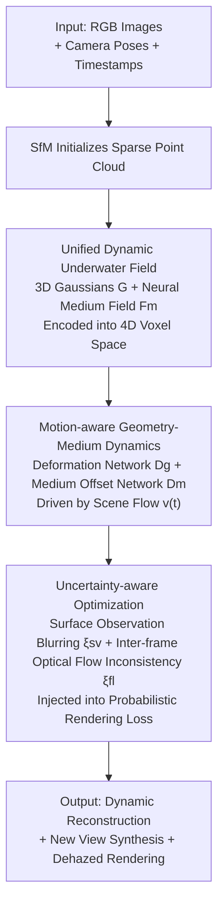

# Uncertainty-Aware 3D Reconstruction for Dynamic Underwater Scenes

**Conference**: ICLR 2026  
**OpenReview**: [https://openreview.net/forum?id=96DTvuYq4h](https://openreview.net/forum?id=96DTvuYq4h)  
**Project Page**: [https://underwater-dynamic-field.github.io/UDF](https://underwater-dynamic-field.github.io/UDF)  
**Area**: 3D Vision  
**Keywords**: Underwater 3D reconstruction, dynamic scenes, 3D Gaussian Splatting, medium modeling, heteroscedastic uncertainty

## TL;DR
This paper proposes UDF (Uncertainty-aware Dynamic Field) to simultaneously model underwater dynamic geometry and time-varying participating media in a unified 4D field. It utilizes per-pixel uncertainty derived from "surface observation blurring + inter-frame optical flow inconsistency" to weight the rendering loss, achieving high-quality reconstruction and new-view synthesis on both controlled and in-the-wild underwater videos.

## Background & Motivation
**Background**: NeRF and 3DGS have achieved realistic reconstructions of static/dynamic scenes in air. Subsequent works like 4DGS and deformation fields have extended these to moving scenes. Underwater research typically adopts "modified underwater imaging models," decomposing radiance along a ray into direct reflection from the object surface and backscattering from the water body, which are then embedded into volumetric rendering (e.g., SeaThru-NeRF, WaterSplatting).

**Limitations of Prior Work**: These methods are almost entirely built on the "rigid static scene" assumption. In real underwater scenes, objects swim, water surfaces deform, and medium properties (attenuation/scattering) change over time. Rigid assumptions cannot capture these non-rigid dynamics. Furthermore, in-the-wild underwater videos (especially those sourced online) suffer from poor visibility and inconsistent noise levels across views and frames, leading to ghosting and temporal flickering in direct reconstructions.

**Key Challenge**: On one hand, geometric cues and medium-induced attenuation are coupled within image intensities; in dynamic scenes, allowing both geometry and media to evolve over time is inherently difficult. On the other hand, observational noise is **input-dependent**—it varies with surface orientation and scene motion. Existing underwater methods use uniform per-pixel deterministic losses, treating all observations equally and failing to identify unreliable regions.

**Goal**: The problem is decomposed into two sub-problems: (1) Modeling time-varying underwater geometry and participating media within a unified representation; (2) Explicitly quantifying input-dependent observational uncertainty to suppress the influence of low-confidence observations during training.

**Key Insight**: The authors observe that two types of unreliable regions in underwater reconstruction have clear physical origins: when the ray direction is nearly tangential to the surface normal, scattering and direct radiance are difficult to decouple, leading high-frequency appearances to be misidentified as geometry (surface observation blurring); non-rigid motion or appearance drift makes inter-frame correspondences ambiguous (inter-frame inconsistency). Both quantities can be approximated from existing geometry/motion estimates without extra annotation.

**Core Idea**: Integrate dynamic geometry and motion-aware media into a unified 4D neural voxel field, and use physically interpretable per-pixel heteroscedastic uncertainty to adaptively weight the rendering loss, enabling the model to ignore "unreliable" observations.

## Method

### Overall Architecture
Given a set of RGB images with camera poses and normalized timestamps, UDF aims to jointly reconstruct the geometry, media effects, and temporal evolution of underwater scenes. The pipeline consists of three serial stages: first, initialize a set of 3D Gaussians embedded in a volumetric medium field using SfM to obtain a **canonical representation**; second, encode this representation into a shared 4D neural voxel space, using a deformation network and a medium offset network to predict time-varying updates for Gaussians and media properties, respectively, achieving **underwater dynamic modeling**; finally, inject per-pixel uncertainty—composed of surface observation blurring and inter-frame optical flow inconsistency—into the rendering loss for **uncertainty-aware optimization**. All stages share the same 4D voxel backbone, where geometry and media are jointly represented.

### Key Designs

**1. Unified Dynamic Underwater Field: Embedding Geometry and Media into a 4D Voxel Space**

To address the challenge where both geometry and media vary over time in dynamic scenes while remaining coupled, UDF constructs a unified representation. The canonical representation consists of 3D Gaussian ellipsoids $\mathcal{G}$ initialized from SfM point clouds and a volumetric medium field $\mathcal{F}_m$. Each Gaussian is an explicit geometric primitive with center $\mu$ and covariance $\Sigma=RSS^\top R^\top$. The surrounding water is modeled by a neural medium field conditioned on ray direction $\omega$. For rendering, color along a ray is split into structure and medium terms $C(r)=C_{str}(r)+C_{med}(r)$. Transmittance is factored into Gaussian occlusion $T^{str}$ and medium exponential decay $T^{med}$: $T_n(s)=\prod_{j=1}^{n-1}(1-\alpha_j)\cdot\exp(-\sigma_{med}s)$. Medium coefficients are further split into attenuation $\sigma_{att}$ and backscattering $\sigma_{bs}$ (both RGB vectors) to capture wavelength-dependent effects.

To encode temporal sequences, UDF uses plane decomposition (K-planes) to split the 4D space-time domain into six orthogonal 2D planes $\{(x,y),(x,z),(y,z),(x,t),(y,t),(z,t)\}$. Structure and media have their own learnable feature maps $f^{str}_k$ and $f^{med}_k$. Querying a space-time point $Q(x_{3d},t)$ involves bilinear interpolation across planes followed by element-wise multiplication to obtain features $F^{str}$ and $F^{med}$.

**2. Motion-aware Geometry-Medium Dynamics: Driving Medium Updates via Scene Flow**

While standard 4DGS only deforms geometry, UDF applies two time-conditioned networks to the features. The deformation network $D_g$ predicts translation, scale, and rotation offsets $\Delta\mu(t),\Delta S(t),\Delta R(t)=D_g(F^{str}(\mu,t),F^{med}(\mu,t))$ to transform Gaussians from canonical to current states. By taking both structure and media features as input, the deformation better aligns with actual underwater dynamics.

Crucially, the medium also updates with motion: Gaussian center time differences are projected to the image plane to calculate 2D scene flow $v(t)=\big(\text{Proj}(\mu+\Delta\mu(t+\Delta t))-\text{Proj}(\mu+\Delta\mu(t))\big)/\Delta t$. The medium offset network $D_m$ then combines $v(t)$ and view direction $\omega$ to output time-varying properties $c_{med}(t),\sigma_{att}(t),\sigma_{bs}(t)=D_m(F^{med}(x,t),v(t),\omega)$. This allows the medium's attenuation and scattering to follow the scene motion.

**3. Heteroscedastic Uncertainty: Weighting Loss via Physically-Derived Per-Pixel Confidence**

UDF integrates two physically interpretable uncertainties into a probabilistic rendering loss. The first is **surface observation blurring** $\xi_{sv}$: scattering is difficult to decouple when the ray is tangential to the surface. A pseudo-normal $n$ is derived from depth gradients, defining $\xi_{sv}^2=(\max(0, \omega \cdot n))^2$. The second is **inter-frame optical flow inconsistency** $\xi_{fl}$: per-pixel motion $v_{pixel}$ is aggregated from visible Gaussians, and a Horn-Schunck flow constraint measures its alignment with image gradients: $\xi_{fl}^2=(\nabla I\cdot v_{pixel}+\partial I/\partial t)^2+\epsilon_0$.

The total variance $\xi_{total}^2=\xi_{sv}^2+\xi_{fl}^2$ is used in a negative log-likelihood loss, treating each pixel as a Normal distribution:

$$\mathcal{L}_c=\frac{\lVert\hat{C}(r)-C(r)\rVert^2}{2\xi_{total}^2}+\frac{1}{2}\log\xi_{total}^2$$

The first term downweights high-uncertainty regions, while the second acts as a regularizer against infinite variance.

### Loss & Training
The total loss is the probabilistic rendering loss plus a Total Variation (TV) smoothness term: $\mathcal{L}=\mathcal{L}_c+\mathcal{L}_{tv}$. Training follows two steps: first, optimize Gaussians $\mathcal{G}$ and the medium field $\mathcal{F}_m$ as a warm-up, then jointly train $D_g$ and $D_m$ with the uncertainty-aware loss enabled. The stability constant is $\epsilon_0=1\times10^{-4}$. Adam optimizer is used with a learning rate decaying from $1\times10^{-3}$ to $1.5\times10^{-4}$. Uncertainty modeling is disabled during inference.

## Key Experimental Results

### Main Results
Evaluated on controlled datasets (DRUVA, SeaThru) and in-the-wild videos (NUSR) using PSNR / SSIM / LPIPS.

Results on NUSR (selected Turtle and Coral scenes):

| Dataset/Scene | Metric | Ours (UDF) | WaterSplatting | NUSR |
|--------|------|------|----------|------|
| NUSR Turtle | PSNR↑ | **33.73** | 25.20 | 28.10 |
| NUSR Turtle | SSIM↑ | **0.965** | 0.879 | 0.899 |
| NUSR Turtle | LPIPS↓ | **0.051** | 0.233 | 0.216 |
| NUSR Coral | PSNR↑ | **28.72** | 28.67 | 26.17 |
| NUSR Coral | LPIPS↓ | **0.085** | 0.098 | 0.157 |

Comparison on DRUVA / SeaThru (selected):

| Dataset/Scene | Metric | Ours (UDF) | Prev. SOTA | Gain |
|--------|------|------|----------|------|
| DRUVA A11 | PSNR↑ | **34.03** | 32.33 (WaterSplatting) | +1.70 |
| DRUVA A11 | LPIPS↓ | **0.123** | 0.207 (WaterSplatting) | -0.084 |
| SeaThru Panama | PSNR↑ | **32.95** | 25.90 (4DGS) | +7.05 |
| SeaThru Panama | LPIPS↓ | **0.065** | 0.277 (4DGS) | -0.212 |

### Ablation Study

Component Ablation (NUSR Turtle):

| Configuration | PSNR↑ | SSIM↑ | LPIPS↓ | Description |
|------|---------|------|------|------|
| Full ($\mathcal{F}_m+D_g+D_m$) | 33.73 | 0.965 | 0.051 | Full Model |
| w/o $D_m$ | 30.84 | 0.951 | 0.072 | No Medium Offset Network |
| w/o $D_g$ | 31.46 | 0.953 | 0.068 | No Deformation Network |
| w/o $\mathcal{F}_m$ | 31.53 | 0.954 | 0.052 | No Neural Medium Field |

Uncertainty Ablation (NUSR Turtle):

| Configuration | PSNR↑ | SSIM↑ | LPIPS↓ | Description |
|------|---------|------|------|------|
| $\xi_{sv}+\xi_{fl}$ | 33.73 | 0.965 | 0.051 | Full Uncertainty |
| w/o $\xi_{sv}$ | 32.48 | 0.951 | 0.062 | No Surface Blurring |
| w/o $\xi_{fl}$ | 31.52 | 0.954 | 0.063 | No Flow Inconsistency |
| None | 30.83 | 0.941 | 0.070 | Deterministic Loss |

### Key Findings
- The medium offset network $D_m$ has the highest impact: removing it drops PSNR from 33.73 to 30.84, confirming that updating media with motion is critical for underwater dynamics.
- Both uncertainty terms are essential: removing $\xi_{fl}$ or $\xi_{sv}$ individually results in significant drops, highlighting the limitation of deterministic losses.
- The model is robust to hyperparameters: medium MLP width changes only fluctuate PSNR by 0.2 dB, and the system is robust to different initialization methods (COLMAP vs. VGGT).

## Highlights & Insights
- **Dynamic Media**: While standard 4DGS only deforms geometry, this work allows medium properties to be driven by 2D scene flow. This addresses the core difference of underwater scenes—where water flows and attenuation varies—leading to a 7 dB PSNR gain over 4DGS on SeaThru Panama.
- **Physically Grounded Uncertainty**: $\xi_{sv}$ quantifies decoupling difficulty via view-normal alignment, while $\xi_{fl}$ quantifies inter-frame ambiguity via flow residuals. Both are derived from geometric/motion estimates without extra networks.
- **Transferability**: The strategy of formulating input-dependent noise as a heteroscedastic NLL loss via physical cues is transferable to other tasks with degraded observations (e.g., fog, night, endoscopy).

## Limitations & Future Work
- Uncertainty modeling is disabled during inference and currently does not output confidence maps for downstream use.
- $\xi_{sv}$ relies on pseudo-normals from noisy underwater depth gradients; while mitigated by using it as a soft weight, performance may suffer in extreme low-visibility.
- The medium offset network uses 2D projected scene flow. Robust 3D motion representations or explicit occlusion handling could further improve results.

## Related Work & Insights
- **vs. WaterSplatting / SeaThru-NeRF**: These use learnable media parameters but assume static scenes and deterministic losses. UDF outperforms them by allowing temporal evolution in a 4D field with heteroscedastic uncertainty.
- **vs. 4DGS / UDR-GS**: 4DGS methods excel at dynamics but ignore participating media, often misinterpreting attenuation as geometry. UDF explicitly separates the two.
- **vs. NeRF Uncertainty Methods**: Prior works mostly estimate per-ray variance in static scenes. UDF is among the first to address "simultaneous geometric and appearance variation" in dynamic conditions using combined physical cues.

## Rating
- Novelty: ⭐⭐⭐⭐ 
- Experimental Thoroughness: ⭐⭐⭐⭐ 
- Writing Quality: ⭐⭐⭐⭐ 
- Value: ⭐⭐⭐⭐ 

<!-- RELATED:START -->

## Related Papers

- [\[ICLR 2026\] Uncertainty Matters in Dynamic Gaussian Splatting for Monocular 4D Reconstruction](uncertainty_matters_in_dynamic_gaussian_splatting_for_monocular_4d_reconstructio.md)
- [\[ICLR 2026\] Horseshoe Splatting: Handling Structural Sparsity for Uncertainty-Aware Gaussian-Splatting Radiance Field Rendering](horseshoe_splatting_handling_structural_sparsity_for_uncertainty-aware_gaussian-.md)
- [\[CVPR 2025\] SpectroMotion: Dynamic 3D Reconstruction of Specular Scenes](../../CVPR2025/3d_vision/spectromotion_dynamic_3d_reconstruction_of_specular_scenes.md)
- [\[ICLR 2026\] COOPERTRIM: Adaptive Data Selection for Uncertainty-Aware Cooperative Perception](coopertrim_adaptive_data_selection_for_uncertainty-aware_cooperative_perception.md)
- [\[ICLR 2026\] Mango-GS: Enhancing Spatio-Temporal Consistency in Dynamic Scenes Reconstruction using Multi-Frame Node-Guided 4D Gaussian Splatting](mango-gs_enhancing_spatio-temporal_consistency_in_dynamic_scenes_reconstruction_.md)

<!-- RELATED:END -->
