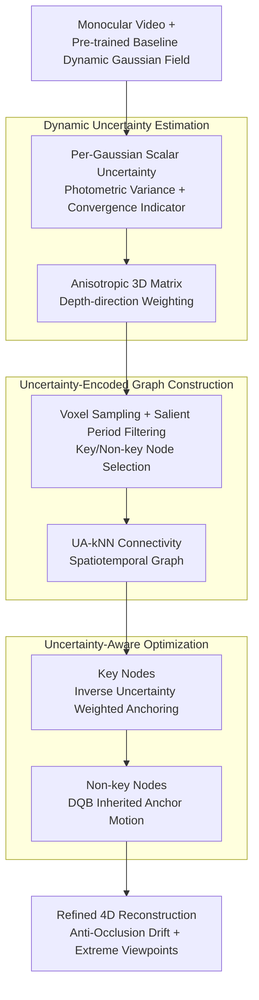

# Uncertainty Matters in Dynamic Gaussian Splatting for Monocular 4D Reconstruction

**Conference**: ICLR2026  
**arXiv**: [2510.12768](https://arxiv.org/abs/2510.12768)  
**Code**: [tamu-visual-ai/usplat4d](https://tamu-visual-ai.github.io/usplat4d/)  
**Area**: 3D Vision  
**Keywords**: Dynamic Gaussian Splatting, uncertainty estimation, 4D Reconstruction, Monocular, novel view synthesis

## TL;DR

Proposes USplat4D, an uncertainty-aware dynamic Gaussian splatting framework that estimates time-varying uncertainty for each Gaussian and constructs an uncertainty-guided spatiotemporal graph to propagate reliable motion cues. This significantly improves monocular 4D reconstruction quality in occluded regions and under extreme novel views.

## Background & Motivation

Reconstructing dynamic 3D scenes from monocular video is a fundamental problem for tasks such as AR, robotics, and human motion analysis, but it is highly challenging due to occlusions and extreme viewpoint changes.

- **Limitations of Prior Work**: Whether using canonical fields, deformation bases, or direct 4D modeling, existing dynamic Gaussian splatting methods perform **uniform optimization** across all Gaussian primitives, relying on 2D supervision signals like depth, optical flow, and photometric consistency. This uniform treatment ignores a critical fact: some Gaussians are repeatedly observed and well-constrained, while others are sparsely observed and weakly constrained.
- **Key Challenge**: Motion estimation drifts in occluded scenarios, and synthesis quality severely degrades under extreme novel views. For example, a rotating backpack always has part of its surface self-occluded at different times, yet humans can still infer the appearance and motion of occluded areas through memory and temporal continuity.
- **Key Insight**: When observations are incomplete, reconstruction should be **anchored by high-confidence cues** and propagated to uncertain regions in a structured manner. High-confidence Gaussians should be prioritized and used to guide the optimization of unreliable Gaussians.

## Method

### Overall Architecture

USplat4D is a model-agnostic uncertainty-aware refinement framework that can be integrated into any dynamic Gaussian splatting method estimating per-Gaussian motion. It first estimates a time-varying uncertainty score for each Gaussian in every frame. Based on this, it decomposes the scene into a few "well-constrained" key nodes and many "weakly-constrained" non-key nodes, connecting them into a spatiotemporal graph. During optimization, the reliable key nodes act as anchors to propagate motion cues through the graph to uncertain regions, thereby suppressing motion drift in occlusions and degradation in extreme novel views. The pipeline consists of three stages: Dynamic Uncertainty Estimation → Uncertainty-Encoded Graph Construction → Uncertainty-Aware Optimization.

### Key Designs

**1. Dynamic Uncertainty Estimation: Quantifying "Which Gaussians are Trustworthy" as Time-Varying Scores**

To enable the framework to identify trustworthy components, the first step is calculating reliability for each Gaussian. Starting from the photometric reconstruction loss $\mathcal{L}_{2,t} = \sum_{h \in \Omega} \|\bar{C}_t^h - C_t^h\|_2^2$, the authors derive a closed-form variance estimate $\sigma_{i,t}^2 = \left(\sum_{h \in \Omega_{i,t}} (T_{i,t}^h \alpha_i)^2 \right)^{-1}$ under local minimum assumptions, where $T_{i,t}^h$ is the transmittance of Gaussian $i$ at pixel $h$ and $\alpha_i$ is its opacity. Gaussians observed by more pixels with higher weights yield smaller variance and higher reliability. Since this holds only when pixels have converged, a per-pixel convergence indicator $\mathbb{1}_t(h)$ is introduced (equal to 1 when color error is below threshold $\eta_c$), falling back to a fixed large uncertainty $\phi$ for non-converged cases. The final scalar uncertainty is $u_{i,t} = \mathbb{1}_{i,t} \cdot \sigma_{i,t}^2 + (1 - \mathbb{1}_{i,t}) \cdot \phi$.

However, scalar uncertainty implies an isotropic assumption, while depth ambiguity in monocular scenes is far greater than in the image plane. To avoid overconfidence along the optical axis, the authors propagate image-space errors to 3D using an anisotropic matrix $\mathbf{U}_{i,t} = \mathbf{R}_{wc} \cdot \text{diag}(r_x u_{i,t}, r_y u_{i,t}, r_z u_{i,t}) \cdot \mathbf{R}_{wc}^\mathsf{T}$, where $\mathbf{R}_{wc}$ is the camera-to-world rotation and $r_z$ is typically larger for the depth direction. This allows uncertainty to rotate with camera poses and explicitly differentiates depth-sensitive directions.

**2. Uncertainty-Encoded Graph Construction: Building Motion Propagation Backbone with Reliable Gaussians**

Based on per-Gaussian uncertainty, Gaussians are divided into key nodes $\mathcal{V}_k$ (low uncertainty) providing motion anchors and non-key nodes $\mathcal{V}_n$ inheriting motion. Key nodes are selected via a two-stage process: first, 3D voxel grid sampling is applied per frame to ensure uniform spatial coverage; then, salient period filtering retains only those candidates with "low uncertainty" for at least 5 frames. The final key/non-key ratio is approximately 1:49 (top 2%).

Graph edges also incorporate uncertainty. Key nodes are connected using Uncertainty-Aware kNN (UA-kNN): neighbors are selected using Mahalanobis distance at the frame $\hat{t} = \arg\min_t \{u_{i,t}\}$ where the node is most reliable. Non-key nodes are associated with the spatially nearest key node and inherit its neighbor structure, forming a spatiotemporal graph where a skeleton of reliable anchors supports weak nodes.

**3. Uncertainty-Aware Optimization: Flowing Motion Correction along Trustworthy Directions**

The optimization objective aims to correct motion without allowing weak Gaussians to diffuse errors. Key nodes are encouraged to stay near pre-trained positions via $\mathcal{L}^{\text{key}} = \sum_t \sum_{i \in \mathcal{V}_k} \|\mathbf{p}_{i,t} - \mathbf{p}_{i,t}^o\|_{\mathbf{U}_{w,t,i}^{-1}} + \mathcal{L}^{\text{motion,key}}$, weighted by the inverse uncertainty matrix $\mathbf{U}_{w,t,i}^{-1}$ so that corrections occur primarily along reliable directions. Non-key nodes interpolate motion $\mathbf{p}_{i,t}^{\text{DQB}}$ from neighboring key nodes via Dual Quaternion Blending (DQB). The loss $\mathcal{L}^{\text{non-key}} = \sum_t \sum_{i \in \mathcal{V}_n} \|\mathbf{p}_{i,t} - \mathbf{p}_{i,t}^o\|_{\mathbf{U}_{w,i}^{-1}} + \sum_t \sum_{i \in \mathcal{V}_n} \|\mathbf{p}_{i,t} - \mathbf{p}_{i,t}^{\text{DQB}}\|_{\mathbf{U}_{w,i}^{-1}} + \mathcal{L}^{\text{motion,non-key}}$ pulls them towards both the pre-trained state and the interpolated trajectory.

### Loss & Training

The overall objective is $\mathcal{L}^{\text{total}} = \mathcal{L}^{\text{rgb}} + \mathcal{L}^{\text{key}} + \mathcal{L}^{\text{non-key}}$, where $\mathcal{L}^{\text{motion}}$ includes isometric, rigidity, relative rotation, velocity, and acceleration regularizations. Training involves two stages: pre-training a dynamic Gaussian field with a baseline model (e.g., SoM or MoSca), followed by refinement using the uncertainty-aware optimization described above.

## Key Experimental Results

### Main Results on DyCheck Dataset

| Setup | Method | mPSNR↑ | mSSIM↑ | mLPIPS↓ |
|------|------|--------|--------|---------|
| 5 scenes, 1× | SC-GS | 14.13 | 0.477 | 0.49 |
| 5 scenes, 1× | Deformable 3DGS | 11.92 | 0.490 | 0.66 |
| 5 scenes, 1× | 4DGS | 13.42 | 0.490 | 0.56 |
| 5 scenes, 1× | MoDec-GS | 15.01 | 0.493 | 0.44 |
| 5 scenes, 1× | MoBlender | 16.79 | 0.650 | 0.37 |
| 5 scenes, 1× | SoM | 16.72 | 0.630 | 0.45 |
| 5 scenes, 1× | **Ours** | **16.85** | **0.650** | **0.38** |
| 7 scenes, 2× | Dynamic Gaussians | 7.29 | – | 0.69 |
| 7 scenes, 2× | 4DGS | 13.64 | – | 0.43 |
| 7 scenes, 2× | Gaussian Marbles | 16.72 | – | 0.41 |
| 7 scenes, 2× | MoSca | 19.32 | 0.706 | 0.26 |
| 7 scenes, 2× | **Ours** | **19.63** | **0.716** | **0.25** |

### Extreme Novel View Synthesis on Objaverse

| Method | View Range | PSNR↑ | SSIM↑ | LPIPS↓ |
|------|----------|-------|-------|--------|
| SoM | (0°, 60°] | 16.09 | 0.860 | 0.31 |
| Ours (SoM) | (0°, 60°] | **16.63** | **0.866** | **0.27** |
| SoM | (120°, 180°] | 16.45 | 0.858 | 0.31 |
| Ours (SoM) | (120°, 180°] | **17.03** | **0.872** | **0.26** |
| MoSca | (0°, 60°] | 16.18 | 0.881 | 0.24 |
| Ours (MoSca) | (0°, 60°] | **16.22** | **0.885** | **0.22** |
| MoSca | (120°, 180°] | 15.89 | 0.876 | 0.25 |
| Ours (MoSca) | (120°, 180°] | **16.31** | **0.886** | **0.21** |

Gains are most significant in extreme views (120°–180°), with a PSNR increase of +0.58 dB over the SoM baseline.

### Ablation Study

| Ablation Setup | PSNR↑ | SSIM↑ | LPIPS↓ |
|----------|-------|-------|--------|
| USplat4D (Full) | **19.63** | **0.716** | **0.25** |
| (a) w/o Uncertainty-guided Key Selection | 18.86 | 0.688 | 0.28 |
| (b) w/o UA-kNN | 19.50 | 0.711 | 0.26 |
| (c) w/o Loss Weighting | 19.08 | 0.681 | 0.25 |

Removing uncertainty guidance for key node selection had the greatest impact, dropping PSNR by 0.77 dB.

## Highlights & Insights

1. **Concise Core Idea**: Elevates uncertainty from an auxiliary signal to the center of the framework, addressing occlusions via "high-confidence anchoring + structured propagation."
2. **Model-Agnostic Design**: Seamlessly integrates with baselines like SoM and MoSca to consistently provide gains.
3. **Depth-Aware Anisotropic Uncertainty**: Extends scalar uncertainty to 3D anisotropic matrices, effectively mitigating depth overconfidence in monocular reconstruction.
4. **Natural Segmentation**: The weight matrix of the key node graph naturally supports multi-object motion segmentation without extra supervision.
5. **Triple Roles of Uncertainty**: Functions uniquely across key node weighting, non-key interpolation guidance, and total loss balancing.

## Limitations & Future Work

1. **Baseline Dependence**: Relies on the quality of the pre-trained model; refinement is limited if the baseline has severe initial motion errors.
2. **Computational Overhead of VFMs**: Remains affected by the cost and errors of underlying visual foundation models (depth/flow).
3. **Limited Near-view Gain**: On views close to the input, the improvement over strong baselines is relatively small (+0.13 dB PSNR).
4. **Hyperparameter Sensitivity**: Parameters like key node ratio and salient period thresholds require scene-specific tuning.
5. **Texture-less Scenes**: Uncertainty estimation may fail in areas with sparse texture or extremely fast motion.

## Related Work

| Direction | Representative Methods | Comparison with USplat4D |
|------|----------|-------------------|
| Dynamic GS (Motion-base) | SoM, MoSca, Marbles | Uses motion bases for regularization but suffers drift under occlusion by not distinguishing reliability. |
| Uncertainty in Scene Recon | SE-GS, Kim et al. (2024) | Typically used for static scenes or as an auxiliary signal, but not integrated into structural graph propagation. |
| Graph-based Modeling | MoSca, SC-GS | Uses fixed distance metrics for graph construction without considering node reliability. |

## Rating

| Dimension | Score (1-5) | Explanation |
|------|-----------|------|
| Novelty | 4 | Innovatively uses uncertainty as the core of a unified graph-optimization framework. |
| Technical Depth | 4 | Rigorous derivation from scalar to anisotropic uncertainty; complete design. |
| Experimental Thoroughness | 4 | Covers three datasets with extensive ablations; focus on extreme novel views is a plus. |
| Writing Quality | 4 | Clear motivation, well-explained formulas, and rich illustrations. |
| Value | 4 | Model-agnostic design makes it highly practical for enhancing existing methods. |
| Overall | 4.0 | A high-quality contribution introducing structured uncertainty modeling to monocular 4D reconstruction. |

<!-- RELATED:START -->

## Related Papers

- [\[ICLR 2026\] WorldTree: Towards 4D Dynamic Worlds from Monocular Video Using Tree-Chains](worldtree_towards_4d_dynamic_worlds_from_monocular_video_using_tree-chains.md)
- [\[ICLR 2026\] Frequency-Aware Dynamic Gaussian Splatting](frequency-aware_dynamic_gaussian_splatting.md)
- [\[CVPR 2026\] Learning Explicit Continuous Motion Representation for Dynamic Gaussian Splatting from Monocular Videos](../../CVPR2026/3d_vision/learning_explicit_continuous_motion_representation_for_dynamic_gaussian_splattin.md)
- [\[ICLR 2026\] Mono4DGS-HDR: High Dynamic Range 4D Gaussian Splatting from Alternating-exposure Monocular Videos](mono4dgs-hdr_high_dynamic_range_4d_gaussian_splatting_from_alternating-exposure_.md)
- [\[CVPR 2026\] SharpTimeGS: Sharp and Stable Dynamic Gaussian Splatting via Lifespan Modulation](../../CVPR2026/3d_vision/sharptimegs_sharp_and_stable_dynamic_gaussian_splatting_via_lifespan_modulation.md)

<!-- RELATED:END -->
